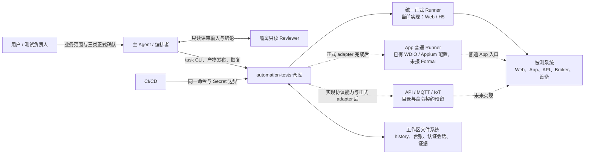
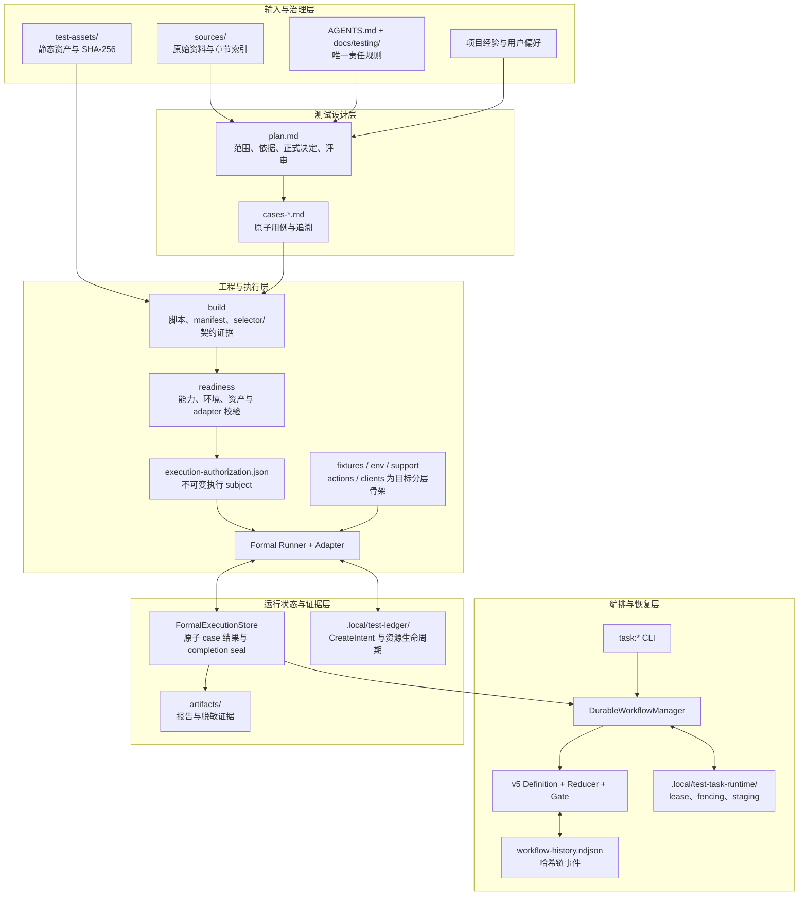
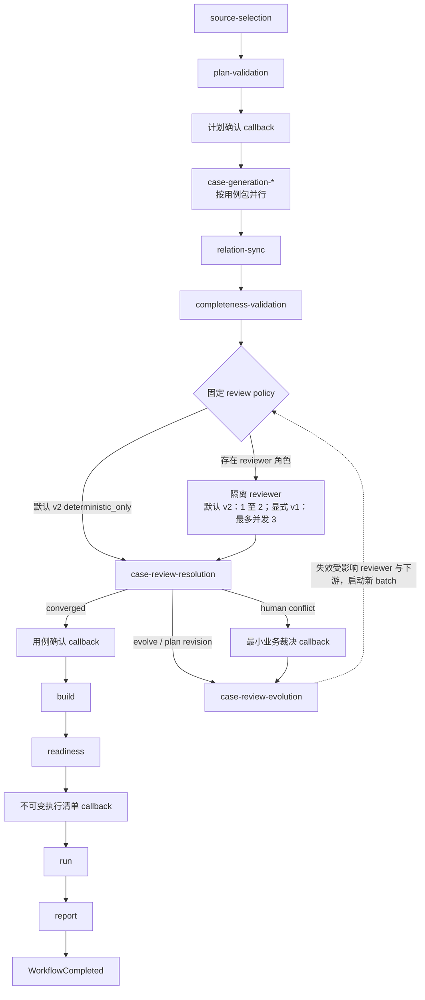
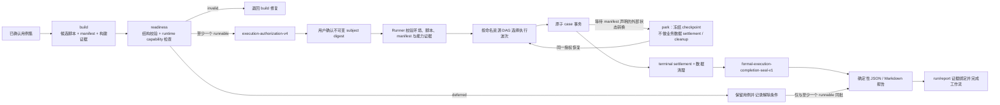
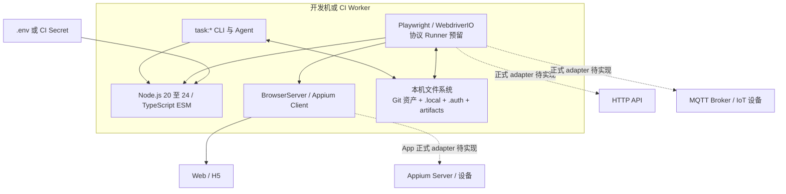

# 自动化测试工程架构设计说明

## 1. 文档定位

本文描述本仓库当前实现的总体架构、核心组件、运行时数据流、可靠性机制和扩展边界，适用于 Web、H5、App、WebView、API、MQTT 与 IoT 链路自动化测试的设计、开发、评审和维护。

本文是架构说明，不新增流程规则。发生冲突时，按以下顺序采用唯一责任文件：

1. [AGENTS.md](../AGENTS.md)：强制门禁、事实所有权与安全边界。
2. [测试规范索引](./testing/README.md)：生命周期、环境、用例、定位、报告与失败分类的唯一责任规范。
3. [IoT 自动化测试 Skill](../skills/iot-automation-testing/SKILL.md)：Agent 的实际操作顺序、模板与评审提示。
4. 本文：解释上述规则在代码和目录中的落地方式。

本文基于仓库源码、配置和命令入口描述静态架构，不把静态检查通过等同于真实业务 E2E 已执行。

## 2. 架构目标与非目标

### 2.1 架构目标

- **可追溯**：从原始资料，经 `REQ → RULE → caseId`，追溯到脚本、不可变执行授权和逐用例证据。
- **可审核**：计划、用例、reviewer 结论、脚本差异、执行范围和结果均有明确的审核边界。
- **可恢复**：Agent、Runner 或宿主中断后，从已校验事件和正式记录恢复，不重复已完成工作或未知结果的外部副作用。
- **默认安全**：生产、业务写入、设备动作、验证码与安全挑战、敏感证据采集均采用显式门禁和最小权限。
- **执行确定性**：Runner 只能执行已确认清单中的 `caseId`、脚本摘要、操作预算和环境范围。
- **平台可扩展**：工作流和正式执行契约独立于具体 Runner，通过 adapter、capability provider、action 和 client 扩展平台能力。

### 2.2 非目标

- 不作为需求管理系统；业务事实仍由 `sources/` 中已登记并实际引用的原始资料提供。
- 不作为分布式调度平台；仓库内核使用本机文件、进程锁和恢复命令，宿主长期任务只是不写入仓库的可选适配。
- 不让真实凭据、验证码、Token、Cookie、真实用户数据或未脱敏业务数据进入 Git、history、plan、日志、报告或对话；受控 `.env` 与 `.auth/` 仅作本机 Secret/会话存储。
- 不自动绕过验证码、滑块、人机验证、设备确认或权限控制。
- 不因存在普通 Runner 命令，就宣称该平台已经具备统一正式执行能力。

## 3. 系统上下文



系统由五类参与者共同完成闭环：

- 用户负责业务范围、计划、用例集和不可变执行清单的正式决定。
- 主 Agent 负责资料选择、产物生成、工作流推进、reviewer 编排、恢复和结果解释。
- 隔离 reviewer 只读审查限定输入，不修改资产，也不代替用户批准。
- 确定性 Runner 只执行已确认的范围，不自行扩大用例、权限或数据预算。
- CI/CD 提供受控运行环境和 Secret，但不改变仓库工作流的事实。

## 4. 总体架构

### 4.1 分层视图



### 4.2 核心设计决策

| 决策 | 设计结果 | 目的 |
| --- | --- | --- |
| 业务层与工程层分离 | `plan.md` 和用例回答“测什么、为什么”；`tests/` 与 `src/` 回答“如何测”。 | 防止用代码实现反推或替代需求事实。 |
| 事件溯源替代可变任务表 | Durable 业务状态只从 `workflow-history.ndjson` 归约；Gate 再叠加时钟、runtime 和真实产物的一次性安全视图。 | 支持审计、中断恢复和幂等推进。 |
| 正式事实分频道保存 | 正式决定在 `plan.md`，运行事件在 history，协调句柄在 runtime，数据资源在 ledger。 | 避免单一状态文件混入不同可信度和生命周期的数据。 |
| `build` 与 `readiness` 分离 | 候选脚本完整性不等于环境可运行性；运行依赖由 readiness 单独判定。 | 避免用环境缺失删除应有覆盖，或用空占位冒充脚本。 |
| 执行范围不可变 | readiness 产物经用户 callback 确认后，Runner 校验环境、脚本和 manifest 摘要。 | 防止确认后静默扩大范围或替换脚本。 |
| 功能、范围和数据卫生分离 | 报告分别输出 `testOutcome`、`scopeStatus`、`dataHygieneStatus`。 | 避免清理成功掩盖产品失败，或功能通过掩盖残留风险。 |
| 工作流结论与产品结论分离 | 产品结果可以失败或不确定；只要执行、清理/登记和报告闭环，工作流仍可成功结束。 | 让“测试发现问题”和“测试流程失控”保持不同语义。 |

## 5. 组件设计

| 组件 | 主要职责 | 关键实现或目录 |
| --- | --- | --- |
| 规则与资料注册 | 维护安全边界、唯一责任规范、原始资料身份与静态资产完整性。 | [AGENTS.md](../AGENTS.md)、[docs/testing/](./testing/README.md)、[sources/](../sources/README.md)、[test-assets/](../test-assets/README.md) |
| 测试设计资产 | 保存一次请求的计划、原子用例包、追溯关系、正式决定和工程设计。 | [testcases/](../testcases/README.md) |
| Durable Workflow 内核 | 定义 v5 DAG、事件类型、纯 reducer、状态投影、Gate v2、恢复和安全回复约束。 | [`src/support/task-workflow/`](../src/support/task-workflow/) |
| 历史存储 | 校验事件结构、敏感字段、幂等键和 SHA-256 链；使用 CAS、文件锁、fsync 与原子替换提交。 | [`historyStore.ts`](../src/support/task-workflow/historyStore.ts) |
| 运行时协调 | 保存可丢弃的 session/reviewer 绑定、Activity lease、fencing token、在途操作与暂存引用。 | [`runtimeLeaseStore.ts`](../src/support/task-workflow/runtimeLeaseStore.ts) |
| 原子产物发布 | 从 runtime staging 校验 Markdown、结构和 digest，再原子发布最终文件；冲突进入 reconciliation。 | [`artifactPublisher.ts`](../src/support/task-workflow/artifactPublisher.ts) |
| Reviewer 编排 | 初始化时固定 review policy 和 reviewer Activity；用例生成后再按实际 case 风险收窄 batch scope，并绑定真实隔离 reviewer。 | [`reviewPolicy.ts`](../src/support/task-workflow/reviewPolicy.ts)、[`reviewLifecycle.ts`](../src/support/task-workflow/reviewLifecycle.ts) |
| 正式执行清单 | 声明 case、capability、命名资源、静态构建证据、操作预算、结果证据和多阶段转换。 | [`formal-execution/types.ts`](../src/support/formal-execution/types.ts)、[`manifest.ts`](../src/support/formal-execution/manifest.ts) |
| Readiness 与授权 | 把 case 分类为 `runnable`、`deferred` 或 `invalid`，冻结脚本、环境、能力和操作上限。 | [`readiness.ts`](../src/support/formal-execution/readiness.ts)、[`authorization.ts`](../src/support/formal-execution/authorization.ts) |
| Capability Provider | 对真实运行依赖执行 `check`，并按需提供 `setup`、`use`、`cleanup`；输出脱敏证据摘要。 | [`capabilityProvider.ts`](../src/support/formal-execution/capabilityProvider.ts) |
| 正式 Runner | 校验授权，复核能力，按依赖波次执行 case，处理外部转换、teardown、恢复和敏感产物。 | [`run-formal-tests.ts`](../scripts/run-formal-tests.ts)、[`run-formal-web-tests.ts`](../scripts/run-formal-web-tests.ts) |
| 正式结果存储 | 保存原子 case 尝试、命名资源、阶段检查点、操作证据、清理状态和 completion seal。 | [`formalExecutionStore.ts`](../src/support/formal-execution/formalExecutionStore.ts) |
| 测试数据管理 | 管理本机合成资源、预算、CreateIntent、资源池、租约、清理、恢复与脱敏摘要。 | [`src/support/test-data/`](../src/support/test-data/) |
| 可复用自动化能力 | `fixtures`、`env` 和 `support` 已承载主要实现；`actions`、`clients` 当前主要定义目标目录边界，随平台能力逐步落地。 | [src/](../src/README.md) |
| 证据与报告 | 聚合 Runner 结果、逐 case 证据、失败分类和三维结论，并执行文本清洗与泄漏扫描。 | [`report-guideline.md`](./testing/report-guideline.md)、[`playwrightEvidenceReporter.ts`](../src/support/formal-execution/playwrightEvidenceReporter.ts) |
| 工程命令 | 提供环境、架构、Markdown、资产、知识、正式执行、恢复和完整重置的登记入口。 | [package.json](../package.json)、[scripts/README.md](../scripts/README.md) |

依赖方向遵循“脚本调用复用能力、CLI 编排内核、内核不反向依赖具体 Runner”的原则。`src/support/task-workflow/` 的非 CLI 内核不得反向导入正式执行适配层或工程脚本，该边界由 `check:architecture` 检查。

## 6. Durable Workflow 设计

### 6.1 v5 阶段 DAG



新请求固定使用定义 v5。`planDigest`、`graphDigest`、capability 和 review policy 在 run 创建时固定；v3、v4、`vnext-1` 或含 `LegacyStateImported` 的历史只读回放，不允许追加新事件。

自动演进后的新 review batch 在受控来源和正式用户决定不变时，通常仍属于同一 `reviewEpochDigest`，只递增语义演进轮次；只有新增受控来源或正式用户决定才建立新的 review epoch。已经成功且未受影响的完整度 Activity 不为形成循环而机械重做。

### 6.2 状态投影

Activity 只允许以下状态：`PENDING`、`READY`、`RUNNING`、`SUCCEEDED`、`RETRY_WAIT`、`WAITING_CALLBACK`、`RECONCILING`、`BLOCKED`、`FAILED`、`CANCELLED`。

Durable 工作流由 history 中的全部 Activity 事件归约为 `RUNNING`、`WAITING_HUMAN`、`WAITING_EXTERNAL`、`RETRY_WAIT`、`RECONCILING`、`BLOCKED`、`SUSPENDED`、`SUCCEEDED`、`FAILED` 或 `CANCELLED`。Gate 在该投影上读取当前时间、runtime lease/reviewer binding、计划与 callback subject 摘要，形成到期重试、rebind、publication wait 和 checkpoint 等一次性安全视图。用户可见的规划、用例、评审、工程、执行和报告六阶段只是只读简化投影，不反向写入状态。

### 6.3 Gate 与续跑

Gate v2 同时返回：

- 当前 history head、workflow state、phase、ready/running Activity 与等待项；
- `nextActions` 和安全 checkpoint；
- `continuation`：`continue_now`、`await_event`、`wait_until`、`wait_user` 或 `stop`；
- `reply`：`none`、`action_required` 或 `final`。

有可自动推进的 Activity 时必须继续当前可用回合。只有真实用户决定、blocker 或显式安全挂起才请求用户动作；只有工作流终态才能输出完成/失败结论。仓库本身不创建周期任务，宿主跨回合任务也不能替代 history 或 gate。

### 6.4 Reviewer 策略

| 初始化路径 | 选择依据 | Reviewer Activity | 并发上限 |
| --- | --- | --- | --- |
| 默认 v2：`light` | 初始化时的 `planText`、写入标记、capability 和用例包结构风险画像。 | `deterministic_only`，不创建 reviewer。 | 0 |
| 默认 v2：`standard` | 同上。 | 一个 `combined` reviewer。 | 2 |
| 默认 v2：`strict` | 同上。 | `combined` 与 `impact` reviewer。 | 2 |
| 显式 `--reviewer-role` | 调用方显式角色；写入场景仍自动补 `impact`。 | 固定兼容 `review-policy-v1` 角色集合。 | 3 |

review policy 和 Activity 在 `task:initialize` 时、正式用例生成前固定。用例产生后计算的 case 风险用于收窄 `combined`/`impact` 的 batch scope，不动态新增或删除 DAG 中的 reviewer 角色。reviewer 任务标识只保存在 `.local/test-task-runtime/`；history 只保存角色、输入摘要和派发/提交语义，正式结论与发现项正文只写入 `plan.md`。

## 7. 正式执行架构

### 7.1 `build → readiness → authorization → run → report`



### 7.2 Formal Execution Manifest

正式 manifest 是 Runner 的声明式执行契约，主要包含：

- `caseId`、标题、实现状态、超时和敏感证据策略；
- 运行时 capability 及其 provider 或环境来源；
- Git 静态资产、selector 契约、浏览器响应契约等 `buildEvidence`；
- `requiredResources`、`producesResources`、跨请求 fixture 消费契约；
- `requiredOperations`、每 case `operationBudgets`、权限等级与数据写入策略；
- 写入结果的结构化 `operationEvidence` 策略；
- 多阶段执行和人工外部转换；
- Web/H5 的 `PageSessionGroup`、复位策略与执行顺序。

静态资产和本地确定性生成器属于 build input。账号、OTP、远端 fixture、异步查询、cleanup 与真实 adapter 才属于 runtime capability。未注册 provider 是 `invalid`，真实环境依赖暂不可用才是 `deferred`。

### 7.3 调度、隔离与并发

- 用例顺序只由 manifest 中命名资源的生产/消费关系推导，不依赖 caseId、文件名或 Playwright discovery 顺序。
- Runner 每次选择当前可解锁的最小拓扑波次；生产者未产出资源时，消费者保持等待或明确阻塞。
- Web/H5 一次授权只启动一个 BrowserServer；普通 case 默认使用独立 Context/Page。
- 只有 `no_write`，且 Context、账号、设备和数据命名空间均可证明隔离时，最多并行 2 个 worker；写入、设备绑定或共享资源场景固定单 worker。
- `PageSessionGroup` 只在显式复位契约下顺序复用页面，不允许通过页面残值跨 case 传递业务前置。

### 7.4 原子 case 事务与外部副作用

正式 run 启动时一次性复核并 setup 当前 runnable case 引用的 capability；case 使用 capability 时仍按 provider 契约检查或取值。随后 scheduler 执行原子 case 的 test/postcondition、资源与证据登记及适用的 finally cleanup/reconciliation。业务写入同时受以下约束：

- 不可变授权中的 operation 与次数预算；
- `TestDataManager` 的环境、资源类型和写入策略检查；
- 远端创建前的 `CreateIntent`；
- 本地 authorization-bound operation reservation；
- 响应契约、响应加查询或后置查询等结构化结果证据。

结果未知时必须冻结同一 intent 或 operation reservation 并精确对账，不能盲目重传 OTP、上传、提交或创建请求。`--resume` 只自动重开没有业务副作用、CreateIntent、operation reservation、命名资源或多阶段 checkpoint 的失败/阻塞 case。

### 7.5 外部转换与 teardown

manifest 声明的审核结果等外部业务状态转换尚未完成时，Runner 保存阶段 checkpoint 并进入 `parked`：不清理业务资源、不结束 test-data run、不伪造最终结果。转换通过受控命令解析后，恢复同一授权、run、预算、intent 和已完成阶段。

人工 OTP fallback 是另一条路径：同一个 headed 浏览器会话在已发送一次验证码后有界等待用户直接在页面输入，随后自动继续，不把 OTP 写入对话、命令行、`.env`、provider、history 或报告，也不因人工输入本身建立 parked transition。

终态 teardown 各阶段独立收口，顺序为：

1. 关闭 BrowserServer。
2. 完成 FormalExecution settlement，包括开放尝试核对和测试数据 cleanup。
3. 逆序 cleanup 已 setup 的 capability provider。
4. 清洗和扫描报告、Trace、截图、Allure 等产物；无法安全清洗的附件删除引用。

即使 formal settlement 返回 `parked`，Runner 仍关闭 BrowserServer、逆序 cleanup 已 setup 的 capability，并清洗产物；跳过的只是业务数据 terminal settlement/cleanup。任一 teardown 阶段失败都会影响 Runner 退出码，但不会覆盖已经形成的原子功能事实。

### 7.6 Completion seal 与报告闭环

`run` 和 `report` 不能使用通用 Activity 成功命令关闭。专用 finalize 入口从已确认执行 subject、FormalExecutionStore、manifest 和 completion seal 确定性派生：

- runnable/deferred case 计数；
- `scopeStatus`；
- `testOutcome`；
- 已接受的 `dataHygieneStatus`；
- manifest、授权和结果摘要。

`report` 只能发布与执行 subject 摘要绑定的 `run-summary.json` 和 `execution-summary.md`，随后原子追加 `WorkflowCompleted`。调用方不能手填测试结论、验证文案或任意报告路径。

## 8. 数据与存储架构

| 数据或目录 | 是否入 Git | 唯一职责 | 明确禁止 |
| --- | --- | --- | --- |
| `sources/manifest.yaml` 与原始资料 | 清单是；非敏感资料按策略提交 | 登记业务资料身份、版本、适用范围和章节索引；敏感资料只保留脱敏引用或受控位置。 | 把敏感原文提交 Git，或作为执行状态、代码仓库清单、测试经验库。 |
| `test-assets/manifest.yaml` 与静态资产 | 是 | 登记可复用静态资产、范围、状态和 SHA-256。 | 保存运行产物、需求事实或敏感配置。 |
| `testcases/.../plan.md` | 是 | 保存范围、需求依据、正式用户决定、reviewer 结论、发现项和工程设计。 | 保存 Activity 进度、lease、宿主任务状态或运行结果真相。 |
| `testcases/.../cases-*.md` | 是 | 保存按模块组织的原子用例和 `REQ/RULE/caseId` 关联。 | 保存可执行代码或独立确认事实。 |
| `workflow-history.ndjson` | 是 | 保存脱敏、append-only、可回放的请求级运行事件。 | 保存凭据、手机号、宿主任务 ID、session、claim 或 lease。 |
| `execution-authorization.json` | 是 | 保存 readiness 产生并经 callback 确认的不可变执行 subject。 | 作为未确认的环境候选或运行时 Secret 容器。 |
| `tests/` 与 `src/` | 是 | 保存请求脚本和跨请求可复用实现。 | 保存真实账号、固定 Token、运行结果或本机状态。 |
| `testcases/archive/` | 是 | 保存只读历史请求证据及其请求专属历史脚本。 | 作为活跃请求输入，或混入本机 runtime/ledger。 |
| `.local/test-task-runtime/` | 否 | 保存可丢弃协调信息、租约、fencing、reviewer 绑定和 staging。 | 保存业务状态或宿主长期任务状态。 |
| `.local/test-ledger/` | 否 | 保存本机合成资源、CreateIntent、run、预算、租约、cleanup，以及 `formal/<authorizationDigest>.json` 正式执行记录。 | 扫描、接管或删除台账外业务数据。 |
| `.local/testing-memory.md` | 否 | 保存当前用户长期协作偏好。 | 保存项目需求、测试经验、正式决定或敏感信息。 |
| `.local/project-knowledge-candidates/` | 否 | 保存项目经验的待验证控制元数据。 | 替代 Git 项目经验正文、需求事实或正式证据。 |
| `.local/repositories/` | 否 | 保存本机被测代码仓库候选。 | 登记到 `sources/manifest.yaml` 或充当业务需求依据。 |
| `.auth/` 与真实 `.env*`（不含 `.env.example`） | 否 | 保存本机认证会话和环境 Secret。 | 进入 Git、history、报告或对话回显。 |
| `artifacts/` | 否 | 保存正式结果、证据包和启用的 Runner 报告。 | 保存未经脱敏或无法证明安全的附件。 |
| `docs/testing/knowledge/` | 是 | 保存按项目维护、带验证状态的可复用测试经验。 | 复制需求原文、当前用户偏好或正式执行证据。 |

### 8.1 测试数据策略

| 策略 | 用途 | 终态要求 |
| --- | --- | --- |
| `no_write` | 查询、页面校验和本地校验。 | 不产生远端资源。 |
| `ephemeral_cleanup` | 临时合成资源。 | 删除或恢复基线，并记录清理证据。 |
| `reusable_fixture` | 明确登记、版本化基线且允许跨请求复用的合成资源。 | 校验后归还资源池；异常时隔离或退役。 |
| `tracked_residual` | test 环境中少量、唯一可识别且暂时无法删除的合成资源。 | 在预算和 TTL 内登记为受控残留。 |

功能状态和数据卫生状态独立保存。cleanup 失败不会把已判定的产品通过/失败改写为另一结果，但会阻止数据生命周期被错误宣称为已闭环。

## 9. 部署与运行时视图



仓库没有常驻服务或中心数据库。Durable 业务状态由 Git 资产、请求 history 和正式产物重建；runtime 可丢弃并通过恢复或 rebind 重建，ledger 只在正式执行与受管测试数据生命周期中参与核对。同一请求的 history 写入必须串行化。需要跨机器协作时，应由 CI 或外部编排保证单写者，并传递经过审核的 Git 资产与 Secret，而不能并发改写同一 `workflow-history.ndjson`。

## 10. 安全架构

| 安全维度 | 架构控制 |
| --- | --- |
| 环境保护 | `TEST_ENV` 明确选择环境；通用环境解析对生产要求单独确认和显式 opt-in，当前统一执行授权进一步直接拒绝 `prod/production`。 |
| 探索与执行隔离 | `explore` 写入预算固定为 0，并通过网络 guard 阻止业务写入；`execute` 只运行已确认清单。 |
| 最小权限 | 每个 case 声明 permission profile、允许操作、操作次数和资源预算。 |
| Secret 管理 | 凭据只来自 `.env`、环境专用文件或 CI Secret；history、plan、台账摘要和报告不保存原值。 |
| 安全挑战 | OTP 优先使用测试白名单、固定测试码或受控测试通道；缺少这些能力时，才在同一可见浏览器中最小人工输入。滑块、人机验证和设备确认不得绕过、破解、模拟或伪造。 |
| 写入防重 | 稳定幂等键、CreateIntent、operation reservation、后置查询和 reconciliation 共同阻止未知结果盲目重试。 |
| 静态资产完整性 | `test-assets/manifest.yaml` 冻结路径、范围和 SHA-256；摘要漂移属于 invalid build。 |
| 证据脱敏 | 敏感 case 关闭整批截图和 Trace；报告发布前执行文本清洗、附件扫描和引用清理。 |
| 数据清理 | 只管理当前机器、当前项目、明确归属的合成资源；不扫描或删除台账外真实数据。 |
| 回复门禁 | 完整测试请求在请求用户动作或输出终态前通过 `task:gate --assert-safe-reply`。 |

## 11. 可靠性与恢复设计

### 11.1 事件与并发一致性

- history 每条事件包含递增 `seq`、`prevDigest` 和当前 `digest`，形成 SHA-256 链。
- 追加前校验完整历史和预期 head；head 变化时返回冲突，不覆盖并发写入。
- 每个语义动作使用稳定 `idempotencyKey`；同键不同内容视为冲突。
- 提交采用临时文件、fsync、原子 rename 和目录 fsync，截断或半行记录安全失败。

### 11.2 Lease 与 fencing

- claim、lease 和 fencing token 只属于 runtime，不进入正式 history。
- lease 过期只表示执行者可能失联，不证明操作未发生。
- 旧 fencing token 不能提交新结果；恢复必须先核对 history、产物和在途外部操作。

### 11.3 产物与外部操作恢复

- 产物先进入 staging，校验通过后记录 prepared 事件并原子发布；最终文件 digest 全部匹配时可补记闭合事件，部分发布或冲突进入 `RECONCILING`。
- 受管资源创建先登记 CreateIntent；OTP、上传、提交等其他外部操作使用 authorization-bound operation reservation 和结构化结果证据。结果不确定时先查询精确后置状态。
- 多阶段 case 使用 checkpoint 和 transition record 恢复，已完成阶段和写入不重放。
- FormalExecutionStore 使用 authorization digest 作为稳定运行键，已封印记录不可再修改。

### 11.4 终态完整性

- `unknown` case、未完成外部转换或未接受的数据卫生状态不能产生 completion seal。
- `run` 和 `report` 必须绑定完全相同的 formal workflow evidence。
- report 成功与 `WorkflowCompleted` 在同一次 history batch 中提交，避免“报告已发布但工作流未结束”的漂移。

## 12. 技术栈与工程约束

| 类别 | 当前选择 |
| --- | --- |
| 语言与模块 | TypeScript、ES2022、ESM，使用 `tsx` 执行，无编译产物提交。 |
| Node.js | `>=20 <25`。 |
| Web/H5 | Playwright Test；正式模式由自定义入口、授权和 evidence reporter 包装。 |
| App | WebdriverIO + Appium 配置；当前尚未接入统一 Formal Runner adapter。 |
| API / MQTT / IoT | 目前只有目录/命令契约与 `mqtt` 依赖，尚无实际协议 client 和统一正式 adapter。 |
| 配置 | `dotenv` + `src/env/`，真实配置不进入 Git。 |
| 清单 | TypeScript manifest + YAML source/test-asset registry。 |
| 报告 | Playwright HTML；CI 可选 JUnit，趋势 profile 可选 Allure；另有确定性 JSON/Markdown 摘要。 |
| 持久化 | Git 管理的 Markdown/NDJSON/JSON 与 Git 忽略的本机 JSON 台账，无中心数据库。 |

## 13. 扩展设计

### 13.1 新增正式 Runner adapter

1. 在 [`runnerAdapters.ts`](../src/support/formal-execution/runnerAdapters.ts) 注册实现，而不是把普通测试命令当作正式入口。
2. 复用授权校验、manifest、FormalExecutionStore、TestDataManager、operation evidence、teardown 和 completion seal 契约。
3. 保证每个 runnable `caseId` 恰好形成一个原子结果和证据包。
4. 补齐 readiness 对 adapter 的可用性判断、恢复语义和正式执行单元测试。
5. 更新命令说明、架构检查和对应平台的报告证据规则。

### 13.2 新增 Capability Provider

1. 实现真实 `check`；脚本需要运行时值时同时实现 `use`。
2. 有资源生命周期时实现幂等 `setup` 和逆序 `cleanup`。
3. provider 证据只返回布尔状态、摘要和解除条件，不返回 Secret 或业务数据。
4. 在默认 registry 或明确的项目 adapter 中注册，并由 manifest 精确关联受影响 case。

### 13.3 修改工作流 DAG 或事件契约

历史定义不可原位改写。新增阶段、改变依赖语义或修改可写事件契约时，应发布新的 definition version，并保留旧版本的纯回放能力；不得通过迁移写入口重写已有 history。

### 13.4 新增数据资源类型

同步补充资源类型、预算、唯一合成标识、cleanup action、validator、台账状态机、报告脱敏摘要和恢复测试。没有明确归属或清理能力时，不得自动接管既有业务资源。

## 14. 当前能力边界

- 统一 Formal Runner adapter 当前仅实现 `web` 和 `h5`。`app`、`api`、`mqtt`、`iot` 虽有普通命令或架构契约，但正式入口会明确拒绝，不能回退到未治理执行。
- `webview` 是 workflow capability，当前没有独立 request-level formal adapter；其正式执行应随未来 App adapter 明确接入。
- 文件型 history 与 ledger 适合单工作区、单写者恢复，不等价于跨节点分布式事务或中心调度。
- 仓库不提供后台定时器或轮询服务；宿主 continuation 是可选能力，失败时仍需当前会话持续推进或显式 `task:resume`。
- 静态架构、类型和单元测试只能证明治理与实现契约，不能证明目标环境、认证会话、Appium、Broker、设备或业务 E2E 当前可用。
- `.local/repositories/`、Graphify 和源码分析只用于用例确认后的工程定位，不能成为业务需求真相。
- 当前正式授权实现比通用环境规范更严格：即使环境解析允许经确认选择生产，`execution-authorization` 仍拒绝生成生产正式执行清单。
- 当前 `src/env/testEnvironment.ts` 主要建模开放平台 Web 地址与认证入口；新增 App、API、MQTT 或 IoT 正式 adapter 时，需要同步扩展平台专属环境解析，而不是复用无关 Web 字段。

## 15. 架构验证

架构或相关规范变更后，按影响范围执行以下检查：

```bash
# TypeScript 边界
npm run check:types

# 目录、命令、规则 owner 和依赖方向
npm run check:architecture

# 实际变更的 Markdown 文件
npm run check:markdown -- README.md docs/README.md docs/architecture-design.md

# 工作流、正式执行和测试数据契约
npm run test:task-workflow
npm run test:formal-execution
npm run test:test-data

# 资料与静态资产完整性
npm run check:knowledge-index
npm run check:test-assets
```

新增平台 adapter、capability provider、数据策略或事件版本时，还必须增加对应的失败分支、恢复分支和敏感信息保护测试。

## 16. 关键参考

- [项目入口](../README.md)
- [测试工作流规范](./testing/automation-guideline.md)
- [环境与测试数据规范](./testing/environment-guideline.md)
- [结构化测试用例规范](./testing/testcase-guideline.md)
- [UI 元素定位规范](./testing/selector-guideline.md)
- [报告与失败分析规范](./testing/report-guideline.md)
- [失败分类规范](./testing/failure-classification.md)
- [脚本与命令职责](../scripts/README.md)
- [可执行测试脚本目录边界](../tests/README.md)
- [可复用能力目录边界](../src/README.md)
