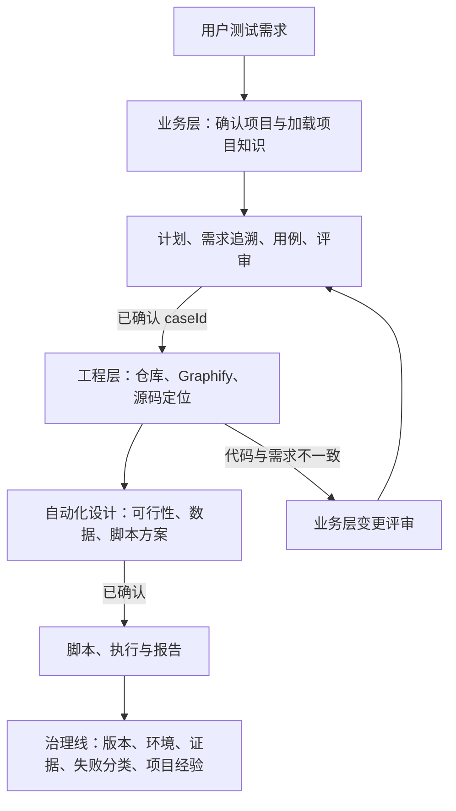

# AI 自动化测试工作流规范

<!-- owns: automation.lifecycle -->

## 1. 目的与适用范围

本文定义 Codex 参与自动化测试时的协作流程，适用于 Web、H5、App、App 内 WebView、API、MQTT 和 IoT 端到端链路。

目标是将用户输入的资料转化为可审核、可追溯、可重复执行的测试资产，避免 AI 基于未确认信息直接生成、执行或修改正式测试脚本。

项目强制规则以 [AGENTS.md](../../AGENTS.md) 为准。本文是生命周期、任务执行清单、受控探索和工程层进入条件的唯一正文来源；测试设计与评审标准见 [testcase-guideline.md](./testcase-guideline.md)，环境与数据生命周期见 [environment-guideline.md](./environment-guideline.md)，运行结果见 [report-guideline.md](./report-guideline.md)。

## 2. 角色与职责

| 角色 | 职责 |
| --- | --- |
| 用户 / 测试负责人 | 提供资料与业务目标；审核测试计划、用例、脚本、目标环境和改进项。 |
| Codex 作者 / 编排者 | 解析资料，提出合理推断，输出测试计划、用例、脚本草案和结果分析；收齐隔离 reviewer 结论后演进草案，并记录假设、缺失信息和风险。 |
| 隔离 reviewer | 仅以本角色允许的原始资料、当前 `plan.md` 和用例包进行只读审查，独立输出发现项和结论；不得修改测试资产或代替业务批准。 |
| 确定性 Runner | 使用 Playwright、Appium/WebdriverIO、API Client 或 MQTT Client 执行已确认的测试。 |
| CI/CD | 提供受控环境、Secret、定时或发布前执行能力，并归档执行结果。 |

Codex 不自动合并、不自动发布、不默认访问生产环境，也不执行未经确认的高风险操作。

## 3. 总体流程

```text
测试请求
  ↓
上下文加载：读取用户偏好 → 按测试需求确认被测项目 → 读取项目测试经验库 → manifest 与章节索引筛选 → 读取命中原始资料
  ↓
业务层：资料输入 → 测试计划草案 → 用户确认 → 测试用例草案 → 用例集评审与演进 → 用户确认
  ↓
工程层：定位代码仓库 → 检查 Graphify 图谱 → 自动化可行性与脚本设计
  ↓
Web/H5：可见 Chrome + Playwright Inspector 受控探索 → 探索证据卡
  ↓
正式脚本 diff → 静态检查与脚本评审
  ↓ 一次确认不可变执行清单
setup → 正式测试 → teardown → 报告
  ↓
范围完成判定、失败分析、修复建议与改进项
  ↓ 用户审核确认
下一轮脚本修改或重新执行
```

每个阶段的输出都是下一阶段的输入。任何草案、候选环境或合理推断均不得绕过审核直接用于正式脚本或测试执行。

### 3.1 测试上下文加载

每次测试任务开始时，Codex 必须先完成以下上下文加载，再进入资料输入、受控探索或测试计划：

1. 无条件读取 `.local/testing-memory.md`（如存在），加载当前用户的长期协作与行为偏好。
2. 根据用户测试需求、目标 URL、资料来源、**活跃**测试计划或已关联资产确认被测项目；此时不得扫描业务源码来替代需求理解。匹配的活跃 `plan.md` 不存在时，必须按当前用户请求创建新的测试计划；不得因只发现归档请求而报告“等待历史范围确认”，也不得默认读取归档请求。
3. 被测项目已识别时，只读取对应项目测试经验库 `docs/testing/knowledge/<project>-testing-knowledge.md`（如存在）；不得读取或套用其他项目的测试经验。
4. 在读取 `sources/` 的正文前，先扫描目录结构并读取 `sources/manifest.yaml` 的元数据（`id`、路径、类型、版本、适用项目、`reference_scopes`、状态）；存在当前项目的 `knowledge_indexes` 登记时，再读取受控章节索引（资料 `id`、`sectionId`、主题、关键词、定位和 SHA-256）。不得以全量打开资料库代替选择。
5. 仅读取以下原始资料：用户直接指定的资料；`status: active` 且 `applicable_projects`、章节主题、关键词、`reference_scopes` 或已有计划追溯与当前测试需求匹配的资料；以及为解释已确认需求所必需的上级资料。**索引命中只表示候选，不表示已读取或已引用。**每份实际读取且用于测试范围、业务规则、推断或结论的资料，必须在当前 `plan.md` 的“输入资料”中记录 manifest `id`、`sectionId`、路径、页码或标题定位、版本和 SHA-256，以及本次用途。资料位于仓库时，记录可点击的仓库相对 Markdown 链接；原型使用精确页面链接，PDF/Word 保留页码或标题定位。命中含图片、流程图或扫描页时，才按需视觉/OCR读取；该读取结果仍须由原始资料复核。
6. 在资料筛选后读取 `test-assets/manifest.yaml`，按项目、类型、平台和范围选择 `active` 静态资产。唯一候选或唯一默认候选可直接作为计划候选；多个同等候选或无候选只记录“待选择”，不得根据文件名、修改时间或目录名称猜测。静态资产不是业务需求依据，不写入“输入资料”表，也不登记到 `sources/manifest.yaml`。
7. `sources/` 内出现但未登记的资料、登记路径不存在、版本/适用范围无法确认或存在多个同等候选资料时，先补登或记录为 `missingInfo` 并向用户确认；不得把文件名、目录名或历史经验当作业务事实。`unknown` 只表示待确认元数据，不是可忽略或默认适用。
8. 被测项目尚未能唯一确认时，记录为 `missingInfo` 并向用户确认；在确认前不得猜测项目专属流程、环境约束、配网方式或恢复策略。
9. 每次输出测试计划、用例草案、评审结论或范围调整时，面向用户列出“本轮实际引用资料”：直接资料和原始知识资料分别列出**可点击资料链接**、`manifest id / sectionId`（如有）、页码/标题/原型页面定位与用途；没有引用知识库时明确写“本轮未引用知识库资料”。仓库资料使用 Markdown 链接；对话附件未落盘或链接不可复现时，明确标注“仅对话附件，暂无持久链接”，并在需要长期追溯前补登到 `sources/`。不得把仅扫描到、仅索引命中或未打开的资料列为依据。

用户偏好适用于本次测试的全部阶段；项目测试经验仅适用于匹配的被测项目。项目测试经验库只沉淀已验证的测试策略，`sources/knowledge-base/` 原始知识资料库才是协议、接口和产品规则的可追溯输入；不得在经验库复制原始需求或契约。两类资料冲突、原始资料版本变化或证据不足时，以当前 `plan.md` 中已登记且确认的原始资料和结论为准。二者都只作为决策输入，不能覆盖当前用户指令、已确认测试计划或实际执行证据。

### 3.1.1 本机维护命令发现与执行

“清理”“重置”“归档”“恢复”属于工程维护请求，不进入测试计划、用例或执行阶段。每个新对话处理此类请求时，必须先读取 `package.json` 的 scripts 与 `scripts/README.md`，按已登记命令的用途和边界选择操作；不得根据目录名、历史经验或扫描结果自行推断要删除的文件。

| 用户意图 | 必须先做 | 允许的后续动作 |
| --- | --- | --- |
| “清理本地测试数据”等范围不完整表述 | 定位匹配命令并运行 `--dry-run` | 输出将清理/归档的类别，等待用户确认完整范围；不得手工删除目录。 |
| “完整重置”“清除所有测试数据”“从头测试” | 确认 `reset:full-test-state` 已登记 | 执行 `npm run reset:full-test-state`；它清理本地运行状态并归档活跃测试资产，不删除远端业务数据。 |
| 恢复已登记的本机资源 | 确认资源台账与恢复命令 | 使用 `npm run test-data:recover`；它不是清理命令。 |
| 用户要求的范围没有对应命令 | 比对命令边界与用户范围 | 报告没有安全匹配命令及最小补充指示；不得用目录扫描或 `rm` 模拟。 |

命令失败、预演结果与用户范围不一致，或涉及远端资源、凭据、生产环境时，保持不执行状态并报告原因。维护请求的产出仅记录命令、脱敏类别和结果；不得把 `.local`、`.auth` 或台账内容作为可预览产出链接。

### 3.1.2 测试请求任务执行清单与进度

测试计划形成时，Codex 必须在同一测试请求的 `plan.md` 建立“任务执行清单”。它是本次请求的跨阶段基线，说明需要经过哪些适用任务、各自的进入条件和完成标志；不是新的流程文档，也不替代测试计划、用例集、工程设计、脚本或执行结果已有的状态字段。

任务清单至少包含：资料、静态资产与环境预检；计划确认；用例生成与追溯；评审、自动演进与复审；用例确认；工程设计；脚本、执行与报告。按本次范围裁剪：不适用任务写为“跳过”并说明依据；写入型测试增加“数据策略/清理或残留台账确认”；App 工程设计增加“资产元数据、Appium 与设备验证”子任务；Web、API、MQTT 或 IoT 链路按需增加受控探索、设备准备、认证挑战或集成验证子任务。后续新增任务必须记录原因、受影响范围和完成标志。

任务状态只允许为：`待开始`、`进行中`、`已完成`、`等待确认`、`阻塞`、`跳过`。`等待确认` 不等于阻塞：前者只等待用户作出最小业务、环境、写入或执行授权决定；后者必须说明缺少的具体条件、受影响任务和解除条件。`已完成` 必须关联计划区块、用例包、工程设计、脚本、报告或其他实际输出；不得以推测或仅打开文件标记完成。

实时状态、待办、依赖关系、阻塞和恢复信息保存在 Git 忽略的 `.local/test-task-state/<type>/<project>/<test-request>/`。每次开始或恢复任务时先读取该状态；每次实质工作完成、阶段变化、阻塞变化或请求确认时先更新本机状态，再在同轮对话中输出完整的简短阶段进度表。表中必须始终列出本次全部适用任务；用户无需打开 `plan.md` 才能知道当前阶段、所需资料、阻断原因、最小确认项和下一步。不得在本机状态或对话卡片记录 `.env` 值、账号、密码、Token、验证码、资源 ID、真实用户信息或敏感业务数据。

每轮进度表后必须输出“本轮产出卡”。产出卡固定提供当前 `plan.md` 的可点击预览入口，并仅列本轮新增或更新的持久化、已存在且可安全展示的文件；没有文件变更时明确写“本轮无持久化文件变更”。产出按 Markdown、图片、视频、HTML 报告、Trace 和普通文件标注预览方式。先使用 `npm run task:output -- --request <type/project/request> --task <TASK-xx> --change 新增|更新|引用 --file <仓库相对路径>` 登记多个文件；没有文件时使用 `--none`。严禁登记 `sources/`、`test-assets/`、`.env`、`.auth/`、`.local/`、归档、工作区外路径或任何敏感文件；链接只指向实际输出，不把输入资料、内部推理或空白文件伪装为交付物。选择了静态资产时，在产出卡后另列“本轮测试资产引用”及可点击路径；它是输入候选，不是本轮产出。

默认对话卡片如下；无阻断或无用户动作时明确填写“无”：

### 3.1.3 阶段交接核验与中断恢复

每次将任务推进到下一阶段、宣告阶段结论或向用户请求确认前，必须完成“阶段交接核验”：本机任务状态、`plan.md` 正式记录和本轮产出三者对同一阶段的状态、证据与下一步一致。任一项缺失、互相矛盾或尚未登记时，不得推进；将受影响任务标为“进行中”或“阻塞”，在本机状态和同轮进度卡写明恢复入口。最终复审必须通过唯一可恢复事务入口 `npm run task:review -- review-transaction-finalize --request <type/project/request> --batch <REV-...> --file <已修订草案>`：它以已登记事务为前提，同步 `RULE → caseId`、登记本轮产出、验证 `plan.md` 正式 reviewer 记录、发现项闭环与本机真实 Agent 事实，并在同一次本机状态提交中关闭 `TASK-04`；任一步失败都只能标为“待恢复”，不得提交最终状态。

### 4.3 短事务闭环与生命周期恢复

生命周期由持久化短事务队列驱动，不依赖模型在单一长回合中连续执行。资料筛选、计划校验、计划确认、用例包生成、关系同步、静态检查、reviewer 派发/收集、自动演进、最终复审、工程设计、脚本评审、执行和报告均为独立短事务。每项必须登记输入摘要、前置条件、唯一执行动作、预期产物、校验方式、重试次数和下游依赖。

短事务只有在产物已落盘（或明确登记无持久化产物）、校验结果已记录且本机状态已提交后才可标记“已完成”。`task:gate --json` 返回执行信封和唯一下一动作；`transaction-claim --owner <稳定执行者标识>` 返回三分钟租期及 claim token，续租、提交、重试或阻塞必须使用该 token。模型回合结束或用户插话不改变已提交事实。

#### 阶段执行信封与最终回复门禁

短事务是提交单位，阶段执行信封是对话与编排单位。一个适用阶段从首个短事务被领取起进入同一执行信封；短事务可以依次提交，但在阶段完成、真实阻塞或合法人工门禁前，执行信封不得关闭。每次状态变化后重新运行 `task:gate`；最终回复前必须通过 `task:gate --assert-final`。

阶段执行信封只允许以下状态：

| 状态 | 含义 | 是否允许最终回复 |
| --- | --- | --- |
| `active` | 存在可立即领取和执行的唯一下一动作。 | 否；继续领取、执行和提交。 |
| `internal_wait` | reviewer 运行、并发槽不足、异步工具未完成、普通重试退避或自动演进等待校验。 | 否；只允许进度更新并继续有界等待。 |
| `waiting_confirmation` | 到达计划、用例集、写入/高风险执行或报告后正式资产变更的人工确认门禁。 | 是；只提出绑定事务的最小确认问题。 |
| `blocked` | 资料冲突、未定义验收、环境/权限不可用、安全挑战或 reviewer 真实失败/超时。 | 是；必须给出受影响事务、解除条件和固定恢复选项。 |
| `completed` | 当前目标全部适用阶段已完成并提交证据。 | 是；输出最终结果。 |
| `cancelled` | 用户明确取消目标或受控取消分支已正式提交。 | 是；说明取消范围和保留状态。 |

最终回复资格必须从执行信封状态派生，不得由模型根据“本轮做了不少工作”“reviewer 已派发”或“工具暂时没有返回”自行决定。`active` 和 `internal_wait` 期间只能发送简短进度消息；不得输出“已派发，待返回后继续”“下一步将自动执行”“请回复继续”或其他会结束当前回合、把恢复责任交给用户的交接语。用户询问状态时，先报告当前信封、短事务和内部等待对象，再继续唯一下一动作；除非用户明确取消或替换目标，插话不关闭执行信封。

内部等待必须使用不超过 60 秒的有界等待：等待结束时若有结果，立即提交对应短事务并重新计算下一动作；若无结果，只更新进度并继续下一次有界等待。并发槽不足时，将未启动角色保持为“等待资源”；任一已启动 reviewer 返回后，先原子提交其正式结果，再释放槽位并补派唯一的下一等待角色。全部 reviewer 收齐后直接进入自动演进、校验、下一轮复审或最终提交，不产生中间最终回复。

项目级 `Stop` Hook 调用最终回复门禁；每个活跃请求同时绑定一个按 request ID 去重的 Codex thread heartbeat。heartbeat 每分钟查询执行信封：有效租约存在时不重复领取，租约失效时恢复同一事务；确认或阻塞时暂停，完成或取消时删除。Hook 不可用、未受信任或被组织策略禁用时，必须形成宿主能力阻塞。仓库 wake 仍是通用持久化契约，不替代宿主续跑器。

确认必须绑定唯一短事务：计划确认、用例集确认、执行授权和报告后的正式资产变更确认只能通过该事务的确认记录解除；确认不得开放其他并行阶段。每次可继续的状态提交必须产生去重 wake；Stop Hook 和 heartbeat 只消费执行信封，不保存业务正文。

只有计划范围确认、用例集最终确认、脚本评审后的统一执行清单和报告后的正式资产变更可进入确认门禁。资料冲突、未定义验收、环境不可用、安全挑战、权限或超出已确认执行清单等真实阻塞必须绑定受影响短事务，展示且只展示：重试、等待外部恢复、提供资料或裁决、跳过受影响范围、取消。普通格式、追溯和评审遗漏一律自动修订并复检；未关闭阻塞或未通过确认门禁不得推进下游事务。

评审阶段的交接顺序固定为：完成 `TASK-03` 与追溯同步 → 创建评审事务并持久化批次、适用角色和派发意图 → 在 `plan.md` 建立该批次的输入基线与 reviewer 行 → 启动 reviewer 并立即登记每个真实 Agent 任务标识 → 收齐结果后回填角色结论、发现项、分类和沉淀判定 → 自动演进、登记修订产物和使初审失效 → 创建并启动最终复审事务 → 最新最终复审收敛后才提交事务并请求用例确认。任何一步未完成时，不得向用户宣告评审完成、用例可确认或阶段结论。

用户插话不改变执行信封；并发槽不足和 reviewer 尚未返回属于 `internal_wait`，必须在当前阶段内有界等待和自动补派。只有宿主抢占或状态写入失败属于可恢复中断，且都不是评审完成。本机状态是运行事实事件账本：事务、派发、启动、完成、失败、草案修订、正式记录同步和恢复动作必须立即落盘；`TASK-04`、批次和整体终态只能由这些事实及正式记录派生，`plan.md` 不复制宿主抢占、wake 或租约等运行时恢复字段。恢复已有请求时，先运行 `npm run task:resume -- --request <type/project/request>`，并只执行其返回的唯一动作，优先级固定为：修复未同步正式记录、等待并收集已启动 reviewer、派发未启动 reviewer、自动演进、发起最终复审、最终提交。已失效批次不得阻断其后的自动演进或最终复审。未启动的适用 reviewer 在正式记录中标为“等待资源”；已启动但未登记的 reviewer 视为状态不一致。此时 `TASK-04` 必须保持“进行中”或“阻塞”，本机状态至少保存中断事实、未完成 reviewer、唯一恢复动作、受影响任务和禁止推进的下一阶段。不得将未登记 reviewer 视作“未开始”或“已完成”。

评审恢复默认自动续跑：补齐正式区块、同步真实 reviewer 运行事实、派发缺失角色、等待已启动角色、自动演进或启动最终复审均为 Codex 的内部动作，不得要求用户逐项确认“继续”。只有资料冲突、验收缺失、范围/环境/写入授权、安全挑战或 reviewer 真实失败/超时才可以暂停并请求最小解除条件。每个 `REV-*` 只能使用一个由事务命令维护的显式边界正式区块；运行状态可为“评审中”，角色结论、发现项和沉淀判定均在该区块内闭环。

| 阶段 | 任务 | 状态 | 当前结论 / 需要动作 |
| --- | --- | --- | --- |
| <阶段> | <任务> | 待开始 / 进行中 / 已完成 / 等待确认 / 阻塞 / 跳过 | <结论；阻塞时写缺少项、影响和解除条件；等待确认时写最小问题和确认后动作> |

### 3.2 双层模型与贯穿治理线

测试资产采用“业务层 + 工程层”的双层模型。业务层决定**测什么和为什么测**，工程层决定**怎样稳定、可重复地实现已确认用例**；环境、版本、数据、证据和变更影响分析作为贯穿治理线，不能由任何一层单独省略。



| 层级 | 主要输入 | 主要产物 | 不得替代的依据 |
| --- | --- | --- | --- |
| 业务层 | 用户需求、原始资料、项目知识、风险 | 计划、需求追溯矩阵、已确认用例 | 不得以当前代码行为替代已确认业务规则。 |
| 工程层 | 已确认 `caseId`、代码仓库、图谱、源码、环境能力 | 自动化设计、脚本、运行证据 | 不得擅自改变用例的业务预期或范围。 |
| 治理线 | 两层产物与实际运行 | 版本关联、数据/环境审批、证据、影响分析、复盘 | 不得以口头说明替代可追溯记录。 |

代码、图谱或运行结果与已确认需求不一致时，工程层必须产出差异和证据，退回业务层评审；不得静默修改用例、放宽断言或把当前代码实现视为正确规则。

### 3.3 受控探索与缺失信息补全

规则生效后新建或重新打开执行范围的 Web/H5 请求，必须在生成正式脚本前完成独立 `explore` 短事务；不得因为已有源码、Graphify、旧 selector 或历史脚本而跳过。阶段顺序固定为“可见探索完成 → 探索证据卡校验通过 → 正式脚本生成与评审”，任一前置未完成时正式脚本阶段保持关闭。成熟化规则不迁移或改写生效前已有的计划、用例、脚本、运行记录与本机台账。

探索完成资格、Inspector/ARIA/locator 观察及证据卡技术标准由 [selector-guideline.md](./selector-guideline.md#8-codex-生成与修复-selector-的流程) 唯一维护；运行模式、可见会话、零写入和敏感采集边界由 [environment-guideline.md](./environment-guideline.md#61-运行模式) 唯一维护；实际命令顺序只见 [Skill](../../skills/iot-automation-testing/SKILL.md)。源码与 Graphify 只能补充工程定位，不能代替页面语义探索。

无法满足可见探索完成条件时，探索事务进入绑定当前脚本范围的工具或环境阻塞，并记录受影响 `caseId` 与最小解除条件；不得生成正式脚本或宣称探索在后台继续。探索中的普通定位、断言或低风险动作失败属于阶段内部恢复，不得结束阶段或把“继续探索”交给用户；会话复位和重建边界由环境规范决定。

业务规则、告警阈值、权限语义、设备状态含义、接口字段业务含义和生产行为仍须来自已引用资料或用户裁决，不得由页面观察反推为需求事实。滑块、短信/图形验证码、人机验证和设备确认等安全挑战不得绕过；正式执行遇到安全挑战时，只请求用户完成最小人工操作，随后重新观察并自动接管确定性步骤。

人工接管提示必须说明：当前状态、阻碍类别、用户唯一需要完成的操作、禁止操作、完成标志、自动恢复动作、最长等待时间和超时影响。不得要求“继续操作”“看看页面”或让用户完成剩余普通流程。每个可恢复流程使用以下状态机：

```text
自动准备 → 自动执行 → 成功 / 失败 / 识别安全挑战
                                      ↓
                            用户仅完成安全挑战
                                      ↓
                    重新观察 → 自动恢复 → 成功 / 下一轮挑战
```

未知阻碍首次出现时，保留页面并采集脱敏的 URL、DOM/无障碍树、可见文案、按钮状态和网络/日志摘要；仅在无额外副作用前提下探索恢复条件。受控自优化只可补齐 selector、等待条件、状态转换和非破坏性恢复动作。环境、凭据、认证会话和产物脱敏规则见 [environment-guideline.md](./environment-guideline.md)。

Web / H5 的正式自动化执行统一使用 Playwright：

```bash
npm run test:web
npx playwright test
```

默认使用 Playwright 自带 Chromium。需要进行 Google Chrome 浏览器兼容性验证时，使用：

```bash
npm run test:web:chrome
```

该命令启动隔离的 Playwright Chrome 实例，不使用个人 Chrome Profile；它属于正式 Chrome 兼容性执行，不改变 Web/H5 使用 Playwright 语义探索的原则。正式结论只能来自 Playwright 的控制台输出、HTML Report、Trace、截图、视频、JUnit XML 和 Allure Report。

## 4. 阶段一：资料输入与测试计划

### 4.1 可接受的输入

- 需求文档、产品说明书、研发设计文档。
- 页面 URL、原型地址、页面截图、App 截图。
- 接口文档、请求响应样例、已有人工测试用例。
- MQTT Topic、设备物模型、告警规则、失败报告。

资料应放入 `sources/` 对应目录，或在对话中明确提供文件路径、URL、版本和适用环境。

`sources/` 的读取顺序为“扫描目录与 manifest 元数据 → 读取当前项目受控章节索引 → 按本次需求筛选命中文档与章节 → 按需读取原始资料和视觉内容 → 在计划中回链”。原始资料变更导致索引 SHA-256 不一致时，索引视为过期，不得继续用于确认需求；重新索引后按变更影响规则复核。新增或直接提供的资料在用于正式计划、用例或评审前必须登记到 `sources/manifest.yaml`；仅浏览目录、manifest 或章节索引不等于已读取资料正文。

### 4.2 Codex 输出的测试计划

测试计划默认状态为“草案”，至少包含：

- 测试目标、范围和非范围。
- 资料来源、版本或 URL。
- 本轮实际引用资料清单：每项提供可点击资料链接、`manifest id / sectionId`、可定位章节及其对范围、规则或推断的用途；未引用的知识库资料不列入。
- 测试资产选择：从 `test-assets/manifest.yaml` 选择的候选资产、可点击路径、选择状态和工程验证项；它不属于“输入资料”或业务需求追溯。
- 测试类型、目标页面/API/Topic/设备及建议测试路径。
- 环境候选项、选择依据和待确认的目标环境。
- 合理推断、缺失信息、风险和待审批事项。
- 需求追溯矩阵，以及用例生成后进行用例集评审与草案演进的交付要求。
- 预计生成的用例、脚本、测试数据、执行命令和报告产物。

计划需要保存时，必须写入 `testcases/<type>/<project>/<test-request>/plan.md`；同一测试请求只使用这一份 `plan.md` 承载计划、评审和后续工程层设计，不再使用 `*.plan.md` 命名。使用固定中文标题和表格，字段格式见 `testcase-guideline.md`。写入或批量更新后，先对实际计划运行 `npm run check:markdown -- <计划路径>`，再运行 `npm run check:architecture`；仅分隔行列数不一致时可运行 `npm run check:markdown -- --fix <计划路径>` 后复检，数据行或正文问题必须修订生成结果。两项检查均通过前，不能对用户称“测试计划已生成”或进入计划确认门禁。

### 4.3 环境处理

环境选择优先级为：已确认测试计划或用户明确指定 > 已确认测试用例的 `targetEnvironment` > `DEFAULT_TEST_ENV`。

当用户未明确环境时，Codex 默认将 `test` 写为候选环境；在计划或工程设计输出中与范围、用例、差异、数据影响一并提交用户确认，并额外提示“未指定环境，已默认使用 test 待确认”。不得为此单独阻塞或单独追问。用户明确指定环境、已确认计划或已确认用例另有目标环境时才覆盖默认值。生产环境不得默认选择；即使获得计划确认，执行前还需要显式开启生产环境保护开关。

生成或更新计划时，Codex 必须执行 `npm run check:environment -- --plan` 的安全预检；已选择静态资产时追加 `--asset <assetId>`。预检只验证所选资产的存在性与 SHA-256，不修改 `.env` 或访问服务；Appium、设备、包名和 Activity 缺失只能标为工程设计待验证，不能阻塞计划或用例生成。计划的“环境选择”记录本地配置状态、预检状态、用户确认状态和未闭合项。只记录脱敏结论；`.env` 配置存在不等于环境可用或用户已确认，未执行预检时不得写成“未提供环境”。

### 4.4 阶段审核门槛

用户至少需要确认：测试范围、目标环境、关键业务预期、合理推断、缺失信息处理方式和高风险操作。

未确认时，Codex 只能补充计划或提出问题，不能生成正式用例和脚本。

## 5. 阶段二：测试用例

计划确认后，按 [testcase-guideline.md](./testcase-guideline.md) 的用例包、原子用例、状态、`REQ ↔ RULE ↔ caseId` 和覆盖标准生成完整草案。计划阶段不得绕过确认直接进入工程层；用例集的状态、评审质量标准、发现项闭环和变更影响均由用例规范定义。

### 5.1 多角色隔离评审

用例集评审属于“用例集评审与演进”，不创建平行评审文档。流程上的门禁是：完整草案完成后，按 [testcase-guideline.md](./testcase-guideline.md#510-用例集评审与草案演进) 确定适用评审；按 [Skill 提示卡](../../skills/iot-automation-testing/SKILL.md#多角色隔离评审提示卡) 启动隔离 reviewer；所有适用结论和发现项闭环后才可提交用户确认。编排或执行记录缺失时，任务清单保持阻塞，不能以作者自评替代。

启动初审前，必须确认 `TASK-03` 已完成、关系同步及 `npm run check:rule-design -- <plan.md>` 已通过、初审批次已登记、当前 `plan.md` 已建立包含输入基线与适用 reviewer 的正式记录。预检发现的普通覆盖遗漏先自动修订并复检；reviewer 返回后，必须先回填正式记录、发现项分类、沉淀判定和本机状态，才能在对话中报告阶段结论；中间状态只能报告“评审进行中”及恢复信息。

#### 连续自动演进与收敛

本节是自动评审循环、任务状态和用户交互的唯一规则来源；发现项分类、修订证据和“可提交确认”的判定由用例规范定义，reviewer 的实际派发顺序由 Skill 定义。

资料明确的发现项必须按以下连续循环处理，不得在单条发现项、单个用例包或单次修订后向用户要求“继续”：

```text
初审 → 汇总分类 → 自动修订全部可证实缺口 → 静态检查与追溯同步
    → 旧批次失效 → 真实 reviewer 最终复审 → 收敛 / 下一轮 / 阻塞
```

- 初审为第 0 轮；每次已登记真实草案修订后的最终复审依次为第 1–3 轮。每轮必须先完成所有适用自动修订项及其规则邻域复核、登记本轮安全产出，再派发下一轮全部适用的真实、只读 reviewer。
- 循环期间，Codex 只更新 `plan.md`、本机任务状态和本轮产出登记，不向用户请求普通修订许可，也不把中间 reviewer 结论称为最终结果。任务状态保持“进行中”。
- 用例集只有在最新最终复审为“可提交确认”、追溯与静态检查通过、自动演进项均关闭且真实 reviewer 完成时才收敛。此时一次性输出完整进度卡、产出卡、自动演进轮次摘要、已修订 `caseId` 与非阻塞风险，再等待一次用例集确认。
- 仅在资料冲突、验收缺失、范围扩展、环境/写入/执行授权、安全挑战、reviewer 失败或超时时停止；输出受影响范围、已完成轮次和最小解除条件。达到第 3 轮仍需修订，或连续两轮没有新的草案修订证据时，`TASK-04` 必须标为“阻塞”，不得无限循环或降级为主 Agent 自评。
- 自动循环的内部更新不要求逐轮对话展示；收敛或阻断时才输出面向用户的完整汇总。用户始终保留最终业务确认权，自动修订不得生成正式脚本或执行测试。

#### 评审后的双层沉淀分流

每个评审批次完成分类后，主 Agent 必须在该批次的 `plan.md` “沉淀判定”表记录归属、目标位置、证据状态和处理结果；规则字段与有效值由 [testcase-guideline.md](./testcase-guideline.md#需求缺口处置与沉淀判定) 唯一定义。本阶段只做分流，不把单次评审结论静默丢失：

1. 需求事实继续通过 `sources → REQ → RULE → caseId` 追溯；不得复制进项目经验库。
2. 已确认且跨项目适用的治理结论，先检查唯一责任规范是否已覆盖；未覆盖时只更新其责任规范，不在计划、Skill 或项目经验库复制正文。
3. 仅具备资料推断或评审建议的项目级内容登记到 `.local/project-knowledge-candidates/<project>.json` 并在计划中只引用候选编号，等待受控探索或正式执行验证；不得影响当前已明确功能的通过/失败结论。
4. 候选一旦获得受控探索或正式执行的可审查验证证据，即按 [report-guideline.md](./report-guideline.md#10-用户偏好与项目测试经验) 即时提升为项目经验；报告阶段只复盘、合并、失效清理和汇总未提升原因。

## 6. 阶段三：自动化可行性、脚本设计与代码定位

本阶段仅在用例集已确认后开始。Codex 根据已确认用例选择对应技术实现：

| 测试类型 | 实现方式 |
| --- | --- |
| Web / H5 | Playwright |
| 原生 App / WebView | Appium + WebdriverIO |
| API | TypeScript API Client |
| MQTT | mqtt.js Client |
| IoT 链路 | API、MQTT 与 Web/App 组合 |

`archive/automation/` 中的内容是已废弃的测试专用实现，不属于可复用能力库；默认不得读取、编译、执行或作为脚本生成参考。只有用户明确要求审计历史实现、复盘或迁移时才可只读查看。归档目录不得保存需求资料、运行产物、凭据或 `.local/repositories/` 中的被测代码。

先将 `.local/repositories/` 作为本机代码仓库根目录，根据已确认项目和用例定位对应仓库；不得以名称相似为由扫描无关仓库。仓库路径、Graphify 图谱和源码定位依据只能写入当前测试请求的 `plan.md` 工程层，不得写入 `sources/manifest.yaml`，也不得作为业务需求或验收规则来源。选定仓库后，**在读取业务源码前**检查是否存在有效 Graphify 图谱：`graphify-out/` 与其中相互关联的 `.graphify_root`、`GRAPH_REPORT.md`、`graph.json`、`.graphify_analysis.json` 或带 Graphify 标识的清单文件。通用 `manifest.json` 不是单独的图谱证据。

有效图谱存在时，先读取报告、清单和源文件路径/实体/关系索引，以已确认需求、页面路径、接口、模块或领域名定位候选源码；再读取候选源码及必要直接依赖确认实现。图谱缺失、损坏、过期或无法唯一定位时，记录原因，回退到仓库结构、项目文档、路由/API 定义和受限文本检索。图谱只用于缩小检索范围，源码和已确认需求才是事实依据；不得读取或回显 `.env`、凭据、会话或其他敏感配置。

在生成正式脚本前，必须在同一测试请求的 `plan.md` 补充“工程层：代码定位与自动化设计”区块，并检查已有的 `src/actions/`、`src/clients/`、`src/fixtures/`、相似测试脚本和可用执行命令。工程设计和预检属于自动短事务，不额外增加人工门禁。该区块至少包含：

- 每个 `caseId` 对应的需求追溯编号、代码仓库、分支/提交标识、图谱路径及其新鲜度判断、源码路径和定位依据。
- 可复用 action、client、fixture、selector/接口契约，以及按 [environment-guideline.md](./environment-guideline.md) 确认的数据策略、台账引用、准备和清理方案。
- 自动化可行性结论：`可实现`、`部分自动化`、`受阻` 或 `需求/代码差异待确认`，以及依据和恢复条件。
- 拟修改或新增的脚本文件、执行命令、目标环境、预期报告位置、风险、假设及仍未满足的前置条件。

只有已确认用例且第 3.3 节探索门禁已经通过时，才能登记正式脚本。脚本生成、静态检查和脚本评审自动连续完成；缺少稳定 selector 或明确预期时只能形成探索草稿并返回探索事务，不得登记为正式脚本或宣称其已稳定可执行。

### 6.1 统一执行清单与范围重开

脚本评审通过后，运行时生成不可变的 `ExecutionAuthorizationSnapshot`，并通过一次确认覆盖本轮全部普通执行动作。清单至少绑定请求、环境、`plan.md` 与脚本摘要、完整 `caseId`、允许操作、资源类型与数量上限、验证码策略、数据策略、残留 TTL 和产物脱敏策略。

- 确认后的清单内操作不再逐项询问；Runner 在 setup 中重新校验摘要、环境和预算。
- 计划、脚本、环境、允许操作、资源类型或数量发生实质变化时，旧清单标记为 `superseded`，不得继续执行。
- 已到执行确认门禁或已进入其下游执行/报告分支的请求需要扩大或修复范围时，只能通过 `execution-scope-reopen` 回到工程设计短事务；命令将旧授权标为 `superseded`，保留已确认历史、旧 blocker 的解除记录、需求、用例与 reviewer 结论，不允许手工改本机状态。
- 切换生产环境、使用真实用户数据、执行不可逆高风险动作或超出清单上限必须重新确认；安全挑战进入绑定当前执行事务的阻塞，解除后恢复同一运行。
- API 或管理页面仅用于后台状态验证。二者都不可用时，只阻塞对应后台断言，不得把已执行的 UI 注册路径伪装成未执行或成功。

运行模式、数据策略、创建意图、TTL 和残留状态的唯一规则见 [environment-guideline.md](./environment-guideline.md#61-运行模式)，本节不重复维护。

### 6.2 自动化规范差异的简短告知

代码仓库、页面、接口、环境或现有测试能力不符合本工程规范时，Codex 必须在本轮回复中向用户给出简短、具体的告知，并在同一 `plan.md` 的工程层“规范差异与用户告知”表留下可追溯记录。不得只说“代码不规范”“无法自动化”或“需要优化”。

告知固定为一至三句，按以下顺序说明：**问题类别和具体事实 → 受影响 `caseId` 与自动化影响 → 最小处理建议或需用户确认项**。事实必须来自已读取的代码、DOM/ARIA 树、接口契约、配置或运行证据；无法观察时明确写“证据不足”，不得猜测研发原因或归责。

| 问题类别 | 必须明确的事实示例 | 自动化处理 |
| --- | --- | --- |
| 可访问性/定位 | “提交按钮没有可用的 ARIA role/name 或关联 label，且没有稳定 `data-testid`；当前候选定位不唯一。” | 记录受影响 `caseId`；建议补充语义或 `data-testid`，或说明受限 XPath 的风险；结论为“部分自动化”或“受阻”。 |
| 测试契约/接口 | “接口响应未提供已确认断言所需字段，或字段语义与资料不一致。” | 记录契约证据，标为“需求/代码差异待确认”，退回业务层确认。 |
| 复用能力 | “现有 action/client/fixture 无法覆盖该已确认流程，且新增实现依赖未确认的业务操作。” | 说明缺少的能力和最小新增范围，待用户确认设计后再实现。 |
| 数据、环境或权限 | “缺少隔离测试账号、设备状态或非生产环境，无法满足用例前置条件。” | 标为“受阻”，说明需要提供或恢复的最小条件；不以生产或真实数据替代。 |
| 仓库或代码定位 | “未能将已确认项目唯一映射到 `.local/repositories/` 下的仓库”，或“图谱和受限检索均无法定位候选实现”。 | 记录确认依据和已排除范围，请用户确认仓库或补充模块/路由/接口信息。 |

示例：`问题：可访问性/定位不符合规范——创建按钮缺少唯一 ARIA 名称和 data-testid，DOM 中有 2 个同名按钮。影响：OPEN-PRODUCT-001 暂不能形成稳定脚本。建议：为目标按钮补充 data-testid="product-create-submit"；确认前自动化结论为“受阻”。`

## 7. 阶段四：测试执行与报告

正式执行前必须确认：

- 测试计划和用例已确认，脚本评审已通过，统一执行清单已确认且摘要仍有效。
- API、MQTT Broker、测试账号、测试设备或 Appium 服务可用。
- 已按 [environment-guideline.md](./environment-guideline.md) 确认环境、数据策略和执行前置条件。
- 所需敏感配置来自本地 `.env`、环境专用 `.env.*` 或 CI Secret，未写入代码和日志。

Web 正式执行由 Playwright project dependencies 连续完成 setup、正式用例与 teardown；报告随后汇总功能和数据卫生两个独立状态。安全挑战是唯一允许在同一运行中暂停人工接管的输入点，解除后继续原事务，不重新创建资源。

正式 Runner 固定单 worker 且不启用失败即停。一个 `caseId` 失败后继续执行所有无依赖用例；只有缺少已声明能力或未精确确认前置资源的消费者进入 `blocked`。产品断言失败不得批量改写为 `skipped`，也不得阻止执行事务汇总所有可执行用例；仍有 `blocked` 或 `unknown` 时，执行事务保持可恢复阻塞。

正式入口仅允许 `npm run test:web:execute -- --request <type/project/request>` 和同一授权的 `--resume`。入口拒绝 `--grep`、文件路径及其他过滤参数；诊断运行不得写入正式原子结果。

执行产物统一保存到 `artifacts/`；目录、逐用例证据强度、脱敏和结果资格只按 [report-guideline.md](./report-guideline.md) 判定，不在流程规范重复定义。

执行失败不等同于产品缺陷；需要进入失败分析阶段。

### 7.1 报告交接

执行结束后，将实际脚本结果、环境与数据处理结果交给 [report-guideline.md](./report-guideline.md) 完成范围判定、正式证据、结果统计、最终进度展示和复盘；流程规范不重复定义结果或证据资格。

## 8. 阶段五：失败分析与持续改进

Codex 读取测试报告、日志、截图、Trace、API 摘要和 MQTT 摘要后，按以下类别分析失败。对脚本问题或未知状态，分析须附“观察 → 判断 → 恢复策略 → 验证结果”记录，以便下一轮在相同状态下优先自动恢复：

- 产品问题。
- 脚本问题。
- 环境问题。
- 测试数据问题。
- 未知问题。

分析结果必须包含证据、结论置信度、修复建议和后续动作。脚本修复、用例补充、环境配置调整或面板改进均先输出 diff 或结构化建议，待用户审核后再实施。

## 9. 停止条件与升级处理

出现以下任一情况时，暂停后续阶段并说明原因：

- 目标环境、业务预期或关键前置条件无法确认。
- 缺少测试账号、测试设备、APK、接口鉴权或 MQTT 连接信息。
- 推断内容会影响断言、环境选择、数据写入或高风险操作，但用户尚未确认。
- 目标为生产环境，或可能删除真实数据、控制硬件、批量修改设备。

暂停时应输出已完成内容、`assumptions`、`missingInfo`、风险和下一步需要用户确认或补充的信息。

## 10. 最小交付清单

| 阶段 | 最小交付物 | 审核结果 |
| --- | --- | --- |
| 测试计划 | `testcases/<type>/<project>/<test-request>/plan.md` 或对话中的结构化计划 | 已确认 / 已拒绝 |
| 测试用例 | 结构化 Markdown 用例 | 已确认 / 退回修改 |
| 自动化设计 | `plan.md` 中的工程层代码/Graphify 定位、可行性、数据与脚本方案 | 已确认 / 退回修改 |
| 自动化脚本 | 基于已确认设计的脚本 diff、执行方案和数据影响说明 | 批准执行 / 退回修改 |
| 测试执行 | 测试结果、报告路径和失败证据 | 接受结果 / 要求复测 |
| 失败分析 | 分类、证据、修复建议和改进项 | 批准实施 / 继续排查 |
