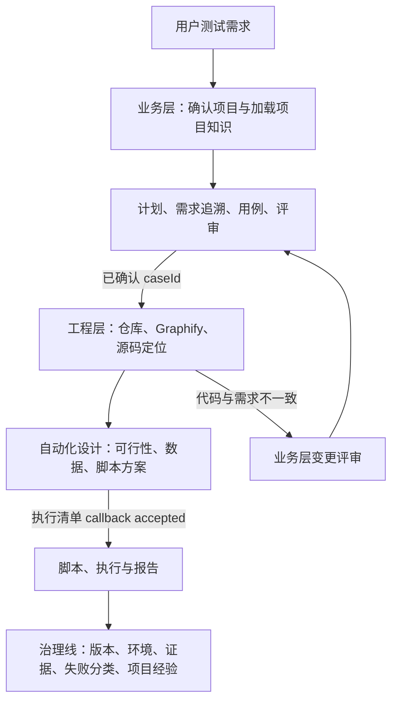

# AI 自动化测试工作流规范

<!-- owns: task.lifecycle -->

## 1. 目的与适用范围

本文定义 Codex 参与自动化测试时的协作流程，适用于 Web、H5、App、App 内 WebView、API、MQTT 和 IoT 端到端链路。

目标是将用户输入的资料转化为可审核、可追溯、可重复执行的测试资产，避免 AI 基于未确认信息直接生成、执行或修改正式测试脚本。

项目强制规则以 [AGENTS.md](../../AGENTS.md) 为准。本文是生命周期、事件状态机、阶段编排和工程层进入条件的唯一正文来源；测试设计与评审标准见 [testcase-guideline.md](./testcase-guideline.md)，环境与数据生命周期见 [environment-guideline.md](./environment-guideline.md)，运行结果见 [report-guideline.md](./report-guideline.md)。

## 2. 角色与职责

| 角色 | 职责 |
| --- | --- |
| 用户 / 测试负责人 | 提供资料与业务目标；审核测试计划、用例、脚本、目标环境和改进项。 |
| Codex 作者 / 编排者 | 解析资料，提出合理推断，输出测试计划、用例、脚本草案和结果分析；收齐隔离 reviewer 结论后演进草案，并记录假设、缺失信息和风险。 |
| 隔离 reviewer | 仅以本角色允许的原始资料、当前 `plan.md` 和用例包进行只读审查，独立输出发现项和结论；不得修改测试资产或代替业务批准。 |
| 确定性 Runner | 使用 Playwright、Appium/WebdriverIO、API Client 或 MQTT Client 执行已确认的测试。 |
| CI/CD | 提供受控环境、Secret、定时或发布前执行能力，并归档执行结果。 |

Codex 不自动合并、不自动发布、不默认访问生产环境，也不执行未经确认的高风险操作。

## 3. 总体流程

```text
测试请求
  ↓
上下文加载：读取用户偏好 → 按测试需求确认被测项目 → 读取项目测试经验库 → manifest 与章节索引筛选 → 读取命中原始资料
  ↓
业务层：资料输入 → 测试计划草案 → 用户确认 → 测试用例草案 → 首稿 readiness → 风险分级评审与定向演进 → 用户确认
  ↓
工程层：定位代码仓库 → 检查 Graphify 图谱 → 自动化可行性与脚本设计
  ↓
Web/H5（存在页面语义、状态变化、定位或证据风险时）：可见探索 → 探索证据卡
  ↓
正式脚本 diff → 静态检查与脚本评审
  ↓ 一次确认不可变执行清单
setup → 正式测试 → teardown → 报告
  ↓
范围完成判定、失败分析与 WorkflowCompleted
```

报告后的资产修改、缺陷修复或重新执行必须由用户另行提出，或进入相应的条件性决定流程；它们不是第四个固定确认门禁。每个阶段的输出都是下一阶段的输入，任何草案、候选环境或合理推断均不得绕过三项固定 callback 或适用的条件性决定直接用于正式执行。

### 3.1 测试上下文加载

每次测试任务开始时，Codex 必须先完成以下上下文加载，再进入资料输入、受控探索或测试计划：

1. 无条件读取 `.local/testing-memory.md`（如存在），加载当前用户的长期协作与行为偏好。
2. 根据用户测试需求、目标 URL、资料来源、**活跃**测试计划或已关联资产确认被测项目；此时不得扫描业务源码来替代需求理解。匹配的活跃 `plan.md` 不存在时，必须按当前用户请求创建新的测试计划；不得因只发现归档请求而报告“等待历史范围确认”，也不得默认读取归档请求。
3. 被测项目已识别时，只读取对应项目测试经验库 `docs/testing/knowledge/<project>-testing-knowledge.md`（如存在）；不得读取或套用其他项目的测试经验。
4. 在读取 `sources/` 的正文前，先扫描目录结构并读取 `sources/manifest.yaml` 的元数据（`id`、路径、类型、版本、适用项目、`reference_scopes`、状态）；存在当前项目的 `knowledge_indexes` 登记时，再读取受控章节索引（资料 `id`、`sectionId`、主题、关键词、定位和 SHA-256）。不得以全量打开资料库代替选择。
5. 仅读取以下原始资料：用户直接指定的资料；`status: active` 且 `applicable_projects`、章节主题、关键词、`reference_scopes` 或已有计划追溯与当前测试需求匹配的资料；以及为解释已确认需求所必需的上级资料。**索引命中只表示候选，不表示已读取或已引用。**每份实际读取且用于测试范围、业务规则、推断或结论的资料，必须在当前 `plan.md` 的“输入资料”中记录 manifest `id`、`sectionId`、路径、页码或标题定位、版本和 SHA-256，以及本次用途。资料位于仓库时，记录可点击的仓库相对 Markdown 链接；原型使用精确页面链接，PDF/Word 保留页码或标题定位。命中含图片、流程图或扫描页时，才按需视觉/OCR读取；该读取结果仍须由原始资料复核。
6. 在资料筛选后读取 `test-assets/manifest.yaml`，按项目、类型、平台和范围选择 `active` 静态资产。唯一候选或唯一默认候选可直接作为计划候选；多个同等候选或无候选只记录“待选择”，不得根据文件名、修改时间或目录名称猜测。静态资产不是业务需求依据，不写入“输入资料”表，也不登记到 `sources/manifest.yaml`。
7. `sources/` 内出现但未登记的资料、登记路径不存在、版本/适用范围无法确认或存在多个同等候选资料时，先补登或记录为 `missingInfo` 并向用户确认；不得把文件名、目录名或历史经验当作业务事实。`unknown` 只表示待确认元数据，不是可忽略或默认适用。
8. 被测项目尚未能唯一确认时，记录为 `missingInfo` 并向用户确认；在确认前不得猜测项目专属流程、环境约束、配网方式或恢复策略。
9. 每次输出测试计划、用例草案、评审结论或范围调整时，面向用户列出“本轮实际引用资料”：直接资料和原始知识资料分别列出**可点击资料链接**、`manifest id / sectionId`（如有）、页码/标题/原型页面定位与用途；没有引用知识库时明确写“本轮未引用知识库资料”。仓库资料使用 Markdown 链接；对话附件未落盘或链接不可复现时，明确标注“仅对话附件，暂无持久链接”，并在需要长期追溯前补登到 `sources/`。不得把仅扫描到、仅索引命中或未打开的资料列为依据。

用户偏好适用于本次测试的全部阶段；项目测试经验仅适用于匹配的被测项目。项目测试经验库只沉淀已验证的测试策略，`sources/knowledge-base/` 原始知识资料库才是协议、接口和产品规则的可追溯输入；不得在经验库复制原始需求或契约。两类资料冲突、原始资料版本变化或证据不足时，以当前 `plan.md` 中已登记且确认的原始资料和结论为准。二者都只作为决策输入，不能覆盖当前用户指令、已确认测试计划或实际执行证据。

### 3.1.1 本机维护命令发现与执行

“清理”“重置”“归档”“恢复”属于工程维护请求，不进入测试计划、用例或执行阶段。每个新对话处理此类请求时，必须先读取 `package.json` 的 scripts 与 `scripts/README.md`，按已登记命令的用途和边界选择操作；不得根据目录名、历史经验或扫描结果自行推断要删除的文件。

| 用户意图 | 必须先做 | 允许的后续动作 |
| --- | --- | --- |
| “清理本地测试数据”等范围不完整表述 | 定位匹配命令并运行 `--dry-run` | 输出将清理/归档的类别，等待用户确认完整范围；不得手工删除目录。 |
| “完整重置”“清除所有测试数据”“从头测试” | 确认 `reset:full-test-state` 已登记 | 执行 `npm run reset:full-test-state`；它清理本地运行状态并归档活跃测试资产，不删除远端业务数据。 |
| 恢复已登记的本机资源 | 确认资源台账与恢复命令 | 使用 `npm run test-data:recover`；它不是清理命令。 |
| 用户要求的范围没有对应命令 | 比对命令边界与用户范围 | 报告没有安全匹配命令及最小补充指示；不得用目录扫描或 `rm` 模拟。 |

命令失败、预演结果与用户范围不一致，或涉及远端资源、凭据、生产环境时，保持不执行状态并报告原因。维护请求的产出仅记录命令、脱敏类别和结果；不得把 `.local`、`.auth` 或台账内容作为可预览产出链接。

### 3.1.2 动态状态与产出

请求级 `testcases/<type>/<project>/<test-request>/workflow-history.ndjson` 是唯一运行事实。`.local/test-task-runtime/<type>/<project>/<test-request>/` 仅保存可丢弃的 claim token、lease、session/reviewer 工具绑定、暂存路径与在途操作引用；Codex Goal 是宿主实时状态，不写入 runtime、history 或计划。删除 runtime 不得改变 Activity、阶段、确认、阻塞或整体结果。`plan.md` 只保存范围、需求依据、正式用户决定、reviewer 结论和发现项，不保存任务表、阶段进度、用例生成进度或 history head。

`task:status` 从 history、工作流定义和真实产物即时渲染任务、阶段、完整度、等待项与下一动作。面向用户只投影 `planning`、`cases`、`review`、`engineering`、`execution`、`reporting` 六个稳定阶段，并以`待开始`、`进行中`、`已完成`、`等待确认`、`阻塞`和`跳过`说明当前阶段；该视图不新增确认，也不删除或改写底层 Activity、workflow state 和恢复事件。每次开始或恢复任务时先验证 history 哈希链，再执行 gate 返回的可自动动作。

安全产物引用随对应 `ActivitySucceeded.outputRefs` 和 digest 写入事件；用户需要状态时，可以从 `task:status` 与本轮成功事件生成只读的简短状态和产出摘要。该摘要只能陈述当前六阶段投影、等待、下一动作和已完成产物；底层 `workflowState` 与 `phase` 仅作为诊断字段，不得展开成额外用户阶段。摘要不能宣称完成、承诺后台续跑、创建 continuation 或推进 Activity。严禁展示 `sources/`、`.env`、`.auth/`、`.local/`、归档、工作区外路径或敏感文件；静态测试资产是输入引用，不是本轮产出。

### 3.1.3 阶段交接核验与中断恢复

每次推进阶段、宣告阶段结论或请求确认前，必须完成“阶段交接核验”：history 派生的 Activity 事实、`plan.md` 中的正式决定与评审结论、真实产物及其摘要必须在适用对象、证据和下游资格上相互一致。任一项缺失或冲突时，不得推进受影响的 Activity；追加 `ArtifactDriftDetected` 或 `BlockerRaised`，按实际风险进入 `RECONCILING` 或 `BLOCKED`。最终复审仍由唯一可恢复入口完成关系同步、把安全文件引用写入对应 `ActivitySucceeded.outputRefs`、校验 `plan.md` 正式 reviewer 记录与发现项闭环；最终成功只能追加对应 reviewer/Activity 事件，不能直接写父任务状态。

### 3.1.4 Durable Workflow、生命周期与恢复

#### 唯一事实源与事件契约

`workflow-history.ndjson` 是请求运行事实的唯一来源，采用语义 append-only 事件。追加时必须执行“读取并验证全部事件 → 校验预期 head → 追加事件 → 临时文件写入与 fsync → 原子替换”；每条事件以 `seq`、`prevDigest`、`digest` 构成 SHA-256 hash chain。截断、乱序、重复序号、摘要不匹配或 CAS 冲突必须安全失败，不能从 `plan.md`、runtime 或产物时间戳猜测成功。

事件至少包含 `schemaVersion`、`eventId`、`seq`、`runId`、`requestId`、`definitionId`、`definitionVersion`、`type`、`occurredAt`、`actorType`、`idempotencyKey`、`payload`、`prevDigest` 和 `digest`。核心类型包括：

- 工作流：`WorkflowStarted`、`ActivitiesExpanded`、`WorkflowSuspended`、`WorkflowResumed`、`WorkflowCompleted`、`WorkflowCancelled`。历史中已存在的 `LegacyStateImported` 只允许 replay，事件追加和 CLI 均不提供迁移入口。
- Activity：`ActivityAttemptStarted`、`ActivitySucceeded`、`ActivityFailed`、`RetryScheduled`、`ActivitiesInvalidated`。
- 产物与副作用：`ArtifactPublishPrepared`、`ArtifactDriftDetected`、`ExternalOperationStarted`、`ExternalOperationReconciled`。
- 人工与阻塞：`CallbackRequested`、`CallbackResolved`、`PlanConfirmationCarriedForward`、`BlockerRaised`、`BlockerResolved`。
- 评审：`ReviewBatchStarted`、`ReviewerDispatched`、`ReviewerSubmitted`、`ReviewBatchInvalidated`。

事件禁止保存密码、验证码、Cookie、Token、真实用户数据、Codex 任务 ID、reviewer/Agent 任务标识、claim token 与 lease。宿主 reviewer 绑定只写 `.local/test-task-runtime/`；history 只保存角色、Activity、输入摘要和派发/提交语义，`plan.md` 只保存输入基线、角色结论和发现项。定义版本、`graphDigest` 和 `planDigest` 在 run 创建时固定；新 run 只使用 v4，v3、`vnext-1` 和含 `LegacyStateImported` 的旧历史只读 replay，不得继续追加事件。

#### Activity、工作流与测试结果

Activity 状态仅由事件归约为 `PENDING`、`READY`、`RUNNING`、`SUCCEEDED`、`RETRY_WAIT`、`WAITING_CALLBACK`、`RECONCILING`、`BLOCKED`、`FAILED` 或 `CANCELLED`。工作流状态仅由全部分支归约为：

| 状态 | 含义 |
| --- | --- |
| `RUNNING` | 存在可运行或运行中的 Activity。 |
| `WAITING_HUMAN` | 只剩绑定有效 subject digest 的人工 callback。 |
| `WAITING_EXTERNAL` | 等待已登记外部结果，不能盲目重复副作用。 |
| `RETRY_WAIT` | 等待已登记退避到期。 |
| `RECONCILING` | 产物或外部副作用结果不确定，必须先核对后置状态。 |
| `BLOCKED` | 真实解除条件尚未满足，且没有独立可运行分支。 |
| `SUSPENDED` | 已安全检查点停止，等待显式恢复或宿主能力恢复。 |
| `SUCCEEDED` | 全部适用流程及报告 Activity 已成功闭环。 |
| `FAILED` | 工作流出现不可恢复失败。 |
| `CANCELLED` | 用户或受控取消分支已提交。 |

父任务、阶段、整体进度和用例完整度都从事件历史与真实产物派生，不再独立持久化。上述 Activity 与 workflow state 是内部恢复契约，必须完整保留；用户可见的六阶段只是只读投影，不能反向驱动状态迁移。无关 blocker、下游确认或 reviewer 容量等待不得冻结仍可运行的独立分支。测试结果与工作流结果分离：产品测试可以为 `failed`、`mixed` 或 `inconclusive`；只要执行、清理/残留登记和报告流程完成，工作流仍可成功闭环。

#### 阶段 DAG、Activity 命令与恢复

顶层阶段固定为：资料筛选与计划校验 → 一次计划确认 callback → 用例包并行生成 → 关系同步、首稿 readiness、隔离评审、证据驱动演进与复审，直至收敛（后续复审优先定向） → 一次用例确认 callback → 按测试类型展开工程 Activity → 脚本生成与评审 → 一次不可变执行清单 callback → setup/execute/verify/cleanup 或 reconcile → 报告 → 完成。Web/H5、App/WebView、API、MQTT、IoT 与写入测试只展开适用节点；文件发布和业务写入保持串行。报告后的正式资产修改属于新的明确决定，不是本工作流的固定确认阶段。

新 run 固定使用定义 v4、`graphDigest` 与 `planDigest`。manager 按计划结构、能力、用例包规模和数据/安全标记选择最小风险档：`light = combined`、`standard = requirements + design`、`strict = requirements + design + impact`；任何业务数据写入都强制包含 `impact`，显式角色清单也不能移除它。reviewer 最多同时运行 3 个；这是容量限制，不是角色总数或评审轮数限制。每个 run 固定 `ReviewPolicy`：`requiredRoles`、`maxConcurrentReviewers: 3`、`maxAttemptsPerRole: 3`、`maxUnchangedRevisionCycles: 2`。已存在 run 继续回放其固定策略，不为采用新分级迁移 history；不存在全局最大评审轮数，只有资料冲突、单角色重试耗尽，或连续两次输入 digest 和发现项集合均未变化时才阻塞评审子流程。

公开入口只有 `task:initialize`、`task:resume`、`task:status`、`task:gate` 和 `task:manage`。Activity、callback、阻塞、恢复、核对与 history 校验都通过 `task:manage` 子命令执行；不提供旧事务别名或旧状态迁移命令。

claim、lease 和 fencing token 只写 runtime。lease 过期只说明执行者失联，不能证明 Activity 或副作用未发生；旧 fencing token 永远不能提交新结果。`task:resume` 先验证 history，再按 DAG 返回全部 `readyActivities` 与安全的 `nextActions`；已经成功的 Activity 不重做。

#### 产物发布、外部副作用与人工 callback

计划、用例、关系和评审文件先生成到同文件系统 `.local/test-task-runtime/.../staging/`，完成 Markdown、结构、追溯、敏感信息和专项检查后追加 `ArtifactPublishPrepared`；随后逐个原子 rename 并回读最终文件核对 digest。普通产物 Activity 最后追加 `ActivitySucceeded`；正式 callback 的计划发布则以显式绑定该 publication 的 `CallbackResolved` 作为 durable commit，四种 resolution 都不得再追加 `ActivitySucceeded`。尚未发布可重新生成；全部 digest 匹配可补记对应闭合事件；部分发布或冲突必须进入 `RECONCILING`。用例包完整度必须计算正文数量、必填区块、唯一 `caseId`、关系和 digest，不允许手填“草案完整”推进评审。

外部写操作使用稳定幂等键 `runId/activityId/operationKind/inputDigest`，操作前登记 intent，操作后登记脱敏结果。结果不确定时先查询后置状态或台账，禁止直接重发验证码、重复上传或重复提交。

callback 必须绑定 `callbackId + activityId + subjectDigest`，结果明确区分 `accepted`、`rejected`、`revision_requested` 和 `cancelled`。用户作出决定后，先在 runtime 暂存候选 `plan.md`，其中“正式用户决定”表必须记录相同决定类型、`subjectDigest` 和结果；随后由 `task:manage callback-resolve --plan-source <暂存 plan.md>` 在同一可恢复事务中原子发布计划并追加解析事件，不得直接改最终计划后再单独写 history。callback 的等待、重试和失效只写 history；拒绝不得记录为“已确认”。

计划确认使用 `plan-confirmation-subject-v2`，其 `subjectDigest` 与用于原子发布核对的 `plan.md` 文件 digest 分离。manager 绑定当前 `requestId`，并只从现有计划结构投影和规范化计划标识、顶层包含/排除业务流程、测试类型、目标环境、高层数据策略与资源类别，以及写入、安全、特权、破坏性和生产访问等权限上限；不得在计划中新增“计划确认边界”表或要求用户确认内部投影。字段规则、断言措辞、`REQ/RULE/caseId`、用例拆分、关系投影、资料索引、reviewer 记录、工程设计和执行清单明细不进入该 subject。

计划确认一旦 `accepted`，在上述投影不变时持续覆盖用例生成、评审、自动演进和复审。删除无依据断言、修正有资料依据的预期、拆分原子用例、调整编号或同步追溯，不得失效计划确认或创建重复 callback。只有顶层业务流程、测试类型/目标环境、高层数据写入类别或权限/安全上限发生实质变化时，才判定为需要修订计划并重新请求一次现有 `plan-confirmation` callback；资料冲突或未定义验收使用最小业务裁决 callback，不伪装成普通自动演进。历史事件没有 v2 subject 版本时按其原始 legacy 语义只读回放，不得因升级本身改变既有决定。

恢复历史误开的 legacy 计划 callback 时，只有 `task:resume` 能在内部追加 `PlanConfirmationCarriedForward`，不提供公开 `task:manage` 子命令。manager 必须验证更早的真实用户 `accepted` 决定及正式决定行、冻结旧计划和当前计划的发布 digest、当前待处理 callback、相关 reviewer 提交和自动演进 publication 全部一致，且旧/新 `plan-confirmation-subject-v2` 完全相同、没有业务冲突；任一证据缺失或不符都保持 `WAITING_HUMAN`。该事件只 supersede 误开的 callback 并恢复原确认，不得伪造 `CallbackResolved`、新增正式用户决定行或改写历史；重复 resume 必须幂等。

用例确认与执行授权保持独立 subject：前者绑定最终收敛的 `REQ/RULE/caseId` 与用例语义，后者绑定原子发布的不可变执行清单。用例集或执行清单的实质变化只失效各自确认，不得反向失效仍处于同一稳定投影的计划确认。

#### Gate v2、Codex Goal 与 Stop Hook

`task:gate --json` 返回 `schemaVersion: "workflow-gate-v2"`、history `head`、`workflowState`、`phase`、`readyActivities`、`runningActivities`、`waits`、`nextActions`、`checkpoint`、`continuation` 和 `reply`。`continuation.kind` 只允许 `continue_now`、`await_event`、`wait_until`、`wait_user`、`stop`；`reply.kind` 只允许 `none`、`action_required`、`final`。

```ts
{
  schemaVersion: "workflow-gate-v2",
  head: { seq, digest },
  workflowState,
  phase,
  readyActivities,
  runningActivities,
  waits,
  nextActions,
  checkpoint,
  continuation: {
    kind: "continue_now" | "await_event" | "wait_until" | "wait_user" | "stop",
    referenceId?,
    notBefore?,
    reason
  },
  reply: {
    kind: "none" | "action_required" | "final",
    allowed,
    reason
  }
}
```

- 有可自动执行的 Activity 时返回 `continue_now + none`，Agent 必须在当前可用回合继续；计划 callback 为 `accepted` 后，必须立即展开并开始用例生成 Activity。它是当前回合义务，不是后台续跑承诺。
- 等待当前 reviewer、工具或已登记外部结果时返回 `await_event + none`；一次性退避使用 `wait_until + none` 和 `notBefore`。正式 callback 的计划 publication 在有效 lease 内也返回 `wait_until + none`，lease 到期后由 `task:resume` 核对发布结果；这两类等待都不是周期轮询、定时器或后台工作，也不能再次向用户索取同一决定。
- 真实用户决定或流程 blocker 返回 `wait_user + action_required`。
- 只有 `SUCCEEDED`、`FAILED`、`CANCELLED` 返回 `stop + final`。

请求用户动作、结束当前测试工作回合或输出完成/失败结论前使用 `task:gate --assert-safe-reply`。`none`、不安全 checkpoint、非终态完成话术或 reply/continuation 不一致都必须非零退出。用户主动请求的只读状态摘要不属于完成结论：它必须逐字受当前 gate/status 投影约束，且不能改变 workflow history。

完整自动化测试请求默认由一个宿主 Codex Goal 覆盖新建或恢复后的规划、评审、工程、执行、清理/核对和报告流程；Activity 只是该 Goal 的内部检查点，不为每个阶段创建 Goal。独立的状态查询、只读诊断、规则或代码维护、清理、重置、归档和测试数据恢复属于短任务，不创建 Goal；完整测试工作流内部的 cleanup/reconcile 仍属于原 Goal。

稳定 `requestId` 的最小解析和宿主 Goal 检查共同构成 Goal 接管预检。`requestId` 无法唯一确定时只请求最小必要信息；确定后、执行 `task:initialize` 或 `task:resume` 前，Agent 必须先调用宿主 `get_goal`。没有未完成 Goal 时调用 `create_goal`；现有未完成 Goal 的 objective 明确绑定同一 `requestId` 时复用，不重置其使用记录；绑定不同请求或无法确认归属时不得替换、清除或改写，只请求用户作出最小选择。Goal 接管预检发生在 workflow history 创建或恢复之前，因此这是请求用户动作时无需先运行 `task:gate --assert-safe-reply` 的唯一前置例外。

新建 Goal 使用以下 objective 结构；可补充已确认范围，但不得删除其中任何完成条件或安全边界：

```text
完成自动化测试请求 <type/project/request>：从新建或恢复开始，持续推进规划、隔离评审与自动演进、工程与脚本、获授权后的执行、清理/核对和报告，直到完整工作流闭环。
遵守生产环境、业务数据写入、设备动作、安全挑战、凭据和审批边界，不扩大用户已确认的测试范围或权限。
仅在有效人工 callback、审批、安全挑战、业务裁决或真实 blocker 需要用户处理时暂停；处理后恢复同一 Goal。
完成条件：workflowState=SUCCEEDED，且 npm run task:gate -- --request <type/project/request> --assert-safe-reply 通过。
```

Goal 的宿主状态只用于跨回合续跑，不能替代 gate 或决定工作流状态：

| workflow/gate 场景 | Goal 动作 |
| --- | --- |
| 新请求或恢复请求通过 Goal 预检 | 创建或复用同一 `requestId` 的 Goal，再执行 `task:initialize` 或 `task:resume`。 |
| `continue_now`，或存在可自动执行的 reconcile、reviewer 派发/重试、草案演进与复审 | 保持 Goal `active` 并立即继续，不请求用户发送“继续”。 |
| `await_event` 或 `wait_until` | 保持 Goal `active`，使用宿主支持的等待/恢复机制取得已登记 reviewer、工具或外部事件；单次等待窗口或墙钟时长本身不构成 reviewer 失败，不得据此中断 reviewer、追加失败事件或发送最终回复。 |
| `WAITING_HUMAN` / callback 对应的 `wait_user + action_required` | 只暂停宿主 Goal，不调用 `update_goal(complete)`、`update_goal(blocked)` 或清除 Goal，也不因 Goal 暂停追加 `WorkflowSuspended`；callback 解析后恢复同一 Goal。 |
| workflow `BLOCKED` / blocker 对应的 `wait_user + action_required` | 暂停同一 Goal 并请求最小解除条件；只有真实条件满足并通过 `task:manage blocker-resolve` 后才恢复，不把 workflow blocker 等同于 Goal `blocked`。 |
| `SUCCEEDED` 且 `task:gate --assert-safe-reply` 通过 | 调用 `update_goal` 将 Goal 标记为 `complete`。产品测试结果为 `failed`、`mixed` 或 `inconclusive` 不改变该判断，只要执行、清理/残留登记和报告均已闭环。 |
| 不可恢复的 workflow `FAILED` | 不得标记 `complete`；只有同一阻塞条件达到宿主规定的连续阻塞审计阈值后，才调用 `update_goal` 标记 `blocked`。当前宿主要求至少连续 3 个 Goal 回合。 |
| workflow `CANCELLED` | 不伪装为 `complete` 或 `blocked`；Goal 清除由用户控制。 |

宿主缺少 `get_goal`、`create_goal` 或必要续跑能力，或 Goal 预检调用失败时，Agent 不得启动/恢复完整工作流、声称 Goal 已启用或伪造 `BlockerRaised`、`WorkflowSuspended` 等业务事件；只向用户提供一次手动 `/goal` 回退指令及上述 objective 文本。强制中断后，只有 Goal 能力恢复，且 Goal 接管预检确认已有或新建的活动 Goal 明确绑定同一 `requestId`，才重新读取 history 并运行 `task:resume`；Goal 本身不能证明 Activity 已完成。`wait_until.notBefore` 只是可恢复退避时间，仓库不因此创建定时唤醒或周期轮询。

Goal 的 ID、状态、预算和使用记录只属于宿主，不写入 `.local/test-task-runtime/`、`workflow-history.ndjson`、`plan.md` 或任何 task CLI/schema。Goal 生命周期只通过宿主 `get_goal`、`create_goal` 和 `update_goal` 管理，不新增 `task:*` 命令、workflow 事件或持久化字段。

项目级 Stop Hook 不调度、不领取 Activity、不执行副作用、不写业务事件，也不得调用 `get_goal`、`create_goal`、`update_goal` 或保存 Goal ID、状态和预算；它只用可丢弃的 session binding 定位请求并委托 gate。gate 返回 `decision: "block"` 时，宿主最多自动生成一次 continuation prompt；`stop_hook_active=true` 表示当前回合已由 Stop 续跑，`continue: false` 优先并且第二次 Stop 必须明确保持非终态，绝不伪造 `SUSPENDED`、`RECONCILING` 或完成结论。缺少 binding、Hook 输入无 session、gate 无法执行或输出无效时，Hook 只能说明“未请求 continuation、history 未改变”，不能承诺后台续跑。只有主 Agent 通过显式 workflow 命令才能持久化 `WorkflowSuspended`。仓库不创建周期定时任务，也不把 Stop Hook 作为 Goal 或工作流正确性的条件；Hook 只在受信任的 `.codex` 配置层且当前文件 hash 已复核/信任时运行，修改 Hook 后必须经 `/hooks` 重新检查与信任。

评审恢复默认自动续跑：补齐正式区块、派发缺失角色、等待已启动角色、自动演进或启动后续复审均为内部 Activity。已确认计划的稳定投影未变化时，不得在这些内部 Activity 之间重新请求计划确认；只有资料冲突、验收缺失、顶层范围/环境/写入或权限边界实质变化、安全挑战或 reviewer 重试耗尽才请求最小解除条件。

### 3.2 双层模型与贯穿治理线

测试资产采用“业务层 + 工程层”的双层模型。业务层决定**测什么和为什么测**，工程层决定**怎样稳定、可重复地实现已确认用例**；环境、版本、数据、证据和变更影响分析作为贯穿治理线，不能由任何一层单独省略。



| 层级 | 主要输入 | 主要产物 | 不得替代的依据 |
| --- | --- | --- | --- |
| 业务层 | 用户需求、原始资料、项目知识、风险 | 计划、需求追溯矩阵、已确认用例 | 不得以当前代码行为替代已确认业务规则。 |
| 工程层 | 已确认 `caseId`、代码仓库、图谱、源码、环境能力 | 自动化设计、脚本、运行证据 | 不得擅自改变用例的业务预期或范围。 |
| 治理线 | 两层产物与实际运行 | 版本关联、数据/环境审批、证据、影响分析、复盘 | 不得以口头说明替代可追溯记录。 |

代码、图谱或运行结果与已确认需求不一致时，工程层必须产出差异和证据，退回业务层评审；不得静默修改用例、放宽断言或把当前代码实现视为正确规则。

### 3.3 条件性探索与安全挑战

<!-- delegates: automation.selectors, automation.environment -->
Web/H5 是否在 `engineering` Activity 内展开 Inspector 和可见探索，只由[定位规范](./selector-guideline.md#8-codex-生成与修复-selector-的流程)判定；运行模式、会话、敏感采集和人工安全挑战边界只由[环境规范](./environment-guideline.md)定义。流程层仅负责：风险触发时把探索留在对应工程 Activity 内，失败只阻塞该分支；需要人工完成安全挑战时创建绑定当前 subject 的条件性 callback，解析后继续同一工作流。源码和 Graphify 只能辅助工程定位，不能替代业务资料或页面语义证据。
<!-- end-delegates -->

## 4. 阶段一：资料输入与测试计划

### 4.1 可接受的输入

- 需求文档、产品说明书、研发设计文档。
- 页面 URL、原型地址、页面截图、App 截图。
- 接口文档、请求响应样例、已有人工测试用例。
- MQTT Topic、设备物模型、告警规则、失败报告。

资料应放入 `sources/` 对应目录，或在对话中明确提供文件路径、URL、版本和适用环境。

`sources/` 的读取顺序为“扫描目录与 manifest 元数据 → 读取当前项目受控章节索引 → 按本次需求筛选命中文档与章节 → 按需读取原始资料和视觉内容 → 在计划中回链”。原始资料变更导致索引 SHA-256 不一致时，索引视为过期，不得继续用于确认需求；重新索引后按变更影响规则复核。新增或直接提供的资料在用于正式计划、用例或评审前必须登记到 `sources/manifest.yaml`；仅浏览目录、manifest 或章节索引不等于已读取资料正文。

### 4.2 Codex 输出的测试计划

<!-- delegates: automation.testcases -->
计划内容、固定结构、追溯和正式决定字段只按[用例规范](./testcase-guideline.md)生成，并保存为请求目录中唯一的 `plan.md`。流程层只负责在计划校验 Activity 成功后，对当前 `plan-confirmation-subject-v2` 请求 `plan-confirmation` callback；该 subject 由 manager 从既有计划区块内部投影，不新增用户可见结构，运行进度也不得写回计划。
<!-- end-delegates -->

### 4.3 环境处理

<!-- delegates: automation.environment -->
环境候选、优先级、预检、生产保护和数据授权只按[环境规范](./environment-guideline.md)处理。流程层把环境相关未决事实绑定到计划确认或条件性 callback，不创建额外固定环境确认阶段。
<!-- end-delegates -->

### 4.4 阶段审核门槛

计划确认 callback 的 subject、结果和失效规则见本文件的 callback 契约；需由用户决定的具体计划字段由[用例规范](./testcase-guideline.md)与[环境规范](./environment-guideline.md)定义。`accepted` 后必须在同一 gate 投影出用例生成 Activity 并继续，随后在稳定计划投影内自动完成生成、评审、演进与复审，不要求用户重复确认计划或发送“继续”；其他结果不得推进下游。

## 5. 阶段二：测试用例

计划确认后，按 [testcase-guideline.md](./testcase-guideline.md) 的用例包、原子用例、状态、`REQ ↔ RULE ↔ caseId` 和覆盖标准生成完整草案。计划阶段不得绕过确认直接进入工程层；用例集的状态、评审质量标准、发现项闭环和变更影响均由用例规范定义。

### 5.1 多角色隔离评审

流程层在首稿 readiness 成功后冻结 reviewer 输入，按 `ReviewPolicy.requiredRoles` 展开 review Activity，并通过 `ReviewBatchStarted`、`ReviewerDispatched`、`ReviewerSubmitted` 和 `ReviewBatchInvalidated` 编排可重复子流程。readiness 一次检查计划必填标记、全部用例包结构、RULE 设计矩阵、关系投影和来源身份；这些硬缺口必须在 reviewer 派发前一次性返回并阻止批次。写入安全提示等 warnings 同轮汇总呈现，但不单独创建 callback，也不以逐条 warning 制造评审轮次。适用角色、发现项分类、正式记录、变更影响和“可提交确认”的业务标准只由[用例规范](./testcase-guideline.md)定义；实际 reviewer 提示卡与操作顺序只见 [Skill](../../skills/iot-automation-testing/SKILL.md)。

批次输入由 manager 从 `plan.md`、定义声明的全部用例包和计划实际引用的受控资料读取并计算，调用方不得注入输入或证据摘要。快照保留这些完整文件作为权威、可校验的回退基线；相同 SHA-256 内容在 runtime 中只保存一个共享 blob，批次优先用硬链接引用，文件系统不支持时才复制，因此复审不会重复占用整份 PDF/Word 空间。定向批次的 reviewer 只需精读 `affectedRefs` 指定的 `REQ/RULE/caseId`、来源 `sectionId` 或标题/页码定位，以及解释该范围所需的直接邻域，不能把完整 PDF、Word 或全部知识库正文当作每轮必读范围。快照被删除且正式输入未变时，`task:resume` 重建相同快照；输入已变时，旧批次以真实当前输入摘要和已提交 reviewer 证据摘要失效，并原子启动确定性新批次，旧 reviewer 的迟到提交不得进入新批次。durable 派发已成功但 runtime 绑定写入失败时，history 仍只保留一次派发；gate 输出 `reviewer-rebind:<batch>:<activity>:<role>`，宿主使用同一个 `reviewer-dispatch` 补建可丢弃绑定，不追加第二个派发事件。已提交、失败或已失效批次的残留绑定由 `task:resume` 清除。

初审批次默认覆盖当前草案的完整适用范围；自动演进后的批次优先使用定向复审。每个定向 scope 必须绑定 `affectedRefs`、`baseBatchId`、复审原因、明确排除引用，以及所有未重审角色的可复用 `ReviewerSubmitted` 证据；缺少任一未重审角色证据时安全失败，不能把“未派发”视为沿用通过。只有变更跨业务域、触及共享规则邻域、数据/执行边界或安全影响，或者无法证明局部影响时，才扩大受影响引用或回到完整适用评审。

`case-review-resolution` 只登记 reviewer 正式结论和发现项，不得修改测试范围、`REQ/RULE`、设计矩阵、关系、用例包或工程内容；候选发布包含此类越权修改时必须在原子发布前拒绝。需要修订时，当前批次失效并返回 `case-review-evolution`；该 Activity 在已确认计划范围内自动修订 `REQ/RULE`、设计矩阵、关系和用例包，真实产物改变后再冻结新输入并复审。若候选修改造成 `plan-confirmation-subject-v2` 实质变化，不得以自动演进名义发布，必须进入现有 `plan-confirmation` callback 的计划修订流程。不存在全局评审轮数；单角色重试与无进展停止只按固定在 run 中的 `ReviewPolicy` 执行，资料冲突通过条件性 callback 裁决。运行事实写 history，正式结论和发现项写 `plan.md`，两者不得互相替代。

## 6. 阶段三：自动化可行性、脚本设计与代码定位

本阶段仅在用例集已确认后开始。Codex 根据已确认用例选择对应技术实现：

| 测试类型 | 实现方式 |
| --- | --- |
| Web / H5 | Playwright |
| 原生 App / WebView | Appium + WebdriverIO |
| API | TypeScript API Client |
| MQTT | mqtt.js Client |
| IoT 链路 | API、MQTT 与 Web/App 组合 |

请求专属历史脚本只允许保存在对应 `testcases/archive/.../automation/` 子目录，默认不得读取、编译、执行或作为新脚本生成参考。共享 action、client、fixture、support 和 Runner 不归档；需求资料、运行产物、凭据和 `.local/repositories/` 中的被测代码不得进入归档。

先将 `.local/repositories/` 作为本机代码仓库根目录，根据已确认项目和用例定位对应仓库；不得以名称相似为由扫描无关仓库。仓库路径、Graphify 图谱和源码定位依据只能写入当前测试请求的 `plan.md` 工程层，不得写入 `sources/manifest.yaml`，也不得作为业务需求或验收规则来源。选定仓库后，**在读取业务源码前**检查是否存在有效 Graphify 图谱：`graphify-out/` 与其中相互关联的 `.graphify_root`、`GRAPH_REPORT.md`、`graph.json`、`.graphify_analysis.json` 或带 Graphify 标识的清单文件。通用 `manifest.json` 不是单独的图谱证据。

有效图谱存在时，先读取报告、清单和源文件路径/实体/关系索引，以已确认需求、页面路径、接口、模块或领域名定位候选源码；再读取候选源码及必要直接依赖确认实现。图谱缺失、损坏、过期或无法唯一定位时，记录原因，回退到仓库结构、项目文档、路由/API 定义和受限文本检索。图谱只用于缩小检索范围，源码和已确认需求才是事实依据；不得读取或回显 `.env`、凭据、会话或其他敏感配置。

在生成正式脚本前，必须在同一测试请求的 `plan.md` 补充“工程层：代码定位与自动化设计”区块，并检查已有的 `src/actions/`、`src/clients/`、`src/fixtures/`、相似测试脚本和可用执行命令。工程设计和预检属于自动 Activity，不额外增加人工门禁。该区块至少包含：

- 每个 `caseId` 对应的需求追溯编号、代码仓库、分支/提交标识、图谱路径及其新鲜度判断、源码路径和定位依据。
- 可复用 action、client、fixture、selector/接口契约，以及按 [environment-guideline.md](./environment-guideline.md) 确认的数据策略、台账引用、准备和清理方案。
- 自动化可行性结论：`可实现`、`部分自动化`、`受阻` 或 `需求/代码差异待确认`，以及依据和恢复条件。
- 拟修改或新增的脚本文件、执行命令、目标环境、预期报告位置、风险、假设及仍未满足的前置条件。

只有已确认用例，且第 3.3 节判定所需的探索证据已经满足时，才能登记正式脚本。脚本生成、静态检查和脚本评审自动连续完成；风险触发但缺少稳定 selector 或明确预期时只能形成探索草稿，并保持对应 `engineering` Activity 未完成，不得登记为正式脚本或宣称其已稳定可执行。

### 6.1 统一执行清单与范围重开

脚本评审通过时，`script-review` Activity 使用 `task:manage execution-authorization-publish` 原子发布请求目录中的 `execution-authorization.json`，再以该文件的不可变摘要请求一次确认。确认后 Runner 从 history 与当前文件派生 `ExecutionAuthorizationSnapshot`；清单至少绑定请求、环境、`plan.md` 与脚本摘要、完整 `caseId`、允许操作、资源类型与数量上限、验证码策略、数据策略、残留 TTL 和产物脱敏策略。

- 确认后的清单内操作不再逐项询问；Runner 在 setup 中重新校验摘要、环境和预算。
- 计划、脚本、环境、允许操作、资源类型或数量发生实质变化时，旧清单摘要不再有效，必须重开工程范围并重新发布，不能继续执行。
- 已到执行确认门禁或已进入其下游执行/报告分支的请求需要扩大或修复范围时，只能通过 `execution-scope-reopen` 使全部 `engineering` 根及其下游失效并重新进入工程设计；history 保留旧确认、旧 blocker 的解除记录、需求、用例与 reviewer 结论，不持久化平行的 `superseded` 状态，也不允许手工改 history 或派生状态。
- 切换生产环境、使用真实用户数据、执行不可逆高风险动作或超出清单上限必须重新确认；安全挑战进入绑定当前执行事务的阻塞，解除后恢复同一运行。
- API 或管理页面仅用于后台状态验证。二者都不可用时，只阻塞对应后台断言，不得把已执行的 UI 注册路径伪装成未执行或成功。

运行模式、数据策略、创建意图、TTL 和残留状态的唯一规则见 [environment-guideline.md](./environment-guideline.md#61-运行模式)，本节不重复维护。

### 6.2 自动化规范差异的简短告知

代码仓库、页面、接口、环境或现有测试能力不符合本工程规范时，Codex 必须在本轮回复中向用户给出简短、具体的告知，并在同一 `plan.md` 的工程层“规范差异与用户告知”表留下可追溯记录。不得只说“代码不规范”“无法自动化”或“需要优化”。

告知固定为一至三句，按以下顺序说明：**问题类别和具体事实 → 受影响 `caseId` 与自动化影响 → 最小处理建议或需用户确认项**。事实必须来自已读取的代码、DOM/ARIA 树、接口契约、配置或运行证据；无法观察时明确写“证据不足”，不得猜测研发原因或归责。

| 问题类别 | 必须明确的事实示例 | 自动化处理 |
| --- | --- | --- |
| 可访问性/定位 | “提交按钮没有可用的 ARIA role/name 或关联 label，且没有稳定 `data-testid`；当前候选定位不唯一。” | 记录受影响 `caseId`；建议补充语义或 `data-testid`，或说明受限 XPath 的风险；结论为“部分自动化”或“受阻”。 |
| 测试契约/接口 | “接口响应未提供已确认断言所需字段，或字段语义与资料不一致。” | 记录契约证据，标为“需求/代码差异待确认”，退回业务层确认。 |
| 复用能力 | “现有 action/client/fixture 无法覆盖该已确认流程，且新增实现依赖未确认的业务操作。” | 说明缺少的能力和最小新增范围，待用户确认设计后再实现。 |
| 数据、环境或权限 | “缺少隔离测试账号、设备状态或非生产环境，无法满足用例前置条件。” | 标为“受阻”，说明需要提供或恢复的最小条件；不以生产或真实数据替代。 |
| 仓库或代码定位 | “未能将已确认项目唯一映射到 `.local/repositories/` 下的仓库”，或“图谱和受限检索均无法定位候选实现”。 | 记录确认依据和已排除范围，请用户确认仓库或补充模块/路由/接口信息。 |

示例：`问题：可访问性/定位不符合规范——创建按钮缺少唯一 ARIA 名称和 data-testid，DOM 中有 2 个同名按钮。影响：OPEN-PRODUCT-001 暂不能形成稳定脚本。建议：为目标按钮补充 data-testid="product-create-submit"；确认前自动化结论为“受阻”。`

## 7. 阶段四：测试执行与报告

正式执行前必须确认：

- 测试计划和用例已确认，脚本评审已通过，统一执行清单已确认且摘要仍有效。
- API、MQTT Broker、测试账号、测试设备或 Appium 服务可用。
- 已按 [environment-guideline.md](./environment-guideline.md) 确认环境、数据策略和执行前置条件。
- 所需敏感配置来自本地 `.env`、环境专用 `.env.*` 或 CI Secret，未写入代码和日志。

Web 正式执行由 Playwright project dependencies 连续完成 setup、正式用例与 teardown；报告随后汇总功能和数据卫生两个独立状态。安全挑战是唯一允许在同一运行中暂停人工接管的输入点，解除后继续原事务，不重新创建资源。

正式 Runner 不启用失败即停；worker 并发与隔离只按[环境规范](./environment-guideline.md#61-运行模式)决定。一个 `caseId` 失败后继续执行所有无依赖用例；只有缺少已声明能力或未精确确认前置资源的消费者进入 `blocked`。产品断言失败不得批量改写为 `skipped`，也不得阻止执行事务汇总所有可执行用例；仍有 `blocked` 或 `unknown` 时，执行事务保持可恢复阻塞。

正式入口仅允许 `npm run test:web:execute -- --request <type/project/request>` 和同一授权的 `--resume`。入口拒绝 `--grep`、文件路径及其他过滤参数；诊断运行不得写入正式原子结果。

执行产物统一保存到 `artifacts/`；目录、逐用例证据强度、脱敏和结果资格只按 [report-guideline.md](./report-guideline.md) 判定，不在流程规范重复定义。

执行失败不等同于产品缺陷；需要进入失败分析阶段。

### 7.1 报告交接

<!-- delegates: automation.reporting -->
执行结束后，将实际脚本结果、环境与数据处理结果交给 [report-guideline.md](./report-guideline.md) 完成范围判定、正式证据、结果统计、最终进度展示和复盘；流程规范不重复定义结果或证据资格。
<!-- end-delegates -->

## 8. 阶段五：失败分析与持续改进

失败类别和判定只按[失败分类规范](./failure-classification.md)执行，证据、结果统计、修复建议和复盘字段只按[报告规范](./report-guideline.md)执行。流程层只保证测试失败仍进入报告 Activity；清理失败、残留未知或副作用不确定时进入 reconciliation，不能直接完成工作流。报告后的实施或复测属于新的明确请求，不是本 run 的固定确认门禁。

## 9. 停止条件与升级处理

出现以下情况时，默认只阻塞直接受影响的 Activity 或能力分支；只要仍有依赖已满足且不受影响的自动 Activity，就必须继续执行。只有不确定性决定整个请求的范围、共享验收基线、公共环境或安全授权，或者继续任何分支都会造成未授权或不可逆风险时，才能阻塞整个请求：

- 目标环境、业务预期或关键前置条件无法确认：阻塞依赖该事实的用例或能力分支；只有目标环境或验收基线对全请求共享时才升级为全局阻塞。
- 缺少测试账号、测试设备、APK、接口鉴权或 MQTT 连接信息：仅阻塞使用该资源的执行分支。
- 推断内容会影响断言、环境选择、数据写入或高风险操作，但用户尚未确认：仅阻塞依赖该推断的 Activity。
- 目标为生产环境，或可能删除真实数据、控制硬件、批量修改设备：阻塞相关执行分支；若授权或安全边界无法隔离，再阻塞整个请求。

暂停时由 gate 返回实际受影响范围、已完成内容、`assumptions`、`missingInfo`、风险和最小解除条件。动态阶段与进度只由 `task:status` 展示，不写回 `plan.md`。

## 10. 最小交付清单

本工作流只有计划、用例集和不可变执行清单三个固定 callback，正常顺序为“计划确认一次 → 自动生成、评审、演进和复审至收敛 → 用例确认一次 → 自动生成并评审脚本 → 执行清单确认一次 → 执行、核对、清理和报告”。其余阶段通过 Activity 产物与校验推进；资料冲突、安全挑战和范围/环境/写入等未决事实只在实际出现时创建条件性 callback。各阶段交付物及其内容由测试规范索引中的责任文件定义，动态状态统一由 `task:status` 展示。
