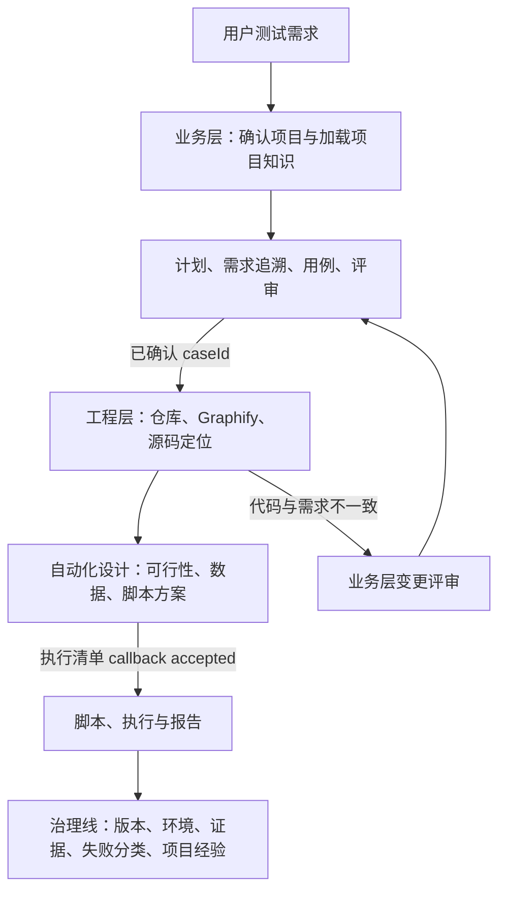

# AI 自动化测试工作流规范

<!-- owns: task.lifecycle -->

## 1. 目的与适用范围

本文定义 AI 测试 Agent 参与自动化测试时的协作流程，适用于 Web、H5、App、App 内 WebView、API、MQTT 和 IoT 端到端链路。

目标是将用户输入的资料转化为可审核、可追溯、可重复执行的测试资产，避免 AI 基于未确认信息直接生成、执行或修改正式测试脚本。

项目强制规则以 [AGENTS.md](../../AGENTS.md) 为准。本文是生命周期、事件状态机、阶段编排和工程层进入条件的唯一正文来源；测试设计与评审标准见 [testcase-guideline.md](./testcase-guideline.md)，环境与数据生命周期见 [environment-guideline.md](./environment-guideline.md)，运行结果见 [report-guideline.md](./report-guideline.md)。

## 2. 角色与职责

| 角色 | 职责 |
| --- | --- |
| 用户 / 测试负责人 | 提供资料与业务目标；审核测试计划、用例、脚本、目标环境和改进项。 |
| 主 Agent / 编排者 | 解析资料，提出合理推断，输出测试计划、用例、脚本草案和结果分析；收齐隔离 reviewer 结论后演进草案，并记录假设、缺失信息和风险。 |
| 隔离 reviewer | 仅以本角色允许的原始资料、当前 `plan.md` 和用例包进行只读审查，独立输出发现项和结论；不得修改测试资产或代替业务批准。 |
| 确定性 Runner | 使用 Playwright、Appium/WebdriverIO、API Client 或 MQTT Client 执行已确认的测试。 |
| CI/CD | 提供受控环境、Secret、定时或发布前执行能力，并归档执行结果。 |

任何 Agent 都不自动合并、不自动发布、不默认访问生产环境，也不执行未经确认的高风险操作。

## 3. 总体流程

```text
测试请求
  ↓
同 run history 恢复；无 history 时确定性 suite 复用评估 → direct_execute / affected_rebuild / full_replan
  ↓
affected/full 分支上下文加载：读取用户偏好 → 按测试需求确认被测项目 → 读取项目测试经验库 → manifest 与章节索引筛选 → 读取命中原始资料
  ↓
业务层：资料输入 → 测试计划草案 → 用户确认 → 测试用例草案 → 首稿 readiness → 风险分级评审与定向演进 → 用户确认
  ↓
工程层：定位代码仓库 → 检查 Graphify 图谱 → 自动化可行性与脚本设计
  ↓
Web/H5：可选的只读真实页面候选探索 → 源码契约补齐 → 自动无头 selector 验证 → 必要时可见 Inspector 兜底
  ↓
正式脚本 diff → 静态检查与脚本评审
  ↓ 一次确认不可变执行清单
setup → 正式测试 → teardown → 报告
  ↓
范围完成判定、失败分析与 WorkflowCompleted
```

报告后的资产修改、缺陷修复或重新执行必须由用户另行提出，或进入相应的条件性决定流程；它们不是第四个固定确认门禁。每个阶段的输出都是下一阶段的输入，任何草案、候选环境或合理推断均不得绕过三项固定 callback 或适用的条件性决定直接用于正式执行。

### 3.1 测试上下文加载

每次测试任务开始时，主 Agent 必须先完成以下上下文加载，再进入资料输入、受控探索或测试计划：

1. 无条件读取 `.local/testing-memory.md`（如存在），加载当前用户的长期协作与行为偏好。
2. 根据用户测试需求、目标 URL、资料来源、**活跃**测试计划或已关联资产确认被测项目；此时不得扫描业务源码来替代需求理解。匹配的活跃 `plan.md` 不存在时，必须按当前用户请求创建新的测试计划；不得因只发现归档请求而报告“等待历史范围确认”，也不得默认读取归档请求。
3. 被测项目已识别时，只读取对应项目测试经验库 `docs/testing/knowledge/<project>-testing-knowledge.md`（如存在）；不得读取或套用其他项目的测试经验。
4. 在读取 `sources/` 的正文前，先扫描目录结构并读取 `sources/manifest.yaml` 的元数据（`id`、路径、类型、版本、适用项目、`reference_scopes`、状态）；存在当前项目的 `knowledge_indexes` 登记时，再读取受控章节索引（资料 `id`、`sectionId`、主题、关键词、定位和 SHA-256）。不得以全量打开资料库代替选择。
5. 仅读取以下原始资料：用户直接指定的资料；`status: active` 且 `applicable_projects`、章节主题、关键词、`reference_scopes` 或已有计划追溯与当前测试需求匹配的资料；以及为解释已确认需求所必需的上级资料。**索引命中只表示候选，不表示已读取或已引用。**每份实际读取且用于测试范围、业务规则、推断或结论的资料，必须在当前 `plan.md` 的“输入资料”中记录 manifest `id`、`sectionId`、路径、页码或标题定位、版本和 SHA-256，以及本次用途。资料位于仓库时，记录可点击的仓库相对 Markdown 链接；原型使用精确页面链接，PDF/Word 保留页码或标题定位。命中含图片、流程图或扫描页时，才按需视觉/OCR读取；该读取结果仍须由原始资料复核。
6. 在资料筛选后读取 `test-assets/manifest.yaml`，按项目、类型、平台和范围选择 `active` 静态资产。唯一候选或唯一默认候选可直接作为计划候选；多个同等候选或无候选只记录“待选择”，不得根据文件名、修改时间或目录名称猜测。静态资产不是业务需求依据，不写入“输入资料”表，也不登记到 `sources/manifest.yaml`。
7. `sources/` 内出现但未登记的资料、登记路径不存在、版本/适用范围无法确认或存在多个同等候选资料时，先补登或记录为 `missingInfo` 并向用户确认；不得把文件名、目录名或历史经验当作业务事实。`unknown` 只表示待确认元数据，不是可忽略或默认适用。
8. 被测项目尚未能唯一确认时，记录为 `missingInfo` 并向用户确认；在确认前不得猜测项目专属流程、环境约束、配网方式或恢复策略。
9. 每次输出测试计划、用例草案、评审结论或范围调整时，面向用户列出“本轮实际引用资料”：直接资料和原始知识资料分别列出**可点击资料链接**、`manifest id / sectionId`（如有）、页码/标题/原型页面定位与用途；没有引用知识库时明确写“本轮未引用知识库资料”。仓库资料使用 Markdown 链接；对话附件未落盘或链接不可复现时，明确标注“仅对话附件，暂无持久链接”，并在需要长期追溯前补登到 `sources/`。不得把仅扫描到、仅索引命中或未打开的资料列为依据。

用户偏好适用于本次测试的全部阶段；项目测试经验仅适用于匹配的被测项目。流程中形成可复用的项目测试策略时，必须立即写入 Git 管理的项目经验库并标注证据状态；不得因尚未完成整轮执行而只留在本地候选队列。同一“项目 + 适用范围”出现新观察或策略冲突时，使用最新可审查记录原位覆盖当前条目，旧版由 Git 历史保留；验证完成后只更新证据状态和引用。`sources/knowledge-base/` 原始知识资料库才是协议、接口和产品规则的可追溯输入；不得在经验库复制原始需求或契约。两类资料冲突、原始资料版本变化或证据不足时，以当前 `plan.md` 中已登记且确认的原始资料和结论为准。项目经验只作为决策输入，不能覆盖当前用户指令、已确认测试计划或实际执行证据。

### 3.1.1 本机维护命令发现与执行

“清理”“重置”“归档”“恢复”属于工程维护请求，不进入测试计划、用例或执行阶段。每个新对话处理此类请求时，必须先读取 `package.json` 的 scripts 与 `scripts/README.md`，按已登记命令的用途和边界选择操作；不得根据目录名、历史经验或扫描结果自行推断要删除的文件。

| 用户意图 | 必须先做 | 允许的后续动作 |
| --- | --- | --- |
| “清理本地测试数据”等范围不完整表述 | 定位匹配命令并运行 `--dry-run` | 输出将清理/归档的类别，等待用户确认完整范围；不得手工删除目录。 |
| “完整重置”“清除所有测试数据”“从头测试” | 确认 `reset:full-test-state` 已登记 | 执行 `npm run reset:full-test-state`；它清理本地运行状态并归档活跃测试资产，不删除远端业务数据。 |
| 恢复已登记的本机资源 | 确认资源台账与恢复命令 | 使用 `npm run test-data:recover`；它不是清理命令。 |
| 用户要求的范围没有对应命令 | 比对命令边界与用户范围 | 报告没有安全匹配命令及最小补充指示；不得用目录扫描或 `rm` 模拟。 |

命令失败、预演结果与用户范围不一致，或涉及远端资源、凭据、生产环境时，保持不执行状态并报告原因。维护请求的产出仅记录命令、脱敏类别和结果；不得把 `.local`、`.auth` 或台账内容作为可预览产出链接。

### 3.1.2 动态状态与产出

请求级 `testcases/<type>/<project>/<test-request>/workflow-history.ndjson` 是唯一运行事实。`.local/test-task-runtime/<type>/<project>/<test-request>/` 仅保存可丢弃的 claim token、lease、session/reviewer 工具绑定、暂存路径与在途操作引用；宿主长期任务只是外部实时状态，不写入 runtime、history 或计划。删除 runtime 不得改变 Activity、阶段、确认、阻塞或整体结果。`plan.md` 只保存范围、需求依据、正式用户决定、reviewer 结论和发现项，不保存任务表、阶段进度、用例生成进度或 history head。

`task:status` 从 history、工作流定义和真实产物即时渲染任务、阶段、完整度、等待项与下一动作。面向用户只投影 `planning`、`cases`、`review`、`engineering`、`execution`、`reporting` 六个稳定阶段，并以`待开始`、`进行中`、`已完成`、`等待确认`、`阻塞`和`跳过`说明当前阶段；该视图不新增确认，也不删除或改写底层 Activity、workflow state 和恢复事件。每次开始或恢复任务时先验证 history 哈希链，再执行 gate 返回的可自动动作。

安全产物引用随对应 `ActivitySucceeded.outputRefs` 和 digest 写入事件；用户需要状态时，可以从 `task:status` 与本轮成功事件生成只读的简短状态和产出摘要。该摘要只能陈述当前六阶段投影、等待、下一动作和已完成产物；底层 `workflowState` 与 `phase` 仅作为诊断字段，不得展开成额外用户阶段。摘要不能宣称完成、承诺后台续跑、创建 continuation 或推进 Activity。严禁展示 `sources/`、`.env`、`.auth/`、`.local/`、归档、工作区外路径或敏感文件；静态测试资产是输入引用，不是本轮产出。

### 3.1.3 阶段交接核验与中断恢复

每次推进阶段、宣告阶段结论或请求确认前，必须完成“阶段交接核验”：history 派生的 Activity 事实、`plan.md` 中的正式决定与评审结论、真实产物及其摘要必须在适用对象、证据和下游资格上相互一致。任一项缺失或冲突时，不得推进受影响的 Activity；追加 `ArtifactDriftDetected` 或 `BlockerRaised`，按实际风险进入 `RECONCILING` 或 `BLOCKED`。最终复审仍由唯一可恢复入口完成关系同步、把安全文件引用写入对应 `ActivitySucceeded.outputRefs`、校验 `plan.md` 正式 reviewer 记录与发现项闭环；最终成功只能追加对应 reviewer/Activity 事件，不能直接写父任务状态。

### 3.1.4 Durable Workflow、生命周期与恢复

#### 唯一事实源与事件契约

`workflow-history.ndjson` 是请求运行事实的唯一来源，采用语义 append-only 事件。追加时必须执行“读取并验证全部事件 → 校验预期 head → 追加事件 → 临时文件写入与 fsync → 原子替换”；每条事件以 `seq`、`prevDigest`、`digest` 构成 SHA-256 hash chain。截断、乱序、重复序号、摘要不匹配或 CAS 冲突必须安全失败，不能从 `plan.md`、runtime 或产物时间戳猜测成功。

事件至少包含 `schemaVersion`、`eventId`、`seq`、`runId`、`requestId`、`definitionId`、`definitionVersion`、`type`、`occurredAt`、`actorType`、`idempotencyKey`、`payload`、`prevDigest` 和 `digest`。核心类型包括：

- 工作流：`WorkflowStarted`、`ActivitiesExpanded`、`WorkflowSuspended`、`WorkflowResumed`、`WorkflowCompleted`、`WorkflowCancelled`。历史中已存在的 `LegacyStateImported` 只允许 replay，事件追加和 CLI 均不提供迁移入口。
- Activity：`ActivityAttemptStarted`、`ActivitySucceeded`、`ActivityFailed`、`RetryScheduled`、`ActivitiesInvalidated`。
- 产物与副作用：`ArtifactPublishPrepared`、`ArtifactDriftDetected`、`ExternalOperationStarted`、`ExternalOperationReconciled`。
- 人工与阻塞：`CallbackRequested`、`CallbackResolved`、`PlanConfirmationCarriedForward`、`BlockerRaised`、`BlockerResolved`。
- 评审：`ReviewBatchStarted`、`ReviewerDispatched`、`ReviewerSubmitted`、`ReviewBatchInvalidated`。

事件禁止保存密码、验证码、Cookie、Token、真实用户数据、宿主任务或会话 ID、reviewer/Agent 任务标识、claim token 与 lease。宿主 reviewer 绑定只写 `.local/test-task-runtime/`；history 只保存角色、Activity、输入摘要和派发/提交语义，`plan.md` 只保存输入基线、角色结论和发现项。定义版本、`graphDigest` 和 `planDigest` 在 run 创建时固定；完成或新建的功能复测使用 v6，上线前已存在且未完成的 v5 仍按原定义恢复，v3、v4、`vnext-1` 和含 `LegacyStateImported` 的旧历史只读 replay，不得继续追加事件。

#### Activity、工作流与测试结果

Activity 状态仅由事件归约为 `PENDING`、`READY`、`RUNNING`、`SUCCEEDED`、`RETRY_WAIT`、`WAITING_CALLBACK`、`RECONCILING`、`BLOCKED`、`FAILED` 或 `CANCELLED`。工作流状态仅由全部分支归约为：

| 状态 | 含义 |
| --- | --- |
| `RUNNING` | 存在可运行或运行中的 Activity。 |
| `WAITING_HUMAN` | 只剩绑定有效 subject digest 的人工 callback。 |
| `WAITING_EXTERNAL` | 等待已登记外部结果，不能盲目重复副作用。 |
| `RETRY_WAIT` | 等待已登记退避到期。 |
| `RECONCILING` | 产物或外部副作用结果不确定，必须先核对后置状态。 |
| `BLOCKED` | 真实解除条件尚未满足，且没有独立可运行分支。 |
| `SUSPENDED` | 已安全检查点停止，等待显式恢复或宿主能力恢复。 |
| `SUCCEEDED` | 全部适用流程及报告 Activity 已成功闭环。 |
| `FAILED` | 工作流出现不可恢复失败。 |
| `CANCELLED` | 用户或受控取消分支已提交。 |

父任务、阶段、整体进度和用例完整度都从事件历史与真实产物派生，不再独立持久化。上述 Activity 与 workflow state 是内部恢复契约，必须完整保留；用户可见的六阶段只是只读投影，不能反向驱动状态迁移。无关 blocker、下游确认或 reviewer 容量等待不得冻结仍可运行的独立分支。测试结果与工作流结果分离：产品测试可以为 `failed`、`mixed` 或 `inconclusive`；只要执行、清理/残留登记和报告流程完成，工作流仍可成功闭环。

`run` 与 `report` 使用 `formal-execution-completion-seal-v1` 完成契约。通用 `activity-succeed`、`artifact-publish-succeed` 和普通 `reconcile --outcome confirmed` 均不得关闭这两个 Activity；只能分别使用 `task:manage execution-run-finalize --request <id> --claim <lease>` 与 `task:manage execution-report-finalize --request <id> --claim <lease>`。专用入口从已确认执行 subject、正式记录和 completion seal 派生结论，不接受调用方填写验证结果、测试结论、文件路径或摘要。新定义中的 completion marker 要求 `ActivitySucceeded` 携带 `formal-execution-workflow-evidence-v1`；旧 v5 history 没有 marker 时仍按原事件只读回放，v3/v4 继续只读，不升级定义或重写历史。

#### v6 稳定套件复用分支

v6 的第一个业务事实是确定性复用评估：先区分长期 `suiteId/suiteVersion` 与本轮 `runRequestId`，再从稳定 manifest、当前文件摘要、精确脚本依赖闭包、Oracle、selector/API 契约、静态资产、权限和数据策略派生 `direct_execute`、`affected_rebuild` 或 `full_replan`，调用方不得手填结论、digest、caseIds 或脚本路径。目标 build 只变化而契约语义不变时仍可直接复用；Provider、账号、设备或远端数据不可用只影响 readiness。

v6 分支固定为：`direct_execute → suite-validation → readiness → authorization → run → report`；`affected_rebuild → impact-location → 定向计划/用例/脚本演进与复审 → readiness → authorization → run → report`；`full_replan` 才进入原有完整设计流程。直接分支只引用 suite manifest，不复制或重新生成 `plan.md`、用例与脚本；定向分支只向生成模型和 reviewer 提供 `impactMap` 证明的受影响引用；映射不完整必须回退 `full_replan`。

`npm run test:suite:assess -- --suite <type/project/feature> --environment <test|pre> [--profile <profile>]` 只读输出评估；`task:initialize -- --request <new-run> --suite <suiteId> --reuse auto --environment <test|pre>` 会重算同一评估，不接受外部摘要或结论。直接分支启动 readiness 后使用 `task:manage suite-readiness-publish --request <new-run> --claim <lease> --environment <test|pre>`；`no_write + test/pre + 完全匹配` 由 `policy_auto_no_write` 为本轮生成 `execution-authorization-v5`，其他写入、OTP、上传、提交、设备动作或提权仍须本轮新确认。设计复用不复用旧授权、正式记录、能力有效期、数据台账、cleanup 结论或报告。

`affected_rebuild` 初始化时把完整稳定设计确定性物化为本轮隔离工作副本，并将 suite-scoped v4 manifest 降为绑定本轮 `runRequestId` 的候选 v3；这只是复制，不重新生成未受影响资产。模型和 reviewer 只接收评估命中的 case/引用，readiness 必须精确使用同一 case 集。工作副本不得直接覆盖稳定目录；只有本轮正式执行、cleanup、seal 与报告收口后，`suite-promote` 才能合并已评审入口并保留未受影响资产。case 集或评估范围外 manifest 发生变化时拒绝局部晋升并要求 `full_replan`。

#### 完整设计分支、Activity 命令与恢复

顶层阶段固定为：资料筛选与计划校验 → 一次计划确认 callback → 用例包并行生成 → 关系同步、首稿 readiness、隔离评审、证据驱动演进与复审，直至收敛（后续复审优先定向） → 一次用例确认 callback → `build` → `readiness` → 一次不可变执行清单 callback → `run` → `report`。`build` 合并工程分析、脚本生成、selector 证据和差异化脚本评审；`run` 在一个可恢复事务中按需完成能力复核、惰性 setup、执行、必要的外部 postcondition、`finally` cleanup 和 reconciliation；`report` 成功后原子写入工作流完成事件。报告后的正式资产修改属于新的明确决定，不是本工作流的固定确认阶段。

`build` 的产物是完整、可审查的候选脚本，不是环境可执行性证明。部署版本、运行时 selector、OTP、fixture/provider、资源预算和实际 cleanup 能力只由 `readiness` 决定 runnable/deferred，不得反向删除有源码依据的候选实现。

v6 `full_replan` 和上线前未完成 v5 的完整设计分支保留 `graphDigest` 与 `planDigest` 约束。计划中的高层数据与安全边界只决定 reviewer 上限；首稿完整度通过后，manager 从各用例的结构化数据策略、前置条件和实际操作步骤生成 `case-review-risk-v2`，按 `caseId` 选择 `light`、`standard` 或 `strict`。`review-policy-v2` 固定为 `deterministic_only`、`combined` 或 `combined_with_impact`：`light` 不创建 reviewer Activity，`standard` 只创建 `combined`，`strict` 创建 `combined + impact`。请求最高档只用于摘要；`combined` 只审查 standard/strict，`impact` 只审查 strict 及共享安全邻域。reviewer 最多同时运行 2 个，单角色最多尝试 3 次，无变更修订最多 2 轮，同一 epoch 最多 2 轮语义演进。历史 run 按其原策略回放，不迁移或改写。

用例阶段与脚本阶段分别评级为 `light`、`standard` 或 `strict`；脚本从 `formalCase(caseId)` 继承该用例的最低档，再按实际脚本操作只升级不降级；请求级最高档只用于摘要，不能成为全部脚本的 floor。所有脚本执行确定性静态门禁；`script_quality` 只读取 standard/strict 用例及共享质量代码，`execution_safety` 只读取 strict 用例及共享安全依赖。light 脚本变化不得使安全 reviewer 证据失效。风险分级只调整自动评审强度，不增加或合并用户 callback；计划、用例集和不可变执行清单仍分别确认一次。

公开入口只有 `task:initialize`、`task:resume`、`task:status`、`task:gate` 和 `task:manage`。Activity、callback、阻塞、恢复、核对与 history 校验都通过 `task:manage` 子命令执行；不提供旧事务别名或旧状态迁移命令。

claim、lease 和 fencing token 只写 runtime。lease 过期只说明执行者失联，不能证明 Activity 或副作用未发生；旧 fencing token 永远不能提交新结果。`task:resume` 先验证 history，再按 DAG 返回全部 `readyActivities` 与安全的 `nextActions`；已经成功的 Activity 不重做。

#### 产物发布、外部副作用与人工 callback

计划、用例、关系和评审文件先生成到同文件系统 `.local/test-task-runtime/.../staging/`，完成 Markdown、结构、追溯、敏感信息和专项检查后追加 `ArtifactPublishPrepared`；随后逐个原子 rename 并回读最终文件核对 digest。普通产物 Activity 最后追加 `ActivitySucceeded`；正式 callback 的计划发布则以显式绑定该 publication 的 `CallbackResolved` 作为 durable commit，四种 resolution 都不得再追加 `ActivitySucceeded`。尚未发布可重新生成；全部 digest 匹配可补记对应闭合事件；部分发布或冲突必须进入 `RECONCILING`。用例包完整度必须计算正文数量、必填区块、唯一 `caseId`、关系和 digest，不允许手填“草案完整”推进评审。

外部写操作使用稳定幂等键 `runId/activityId/operationKind/inputDigest`，操作前登记 intent，操作后登记脱敏结果。结果不确定时先查询后置状态或台账，禁止直接重发验证码、重复上传或重复提交。

callback 必须绑定 `callbackId + activityId + subjectDigest`，结果明确区分 `accepted`、`rejected`、`revision_requested` 和 `cancelled`。用户作出决定后，先在 runtime 暂存候选 `plan.md`，其中“正式用户决定”表必须记录相同决定类型、`subjectDigest` 和结果；随后由 `task:manage callback-resolve --plan-source <暂存 plan.md>` 在同一可恢复事务中原子发布计划并追加解析事件，不得直接改最终计划后再单独写 history。callback 的等待、重试和失效只写 history；拒绝不得记录为“已确认”。

计划确认使用 `plan-confirmation-subject-v2`，其 `subjectDigest` 与用于原子发布核对的 `plan.md` 文件 digest 分离。manager 绑定当前 `requestId`，并只从现有计划结构投影和规范化计划标识、顶层包含/排除业务流程、测试类型、目标环境、高层数据策略与资源类别，以及写入、安全、特权、破坏性和生产访问等权限上限；不得在计划中新增“计划确认边界”表或要求用户确认内部投影。字段规则、断言措辞、`REQ/RULE/caseId`、用例拆分、关系投影、资料索引、reviewer 记录、工程设计和执行清单明细不进入该 subject。

计划确认一旦 `accepted`，在上述投影不变时持续覆盖用例生成、评审、自动演进和复审。删除无依据断言、修正有资料依据的预期、拆分原子用例、调整编号或同步追溯，不得失效计划确认或创建重复 callback。只有顶层业务流程、测试类型/目标环境、高层数据写入类别或权限/安全上限发生实质变化时，才判定为需要修订计划并重新请求一次现有 `plan-confirmation` callback；资料冲突或未定义验收使用最小业务裁决 callback，不伪装成普通自动演进。历史事件没有 v2 subject 版本时按其原始 legacy 语义只读回放，不得因升级本身改变既有决定。

恢复历史误开的 legacy 计划 callback 时，只有 `task:resume` 能在内部追加 `PlanConfirmationCarriedForward`，不提供公开 `task:manage` 子命令。manager 必须验证更早的真实用户 `accepted` 决定及正式决定行、冻结旧计划和当前计划的发布 digest、当前待处理 callback、相关 reviewer 提交和自动演进 publication 全部一致，且旧/新 `plan-confirmation-subject-v2` 完全相同、没有业务冲突；任一证据缺失或不符都保持 `WAITING_HUMAN`。该事件只 supersede 误开的 callback 并恢复原确认，不得伪造 `CallbackResolved`、新增正式用户决定行或改写历史；重复 resume 必须幂等。

用例确认与执行授权保持独立 subject：前者绑定最终收敛的 `REQ/RULE/caseId` 与用例语义，后者绑定原子发布的不可变执行清单。用例集或执行清单的实质变化只失效各自确认，不得反向失效仍处于同一稳定投影的计划确认。

#### Gate v2、宿主生命周期与停止事件适配

`task:gate --json` 返回 `schemaVersion: "workflow-gate-v2"`、history `head`、`workflowState`、`phase`、`readyActivities`、`runningActivities`、`waits`、`nextActions`、`checkpoint`、`continuation` 和 `reply`。`continuation.kind` 只允许 `continue_now`、`await_event`、`wait_until`、`wait_user`、`stop`；`reply.kind` 只允许 `none`、`action_required`、`final`。

```ts
{
  schemaVersion: "workflow-gate-v2",
  head: { seq, digest },
  workflowState,
  phase,
  readyActivities,
  runningActivities,
  waits,
  nextActions,
  checkpoint,
  continuation: {
    kind: "continue_now" | "await_event" | "wait_until" | "wait_user" | "stop",
    referenceId?,
    notBefore?,
    reason
  },
  reply: {
    kind: "none" | "action_required" | "final",
    allowed,
    reason
  }
}
```

- 有可自动执行的 Activity 时返回 `continue_now + none`，Agent 必须在当前可用回合继续；计划 callback 为 `accepted` 后，必须立即展开并开始用例生成 Activity。它是当前回合义务，不是后台续跑承诺。
- 等待当前 reviewer、工具或已登记外部结果时返回 `await_event + none`；一次性退避使用 `wait_until + none` 和 `notBefore`。正式 callback 的计划 publication 在有效 lease 内也返回 `wait_until + none`，lease 到期后由 `task:resume` 核对发布结果；这两类等待都不是周期轮询、定时器或后台工作，也不能再次向用户索取同一决定。
- 真实用户决定或流程 blocker 返回 `wait_user + action_required`。
- 只有 `SUCCEEDED`、`FAILED`、`CANCELLED` 返回 `stop + final`。

请求用户动作、结束当前测试工作回合或输出完成/失败结论前使用 `task:gate --assert-safe-reply`。`none`、不安全 checkpoint、非终态完成话术或 reply/continuation 不一致都必须非零退出。用户主动请求的只读状态摘要不属于完成结论：它必须逐字受当前 gate/status 投影约束，且不能改变 workflow history。

完整自动化测试请求始终由仓库 Durable Workflow 覆盖新建或恢复后的规划、评审、工程、执行、清理/核对和报告流程；Activity 是其内部检查点。宿主若提供跨回合长期任务能力，可为整个请求创建或复用一个外部任务容器，但不为每个阶段重复创建。独立的状态查询、只读诊断、规则或代码维护、清理、重置、归档和测试数据恢复属于短任务，不创建宿主长期任务；完整测试工作流内部的 cleanup/reconcile 仍属于原请求。

稳定 `requestId` 的最小解析和可用宿主能力检查共同构成接管预检。`requestId` 无法唯一确定时只请求最小必要信息；确定后、执行 `task:initialize` 或 `task:resume` 前，主 Agent 若能查询宿主长期任务，则查询并创建或复用 objective 明确绑定同一 `requestId` 的任务，不重置其使用记录。已有宿主任务绑定不同请求或无法确认归属时不得替换、清除或改写，只请求用户作出最小选择。宿主没有等价能力或调用失败时仍可启动或恢复仓库 workflow，但必须依靠当前会话继续或显式 `task:resume`，不得声称存在后台续跑保证。

创建宿主长期任务时使用以下 objective 结构；可补充已确认范围，但不得删除其中任何完成条件或安全边界：

```text
完成自动化测试请求 <type/project/request>：从新建或恢复开始，持续推进规划、隔离评审与自动演进、工程与脚本、获授权后的执行、清理/核对和报告，直到完整工作流闭环。
遵守生产环境、业务数据写入、设备动作、安全挑战、凭据和审批边界，不扩大用户已确认的测试范围或权限。
仅在有效人工 callback、审批、安全挑战、业务裁决或真实 blocker 需要用户处理时暂停；处理后恢复同一请求。
完成条件：workflowState=SUCCEEDED，且 npm run task:gate -- --request <type/project/request> --assert-safe-reply 通过。
```

宿主长期任务状态只用于跨回合续跑，不能替代 gate 或决定工作流状态：

| workflow/gate 场景 | 宿主适配动作 |
| --- | --- |
| 新请求或恢复请求通过接管预检 | 宿主支持时创建或复用同一 `requestId` 的长期任务，再执行 `task:initialize` 或 `task:resume`；不支持时直接进入仓库 workflow。 |
| `continue_now`，或存在可自动执行的 reconcile、reviewer 派发/重试、草案演进与复审 | 宿主任务保持活动并立即继续，不请求用户发送“继续”；无宿主任务时同样在当前可用回合继续。 |
| `await_event` 或 `wait_until` | 使用宿主支持的等待/恢复机制取得已登记 reviewer、工具或外部事件；单次等待窗口或墙钟时长本身不构成 reviewer 失败，不得据此中断 reviewer、追加失败事件或发送最终回复。 |
| `WAITING_HUMAN` / callback 对应的 `wait_user + action_required` | 只暂停宿主长期任务，不把暂停写成 workflow 事件；callback 解析后恢复同一请求。 |
| workflow `BLOCKED` / blocker 对应的 `wait_user + action_required` | 暂停同一宿主任务并请求最小解除条件；只有真实条件满足并通过 `task:manage blocker-resolve` 后才恢复，不把 workflow blocker 等同于宿主任务终态。 |
| `SUCCEEDED` 且 `task:gate --assert-safe-reply` 通过 | 宿主支持时将长期任务标记为完成。产品测试结果为 `failed`、`mixed` 或 `inconclusive` 不改变该判断，只要执行、清理/残留登记和报告均已闭环。 |
| 不可恢复的 workflow `FAILED` | 不得标记完成；仅按当前宿主自己的阻塞语义处理，不得用宿主状态改写 workflow history。 |
| workflow `CANCELLED` | 不伪装为完成或阻塞；宿主任务的清除或归档由用户控制。 |

宿主长期任务能力缺失或调用失败时，Agent 不得声称能力已启用，也不得伪造 `BlockerRaised`、`WorkflowSuspended` 等业务事件；它应说明续跑能力边界，并以当前会话或后续显式 `task:resume` 推进。恢复时始终先读取 history 并运行 `task:resume`；宿主任务本身不能证明 Activity 已完成。`wait_until.notBefore` 只是可恢复退避时间，仓库不因此创建定时唤醒或周期轮询。

宿主长期任务的 ID、状态、预算和使用记录只属于宿主，不写入 `.local/test-task-runtime/`、`workflow-history.ndjson`、`plan.md` 或任何 task CLI/schema。具体宿主通过自身能力管理其生命周期，不新增 `task:*` 命令、workflow 事件或持久化字段。

项目级停止事件适配器不调度、不领取 Activity、不执行副作用、不写业务事件，也不管理或保存宿主长期任务；它只用可丢弃的 session binding 定位请求并委托 gate。宿主可以把 gate 的阻止结果映射为一次 continuation，但递归调用必须明确保持非终态。缺少 binding、输入无 session、gate 无法执行或输出无效时，适配器只能说明“未请求 continuation、history 未改变”，不能承诺后台续跑。只有主 Agent 通过显式 workflow 命令才能持久化 `WorkflowSuspended`。仓库不创建周期定时任务，也不把停止事件适配器作为工作流正确性的条件；每个宿主专属配置都只是可选兼容适配，必须在受信任工作区检查命令路径、当前文件摘要和权限，修改后重新复核。

评审恢复默认自动续跑：补齐正式区块、派发缺失角色、等待已启动角色、自动演进或启动后续复审均为内部 Activity。已确认计划的稳定投影未变化时，不得在这些内部 Activity 之间重新请求计划确认；只有资料冲突、验收缺失、顶层范围/环境/写入或权限边界实质变化、安全挑战或 reviewer 重试耗尽才请求最小解除条件。

### 3.2 双层模型与贯穿治理线

测试资产采用“业务层 + 工程层”的双层模型。业务层决定**测什么和为什么测**，工程层决定**怎样稳定、可重复地实现已确认用例**；环境、版本、数据、证据和变更影响分析作为贯穿治理线，不能由任何一层单独省略。



| 层级 | 主要输入 | 主要产物 | 不得替代的依据 |
| --- | --- | --- | --- |
| 业务层 | 用户需求、原始资料、项目知识、风险 | 计划、需求追溯矩阵、已确认用例 | 不得以当前代码行为替代已确认业务规则。 |
| 工程层 | 已确认 `caseId`、代码仓库、图谱、源码、环境能力 | 自动化设计、脚本、运行证据 | 不得擅自改变用例的业务预期或范围。 |
| 治理线 | 两层产物与实际运行 | 版本关联、数据/环境审批、证据、影响分析、复盘 | 不得以口头说明替代可追溯记录。 |

代码、图谱或运行结果与已确认需求不一致时，工程层必须产出差异和证据，退回业务层评审；不得静默修改用例、放宽断言或把当前代码实现视为正确规则。

### 3.3 条件性探索与安全挑战

<!-- delegates: automation.selectors, automation.environment -->
Web/H5 在 `build` Activity 内按“资格满足时的只读真实页面候选探索 → 源码契约补齐 → 缓存命中或自动无头验证 → 可见 Inspector fallback”取得 selector 证据，充分条件、证据等级和 fallback 触发器只由[定位规范](./selector-guideline.md#8-候选-selector-的生成与修复流程)判定；运行模式、会话、零写入和人工安全挑战边界只由[环境规范](./environment-guideline.md)定义。探索适配器不可用不阻塞 build，也不作为 Capability Provider；状态迁移本身不触发 Inspector，源码和 Graphify 也不能替代业务资料或已确认业务预期。
<!-- end-delegates -->

## 4. 阶段一：资料输入与测试计划

### 4.1 可接受的输入

- 需求文档、产品说明书、研发设计文档。
- 页面 URL、原型地址、页面截图、App 截图。
- 接口文档、请求响应样例、已有人工测试用例。
- MQTT Topic、设备物模型、告警规则、失败报告。

资料应放入 `sources/` 对应目录，或在对话中明确提供文件路径、URL、版本和适用环境。

`sources/` 的读取顺序为“扫描目录与 manifest 元数据 → 读取当前项目受控章节索引 → 按本次需求筛选命中文档与章节 → 按需读取原始资料和视觉内容 → 在计划中回链”。原始资料变更导致索引 SHA-256 不一致时，索引视为过期，不得继续用于确认需求；重新索引后按变更影响规则复核。新增或直接提供的资料在用于正式计划、用例或评审前必须登记到 `sources/manifest.yaml`；仅浏览目录、manifest 或章节索引不等于已读取资料正文。

### 4.2 Agent 输出的测试计划

<!-- delegates: automation.testcases -->
计划内容、固定结构、追溯和正式决定字段只按[用例规范](./testcase-guideline.md)生成，并保存为请求目录中唯一的 `plan.md`。流程层只负责在计划校验 Activity 成功后，对当前 `plan-confirmation-subject-v2` 请求 `plan-confirmation` callback；该 subject 由 manager 从既有计划区块内部投影，不新增用户可见结构，运行进度也不得写回计划。
<!-- end-delegates -->

### 4.3 环境处理

<!-- delegates: automation.environment -->
环境候选、优先级、预检、生产保护和数据授权只按[环境规范](./environment-guideline.md)处理。流程层把环境相关未决事实绑定到计划确认或条件性 callback，不创建额外固定环境确认阶段。
<!-- end-delegates -->

### 4.4 阶段审核门槛

计划确认 callback 的 subject、结果和失效规则见本文件的 callback 契约；需由用户决定的具体计划字段由[用例规范](./testcase-guideline.md)与[环境规范](./environment-guideline.md)定义。`accepted` 后必须在同一 gate 投影出用例生成 Activity 并继续，随后在稳定计划投影内自动完成生成、评审、演进与复审，不要求用户重复确认计划或发送“继续”；其他结果不得推进下游。

## 5. 阶段二：测试用例

计划确认后，按 [testcase-guideline.md](./testcase-guideline.md) 的用例包、原子用例、状态、`REQ ↔ RULE ↔ caseId` 和覆盖标准生成完整草案。计划阶段不得绕过确认直接进入工程层；用例集的状态、评审质量标准、发现项闭环和变更影响均由用例规范定义。

### 5.1 多角色隔离评审

流程层在首稿 readiness 成功后冻结 `case-review-risk-v2` 与 `review-policy-v2`。`deterministic_only` 仅运行完整度、关系、来源和结构门禁，不创建 `ReviewBatchStarted`、`ReviewerDispatched` 或 `ReviewerSubmitted`；其他模式才按角色 scope 展开 review Activity。readiness 一次检查计划必填标记、全部用例包结构、RULE 设计矩阵、关系投影和来源身份；硬缺口必须在 reviewer 派发前一次性返回。写入安全提示等 warnings 同轮汇总，不单独创建 callback 或制造评审轮次。适用角色、发现项分类、正式记录、变更影响和“可提交确认”标准只由[用例规范](./testcase-guideline.md)定义。

批次输入由 manager 从 `plan.md`、定义声明的用例包和计划实际引用的受控资料读取并计算，调用方不得注入摘要。`review-input-snapshot-v2` 同时冻结完整资产摘要、语义输入摘要和角色输入摘要；`review-batch-scope-v3` 冻结 epoch、语义演进轮次和角色 scope。reviewer 记录、生成式统计、workflow、工程和报告区块不进入语义输入；索引、摘要、排序、格式和关系投影变化不失效 reviewer 证据。`combined` 只读 standard/strict，`impact` 只读 strict 及安全邻域；完整 PDF/Word 仅作审计回退，默认只注入引用 section/page 和直接规则邻域。

每次 `reviewer-dispatch` 和 `reviewer-submit` 都必须携带宿主创建真实只读子 Agent 后返回的 `agentTaskId`。该标识必须与主 session/thread 不同，只写 runtime；提交前 manager 必须验证同一 `batchId + activityId + role` 的 running binding。新 `ReviewerSubmitted` 只持久化不含标识的隔离证明版本。缺少绑定、runtime 丢失或绑定不一致时不写提交事件，gate 输出 rebind；durable 派发已成功但 runtime 写入失败时仍只保留一次派发。旧 history 继续回放，但缺少新隔离证明的旧批次不能冒充修复后的真实隔离证据。

初审批次默认覆盖当前草案的完整适用范围；自动演进后的批次优先使用定向复审。每个定向 scope 必须绑定 `affectedRefs`、`baseBatchId`、复审原因、明确排除引用，以及所有未重审角色的可复用 `ReviewerSubmitted` 证据；缺少任一未重审角色证据时安全失败，不能把“未派发”视为沿用通过。只有变更跨业务域、触及共享规则邻域、数据/执行边界或安全影响，或者无法证明局部影响时，才扩大受影响引用或回到完整适用评审。

`case-review-resolution` 只登记 reviewer 正式结论和发现项，不得修改测试范围、`REQ/RULE`、设计矩阵、关系、用例包或工程内容；越权候选必须在原子发布前拒绝。需要修订时，`case-review-evolution` 只在已确认计划范围内自动修订；步骤、前置、预期、`REQ/RULE` 或业务语义变化只失效 `combined`，操作、权限、数据策略、OTP、cleanup、reconciliation 或未知结果变化只失效 `impact`，同时改变场景语义时才两者失效。同一 epoch 最多两轮语义演进；第三轮登记 `review_convergence_failed` 并停止派发。工具失败重试和确定性修正不消耗轮次；新正式决定或受控来源证据建立新 epoch。资料冲突或验收未定义使用条件性 callback 裁决。

## 6. 阶段三：自动化可行性、脚本设计与代码定位

本阶段仅在用例集已确认后开始。主 Agent 根据已确认用例选择对应技术实现：

| 测试类型 | 实现方式 |
| --- | --- |
| Web / H5 | Playwright |
| 原生 App / WebView | Appium + WebdriverIO |
| API | TypeScript API Client |
| MQTT | mqtt.js Client |
| IoT 链路 | API、MQTT 与 Web/App 组合 |

请求专属历史脚本只允许保存在对应 `testcases/archive/.../automation/` 子目录，默认不得读取、编译、执行或作为新脚本生成参考。共享 action、client、fixture、support 和 Runner 不归档；需求资料、运行产物、凭据和 `.local/repositories/` 中的被测代码不得进入归档。

先将 `.local/repositories/` 作为本机代码仓库根目录，根据已确认项目和用例定位对应仓库；不得以名称相似为由扫描无关仓库。仓库路径、Graphify 图谱和源码定位依据只能写入当前测试请求的 `plan.md` 工程层，不得写入 `sources/manifest.yaml`，也不得作为业务需求或验收规则来源。选定仓库后，**在读取业务源码前**检查是否存在有效 Graphify 图谱：`graphify-out/` 与其中相互关联的 `.graphify_root`、`GRAPH_REPORT.md`、`graph.json`、`.graphify_analysis.json` 或带 Graphify 标识的清单文件。通用 `manifest.json` 不是单独的图谱证据。

有效图谱存在时，先读取报告、清单和源文件路径/实体/关系索引，以已确认需求、页面路径、接口、模块或领域名定位候选源码；再读取候选源码及必要直接依赖确认实现。图谱缺失、损坏、过期或无法唯一定位时，记录原因，回退到仓库结构、项目文档、路由/API 定义和受限文本检索。图谱只用于缩小检索范围，源码和已确认需求才是事实依据；不得读取或回显 `.env`、凭据、会话或其他敏感配置。

在生成正式脚本前，必须在同一测试请求的 `plan.md` 补充“工程层：代码定位与自动化设计”区块，并检查已有的 `src/actions/`、`src/clients/`、`src/fixtures/`、相似测试脚本和可用执行命令。工程设计和预检属于自动 Activity，不额外增加人工门禁。该区块至少包含：

- 每个 `caseId` 对应的需求追溯编号、代码仓库、分支/提交标识、图谱路径及其新鲜度判断、源码路径和定位依据。
- 可复用 action、client、fixture、selector/接口契约，以及按 [environment-guideline.md](./environment-guideline.md) 确认的数据策略、台账引用、准备和清理方案。
- 自动化可行性结论：`可实现`、`部分自动化`、`受阻` 或 `需求/代码差异待确认`，以及依据和恢复条件。
- 拟修改或新增的脚本文件、执行命令、目标环境、预期报告位置、风险、假设及仍未满足的前置条件。

用例已确认，且已确认版本的源码、组件状态或接口契约足以推导业务步骤时，即可登记完整的正式候选脚本。零写入无法穿越保存、注册、提交等边界时，允许生成 `runtime_validation_pending` 脚本：正文必须包含边界前完整步骤和边界后明确候选实现，manifest 必须登记 `reachableBoundary` 和 `pendingCapabilityIds`。目标环境部署、运行时 selector、OTP/fixture、已实现 provider、资源预算和实际 cleanup 能力当前不可用时，应在 `readiness` 将受影响 case 标记为 `deferred`；引用未实现 provider 则是 `invalid` 并返回 build 修复。两者都不得将候选脚本改成固定阻断占位。只有缺少真正生成依据，例如无法确定 UI 主路径、业务动作或可观察预期时，才保持 `build` blocker。

`build` 的确定性门禁包括项目感知的 TypeScript 编译、完整且唯一的 `caseId` 映射、敏感字面量扫描、每个 case 的 `requiredOperations`/`operationBudgets`/`dataWritePolicy`/`implementation` 声明及正式 source gate。新生成的请求级候选只接受 `formal-execution-manifest-v3`；受控晋升会将其物化为带 `suiteId` 和不可变来源请求的 `formal-execution-manifest-v4`，稳定套件直跑只接受该 v4。两者的每个 runnable case 都必须声明与已登记资料或正式用户决定绑定的业务 Oracle，并以 `verifyBusinessOracle()` 产生结构化结果。source gate 必须拒绝空 callback、纯 guard、固定 `blockForMissingContracts`、仅 capability 检查、action-only、`addAssertion()`-only、人工构造 Oracle 结果或无条件结束的实现。每个外部操作的数量上限必须按 case 冻结，Runner 在真实操作前以脱敏幂等 key 原子预留；同 key 恢复不得重放，超出上限必须停止。条件性运行时保护可以保留，但不能代替可审查的业务正文。真实写入与下游验证仍只能进入执行清单确认后的正式 `run`。

正式脚本身份必须使用同一候选依赖闭包解析器贯穿脚本评审、授权发布、Runner 和 completion finalize：入口 manifest 与全部 `*.formal.spec.ts`、同请求 helper 以及递归导入的 `actions/clients/env/web/test-assets` 等本地运行依赖都进入 reviewer 输入和 `scriptDigests`；`import type` 不属于运行闭包。直接导入的 `src/support/formal-execution/` Runner 模块按 runtime leaf 冻结其文件字节但不递归展开基础设施全图，避免把共享治理实现重复计入每次业务评审。候选闭包中的未解析依赖、非字面量动态导入、路径或 realpath 越界，以及授权后新增、删除、遗漏或摘要漂移的 formal spec/helper/runtime leaf 都是 invalid input；finalize 必须在动态加载 manifest 前完成同一精确闭包校验。

### 6.1 统一执行清单与范围重开

`direct_execute` 的 readiness 使用 `suite-readiness-publish` 重新检查真实能力和资源池，并从 suite manifest 派生 `execution-authorization-v5`；它不运行生成模型或 reviewer。`affected_rebuild/full_replan` 的 `build` 完成后可使用只读 `script-review-assess` 预览等级，运行中的 readiness 再使用 `execution-readiness-publish` 执行项目编译、source gate、敏感信息、reviewer 证据和真实运行依赖检查。`invalid` 返回对应工程分支修复；`runnableCount = 0` 登记 blocker，不发布清单、不请求执行确认。重建分支在当前请求中发布 `execution-authorization-v4`，完成后才能通过晋升入口形成新 suite 版本。两种授权都必须绑定目标构建、readiness 摘要、每 case 权限/操作/数据策略/资源依赖、可执行/延期范围、脚本闭包与能力证据。Runner 只发现清单中的 runnable case；deferred case 由报告单列。

`readiness` 只复核真实运行条件：账号、OTP 通道、远端 fixture/动态测试数据、外部观察器、Runner adapter、资源池租约与已授权替代预算。ARIA、selector、浏览器响应解析、源码契约，以及已纳入 Git 的静态测试资产与本地确定性生成器都属于冻结 `buildEvidence`，不是 Capability Provider。新 manifest 使用 `requiredTestAssetIds` 关联资产，并用 `test_asset` 证据冻结 `assetId`、路径和实际 SHA-256；资产缺失、非 active、项目/平台/范围不匹配或摘要漂移直接作为 `invalid build` 返回，不能降级为 capability unavailable。资源池暂时为空但清单已授权惰性创建时可 runnable；既无合格资源又无创建预算时才 deferred。这些状态不得将已有实现的 case 改为空脚本或固定 blocker。

请求级 v3 build identity 同时冻结 Oracle 契约、来源索引与全部 build evidence 内容摘要。稳定 v4 仍冻结相同业务语义，但对 JSON build evidence 使用去除 `targetBuildDigest`、采集时间等易变构建字段后的语义摘要，使目标 build 更新而契约未漂移时可以复用；静态测试资产始终使用原始文件摘要。evidence `kind` 必须与 JSON schema 一致，其顶层路径与嵌套 `sourceFiles[]` 都必须在 `realpath` 后仍位于当前工作区，且 `sourceFiles[].sha256` 必须与真实文件一致。`formal-execution-manifest-v3` 只能与 readiness 冻结的 `execution-authorization-v3/v4` 组合，稳定 v4 只能与绑定 `suiteId/suiteVersion` 的 `execution-authorization-v5` 组合；旧 v2 授权可读历史，不得用来启动或封印新执行。Runner 必须在启动 BrowserServer/Provider 前重算身份，`execution-run-finalize` 必须在封印前使用同一验证器再算一次。任一资料、章节、脚本、Oracle 或 build evidence 语义漂移都是 `invalid input`，不得降级为 deferred，也不得从 CLI 接受人工摘要覆盖。

只有整条 case 从第一阶段启动就必需的真实运行能力才能放入用例级 `requiredCapabilities`；某个可选参数、精确边界样本或后续分支专用条件不得延期同一 case 的其他独立等价类。资料给出数值阈值但未定义十进制/二进制等单位换算时，优先使用对所有合理口径都成立的明显低于与明显高于代表值；精确等号、相邻一单位等无法定案的边界只记录为未断言，不得虚构口径，也不得阻塞格式、非法值和明确区间场景。

多阶段用例的 readiness 只判断第一阶段能否开始。后续阶段才需要的审核状态、测试账号、通知确认或状态 fixture 必须在 manifest 中绑定 `checkAfterTransitionId`，不得提前把整条用例延期。`buildExecutionDependencyPlan(manifest, selectedCaseIds)` 只从 `producesResources → requiredResources` 和同一基线的唯一资源池生产者推导有向无环图，不允许再声明 `dependsOnCaseIds` 或依赖文件发现顺序；未知生产者、多生产者歧义、未授权生产者和循环均是 `invalid build`。当前清单内存在可启动生产者时，消费者与生产者一同进入 `runnableCaseIds`，并分别展示 `initialRunnableCaseIds`、`scheduledCaseIds`、`executionWaves` 和确定性 `graphDigest`；只有生产者、资源池和已授权创建预算均不存在时才 deferred。执行清单必须展示依赖路径和外部转换摘要，但转换仍属于同一次执行授权，不新增 callback。

`run` 遇到真实外部状态转换时，先完成当前波次并持久化新执行使用的 `formal-execution-record-v3` 阶段检查点，再以 `external_transition_required` 的 `BlockerRaised` 释放 Runner lease。旧 v1/v2 record 只读回放，不能追加检查点或封印。用户只提交 manifest 允许的结果和布尔脱敏证明；`execution-transition-resolve` 验证检查点摘要后用 `BlockerResolved` 恢复同一 Activity、同一授权和同一测试数据 run。已完成阶段和外部写入不得重放。一次只解除部分转换时先执行已满足分支，其他转换在下一波次继续等待。等待审核属于可恢复暂停，不得把宿主长期任务标记为阻塞终态。

等待中的 external transition 一律使 settlement 返回 `parked`：Runner 只能关闭进程级 BrowserServer 和 Capability Provider，不得调用业务资源 cleanup、结束 test-data run 或把未知清理写成成功。转换解析后，Store 只为同一 case 建立新的 pending attempt，并从冻结 checkpoint 继续；不得恢复为旧 blocked 终态、重复已完成阶段或重放写入。没有等待转换时才进入 terminal settlement，并以 cleanup 返回的结构化资源摘要判定数据卫生，不能用“没有抛异常”代替成功。清理未闭环时保持已经形成的功能结果，自动为 `run` 登记确定性数据卫生 blocker；恢复后只重做 settlement/finalize，不重跑已完成 case、阶段或写入。BrowserServer 关闭、settlement、Capability Provider 清理和制品扫描按此顺序分别捕获错误，任一阶段失败都不得跳过后续阶段。

短信 OTP 的页面内人工输入不等同于跨回合外部状态转换：当用例以 `ui_state` 声明 `send_test_otp` 时，Runner 在一个显式 `--headed` 会话内保持 Context/Page，用户直接在受控页面输入，脚本通过输入状态自动继续。该等待不新增 callback、不释放浏览器、不轮询模型，也不将验证码持久化。未以 `--headed` 启动时必须在发送前失败关闭。

Provider 只能表示已有真实可调用实现的外部运行时依赖，例如受控 OTP 通道、惰性 fixture setup、无 UI 可观测面的异步终态查询或幂等 cleanup。用户在页面上可直接观察的字段值、只读性、角色、路由、消息、列表和已消费响应必须由正式脚本使用 DOM/ARIA、文本、页面状态或浏览器响应直接断言，不建 Provider。注册表中不存在的 `providerId` 是 manifest/build 配置错误，受影响用例为 `invalid`；只有 Provider 已实现但当前环境证据不可用时才是 `deferred`。

无法用稳定结构断言表达的布局、图表、图像或组合可见状态，可截取脱敏的最小元素区域交给宿主模型按冻结 rubric 审查。这是 UI 证据的最后兜底，不是 readiness Capability，也不能替代 OTP、fixture、异步后台终态、短信送达、唯一资源身份或 cleanup 证据。当前宿主没有可编程图像审查工具时，不得声称模型已自动判定；应先使用 DOM/ARIA 或确定性视觉基线，否则保留真实 build blocker。

Web/H5 的 `targetBuildDigest` 必须直接读取 manifest 引用的冻结 selector 证据；调用方可传入同名参数作为兼容校验，但必须与证据中的完整 SHA-256 严格相等。来源缺失、多个证据互相冲突或参数不一致属于 readiness 的 `invalid input`，必须在 Capability Provider 评估前停止，不能把所有 case 降级为 deferred。诊断必须同时输出证据路径、证据完整摘要和调用方完整摘要，禁止只显示相同的短前缀。

每个实际外部写操作由 manifest 冻结 `operationEvidence`：能以稳定可见终态定案时使用 `ui_state`；同步最终响应使用 `response_contract`；响应通常可定案但允许一次异常查询使用 `response_with_query_fallback`；只代表受理的异步响应使用 `response_then_query`；其他情形使用 `query_only`。截图和 ARIA 不单独证明后端写入，但已评审的 UI 最终状态可以作为用户可见结果证据。响应缺失、重复、契约漂移或稳定身份缺失时结果为 `unknown`，冻结相同 intent 并进入 reconciliation；`ephemeral_cleanup` 需删除或基线恢复证据，`reusable_fixture` 需晋升/租约/归还证据，`tracked_residual` 仍需稳定脱敏身份、正数预算和 TTL。

- 确认后的清单内操作不再逐项询问；Runner 启动时重新校验摘要、环境、能力证据和预算。
- 计划、脚本、环境、允许操作、资源类型或数量发生实质变化时，旧清单摘要不再有效，必须重开工程范围并重新发布，不能继续执行。
- 已到执行确认门禁或已进入其下游执行/报告分支的请求需要扩大或修复范围时，只能通过 `execution-scope-reopen` 使 `build` 及其下游失效并重新进入工程设计；history 保留旧确认、旧 blocker 的解除记录、需求、用例与 reviewer 结论，不持久化平行的 `superseded` 状态，也不允许手工改 history 或派生状态。
- 切换生产环境、使用真实用户数据、执行不可逆高风险动作或超出清单上限必须重新确认；安全挑战进入绑定当前执行事务的阻塞，解除后恢复同一运行。
- API 或管理页面仅用于后台状态验证。二者都不可用时，只阻塞对应后台断言，不得把已执行的 UI 注册路径伪装成未执行或成功。

运行模式、数据策略、创建意图、TTL 和残留状态的唯一规则见 [environment-guideline.md](./environment-guideline.md#61-运行模式)，本节不重复维护。

### 6.2 自动化规范差异的简短告知

代码仓库、页面、接口、环境或现有测试能力不符合本工程规范时，主 Agent 必须在本轮回复中向用户给出简短、具体的告知，并在同一 `plan.md` 的工程层“规范差异与用户告知”表留下可追溯记录。不得只说“代码不规范”“无法自动化”或“需要优化”。

告知固定为一至三句，按以下顺序说明：**问题类别和具体事实 → 受影响 `caseId` 与自动化影响 → 最小处理建议或需用户确认项**。事实必须来自已读取的代码、DOM/ARIA 树、接口契约、配置或运行证据；无法观察时明确写“证据不足”，不得猜测研发原因或归责。

| 问题类别 | 必须明确的事实示例 | 自动化处理 |
| --- | --- | --- |
| 可访问性/定位 | “提交按钮没有可用的 ARIA role/name 或关联 label，且没有稳定 `data-testid`；当前候选定位不唯一。” | 记录受影响 `caseId`；建议补充语义或 `data-testid`，或说明受限 XPath 的风险；结论为“部分自动化”或“受阻”。 |
| 测试契约/接口 | “接口响应未提供已确认断言所需字段，或字段语义与资料不一致。” | 记录契约证据，标为“需求/代码差异待确认”，退回业务层确认。 |
| 复用能力 | “现有 action/client/fixture 无法覆盖该已确认流程，且新增实现依赖未确认的业务操作。” | 说明缺少的能力和最小新增范围，待用户确认设计后再实现。 |
| 数据、环境或权限 | “缺少隔离测试账号、设备状态或非生产环境，无法满足用例前置条件。” | 标为“受阻”，说明需要提供或恢复的最小条件；不以生产或真实数据替代。 |
| 仓库或代码定位 | “未能将已确认项目唯一映射到 `.local/repositories/` 下的仓库”，或“图谱和受限检索均无法定位候选实现”。 | 记录确认依据和已排除范围，请用户确认仓库或补充模块/路由/接口信息。 |

示例：`问题：可访问性/定位不符合规范——创建按钮缺少唯一 ARIA 名称和 data-testid，DOM 中有 2 个同名按钮。影响：OPEN-PRODUCT-001 暂不能形成稳定脚本。建议：为目标按钮补充 data-testid="product-create-submit"；确认前自动化结论为“受阻”。`

## 7. 阶段四：测试执行与报告

正式执行前必须确认：

- 测试计划和用例已确认，脚本评审已通过，统一执行清单已确认且摘要仍有效。
- API、MQTT Broker、测试账号、测试设备或 Appium 服务可用。
- 已按 [environment-guideline.md](./environment-guideline.md) 确认环境、数据策略和执行前置条件。
- 所需敏感配置来自本地 `.env`、环境专用 `.env.*` 或 CI Secret，未写入代码和日志。

Web 正式执行默认复用 Runner 持有的 browser process，但每个 case 使用独立 Browser Context/Page；只有 manifest 声明且通过校验的 `PageSessionGroup` 可以复用会话。共享组由 worker 级 session pool 持有，每条 `formalCase` 仍独立开始/收口证据；通过的组内 case 连续复用页面，页面关闭、路由偏离或 Playwright 因失败重启 worker 时重建该组，不能承诺保留失败现场。Runner 按冻结 manifest 动态计算拓扑波次，只向 Playwright 传入当前已解锁的 `caseId`；仅当前波次包含同一共享组的多个 case 时强制单 worker，不得因后续波次可能复用页面而把整个 run 永久串行化。写入或独占资源链保持串行；互不依赖且隔离成立的只读节点最多使用两个 worker。fixture 按 runnable case 惰性加载，cleanup 在 Runner 的 `finally` 中按本次 ledger 实际创建资源执行；普通断言在 case 内完成，只有写入、异步事件、设备状态或最终一致性场景执行外部 postcondition。安全挑战和已声明的真实外部业务状态转换允许在同一运行中暂停人工接管，解除后从持久化阶段检查点继续，不重新创建资源或重复业务操作。

发送 OTP、上传、提交或等待人工输入前，脚本必须先完成该阶段之后仍会使用的确定性控件预检：唯一性、可见性、可操作容器和已知静态状态均须在副作用发生前验证。预检不得执行真实写入，也不得把尚未满足业务前置条件造成的按钮禁用误判为脚本失败。这样，定位或组件封装错误应在验证码发送、文件上传和提交 intent 之前暴露；已进入人工输入阶段后，不得因尚可提前发现的 selector 错误关闭页面并要求用户重做。

每一波结束后，Runner 只从当前 `formal-execution-record-v3` 读取已完成阶段和已确认命名资源：阶段资源一旦由生产者使用 `publishResource(name, ledgerResourceId, evidence)` 登记，即可解锁消费者，不必等待生产者整个 case 终态；无身份的兼容证据仅可用 `confirmResource`，不得向需要本地资源句柄的消费者伪造身份。`consumeResource(name)` 只能返回当前授权、当前环境、当前 run 且由本机 Runner 登记的句柄，真实 ID、手机号、OTP 和凭据不得进入 history、授权或报告。生产者失败只阻塞其后代并保存根因路径，其他分支继续；没有可执行节点时合并全部当前可达外部转换一次请求，既无转换又有未完成节点才判定依赖死锁。

正式 Runner 不启用失败即停；worker 并发与隔离只按[环境规范](./environment-guideline.md#61-运行模式)决定。一个 `caseId` 失败后继续执行所有无依赖用例；只有缺少已声明能力或未精确确认前置资源的消费者进入 `blocked`。v3 case 只有在全部必需 Oracle 为 `satisfied` 时才能 `passed`，任一 `violated` 形成产品 `failed`；观察不可定案、未类型化异常或 worker 中断形成 terminal `unknown`，不得伪装为产品失败。产品 Oracle 失败不得批量改写为 `skipped`，也不得阻止执行事务汇总所有可执行用例；仍有 `blocked` 或 `unknown` 时，执行事务保持可恢复阻塞。

terminal settlement 完成后，`execution-run-finalize` 只有在正式记录的 request、环境、manifest、目标构建、执行 subject、runnable/deferred case 集一致，且不存在 `unknown`、等待转换或未接受的数据卫生状态时，才建立幂等 completion seal 并关闭 `run`。`failed`、`blocked` 或 `deferred` 是可封印的真实产品/范围结果，不得伪装为全范围通过。`execution-report-finalize` 只能由同一 seal 确定性重建并发布授权摘要目录中的 `run-summary.json` 与 `execution-summary.md`；其 evidence 必须与 `run` 一致，`report` 的 `ActivitySucceeded` 与 `WorkflowCompleted` 在同一次原子追加中提交。seal 后正式 case、cleanup、能力、资源与证据均不可继续写入；需要改变结果时必须建立新的授权运行。

terminal `unknown` 是“尝试已结束但业务结果无法可靠定案”，与尚未结束的 pending attempt 分开保存。它仍禁止 seal 和 Workflow 完成；专用 finalize 必须为 `run` 登记绑定当前 execution subject 的确定性 outcome blocker 并 park。通用 success、普通 reconciliation、手工 blocker resolve 或 CLI 结论参数不得清除该 blocker；只有同一冻结授权下的新可信 attempt，或重新 readiness/授权后的新 run 才能进入专用 finalize。阻塞、unknown 或数据卫生未闭环退出码为 `2`；产品 Oracle 失败或已证明的脚本/基础设施失败为 `1`；全部正常为 `0`。

统一正式入口为 `npm run test:execute -- --request <type/project/request>`；Web/H5 兼容入口为 `npm run test:web:execute -- --request <type/project/request>`。两者仅接受同一授权的 `--resume` 和显式调试用 `--headed`，拒绝用户提供 `--grep` 或文件路径；case 子集只能来自不可变执行清单。尚未实现正式 adapter 的 App/API/MQTT/IoT 必须在 readiness 保持 deferred，不得回退到未治理的普通命令。

执行产物统一保存到 `artifacts/`；目录、逐用例证据强度、脱敏和结果资格只按 [report-guideline.md](./report-guideline.md) 判定，不在流程规范重复定义。

执行失败不等同于产品缺陷；需要进入失败分析阶段。

### 7.1 报告交接

<!-- delegates: automation.reporting -->
执行结束后，将实际脚本结果、环境与数据处理结果交给 [report-guideline.md](./report-guideline.md) 完成范围判定、正式证据、结果统计、最终进度展示和复盘；流程规范不重复定义结果或证据资格。
<!-- end-delegates -->

## 8. 阶段五：失败分析与持续改进

失败类别和判定只按[失败分类规范](./failure-classification.md)执行，证据、结果统计、修复建议和复盘字段只按[报告规范](./report-guideline.md)执行。流程层只保证测试失败仍进入报告 Activity；清理失败、残留未知或副作用不确定时进入 reconciliation，不能直接完成工作流。报告后的实施或复测属于新的明确请求，不是本 run 的固定确认门禁。

## 9. 停止条件与升级处理

出现以下情况时，默认只阻塞直接受影响的 Activity 或能力分支；只要仍有依赖已满足且不受影响的自动 Activity，就必须继续执行。只有不确定性决定整个请求的范围、共享验收基线、公共环境或安全授权，或者继续任何分支都会造成未授权或不可逆风险时，才能阻塞整个请求：

- 目标环境、业务预期或关键前置条件无法确认：阻塞依赖该事实的用例或能力分支；只有目标环境或验收基线对全请求共享时才升级为全局阻塞。
- 缺少测试账号、测试设备、APK、接口鉴权或 MQTT 连接信息：仅阻塞使用该资源的执行分支。
- 推断内容会影响断言、环境选择、数据写入或高风险操作，但用户尚未确认：仅阻塞依赖该推断的 Activity。
- 目标为生产环境，或可能删除真实数据、控制硬件、批量修改设备：阻塞相关执行分支；若授权或安全边界无法隔离，再阻塞整个请求。

暂停时由 gate 返回实际受影响范围、已完成内容、`assumptions`、`missingInfo`、风险和最小解除条件。动态阶段与进度只由 `task:status` 展示，不写回 `plan.md`。

## 10. 最小交付清单

`full_replan` 保留计划、用例集和不可变执行清单三个确认；`affected_rebuild` 只重开被实质改变的对应决定；`direct_execute` 不重开计划或用例确认，仅对本轮写入/安全范围创建新执行授权，完全 `no_write` 时可按确定性策略自动授权。其余阶段通过 Activity 产物与校验推进；资料冲突、安全挑战和范围/环境/写入等未决事实只在实际出现时创建条件性 callback。动态状态统一由 `task:status` 展示。
