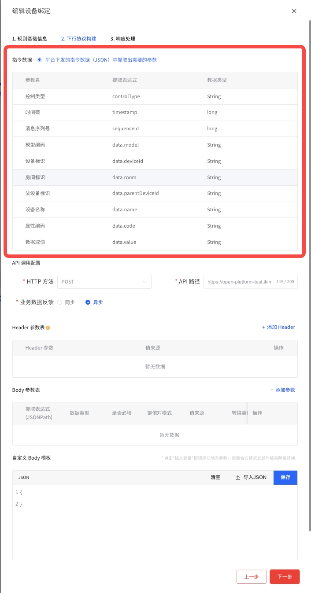

# 云云接入bridge协议转换操作指南

# 更新说明

更新时间：2025\-11\-27

**版本号：\<1\.0版本\>**

|**功能**|**变更类型**|**说明**|**相关文档**|
|---|---|---|---|
|| |||

# 产品介绍

云云接入bridge协议转换是通过配置bridge转换规则，将第三方自定义协议转换为平台标准协议，适用于在产品开发过程，使用自定义协议的第三方云云设备。

用户通过配置自定义协议和平台标准协议之间的bridge协议转换规则，实现各类按照自定义协议接入的产品设备能够转换平台识别的数据格式，打破通信协议的壁垒，完成产品数据上行下达的通信传输

通过技术手段解决了物联网领域最普遍的“碎片化”难题，将平台从一个封闭的标准执行者转变为一个开放的协议翻译中心，数平台实现规模化、普适性接入的核心竞争力。

## 基本概念

|**概念**|**说明**|
|---|---|
|协议|协议是一套预先定义好的规则和格式，规定了数据如何打包、发送、接收和解析。|
|上行数据|上行数据是从设备发送到云端的数据，可以理解为设备“上报”的数据。 例如：智能手环将心率和睡眠报告上报给云端和App|
|下行数据|下行数据是从云端向设备发送的数据，可以理解为云端“下发”的指令数据。 例如：向台灯打开灯光|
|公共header|公共Header（公共消息头/通用头） 是指在协议转换过程中，那些在协议中保持不变、可以被直接复制或简单映射的通用信息字段，封装了数据包的路由、管理和控制信息。|
|通信认证|通信认证是通信双方在建立连接前相互确认对方身份真实性的过程。它通过验证等凭证，确保通信对象可信，防止伪装攻击（如中间人攻击），为后续安全通信（如加密传输）建立信任基础。|

## 技术架构

## 功能优势

主要体现在以下几个方面：

**1\. 生态开放性与兼容性强**

通过云云bridge功能，开放平台可以接入不同使用私有协议的设备，打破了私有协议的壁垒，允许平台接入几乎所有制造商的设备，极大地丰富了产品生态。

**2\. 降低接入门槛与开发成本**

对于设备厂商，无需为适配平台而修改自身固件或标准协议，几乎“零成本”即可实现接入。对于平台方，也无需为每个厂商定制开发后端解析代码，将技术对接工作标准化、可视化。

**3\. 提升部署效率与灵活性**

通过可视化配置页面，将原本需要后端开发人员编写解析代码的复杂工作，转变为可由技术支持或实施工程师通过界面操作完成的标准化任务，缩短了单个新设备类型的接入周期。

**4\. 统一数据与标准化管理**

无论底层协议如何千差万别，经过转换后，所有设备数据在平台内部都遵循统一的标准化格式，这为后续的数据告警规则设置及运维管理提供了唯一、一致的基础，极大简化了平台内部复杂性。

**5\. 技术解耦与未来保障**

将协议解析逻辑从前端应用和核心业务逻辑中剥离出来，形成一个独立的中间转换层。当某个厂商协议升级或新协议出现时，只需调整对应的转换规则，而不会冲击平台核心架构，增强了系统的可维护性和面向未来的扩展性。

## 应用场景

具体场景包括：

**1\. 智能家居/全屋智能平台集成**

平台需要接入不同品牌、不同时期的家电，通过此功能，无需厂商配合，即可将这些使用私有协议的设备“翻译”接入统一平台，实现跨品牌联动与控制。

**2\. 第三方云云对接与生态合作**

当平台希望与另一个成熟的设备云（如某品牌自有云）进行“云云对接”时，对方提供的API数据格式可能与本方标准不符。此功能可将对方的数据流“翻译”成本平台的标准物模型，实现设备状态的同步与控制指令的下发。

**3\. 快速定制化项目交付**

对于系统集成商而言，面对客户提出的“接入某个特定品牌设备”的定制化需求，无需等待开放平台官方开发支持。实施团队可以自行研究其协议，并通过此可视化工具快速配置完成接入，极大提升项目交付速度和灵活性。

## 适用范围

1. 仅支持“云云接入”设备。设备必须先接入一个第三方云平台，您的平台再与该第三方云进行通信和协议转换。

2. 设备本身需具备联网能力，并已完成与第三方云（如设备厂商的云）的接入，其数据和指令需能通过该云的API获取或下发。

3. 无法直接连接那些仅部署在本地局域网（如通过蓝牙、Zigbee、LoRa或企业内网）且未接入任何外部云的设备。

4. 实施高度依赖于第三方云的稳定性、API开放性及速率限制。您需要额外处理与多个第三方云之间的网络通信、认证、鉴权等复杂性。

# 云云接入Bridge协议配置操作指南

你可以参考该文档，快速上手云云接入协议 Bridge 配置，整体流程为：

1. **\<新增云云接入Bridge协议\>**

2. **\<协议信息配置\>**

3. **\<上行数据解析配置\>**

4. **\<下行数据解析配置\>**

## \<新增云云接入Bridge协议 \>

### 准备工作

1. 该公司已经开通云云接入服务

**创建云云bridge有两个入口**

1. 协议管理

2. 产品开发\-云云开发

### \<协议管理入口\>

协议管理为一个产品接入系统的新功能模块，是查看、管理、新增的云云接入bridge协议的入口。

**协议管理列表**

|字段|字段描述|
|---|---|
|协议名称|定义该条协议的统一名称|
|协议描述|描述该协议适用的场景|
|是否关联产品|是 or 否 1\. 是，代表该协议已关联云云接入产品 2\. 否，代表该协议未关联任何产品|
|状态|启用 or 不启用 - 启用，则关联的产品使用该条协议 - 不启用，则关联的产品不使用该条协议|
|创建时间|记录该协议创建的时间，时间格式为：yyyy\-mm\-dd hh:mm:ss|
|操作|编辑、删除 1. 点击【编辑】，编辑协议的内容 2. 点击【删除】，显示删除确认弹窗     1. 删除该协议，将会影响已关联的产品，是否确认删除？|

**新增协议**

1. 点击【新增协议】，显示新增弹窗，点击【确定】，跳转【云云接入协议bridge】配置页面

### \<产品开发\-云云开发入口\>

创建产品，若选择的云云接入的智能化方案，会有一个协议类型的选项

1. 平台标准协议

2. 自定义协议

若选择【平台标准协议】则不需要配置云云接入bridge协议；

若选择【自定义协议】，则需要配置云云接入bridge协议，见图2

若是自定义协议，云云开发\-设备开发页面如下显示，用户需要点击【选择与配置协议】，去从已有的协议中选择符合的协议或者新增该设备使用的通信协议

**选择协议**

1. 点击【 选择与配置协议】，会显示该企业组下已配置的数据协议，用户可从中选择一种勾选配置，单选

2. 若其中没有符合该设备的协议，点击【新增协议】，去配置该设备的云云接入通信协议

3. 配置完成后，协议信息以列表形式展示

    |    协议名称|    用户定义|
    |---|---|
    |    创建时间|    yyyy\-mm\-dd hh:mm:ss|
    |    状态|    启用、不启用|
    |    操作|    查看、编辑、删除|

**新增协议**

1. 点击【新增协议】，显示新增弹窗，点击【确定】，跳转【云云接入协议bridge】配置页面

## \<协议信息配置 \>

##### **协议基本信息配置**

用户需在指定表单区域输入以下信息：

- 协议名称：文本框，自定义命名，不超过32字符，需要唯一性校验

- 协议描述：文本框，支持简短说明，不超过256字符

##### **产品\-协议映射**

配置平台产品与协议的关联，后续该产品model下的设备与平台之间的协议转换都基于此映射关系。

**产品\-协议映射表**

**添加映射关系**

产品与协议映射关系是通过以下两个途径添加：

1 是通过在产品\-设备开发页面，勾选已有协议，完成产品与协议之间的映射配置。勾选后，产品与协议关系同步在产品\-协议映射表内；

2 是在协议详情内部点击【添加映射关系】，在添加协议关系的弹窗内选择产品，确认添加后即可完成映射配置。

##### **公共header配置**

目的：让系统在向上游的第三方云平台发送请求时，自动在所有请求中添加一组预先定义好的通用HTTP头部信息。

公共Header配置是“云云接入”中提升效率、确保一致性和安全性的基础设施。它把每个接口都需要关心的通用通信信息，抽离出来进行集中化管理。

**公共Header列表配置**

|字段|字段描述|
|---|---|
|Header参数|只支持字符: A\-Z a\-z \_|
|值来源|分为平台生成、静态值、Token、签名认证、API key参数、Basic Auth认证头|
|操作|编辑、删除 - 编辑：点击 “编辑” 按钮，显示【修改header】弹窗，用户修改保存 - 删除：点击 “删除” 按钮，弹出确认删除弹窗，用户确认后删除该 Header 配置|

**新增header**

点击 “新增 Header” 按钮，补充公共 Header 参数和值来源

|值来源类型|填写说明|
|---|---|
|平台生成 |1. 类型选择 - 您需要从一个下拉选择框中，选择此次Header值的动态生成 “类型”。 - 当前可选项为：     - 时间戳：系统将自动生成一个当前时刻的时间戳。     - 随机数：系统将自动生成一个随机字符串。 2. 详细参数配置     - 当类型为 “时间戳” 时，提供 “单位” 下拉选择框，可选项包括 “秒级”“毫秒级” ；     - 当类型为“随机数”时，提供“随机数的格式”选择，随机数的位数自定义输入框，用户可自定义|
|静态值|选择此选项时，用户可直接输入固定的静态值作为 Header 值 1. 提供文本输入框，用户输入所需的静态值即可，最多64位数|
|Token|选择此选项时，需要先指定的 API 接口，从其响应中提取目标Token字段值作为 Header 值。 1. 提供 “指定 API” 下拉选择框，选择目标 API 接口 2. 提供 “读取表达式” 输入框，用户输入目标JSON表达式即可，格式示例为 “Token”，系统会从指定 API 接口的响应中提取该字段值|
|签名认证|该参数值是签名认证的计算结果值|
|API key参数|该参数值是API Key 的具体值，平台会将 API Key 值作为该 Header 参数的值添加到请求头中|
|Basic Auth认证头|该参数值是平台按照Basic Auth认证方式，将用户名和密码进行加密编码的计算结果|

**下一步跳转**

完成【协议信息配置 】后，点击底部“下一步”按钮，触发跳转提示“正在跳转到下一步，并进入步骤2【上行数据解析配置】

## \<上行数据解析配置\>

作为云云接入bridge协议转换流程的第二个步骤，该功能的主要目的是配置平台接收设备上行数据时的上行通信认证配置和数据解析规则，并提供测试验证功能，以此当设备上行数据上报时候，能够将设备数据转换为平台能够识别的标准数据格式。

上行数据解析配置分为三步：1\. 上行通信认证配置、2\. 上行通信规则配置、3\. 数据转换预览

##### **上行通信认证配置**

上行数据认证的配置是云端判断“数据是谁发的、是否可信”的唯一依据，所有数据必须通过数据认证后，才能进行后续的处理。

上行通信认证分为两种类型：

- 1是平台标准认证方式：通常指平台为您生成的、标准化的认证方式；

- 2是自定义认证方式，由私有认证方式，平台目前支持Basic Auth认证和签名认证。

**平台标准认证方式**

1. 展示信息：如图展示

2. 平台验签方式：点击【平台获取接口授权方式】，显示规则内容弹窗，点击【下载】，下载认证文件

**自定义认证方式**

当用户选择自定义认证方式时，需要补充上行认证方式

上行认证方式：用户从下拉菜单中选择具体的上行认证方式：1\. 签名认证  2\. Basic Auth

|认证类型|认证含义|应用场景|
|---|---|---|
|签名认证|平台使用预先的密钥key和Secret，对请求的特定内容（如参数、时间戳）按照对方规定的算法生成一个唯一的“数字签名”，并随请求一起发送。对方云平台会用同样的算法验签，通过则表明请求合法且未被篡改。|安全性要求高的开放API场景，这是最常见、最安全的云间认证方式。|
|Basic Auth|平台直接将用户名（Username）和密码（Password） 拼接后，进行Base64编码，将编码后的字符串放在请求头的 Authorization 字段中发送。|一些传统或内部系统的API，认证逻辑相对简单。注意： 请在HTTPS环境下使用，以确保传输安全。|

- **签名认证方式配置说明**

|字段|填写说明|
|---|---|
|签名算法|- 用户从下拉菜单中选择用于签名的算法，如 HMAC \- SHA256 、HMAC\-SHA1、RSA\-RSA\-SHA256、MD5 - 用户选择后，后续签名计算逻辑将基于该算法|
|签名密钥|- 用户输入用于签名的 App key 和 App secret|
|参与签名的组件|- 用户选择请求中需要参与签名的部分，包括 HTTP 方法、URL 查询参数、请求体 - 对于 “HTTP 方法”“URL 查询参数”“请求体”，提供复选框，用户勾选后表示该部分参与签名     - 勾选 “URL 查询参数” 后，需配置排序规则（如按参数名 ASCII 码升序排序）、键值连接符（如 “=”）、参数对连接符（如 “\&”）     - 勾选 “请求体” 后，同样需配置排序规则、键值连接符、参数对连接符|
|字符串组装规则|- 配置 API 请求签名的字符串组装方式，可通过选择或手动输入模板变量来定义组装规则。 - 平台提供组装规则的示例 - 平台根据配置的信息，提供可选择的变量按钮，点击变量按钮可将其插入到组装规则输入框中，也支持用户手动输入自定义组装规则|
|签名 Header 参数|- 下拉选择签名结果放置的 Header  - 参数来源：公共header提前配置完成的签名header|

- **Basic Auth认证方式配置说明**

|字段|填写说明|
|---|---|
|用户名|用户在指定输入框中输入用于 Basic Auth 认证的用户名|
|密码|用户在指定输入框中输入用于 Basic Auth 认证的密码，支持密码隐藏 / 显示切换|
|加密算法|用户从下拉菜单中选择对用户名和密码进行加密编码的算法，平台会自动使用该算法对用户名和密码进行处理并添加到 Header|
|字符串连接符|用户可在指定输入框中输入用于连接用户名和密码的字符串连接符，将用户名和密码用该连接符串起来|
|认证头|- 下拉选择Header 参数 - 参数来源：公共header提前配置完成的Basic Auth 认证头|

注：填写完成后需要点击【保存认证配置】去保存通信认证配置。

##### **上行解析规则配置**

在“云云Bridge”中，“上行数据解析规则” 是将第三方设备云上报的私有协议数据，翻译、转换为平台能统一理解和处理的标准协议数据的核心模块。

**平台提供的五类上行规则**

您需要为以下每类规则配置对应的解析逻辑。如果您的设备私有协议不支持或不需要某种回调，可以直接将其关闭。

|规则类型|功能说明|场景示例|
|---|---|---|
|绑定回调|当设备在第三方云上成功绑定/授权时，第三方云通过此规则通知平台。|用户使用App将一台新空调绑定到厂商云，平台需同步此绑定关系。|
|控制属性回调|当设备响应来自平台的下行控制指令后，第三方云通过此规则将设备执行结果回传。|平台下发“设置温度25℃”后，空调确认并上报“当前温度已设为25℃”。|
|事件回调|设备主动上报的告警、故障或状态变化（非周期性状态）。|门磁检测到开门动作，摄像头检测到移动侦测，设备发生故障码。|
|设备状态回调|设备周期性上报或平台主动查询时的设备全量或关键状态数据。|传感器定时上报温度、湿度；平台查询设备当前所有工作模式。|
|解绑回调|当设备在第三方云上被解绑或移除时，第三方云通过此规则通知到平台。|用户在App中删除了设备，平台需同步移除该设备。|

**上行解析列表**

**列表字段展示**

|字段|字段说明|
|---|---|
|规则名称|规则名称是平台默认生成的|
|触发条件|该规则触发使用的条件规则|
|回调地址|默认展示平台生成的回调地址，用户可在输入框中修改规则触发后的回调地址|
|状态|规则状态控制 1. 每条规则对应一个状态开关，可控制规则的启用或禁用 2. 状态开关，可在启用和禁用之间切换，切换后状态实时更新显示，默认开启状态|
|操作|点击 “编辑”，进入规则编辑界面，可对规则名称、触发条件、回调地址等进行修改|

**编辑上行数据解析规则**

“上行通信规则配置”是平台提供了上行数据处理规则的编辑能力，支持配置平台上行规则基础信息、触发条件、解析映射规则及响应规则，以此实现上行数据的标准化转换与处理。

新增/编辑上行规则分为3步骤： 1\. 规则基础信息、2\. 解析映射规则、3\. 响应处理。

###### 规则基础信息

|字段|填写说明|
|---|---|
|规则名称|以只读形式显示平台标准规则名称，不可编辑|
|回调地址|1. 默认展示平台生成的回调地址，用户可在输入框中修改规则触发后的回调地址 2. 提供文本输入框，支持用户输入有效的 URL 地址作为回调地址，输入时可进行格式合法性校验，若不符合 URL 格式则给出提示|
|消息类型标识符|1. 用户在输入框中指定用于触发规则的消息类型标识符，如 “content type” 等，输入内容作为触发条件的一部分|
|消息类型值|1. 用户在输入框中指定消息类型标识符对应的具体值，如 “xx”，当上行数据中的消息类型符合 “消息类型标识符 = 消息类型值” 时，触发该规则|

###### 解析映射规则

编辑上行规则的第二步，用于配置第三方数据到平台数据的解析规则映射，实现不同格式、结构的数据转换，确保平台能正确识别和处理来自第三方的上行数据。

（1）原始数据示例

用户可将原始数据格式复制在此，作为辅助展示作用，以固定区域展示第三方上行数据示例内容，如报文或 JSON 结构示例，用户可以直观查看数据原始上报的数据格式。

（2）上行参数表

定义第三方系统上行数据参数的格式规范，用于后续字段映射

- 添加数据字段：用户可添加新的数据字段，定义第三方上行数据中需解析的字段，点击【添加参数】，显示添加参数的弹窗，补充弹窗内的字段信息

**添加上行数据参数配置说明**

|字段|填写说明|
|---|---|
|提取表达式（JSONPath）配置|1. 用户输入JSONPath 表达式，用于定位原始数据中待提取的字段，必填 2. 示例：如果原始数据是 \{"status": \{"temp": 25\}\}，要提取温度值 25，表达式应填写 $\.status\.temp。|
|数据类型|1. 用户从下拉菜单中选择提取字段的数据类型，必填； 2. 类型有：字符串、整数、长整数、浮点数、布尔值、数组、列表、对象|
|键值对模式 |1. 用户从下拉菜单中选择参数的键值对模式，必填； 2. 键值对类型有：仅键（key）、仅值（value） 3. 示例：     - 仅键：只提取键名。例：从 \{"code": 1\} 中提取出 "code"。     - 仅值：只提取键值。例：从 \{"code": 1\} 中提取出 1。|
|转换类型|1. 用户从下拉菜单中选择对提取字段的转换类型，必填； 2. 类型有：     - 无转换：原始值可直接使用，无需处理     - 枚举值转换：示例：将设备上报数值为「0」映射为平台数值「1」     - 时间格式转换：需要补充设备上报的具体时间格式     - 键值对转换：将整个键值对整体作为转换对象|

（3）可视化映射 \- 平台标准 JSON Body 模板

- 第一步：理解目标格式（JSON模板展示）

    在 “平台标准JSON模板” 固定区域，系统会清晰地展示一份最终的JSON结构示例。该示例会明确列出：

    - 参数字段：平台要求的标准字段名称（如 deviceId, timestamp, property）。

    - 字段含义：每个字段代表什么（如 “设备标识”、“时间戳”）。

    - 数据类型：字段值应是字符串、数字还是布尔值等（如 String, Number）。

    - 是否必填：明确标记该字段是否必须提供。

- 第二步：获取源数据

    您在上一步“**上行数据参数表**”中，已经为每个需要的信息（如设备ID、温度值）编写了提取规则（如JSONPath ：$\.device\.id）。这些规则的引用标识，会汇总在 “上行数据参数表” 中，成为本步骤的 “数据来源库”。

- 第三步：插入变量执行映射

    - 在平台标准JSON模板中，找到需要填充值的字段位置。

    - 点击 “插入变量” 按钮，系统会弹出弹窗，展示 “上行数据参数表” 中所有可用的参数（即您提取好的数据来源）。

    - 在弹窗中，选择对应的参数，选择后，一个代表该参数的变量（如 \{\{deviceId\}\}）会自动插入到JSON模板的指定位置。

    - 这个过程实质上是建立了 “源数据 → 目标字段” 的映射关系。发送请求时，变量 \{\{deviceId\}\} 会被实际解析出的具体数值（如 "device\_123"）自动替换。

- 第四步：模板刷新与保存

    - 保存配置：所有映射关系编辑完成后，点击 “保存” 图标按钮，当前的JSON模板配置将被持久化存储。

    - 刷新重置：在编辑过程中，若想放弃未保存的修改，点击 “刷新” 图标按钮，模板将重新加载至上一次成功保存的版本，避免误操作。

###### 响应处理

为了标准化、自动化地处理和转换从服务器返回的响应数据，确保应用程序能够一致、可靠地处理各种响应情况，当平台接收到第三方的上行数据并进行处理后，需要向第三方返回响应时，使用此功能配置响应的生成规则进行协议转换，将平台生成的数据格式转换为第三方的数据规则。

（1）响应表达式的配置

- 成功条件表达式：需要输入私有协议判定操作成功的条件表达式

- 是否需要平台响应数据：单选配置

    - 选择是，则需要配置响应数据映射

    - 选择否，则不需要配置响应数据映射

（2）参数数值配置

定义平台向第三方系统确认“操作成功”等条件参数的数值。您在此处配置的值，将作为成功凭证在绑定完成后传递给第三方系统。

参数数值：请在此输入与第三方系统约定好的成功标识值（如特定字符串、状态码等）。

当平台侧绑定流程成功时，此值将自动填入协议中对应字段，并回调通知第三方系统，完成最终确认。

（3）payload参数映射

- **payload参数表**

payload参数以表格的形式展示所有已配置的响应参数，表格为只读状态，不可直接编辑。

**payload参数表配置说明**

|字段|字段说明|
|---|---|
|提取表达式（JSONPath）配置|用户输入合法的 JSONPath 表达式，用于定位平台数据中待提取到第三方 payload 的字段|
|数据类型|1. 用户从下拉菜单中选择提取字段的数据类型，必填； 2. 类型有：字符串、整数、长整数、浮点数、布尔值、数组、列表、对象|
|键值对模式|1. 用户从下拉菜单中选择参数的键值对模式，必填； 2. 键值对类型有：仅键（key）、仅值（value） 3. 示例：     - 仅键：只提取键名。例：从 \{"code": 1\} 中提取出 "code"。     - 仅值：只提取键值。例：从 \{"code": 1\} 中提取出 1。|
|值来源|值来源分为1\. 静态值、2\. 平台随机生成（随机字符串、时间戳）|
|是否必填|单选|
|转换类型|1. 用户从下拉菜单中选择对提取字段的转换类型，必填； 2. 类型有：     - 无转换：原始值可直接使用，无需处理     - 枚举值转换：示例：将设备上报数值为「0」映射为平台数值「1」     - 时间格式转换：需要补充设备上报的具体时间格式|

（4）平台参数表

当平台收到并成功处理一条上行消息后，向您或下游系统响应的标准化数据格式。表格中明确列出了所有可能返回的参数，并特别标识了哪些是核心且保证返回的字段。

|参数名称|提取表达式|数据类型|参数位置|是否必须|
|---|---|---|---|---|
|平台设备id|device Id|String|response|否|
|设备标识|device Sn|String|response|是|
|接口响应码|code|String|response|是|
|接口响应信息|message|String|response|否|
|接口响应时间|responseTime|String|response|是|

**注明：**

标注为 “是” 的参数，表示无论本次处理成功与否，平台一定会在响应报文中包含该字段。

标注为 “否” 的参数，可能在特定业务场景下不返回（例如，失败时 message 字段可能为空）。

（5）回复第三方 payload 标准模板

此功能是定义和编辑平台在收到设备上行数据后，需要回复给第三方云的标准响应报文格式，为了确保通信的完整性，用户需要在此处配置这个报文的固定模板。

- 第一步：导入基础模板

    1. 在 “第三方payload模板区域”，需要通过 “导入JSON” 功能，上传一份标准回复报文示例（即您的私有协议格式）。

    2. 导入后，该JSON模板会清晰地展示在编辑区内，会显示参数字段和插入变量按钮，您配置的基础框架。

- 第二步：插入动态变量

    1. 无法预先知道每次回复的具体数据（如状态码、时间戳、本次收到的消息ID等），因此需要在JSON模板的相应位置，点击 “插入变量” 按钮，显示可配置的参数含义弹窗，平台提供的payload参数列表中选择并插入。

    2. 这些变量会在每次实际回复时，被系统自动替换为真实的值。

- 第三步：保存与管理

    - 保存配置：编辑完成后，点击 “保存” 图标按钮，当前的模板配置将被持久化存储。系统在后续通信中将严格按此模板生成回复。

    - 刷新重置：在编辑过程中，若想放弃未保存的修改，点击 “刷新” 图标按钮，模板将重新加载至上一次成功保存的版本，防止误操作。

##### **数据转换预览（上行数据）**

基于以上上行数据解析规则、响应数据处理规则，可以实时预览测试数据转换。

- 第一步：选择测试场景（测试模板样例）

    1. 在 “测试模板样例” 下拉选择框中，系统会列出您已配置好的所有上行数据规则，例如：设备绑定回调

    2. 您需要根据测试目的选择对应的模板。例如，想测试温度数据上报，就选择 “控制属性回调” 模板。后续的测试将严格基于此模板所关联的解析规则进行。

- 第二步：准备模拟数据（原始数据样例输入）

    1. 在 “原始数据样例” 输入区域（标签为 “导入JSON”），输入或粘贴一份模拟第三方设备实际上报的数据。

    2. 此数据应符合您的私有协议格式（通常是JSON）。

- 第三步：执行转换（测试转换操作）

    1. 准备就绪后，点击 “测试转换” 按钮。系统将立即启动模拟流程：自动应用您在第一步所选模板对应的全部配置，对输入区的原始数据进行完整的转换处理。

- 第四步：验证与调试（平台标准数据展示）

转换完成后，结果将显示在 “平台标准数据” 区域。系统会明确提示本次测试的状态：

|状态|界面显示|说明与后续操作|
|---|---|---|
|转换成功|1. 区域右上角显示 【转换成功】 状态标签与对勾图标。 2. 区域主体完整展示转换后的、符合平台标准的JSON数据。|表示配置完全正确。可以检查输出数据的每个字段，确认映射是否符合预期。|
|转换失败|1. 区域右上角显示 【转换失败】 状态标签与错误图标。 2. 页面会提示具体的错误信息。|需要根据错误信息，返回检查对应的 “参数表” 或 “JSON映射模版” 配置。|

**下一步跳转**

完成步骤2配置后，点击底部右侧蓝色“下一步”按钮（带箭头图标），进入步骤3

**上一步跳转**

可以点击底部左侧的“上一步”按钮，进入步骤1

## \<下行数据解析配置\>

作为云云接入bridge协议转换整个流程的第三大核心功能，目的是配置平台指令到第三方协议的转换规则，实现平台指令到第三方系统的"多对一"触发与"多对多"API调用。

下行数据解析的业务逻辑：

1. 规则配置：在平台中创建指令转换规则，选定协议类型为“API调用型”。

2. 参数提取：使用 JSONPath 从平台下发的指令中提取所需参数，并转换为目标数据类型。

3. 协议组装：根据配置的第三方API格式，自动将提取的参数组装为对应的请求结构。

4. 执行与触发：规则触发后，系统自动向第三方系统发起API调用，并完成指令下发的全流程。

下行数据解析配置分为三步：1\. 下行通信认证配置、2\. 下行通信规则配置、3\. 数据转换预览。

##### 下行通信认证配置

配置规则场景有两种：

- 场景一：上行认证为“平台标准认证”

    - 下行配置规则：必须为下行通信单独配置一个自定义的认证方式，无法复用上行认证。

    - 原因：平台标准认证通常是平台接收数据时的内部验证规则，并不适用于向第三方平台发起的主动请求。

- 场景二：上行认证为“自定义认证”

    您可以选择 1\. 复用上行认证  2\. 自定义下行认证

    1. 复用上行认证

        - 选择此项后，系统将自动采用您在上行认证中已配置好的完全相同的认证方式（目前仅支持签名认证、basic Auth认证）来发起下行请求。

    2. 不复用，自定义下行认证

        - 您需要为下行请求单独配置一套全新的认证规则，独立于上行认证。

        - 适用场景：第三方云平台要求上行和下行请求使用不同的密钥、令牌或签名算法。

    当您需要自定义下行认证时，可选的认证方式有：无认证、API key、签名认证\(上行已说明）、basic Auth\(上行已说明）、Bearer Token、签名\+Token。

|认证方式|说明与典型配置|
|---|---|
|无认证|下行请求不携带任何认证信息。|
|API Key|在请求Header（如X\-API\-Key）或Query参数中携带固定密钥。|
|签名认证|与上行一致，需配置签名算法、参与签名的字段、密钥等，确保请求的完整性与不可抵赖性。|
|Basic Auth|与上行一致，在Header中配置标准的Authorization: Basic \<base64编码的用户名:密码\>。|
|Token|在Header中配置Authorization: Bearer \<您的访问令牌\>，常用于OAuth 2\.0等协议。|
|签名\+Token|复合认证。请求需同时包含有效的签名（验证请求本身）和Token（验证调用者身份），安全性最高。|

**认证方式具体配置规则**：

**（1）无认证**

1. “全局认证方式” 下拉框默用户选择为 “无认证” 后，下方与认证相关的额外参数输入区域）将隐藏，因为 “无认证” 模式下无需这些参数

**（2）API key**

1. 当全局认证方式”下拉框选择为 【API Key】 后，下方展示与 API Key 相关的配置项，包括 “API Key” 输入框、“添加位置” 下拉选择框及对应的参数输入框

    1. API Key 输入框：需在此输入 API Key 的具体数值

    2. 添加位置下拉选择框：默认提供 “公共 header” 选项，用户可选择将 API Key 添加到Header 中

**（3）签名认证（同上行规则）**

**（4）Basic Auth（同上行规则）**

**（5）Token**

token认证方式分为1\. 静态 Token 配置、2\. 动态Token配置

**静态 Token 配置**

- 第一步：启用静态 Token

    1. 在认证配置页面，找到 “Token ” 选项。

    2. 点击 “使用静态 Token” 单选按钮，启用此模式。

- 第二步：配置 Token 携带位置

您需要指定静态 Token 在 HTTP 请求中的存放位置，从公共Header选择：

1. 在 “Token 添加位置” 处，使用下拉选择框。

- 从列表中选取一个您已在 “公共Header配置” 中定义好的 Header 名称（例如 `Authorization`）。

- 第三步：配置 Token 值

    在 “Token 值” 输入框中，准确无误地填入第三方平台提供给您的静态 Token 字符串。

**动态Token配置**

1. 第一步：启用动态 Token

    1. 在认证配置页面，找到 “Token ” 选项

    2. 点击 “使用动态 Token ” 单选按钮，以启用此模式

    3. 选中后，下方将展开动态 Token 的专用配置区域

2. 第二步：配置 Token 使用格式
在展开的区域中，配置动态 Token 在请求中的携带格式：

    1. 找到 “是否添加‘Bearer’前缀” 单选按钮组

    2. 根据第三方 API 的要求做出选择：

        - 选择 “是”：系统将在实际获取到的 Token 值前自动添加 “Bearer ” 前缀和空格

        - 选择 “否”：Token 将作为纯值放入 Header

3. 第三步：定义 Token 获取规则（关键步骤）
这是动态 Token 的核心。您需要另行配置一个专门的下行规则，来定义如何请求 Token。根据界面提示，需要在 “下行规则列表”中新增一条规则，规则类型选择为 【get Token】

**（6）签名\+Token认证**

签名\+Token把签名认证的部分和TOKEN认证整合在一起的复合认证方式。

注：填写完成后需要点击【保存认证配置】去保存通信认证配置。

##### 下行通信规则配置

覆盖下行规则的添加、规则信息展示（规则名称、下发触发条件、调用第三方 API、状态）及规则操作（顺序调整、编辑、删除）等功能点

**平台支持的五类下行规则**

平台提供了五种标准类型，在配置下行规则时，您需要首先指定其 Control type。此选项定义了规则的核心目的和触发场景，决定了平台将如何处理和构建后续的请求。

|Control type|含义|示例场景|
|---|---|---|
|设备绑定|平台与第三方设备/账号之间建立关联关系|用户在App/平台中，授权绑定一个第三方设备或服务账号。|
|设备解绑|解除平台与第三方设备/账号之间的关联关系。|用户在App/平台中，移除或解绑一个已连接的设备。|
|属性控制|向设备下发控制指令，改变其状态或执行动作。|用户或自动化场景触发了设备控制（如开灯、调温、开启扫地）。|
|添加节点|向第三方云注册或同步一个设备/子设备信息|平台创建设备后，需要将此设备信息正式注册到第三方云，以便其能识别和管理。|
|GeT Token|自动获取用于访问第三方云API的访问令牌。|在需要Token认证的规则执行前，由系统自动触发；或在Token过期时自动刷新。|

**下行规则列表字段展示**

|字段|字段说明|
|---|---|
|规则名称|展示各条规则的名称，从规则配置信息中获取规则名称并显示|
|下发触发条件|展示各条规则的下发触发条件，从规则配置信息中获取下发触发条件并显示|
|调用第三方 API |展示各条规则调用的第三方 API URL，从规则配置信息中获取调用第三方 API 的相关信息并显示|
|状态|通过开关组件展示并控制规则的启用 / 禁用状态|
|排序|调整规则在列表中的顺序，顺序将影响当触发条件一致的情况下调用第三方API的顺序|
|操作|1. 编辑规则     1. 点击 “编辑” 按钮，弹出规则编辑弹窗（或跳转至规则编辑页面），可修改规则名称、下发触发条件、调用第三方 API 等信息 2. 删除规则     1. 提供 “删除” 按钮，点击可删除对应的规则，弹出确认删除弹窗，用户确认后，该规则从列表中移除|

**新增/编辑下行通信规则**

下行通信规则配置流程分为3步骤：1\. 规则基础信息、2\. 下行协议构建和3\. 响应处理。

###### 规则基础信息

|字段|字段说明|
|---|---|
|规则名称|必填，用于标识规则的唯一名称，不超过32字符|
|规则描述|非必填，规则用途及说明文字，不超过256字符|
|Control type|1. 必填，下行控制指令，该条规则的触发条件 2. 选项有：设备绑定、设备解绑、属性控制、添加节点、Get Token|

###### 下行协议构建

下行协议构建分为了2大部分：1\. 平台指令数据 2\. API调用配置 

**（1）下行协议构建 \- 平台指令数据动态展示**

只有Control type为设备绑定、设备解绑、属性控制会展示平台指令参数，添加节点和Get Token没有平台指令参数

- 场景一：会展示“平台指令数据”的 Control type
当您选择以下与具体设备业务强相关的类型时，“平台指令数据”区域会自动出现：

    - 设备绑定、设备解绑、属性控制
      因为这几种操作都是由平台上某个具体的设备事件或用户指令触发的。例如，用户在App上点击了“关灯”，平台就会生成一条包含 deviceId（哪个灯）、command（什么指令）、value（关）等标准参数的指令，并传递给您的规则。此区域的作用，就是将这部分动态下发的指令参数清晰地展示给您，供您在下一步“API调用配置”中直接引用。

- 场景二：不会展示“平台指令数据”的 Control type
  当您选择以下系统级或认证类的类型时，“平台指令数据”区域会保持隐藏：

    - 添加节点、Get Token
      因为这类规则不由具体的设备指令触发，而是由规则引擎本身根据配置（如定时触发）或为了维护通信链路（如自动刷新Token）而自动发起的。它们的请求参数通常是固定的或在规则上下文中预先定义好的，并不需要接收一份来自平台业务层的动态指令。因此，您需要直接在“API调用配置”部分填写这些静态或预定义的参数。

1. 选择 Control type：首先在规则配置中选定操作类型

    - 如果选择了设备绑定、解绑或属性控制，请关注下方出现的 “平台指令数据” 区域，其中提供的参数是您后续配置API的关键输入。

    - 如果选择了添加节点或Get Token，请直接忽略此区域，前往下一步。

2. 进行API调用配置：根据上一步的情况，在配置API路径、请求体时，相应地选择使用平台提供的动态变量，或填写固定的静态参数。

    - 当您配置下行规则的 “下发触发条件” 时，本区域会根据您选择的Control type （控制类型），自动展示平台在此类指令中将会提供的标准数据字段

    - 每个参数信息：参数名、JSONPath表达式、数据类型

    - 您无需在此处进行任何配置。此区域的作用是帮助您了解在后续配置“body模版”时，可以使用哪些来自平台的标准数据。

    |    字段名|    字段说明|
    |---|---|
    |    参数名|    平台标准数据模型中该字段的名称。|
    |    JSONPath 表达式|    在后续步骤中引用该数据参数|
    |    数据类型|    该参数值的数据格式，确保您在引用时格式正确。|

**（2）API调用配置**

用于定义平台在触发规则后，如何调用第三方云服务的具体接口。

您需要在此配置 HTTP 请求的核心要素，包括请求方法、目标地址以及结果反馈方式，请按照以下步骤依次完成API配置。

- 第一步：选择HTTP方法

    1. 从【HTTP方法】下拉选项选择，必填项

    2. 点击下拉框，系统会展开包含 POST、GET、PUT、DELETE 选项的列表

    3. 根据第三方 API 接口文档的要求，选择唯一正确的方法（例如，获取数据通常用GET，创建或提交数据通常用 POST）

- 第二步：设置API路径

    1. 必填项，请根据第三方 API 文档，在此输入目标接口的具体路径

- 第三步：配置业务数据反馈方式

    1. 必填项，选项分为 “同步” 和 “异步”，请根据实际的业务场景和对可靠性的要求，选择其中一种模式

|反馈方式|含义|适用场景|注意事项|
|---|---|---|---|
|同步|平台会等待第三方API返回响应后，才将结果反馈给指令发起方。链路为：平台 → 第三方API → \(等待响应\) → 平台 → 用户。|需要立即确认指令是否成功的场景，如开关控制、模式切换。|如果第三方API响应慢，会导致平台整体响应延迟或超时。|
|异步|平台在发出请求后立即向指令发起方返回“已接收”，然后异步等待并处理第三方API的响应。链路为：平台 → \(立即回复用户\) \& 第三方API → \(异步处理响应\)。|对实时性要求不高，或第三方处理耗时较长的场景，如设备固件升级、复杂数据计算。|指令发起方无法立刻得知最终执行结果，需要通过查询或其他通知机制获取。|

**若HTTP方法是POST/PUT，需要补充API的Header和Body配置**

- 第四步：Header 配置

    1. 点击【添加Header】按钮，显示添加header 的弹窗，从公共header里面选择header即可。

- 第五步：body 参数表配置

    1. 点击【添加参数】按钮，显示添加Body弹窗，补充弹窗信息

**添加body参数配置说明**

|字段|字段说明|
|---|---|
|提取表达式（JSONPath）配置|用户输入合法的 JSONPath 表达式，用于定位第三方body参数的字段|
|数据类型|1. 用户从下拉菜单中选择body参数的数据类型，必填； 2. 类型有：字符串、整数、长整数、浮点数、布尔值、数组、列表、对象|
|键值对模式|1. 用户从下拉菜单中选择参数的键值对模式，必填； 2. 键值对类型有：仅键（key）、仅值（value） 3. 示例：     - 仅键：只提取键名。例：从 `{"code": 1}` 中提取出 `"code"`。     - 仅值：只提取键值。例：从 `{"code": 1}` 中提取出 `1`。|
|值来源|值来源分为1\. 静态值、2\. 平台随机生成（随机字符串、时间戳）|
|是否必填|单选|
|转换类型|1. 用户从下拉菜单中选择对提取字段的转换类型，必填； 2. 类型有：     - 无转换：原始值可直接使用，无需处理     - 枚举值转换：示例：将设备上报数值为「0」映射为平台数值「1」     - 时间格式转换：需要补充设备上报的具体时间格式|

- 第六步：自定义 Body 模板配置

此功能是定义和编辑平台向第三方云发送的标准数据格式，为了确保通信的完整性，用户需要在此处配置格式模板。

1. 导入基础模板

    1. 在 “自定义Body模板”区域，通过 “导入JSON” 功能，上传一份标准示例（即您的私有协议格式）。

    2. 导入后，该JSON模板会清晰地展示在编辑区内，会显示参数字段和插入变量按钮，即您配置的基础框架。

2. 插入动态变量

    1. 您需要在JSON模板的相应位置，点击 “插入变量” 按钮，显示可配置的参数含义弹窗，从平台提供的标准指令数据列表中选择并插入。

    2. 这些变量会在每次实际发送时，会被系统自动替换为真实的值。

3. 保存与管理

    1. 编辑完成后，点击 “保存” 图标按钮，当前的模板配置将被持久化存储。系统在后续通信中将严格按此模板生成回复。

    2. 在编辑过程中，若想放弃未保存的修改，点击 “刷新” 图标按钮，模板将重新加载至上一次成功保存的版本，防止误操作。

**若HTTP方法是GET/DELETE，需要补充API的Header和Query参数配置**

- 第四步：Header 配置

    - 点击【添加Header】按钮，显示添加header 的弹窗，从公共header里面选择header即可。

- 第五步：Query 参数

    - 点击 “添加参数” 按钮后，补充新增【Query参数】弹窗

**Query参数配置说明**

|字段|字段说明|
|---|---|
|提取表达式（JSONPath）配置|必填，用户输入合法的 JSONPath 表达式，用于定位第三方Query 参数的字段|
|是否必填|单选|
|数据类型|1. 用户从下拉菜单中选择Query参数的数据类型，必填； 2. 类型有：字符串、整数、长整数、浮点数、布尔值、数组、列表、对象|
|键值对模式|1. 用户从下拉菜单中选择参数的键值对模式，必填； 2. 键值对类型有：仅键（key）、仅值（value） 3. 示例：     - 仅键：只提取键名。例：从 `{"code": 1}` 中提取出 `"code"`。     - 仅值：只提取键值。例：从 `{"code": 1}` 中提取出 `1`。|
|对应平台参数|1. 对应平台标准字段” 下拉选择框用于选择 Query 参数对应的平台标准字段 2. 用户点击下拉框可展开查看所有可选平台标准字段选项并进行选择|
|值来源|值来源分为1\. 静态值、2\. 平台随机生成（随机字符串、时间戳）|
|转换类型|1. 用户从下拉菜单中选择对提取字段的转换类型，必填； 2. 类型有：     - 无转换：原始值可直接使用，无需处理     - 枚举值转换：示例：将设备上报数值为「0」映射为平台数值「1」     - 时间格式转换：需要补充设备上报的具体时间格式|

###### 响应处理

定义了如何解读第三方服务的返回结果，让平台能够智能地判断指令执行成功与否，并精准提取返回数据，供后续业务（如状态同步、消息通知）使用。

响应处理分为三部分内容：1\. 配置成功表达式 2\. 配置状态规则 3\. 配置返回参数说明

（1）配置成功表达式（全局成功条件）

1. 提供 “成功表达式” 输入框，用于输入判断响应成功的表达式，为必填项

2. 在此输入一个能唯一判断HTTP请求层面成功的表达式。

（2）配置状态规则（业务状态映射）

即使HTTP请求成功，业务也可能失败。此部分用于解析响应体，定义具体的业务状态。您必须至少配置一条“视为成功”的规则。

- 第一步：新增参数

    1. 点击后，将在规则表格的最上方新增一个空行，您可以直接在该行的各列中输入内容。

- 第二步：从平台提供的标准状态列表中选择一个最匹配的平台状态含义

    - 平台提供的状态规则含义有：

        - 操作成功 \(200\)

        - 请求超时 \(408\)

        - 接口鉴权失败 \(413）

        - 服务器维护/过载/拒绝 \(503\)

        - 上游服务器超时 \(504\)

        - 依赖服务数据处理失败 \(512\)

        - 服务不可用 \(513\)

        - 未查询到设备信息 \(10566\)

- 第三步：配置错误码

    - 平台提供 “错误码” 输入框，用于输入API返回的实际值。

    - HTTP状态码：如果第三方直接用HTTP状态码表示错误（如 `503`），则此处填写 `503`。

    - 业务Body中的code字段：更常见的情况是HTTP状态为200，但Body中有业务码。例如，第三方返回 `{"code": 0, "msg": "成功"}` 或 `{"code": 10566, "msg": "设备不存在"}`，则此处应填写对应的业务码 `0` 或 `10566`。

- 第四步：设置该错误码是否视为成功

    - 提供开关组件，用于设置该状态规则是否视为成功，默认状态可自定义（如默认开启或关闭）

    - 如果此条规则对应的第三方响应（如 `code: 0`）代表业务执行成功，请将开关切换到开启（ON） 状态。

    - 如果代表某种失败（如 `code: 10566`），请确保开关为关闭（OFF） 状态。

（3）返回参数说明

|参数|填写说明|
|---|---|
|提取表达式\(JSONPath\)|必填，用于输入返回参数的字段表达式|
|数据类型|1. 用户从下拉菜单中选择参数的数据类型，必填； 2. 类型有：字符串、整数、长整数、浮点数、布尔值、数组、列表、对象|
|参数说明|1. 若是此条规则的control type是Get token：参数说明分别是Token和过期时间 2. 若是此条规则的control type是节点：参数说明是空间节点|

注明：仅Control type的类型是Get token和添加节点的API调用规则，响应处理需要配置返回参数说明

##### 数据转换预览（下行数据）

基于下行数据解析规则、响应数据处理规则，可以实时预览测试数据转换。

- 第一步：选择测试模板样例

    1. 选择“测试模板样例” 下拉选择框，点击下拉框，系统会展开一个列表，里面是所有已配置的下行数据规则，从列表中选择您想测试的规则（例如：“属性控制”）

- 第二步：查看与调整平台示例消息

    1. 选中规则后，查看 “平台示例消息” 区域。这里会自动填充一份符合该规则类型的、标准的平台下行消息示例

    2. 您可以直接在此区域编辑这份消息，以模拟不同参数下的转换效果（例如，将温度值从 `25` 改为 `30`）

- 第三步：执行数据转换测试

    1. 确认输入的平台示例消息符合您的测试意图后，点击 “测试转换” 按钮

    2. 系统将立即启动转换引擎，执行以下操作：

        - 将“平台示例消息”区域的内容作为输入

        - 读取您当前选择的测试规则的所有配置（包括API路径、请求头、数据映射等）

        - 按照规则配置，执行完整的转换逻辑（包括变量替换、格式组装等）

第四步：查看三方示例数据与结果

1. 转换完成后，结果将显示在输出区域。

|输出状态|界面提示|说明与后续操作|
|---|---|---|
|转换成功|1. 区域右上角显示 【转换成功】 状态标签与对勾图标。 2. 区域主体完整展示转换后的下行指令数据格式。|表示您的配置完全正确。您可以检查输出数据的每个字段，确认映射是否符合预期。|
|转换失败|1. 区域右上角显示 【转换失败】 状态标签与错误图标。 2. 页面会提示具体的错误信息。|您需要根据错误信息，返回检查对应的 “参数表” 或 “JSON映射模版” 配置。|

**后续操作**

1. 点击 “完成” 按钮时，先校验是否满足完成配置的条件，若满足则保存所有配置并结束流程；若不满足，给出提示信息（如 “请先确保已完成认证配置和下行规则配置”）。

