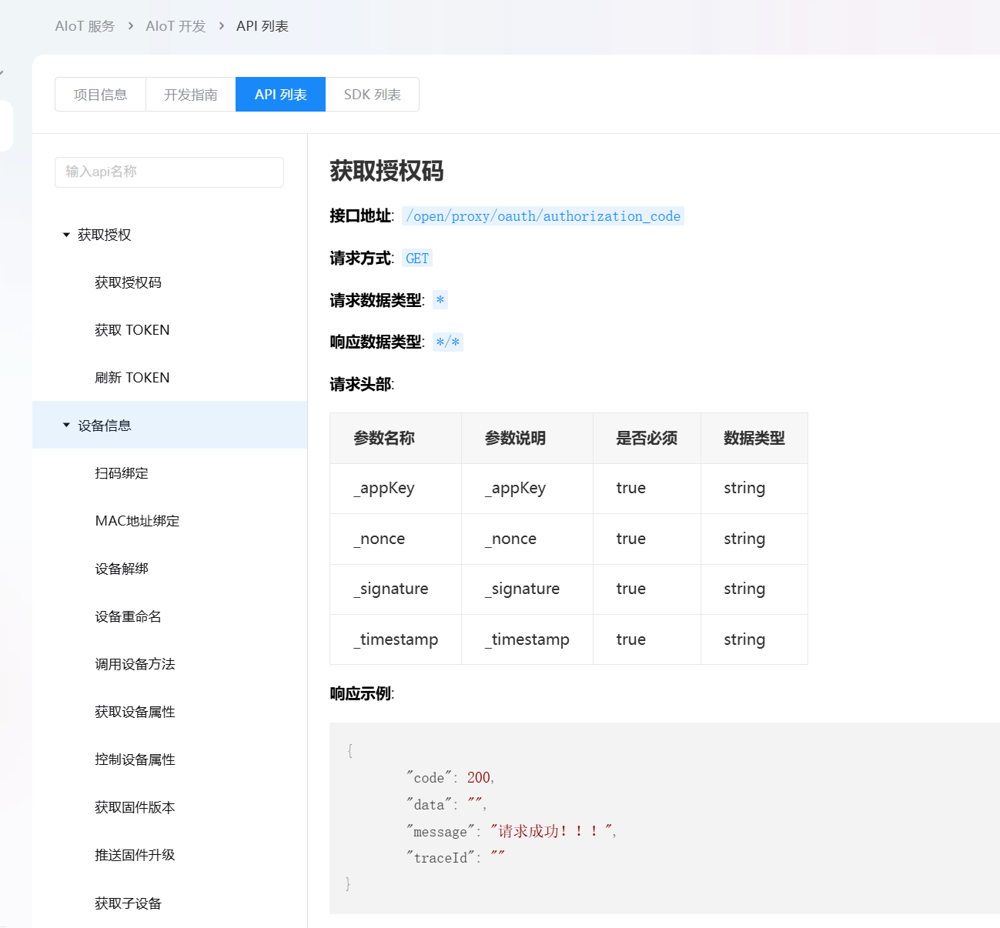

# 开放平台每周发版日志

# 20250718—版本1\.0 已完成

## 产品接入系统 

[产品接入系统功能需求说明 ](https://ikinglink.feishu.cn/docx/OwBzd9pE5ofc34x9ki2cRrr8nxg?from=from_copylink)

1. 产品开发

    1. 创建产品

    2. 基础配置

    3. 功能定义：只有属性

    4. 高级配置：消息推送

    5. 产品测试：自测和实验室测试

    6. 产品申请上线

2. 授权码管理

3. 采购管理

## 产品服务系统

1. 云云接入服务项目

## 产品运营系统

无

## 集中管理平台

[集中管理平台（运营平台）—开发者平台维护模块](https://ikinglink.feishu.cn/docx/ZvXrdxbt6opkMdx0J5dckTfJnqf?from=from_copylink)

1. 审核管理：申请授权码、设备测试、产品上线、消息推送

2. 采购管理

3. 模组配置

4. 产品管理：产品总览、产品配置、品类管理、类目管理

5. 模版管理：产品功能模板、功能库、消息模板

# 20250808上线需求—2\.0     已完成

28号联调、29号测试

## 产品接入系统

[产品接入系统0725上线需求](https://ikinglink.feishu.cn/docx/Atb8dvxQmoyL9NxicsScHrhJntf?from=from_copylink)

1. 补全所有模组资料 wifi plc zigbee 

2. 增加事件、方法功能点   

3. 当前已上线的产品在产品开发系统中体现 迁移数据1期   

[开放平台迁移产品表](https://ikinglink.feishu.cn/wiki/SV2lwlbFciH3LGka44PckLLgnae?from=from_copylink&sheet=5GELgk)

## 集中管理平台需求优化

[集中管理平台0725上线需求](https://ikinglink.feishu.cn/wiki/XlJlwaSmdikfY8k2xx3cje43nuf?from=from_copylink)

## 产品服务系统

1. 40\+个接口（包含云云接入服务接口），API接口调试

2. 10\+云云接入服务接口   测试中

    1. 7\.21开测，

    [云云接入API](https://ikinglink.feishu.cn/docx/AWeKdR8KyoZqBTxMUK3cM6Yvn3e)

## 产品运营系统

无

# 20250903上线需求

1. 迁移任务

    1. 80\+saas接口开发测试完毕

    2. 迁移设备数据

    3. saas获取接入系统产品数据接口

2. 产品接入系统

    [2\.0 优化调整的部分](https://ikinglink.feishu.cn/wiki/KPJFwt1y7iuHfHktdpTcLu0gnqe?from=from_copylink)

3. 产品服务系统

    1. 门锁API

    2. API接口调试页面搭建

        1. 调试请求

        2. 调试结果

4. 开放平台管理系统

    1. 从集中管理平台独立出去，形成【开放平台管理系统】

    [开放平台管理系统](https://ikinglink.feishu.cn/wiki/BMKMwxwtAiDayvk90FKcXnbAnOf?from=from_copylink)

    2. 产品功能模板

        - 添加功能点的范围锁定在所属品类上

        - 添加功能点的所属品类筛选项去掉

    3. 通讯方式：wifi、蓝牙、zigbee、NB\-IoT、wifi\+蓝牙、4G、RS485、PLC、以太网、Z\-wave、LoRa

# 20250910上线需求

### 迁移任务

1. 配合saas100\+接口迁移

2. saas空间和用户API

### 云云对接bridge

1. 云云接入协议转换

### 产品接入系统 P1

1. 场景联动

2. 自定义功能点

[产品接入系统上线需求—3\.0](https://ikinglink.feishu.cn/wiki/ZL7SwTNw9i8Gc6kh9dRcj6UmnQe?from=from_copylink)

### 集中管理平台

1. 场景联动审核

[集中管理平台上线需求—3\.0](https://ikinglink.feishu.cn/wiki/F8eXw6mwWiPonvk55iHcrbpBnnS?from=from_copylink)

# 20250917上线需求

### 集中管理平台 P1

1. **驾驶舱**

[集中管理平台上线需求—4\.0](https://ikinglink.feishu.cn/wiki/UBtzw3ZO2iJyFdknUkocM91HnHe?from=from_copylink)

### 产品运营系统 P1

1. 需求文档

[产品运营系统](https://ikinglink.feishu.cn/docx/SVJ5dKYeDoXHyQxOi94cz7wunqe)

设计图：

https://lanhuapp\.com/web/\#/item/project/stage?tid=9af5cade\-5f03\-46be\-93df\-a4e5f2239076\&pid=ee3ed853\-77b8\-4e76\-90df\-6217d93cf85d

### 产品接入系统

1. 云云对接bridge前端配置  

[云云协议转换前端配置需求](https://ikinglink.feishu.cn/wiki/EWvSw6I7uilhLyk4P9icu20In8f?from=from_copylink)

# 20250924上线需求

### 产品服务系统

1. 授权智居b端项目需求

[AIOT服务开发](https://ikinglink.feishu.cn/docx/S5kBdJQ2joe44zx1J1LcoQ4cnre?from=from_copylink)

### 产品接入系统

1. 接入系统 \- 详情页重构

# 20250930上线需求

## 工单系统优化

1. 开放平台工单需求开发

[工单系统](https://ikinglink.feishu.cn/wiki/HOqbwoREeieBdgkwHOdcPrhInkf?from=from_copylink)

2. 工单系统和小程序

## 

