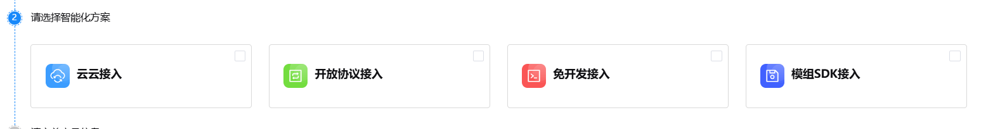
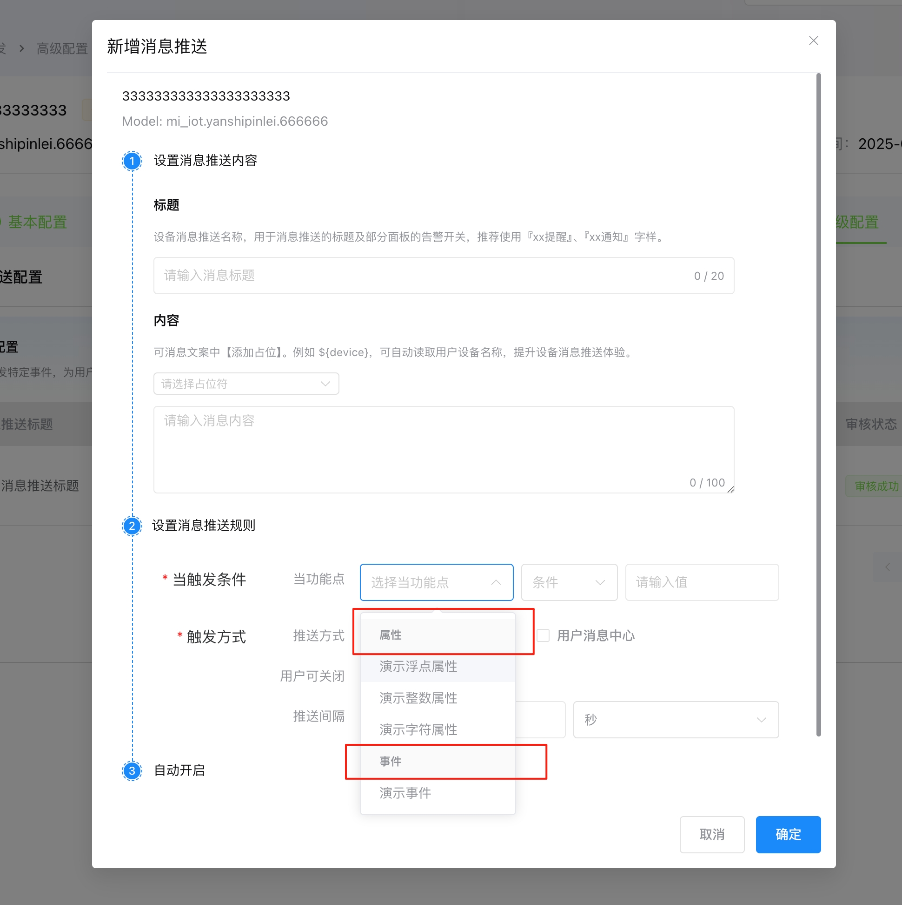

# 上线需求

## 产品接入系统

1. 智能化方式添加详情简要，便于用户理解

云云接入：适用于自有云服务厂商，通过Open API无缝接入Hommor Aura生态，无需改造设备固件。

开放协议接入：适用采用标准/私有协议的成品设备，直连接入Hommor Aura生态。

免开发接入：适用需要快速接入的设备，采用金云模组和固件，零代码免开发接入Hommor Aura生态。

模组SDK接入：预置模组与SDK，免除底层协议开发，极速完成设备智能化接入。

2. 一级类目：其他。放在最后的位置

3. 消息推送触发条件显示

    - 开放平台产品接入的消息配置弹窗里,  这个下拉组件的分组\(红框\)标签看看怎么设计清晰一些,   现在容易为是可以点的选项, 其实不能点

4. **设备开发—固件配置**

**固件列表**

1. 首个固件（初始版本）

    - 该固件是产品出厂时内置的，无需通过OTA（在线升级） 方式推送，是跟随产品上线而上线，不需要固件升级的按钮

2. 后续新增的固件（升级版本）

    1. 用于固件升级，才有固件升级的按钮，允许用户去手动执行固件OTA的操作

3. 固件升级

    1. 首个固件，隐藏显示

    2. 后续新增固件（升级版本），显示

**新增固件版本的前提条件：**

- 必须存在至少一个已上线的固件版本（即首个固件或后续已发布的固件）

- 不允许在固件处于“开发中、送审中、测试中、测试未通过、测试通过未上线“”新增版本。

5. 配网方式增加、热点名称、蓝牙名称非必填

6. 补充云云接入服务API列表

## 控制台

1. 文档中心

2. 常见问题

[iot平台帮助文档](https://ikinglink.feishu.cn/docx/QDwDd758LoWmtRxJBgRcX9dInZ0?from=from_copylink)

