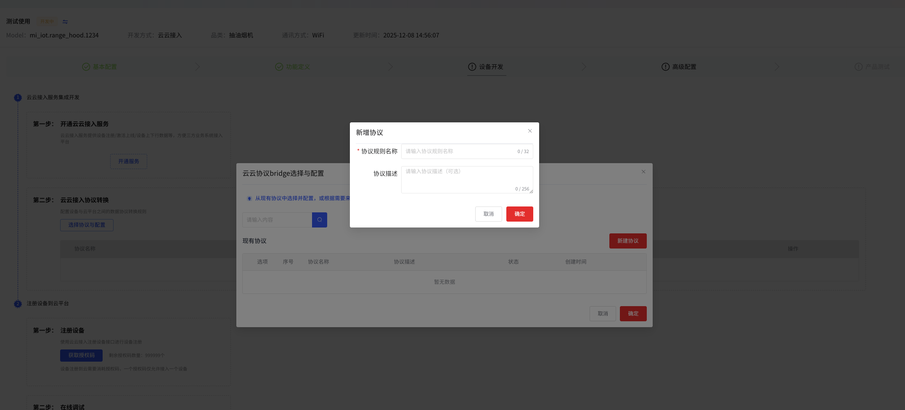
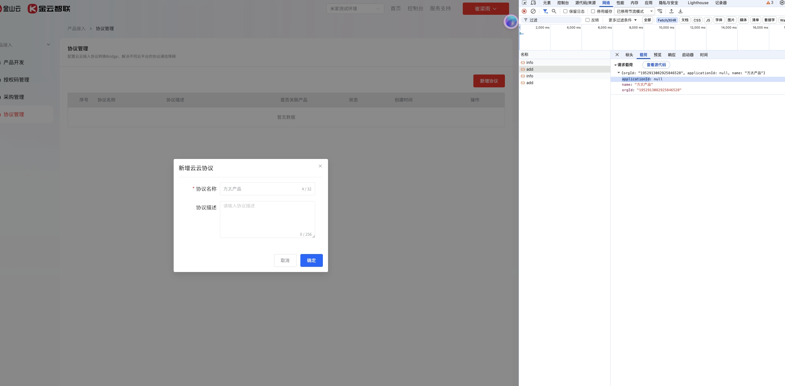

# 云云bridgeBug

### 云云bridge部分

1. bridge参数校验，同一规则下参数表达式不能重复配置（通过）

2. 新增协议的弹窗和协议管理的弹窗内容、样式保持一致  通过

3. 用户未开通云云接入服务的前提下，新增云云bridge协议情况

Toast提示：请先开通云云接入服务，再新增新增云云bridge协议    （通过）

4. 选择平台产品的弹窗页面居中显示，目前为太靠上显示    （通过）

5. 产品开发删除产品，删除信息需要同步到 云云bridge表    （通过）

6. 英文单词之间间距有空格，API key参数、Basic Auth认证头  通过

7. 用户在指定输入框中输入用于 Basic Auth 认证的密码，支持密码隐藏 / 显示切换

8. 提取表达式的输入框与标题横线重合 \(不通过）

9. 上行数据参数表，添加参数成功后，会有两个成功的提示，保存成功\&添加成功，简化成一个即可【添加成功】

不通过

10. 枚举值转换规则配置补充这个提示—通过

11. 上行响应规则：在payload参数映射以及标题的下面添加一个二级小标题：payload参数表 （通过）

12. 删除【平台将自动添加Header: AuthorizationToken所在header自动加入在公共header】（通过）

13. 补充【**下行触发条件】小标题 （通过）**

14. Query参数表需要【对应平台标准字段】这个配置吗，当添加节点和Get token的时候，无平台参数表（和后端确定），get token和获取节点去掉这个选项，其他3种类型的改成非必填。（通过）

15. 对应平台标准字段优化为：对应平台参数；选择框提示：请选择 对应平台参数 （通过）

16. 参数说明既然不能选择，则显示的样式改成固定展示，去除下拉选择框样式 （通过）

17. 下行：输出原始数据优化为：输出下行指令 （通过）

18. 添加参数的值来源统一有四个选项：无转换、时间格式转换、枚举值转换、键值对转换 （通过）

