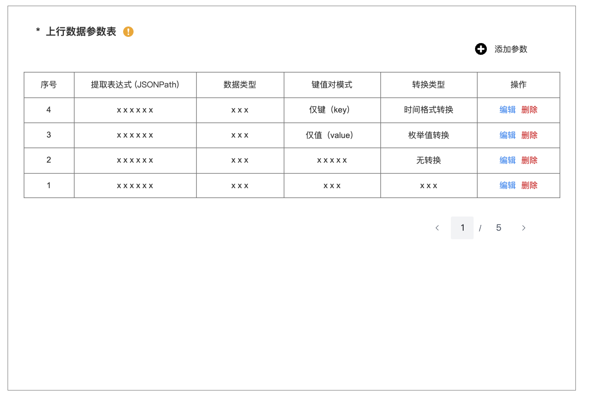

# 云云bridge优化

## **原型**：https://modao\.cc/axbox/share/ChiQLUGt1wdfm8IXQfX71

1. 编辑规则优化

在抽屉顶部加一个页面标题

- 上行规则：编辑【上行规则】名称，例如：编辑绑定回调

- 下行规则：编辑下行规则

### 上行数据解析配置

#### 可视化映射，必填的字段需要做必填校验

#### 响应处理

成功表达式和是否响应处理起个小标题

#### 上行数据参数表，转换规则优化

1. 上行参数列表管理

    1. 以表格形式展示所有已配置的上行参数

    2. 表格为只读状态，不可直接编辑

    3. 每条参数记录后提供【编辑】与【删除】按钮，用户仅能通过点击按钮进行相应操作

2. 添加上行参数

    1. 列表上方提供【添加参数】按钮

    2. 点击后弹出“添加上行数据参数”模态窗口

    3. 必填字段：提取表达式（输入框）、数据类型（下拉选择）、键值对模式（下拉选择：仅键\(key\) 、仅值\(value\)、转换类型（下拉选择，选项包括：无转换、枚举值转换、时间格式转换）

    4. 提取表达式和数据类型保持之前不变

3. 转换类型的动态表单逻辑

    1. 选择无转换：无需展示额外配置项

    2. 选择枚举值转换：需补充规则

        1. 规则表述：“当设备上报数值为 \[输入框\] 时，映射为本平台数值 \[下拉选择/输入框\]”。

    3. 选择 时间格式转换：需要补充设备上报的具体时间格式

4. 编辑上行参数

    点击参数列表中对应记录的【编辑】按钮

    弹出与“添加”相同的编辑弹窗，其中表单字段预填充该参数的现有配置信息，支持用户修改所有字段。

5. 删除上行参数

    点击参数列表中对应记录的【删除】按钮，显示删除趣儿弹窗，点击即可删除

#### 上行响应处理参数映射

1. 响应参数列表管理

    1. 以表格的形式展示所有已配置的响应参数

    2. 表格为只读状态，不可直接编辑

2. 添加参数

    1. 点击【添加参数】，弹出添加payload弹窗

    2. 必填字段：提取表达式、数据类型、键对值模式、值来源、必填/非必填，转换类型

    3. 数据类型和提取表达式保持不变

    4. 值来源的下拉选项有：静态值、平台随机生成（随机字符串、时间戳）

3. 转换类型参考上行数据参数表，转换规则优化

## 下行数据解析配置

1. Get token和获取节点

    1. 不展示平台参数表

    2. 不展示body参数表

    3. 不展示自定义body模版

2. body参数表和query参数表，添加值来源、数据类型、键对值模式

