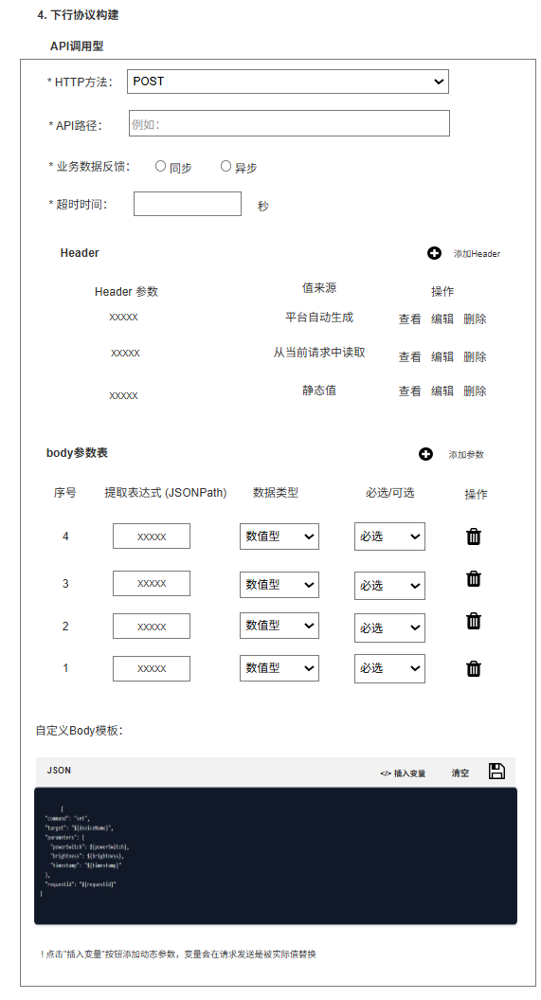

# 云云协议转换前端配置需求

二期优化部分

[云云bridge优化](https://ikinglink.feishu.cn/wiki/DIAHww6XUiyKFOkvWbpcavXJnpb?from=from_copylink)

# 原型：

https://modao\.cc/axbox/share/ChiQLUGt1wdfm8IXQfX71?screen=abm2t2

更新时间：2025\-09\-11版本

针对不按照\-平台标准协议接入的云云设备，需要使用云云bridge协议转换

创建云云bridge有两个入口

1. 协议管理

2. 产品开发\-云云开发

## 协议管理

协议管理为一个产品接入系统的新功能模块，负责管理新增的云云接入bridge协议

**协议管理列表**

1. 列表字段：序号、协议名称、协议描述、是否关联产品、状态、创建时间、操作

2. 协议名称：必填，最大长度32个字符

3. 协议描述：选填，最大长度256字符

4. 是否关联产品：是 or 否，

5. 状态：启用、不启用

    1. 启用，则关联的产品使用该条协议

    2. 不启用，则关联的产品不使用该条协议

6. 创建时间：yyyy\-mm\-dd hh:mm:ss

7. 操作：查看、编辑、删除

    1. 查看，可以查看协议详情

    2. 编辑权限

        1. 启用和不启用状态下均可编辑

    3. 删除权限

        1. 点击【删除】，显示删除确认弹窗

            1. 删除该协议，将会影响已关联的产品，是否确认删除？

8. 分页：10条协议进行一次分页

**新增协议**

1. 点击【新增协议】，显示新增弹窗，点击【确定】，跳转【云云接入协议bridge】配置页面

## 产品开发\-云云设备开发

**创建产品**

1. 创建产品，若选择云云接入，在完善产品信息的位置，多显示一个选择

    选项为：协议类型

    1. 平台标准协议

    2. 自定义协议

**设备开发**

若是自定义协议，设备开发页面如下显示，用户需要点击【选择与配置协议】，去从已有的协议中选择符合的协议或者新增该设备使用的通信协议

**选择协议**

1. 点击【 选择与配置协议】，会显示该企业组下已配置的数据协议，用户可从中选择一种勾选配置，单选

2. 若其中没有符合该设备的协议，点击【新增协议】，去配置该设备的云云接入通信协议

3. 配置完成后，协议信息以列表形式展示

    |    协议名称|    用户定义|
    |---|---|
    |    创建时间|    yyyy\-mm\-dd hh:mm:ss|
    |    状态|    启用、不启用|
    |    操作|    查看、编辑、删除|

**新增协议**

1. 点击【新增协议】，显示新增弹窗，点击【确定】，跳转【云云接入协议bridge】配置页面

## 新增协议配置

- **多步骤配置流程**

    云云协议配置流程包含3个有序步骤：协议信息配置（步骤1）→上行数据解析配置（步骤2）→下行数据解析配置（步骤3），用户需按顺序完成，未激活步骤（步骤2/3）不可点击跳转

- **进度可视化**

    顶部进度条实时显示当前配置进度（步骤1完成时进度为1/3），步骤导航栏通过图标颜色区分状态（已完成步骤显示蓝色对勾，未激活步骤显示灰色数字）

### **协议信息配置**

1. **协议基本信息配置**

用户需在指定表单区域输入以下信息：

- 协议名称：文本框，自定义命名，不超过32字符，需要唯一性校验

- 协议描述：文本框，支持简短说明，不超过256字符

2. **产品\-协议映射**

    配置平台产品与协议的关联，后续该产品model下的设备与平台之间的协议转换都基于此映射关系

    1. 产品\-协议映射表

    列表字段：序号、产品名称、产品model、产品状态、操作（删除）

    2. 添加映射关系

    产品与协议映射关系是通过以下两个途径添加：

    1是通过在产品\-设备开发页面，勾选已有协议，完成产品与协议之间的映射配置。勾选后，产品与协议关系同步在产品\-协议映射表内

    2是在协议详情内部点击【添加映射关系】，在添加协议关系的弹窗内补充产品信息，确认添加后即可完成映射配置

    1. 点击【删除】，显示删除确认的弹窗，弹窗内的文案：确认解除该产品与此协议之间的映射关系吗？

3. **步骤跳转与交互控制**

    1. 下一步跳转：完成步骤1配置后，点击底部右侧蓝色“下一步”按钮（带箭头图标），触发跳转提示“正在跳转到下一步，并进入步骤2

### **上行数据解析配置**

目的：配置平台接收设备上行数据时的上行通信认证配置和数据解析规则，并提供测试验证功能

**上行数据解析业务逻辑规则**

1. 规则触发逻辑：当第三方系统通过HTTP接入，向云云接入Bridge发送数据时，自动触发对应规则执行。

2. 数据解析逻辑：通过预定义配置的解析方法（如JSONPath、正则表达式或自定义解析脚本），从第三方系统上报的原始数据载荷（Payload）中提取所需字段的值。

3. 协议转换逻辑：根据配置的映射关系，将提取的字段值转换为符合本平台物模型标准的规范数据格式，并组装成平台可识别的上行消息。

4. 数据上报逻辑：将转换后的标准数据，通过MQTT等协议发布到平台指定的Topic，或调用平台提供的设备数据上报API，完成数据上行。

上行数据解析配置分为三步：1\. 上行通信认证配置、2\. 上行通信规则配置、3\. 数据转换预览

#### **2\.1 上行通信认证配置**

上行数据认证是云端判断“数据是谁发的、是否可信”的唯一依据，所有数据必须通过数据认证后，才能进行后续的处理

上行通信认证分为两种类型：

1. 平台标准认证方式：通常指平台为您生成的、标准化的认证方式

2. 自定义认证方式：由用户自己定义和管理的认证方式，现有的basic Auth认证或自定义的加密签名认证

**上行通信认证默认选择平台标准方式**

**平台标准认证方式**

1. 展示信息：如图展示

2. 平台验签方式：点击【查看平台验签规则】，显示规则内容弹窗，点击【下载】，下载验签文件

**自定义认证方式**

当用户选择自定义认证方式时，需要补充上行认证方式

上行认证方式：用户从下拉菜单中选择具体的上行认证方式，签名认证、basic Auth，单选，二选一

交互说明：下拉菜单展示可选的认证方式列表，用户选择后，后续相关配置可能根据所选方式有不同联动

##### **签名认证**

1. 签名算法

    - 用户从下拉菜单中选择用于签名的算法

    - 交互说明：下拉菜单列出支持的签名算法，如 HMAC \- SHA256 等，用户选择后，后续签名计算逻辑将基于该算法

2. 签名密钥

    - 用户输入用于签名的 App key 和 App secret

    - 交互说明：提供两个输入框，分别用于输入 App key 和 App secret，输入内容应进行加密存储（若涉及存储），且输入时可选择是否隐藏显示

3. 参与签名的组件

    - 用户选择请求中需要参与签名的部分，包括 HTTP 方法、URL 查询参数、请求体、特定 Header

    - 交互说明

        - 对于 “HTTP 方法”“URL 查询参数”“请求体”，提供复选框，用户勾选后表示该部分参与签名

        - 勾选 “URL 查询参数” 后，需配置排序规则（如按参数名 ASCII 码升序排序）、键值连接符（如 “=”）、参数对连接符（如 “\&”）

        - 勾选 “请求体” 后，同样需配置排序规则、键值连接符、参数对连接符

        - 对于 “特定 Header”，提供 “新增 Header” 按钮，点击后可添加需要参与签名的 Header 参数，可对已添加的 Header 参数进行查看、编辑、删除操作

4. 字符串组装规则

    - 灵活配置 API 请求签名的字符串组装方式，可通过选择或手动输入模板变量来定义组装规则。

    - 交互说明

        - 提供示例说明组装规则的格式，如\{method\}\\n\{path\}\\n\{query\}\\n\{body\_hash\}\\n\{header:X \- Timestamp\}\\n\{header:X \- Nonce\}；

        - 提供可选择的模板变量按钮（如\{method\} \{path\} \{query\} \{body\_hash\} \{header:X \- Timestamp\} \{header:X \- Nonce\}），点击变量按钮可将其插入到组装规则输入框中，也支持用户手动输入自定义组装规则

            - 模板变量关于header的来源于特定header参数配置

5. 签名 Header 参数

    - 配置签名结果放置的 Header 位置。

    - 交互说明：提供输入框，用户输入签名所在的 Header 名称，如X \- Signature，输入提示

6. 公共 Header

    1. 配置自动添加公共请求的 Header

    2. 交互说明：提供 “新增 Header” 按钮，点击后可添加公共 Header 参数，可对已添加的公共 Header 参数进行查看、编辑、删除操作

    3. 操作功能

        - 编辑：点击 “编辑” 按钮，显示【修改header】弹窗，用户修改保存

        - 删除：点击 “删除” 按钮，弹出确认删除弹窗，用户确认后删除该 Header 配置项

###### **新增header**

为用户提供灵活配置 HTTP 请求头（Header）的能力，支持多种值来源方式，以满足不同场景下对请求头定制化的需求

1. Header 参数配置

    1. 用户可在 “Header 参数” 输入框中输入要配置的 Header 名称，该名称需符合 HTTP Header 命名规范

    2. 交互说明

        1. 提供文本输入框，支持用户输入自定义的 Header 参数名

        2. 输入时可进行格式合法性校验（如是否包含非法字符等），若不合法则给出提示

2. 值来源选择

    值来源分为多种，单选

    1. 由平台自动生成

    选择此选项时，平台会根据用户进一步选择的类型和单位自动生成 Header 值

    1. 提供 “类型” 下拉选择框，可选项包括 “时间戳” 、“随机数”；

    - 交互说明

    1. 当类型为 “时间戳” 时，提供 “单位” 下拉选择框，可选项包括 “秒级”“毫秒级” 等，用户选择后，平台按对应规则生成时间戳作为 Header 值

    2. 当类型为“随机数”时，提供“随机数的格式”选择，随机数的位数自定义输入框，用户可自定义

    2. 静态值

    选择此选项时，用户可直接输入固定的静态值作为 Header 值

    1. 提供文本输入框，用户输入所需的静态值即可

    3. 获取Token

    选择此选项时，调用指定的 API 接口，从其响应中提取目标Token字段值作为 Header 值。

    1. 提供 “指定 API” 下拉选择框，列出可选择的 API 接口

    2. 提供 “读取表达式” 输入框，用户输入目标JSON表达式即可，格式示例为 “Token”，系统会从指定 API 接口的响应中提取该字段值

3. 确认与取消操作

用户配置完成后可确认保存，或取消本次配置操作

1. 提供 “确定” 和 “取消” 按钮

2. 点击 “确定” 时，对配置内容进行校验，若合法则保存配置

3. 点击 “取消” 时，放弃本次配置，关闭配置header界面，返回上一个页面

##### Basic Auth认证

配置基于 Basic Auth 的上行通信认证，确保通信过程的安全性，要求通信方式必须采用 HTTPS

1. 认证方式选择

    1. 提供 “平台标准认证方式” 和 “自定义认证方式” 两个单选选项，选中 “自定义认证方式” 时，下发显示上行认证方式

    2. 切换到 “平台标准认证方式” 时，隐藏 Basic Auth 配置区域，显示有平台标准认证相关界面

2. 上行认证方式

    可选的认证方式列表，下拉菜单提供 “Basic Auth” 选项，用户选择后，界面给出 “使用 Basic 认证，通信方式必须采用 HTTPS 方式” 的提示信息

3. 用户名配置

    用户在指定输入框中输入用于 Basic Auth 认证的用户名

    1. 提供带 “请输入用户名” 占位符的文本输入框，用户可在此输入用户名，输入内容实时显示

4. 密码配置

    用户在指定输入框中输入用于 Basic Auth 认证的密码，支持密码隐藏 / 显示切换

    1. 提供带 “请输入密码” 占位符的密码输入框，右侧有眼睛图标，点击可切换密码的隐藏与显示状态

5. 加密算法选择

    用户从下拉菜单中选择对用户名和密码进行加密编码的算法，平台会自动使用该算法对用户名和密码进行处理并添加到 Header

    1. 下拉菜单列出支持的加密算法选项，用户选择后，界面给出 “平台将自动将用户名和密码进行加密编码，并添加到 Header” 的提示信息

6. 字符串连接符配置

    用户可在指定输入框中输入用于连接用户名和密码的字符串连接符，将用户名和密码用该连接符串起来。

    1. 提供文本输入框，界面给出 “将用户名和密码用连接符串起来” 的提示信息，用户可输入自定义的连接符

7. 认证头配置

    用户可配置编码结果放置的 Header 名称，默认值为 “Authorization”。

    1. 提供文本输入框，默认显示 “Authorization”，界面给出 “编码结果默认放置在‘Authorization’ header 内” 的提示信息，用户可修改该 Header 名称

8. 公共 Header 配置

    用户可配置其他公共 Header，支持新增、查看、编辑、删除操作。

    1. 提供 “新增 Header” 按钮，点击后弹出 Header 配置界面（可参考之前 “新增 Header” 功能需求），配置完成后在 “Header 参数”“值来源” 列显示对应信息，每行有 “查看”“编辑”“删除” 操作按钮，点击可执行相应操作。

#### **2\.2 上行数据解析列表**

配置上行数据的解析规则，实现第三方协议到平台协议的转换，支持对不同规则进行管理，包括查看、编辑等操作，同时可控制规则的启用或禁用状态

- 默认生成平台已有的上行数据规则：设备绑定、设备上下线、删除设备、属性上报、事件上报

- 用户需要针对每个规则，去配置符合该产品设备的数据解析规则，如果有不需要的规则，可以将状态改为关闭

1. 规则展示

    1. 以列表形式展示所有上行解析规则，包含规则名称、触发条件、回调地址、状态等信息

    2. 默认只展示规则名称、回调地址，触发条件需要用户自己补充

2. 规则状态控制

    1. 每条规则对应一个状态开关，可控制规则的启用或禁用

    2. 点击状态开关，可在启用和禁用之间切换，切换后状态实时更新显示，默认开启状态

3. 规则操作

    1. 提供 “查看” 和 “编辑” 操作选项，用于查看规则详情和修改规则配置

    2. 点击 “查看”，展示规则的详细配置信息

    3. 点击 “编辑”，进入规则编辑界面，可对规则名称、触发条件、回调地址等进行修改

##### **编辑上行数据解析规则**

提供上行数据处理规则的编辑能力，支持配置规则基础信息、触发条件、解析映射规则及JSON模板，实现上行数据的标准化转换与处理。

1. 基础信息配置

    1. 规则名称：以只读形式显示平台标准规则名称，不可编辑

    2. 规则状态控制

        1. 提供开关控件，用于设置规则的启用或禁用状态

        2. 点击开关可在启用和禁用之间切换，切换后状态实时更新显示，启用状态下规则生效，禁用状态下规则不执行

    3. 回调地址

        1. 默认展示平台生成的回调地址，用户可在输入框中修改规则触发后的回调地址

        2. 提供文本输入框，支持用户输入有效的 URL 地址作为回调地址，输入时可进行格式合法性校验，若不符合 URL 格式则给出提示

2. 触发条件设置

    1. 消息类型标识符

        1. 用户在输入框中指定用于触发规则的消息类型标识符

        2. 提供文本输入框，用户输入对应的消息类型标识符，如 “content type” 等，输入内容作为触发条件的一部分

    2. 消息类型值

        1. 用户在输入框中指定消息类型标识符对应的具体值

        2. 提供文本输入框，用户输入与消息类型标识符匹配的值，如 “xx”，当上行数据中的消息类型符合 “消息类型标识符 = 消息类型值” 时，触发该规则

        3. 同时提供示例 “当 content type = xx 时，触发该上行规则上报”，辅助用户理解配置方式

3. **解析映射规则（必填）**

    编辑上行规则的第三步，用于配置第三方数据到平台数据的解析规则映射，实现不同格式、结构的数据转换，确保平台能正确识别和处理来自第三方的上行数据

    1. 第三方上行数据示例展示

        1. 展示第三方上行数据的示例，帮助用户直观了解待解析的原始数据格式

        2. 以固定区域展示第三方上行数据示例内容，如报文或 JSON 结构示例，用户需要手动输入上行数据示例，示例内容清晰呈现数据的结构、字段等信息

    2. 上行规则参数配置

        1. 数据字段管理

            - 添加数据字段：用户可添加新的数据字段，定义第三方上行数据中需解析的字段

                - 点击 “添加数据字段” 按钮，在参数表最上方新增一行空白配置项，供用户输入提取表达式、选择数据类型和转换规则

            - 保存数据字段：将配置好的数据字段信息保存，以便后续使用

                - 点击 “保存数据字段” 按钮，对当前参数表中配置的所有数据字段进行保存操作，保存成功后给出提示

        2. 提取表达式（JSONPath）配置

            - 提供文本输入框，用户输入JSONPath 表达式，用于定位原始数据中待提取的字段，必填

            - 输入时可提供简单的格式提示或示例（如 “$\.current” 用于提取根节点下的 “current” 字段）

        3. 数据类型选择

            - 用户从下拉菜单中选择提取字段的数据类型

            - 下拉菜单提供可选的数据类型，如 “数值型”“字符串型”“布尔型” 等，必填

        4. 转换规则选择

            - 用户从下拉菜单中选择对提取字段的转换规则

            - 下拉菜单提供可选的转换规则（无转换/字符串转大写/字符串转小写/JSON解析/时间格式转换），用户根据需求选择合适的转换规则，对提取的字段进行转换处理

        5. 数据字段操作：支持对数据字段进行删除操作

            - 每行数据字段右侧提供删除图标按钮，点击该按钮可删除对应的字段配置项

        6. 支持对参数列表进行分页查看，通过分页控件（如页码切换按钮）浏览多页参数

    3. ~~平台标准参数表~~

        1. ~~展示~~**~~该上行规则下~~**~~的平台定义的标准参数列表，包括提取表达式（JSONPath）和数据类型~~

        2. ~~以列表形式呈现平台标准参数，清晰展示每个参数的提取路径和数据类型，作为后续映射的目标参考~~

        3. ~~支持分页展示，通过分页控件（如页码切换按钮）浏览多页参数~~

    4. 可视化映射 \- 平台标准 JSON Body 模板

        1. JSON 模板展示：展示平台标准的 JSON Body 模板，作为数据映射后的目标格式

            1. 以固定区域展示平台标准 JSON 结构示例，示例内容明确呈现平台所需的字段、、数据类型注释、结构信息，用户可直观了解最终要生成的 JSON 格式

        2. 插入变量

            1. 支持将第三方上行数据解析后的参数变量插入到平台标准 JSON 模板中

            2. 提供 “插入变量” 按钮，点击该按钮后，弹出可选择的第三方上行数据参数列表（即之前配置的上行数据参数表中的字段），用户选择对应参数后，该参数变量会被插入到 JSON 模板的指定位置（或当前光标位置）

            3. 插入的变量在请求发送时会被实际解析后的值替换。

        3. 模板刷新与保存：支持对 JSON 模板进行刷新和保存操作

            1. 提供刷新图标按钮，点击可重新加载 JSON 模板（若模板有更新）

            2. 提供保存图标按钮，点击可保存当前编辑后的 JSON 模板配置

4. **上行数据响应处理（必填）**

    当平台接收到第三方的上行数据并进行处理后，需要向第三方返回响应时，使用此功能配置响应的生成规则

    1. 成功条件表达式

        1. *输入第三方判定操作成功的条件表达式*

    2. 是否需要平台响应数据

        1. 单选配置

        2. 选择是，则需要配置响应数据映射

        3. 选择否，则不需要配置响应数据映射

    3. 第三方赋值

        1. 配置平台判定 “绑定成功” 时，第三方给对应字段赋的值。

        2. 提供文本输入框，用户输入要赋的值，该值将在平台判定绑定成功时，传递给第三方系统的对应数值

    4. 响应数据映射

        1. 平台参数表

            1. 以可读形式展示该条规则下平台响应的参数字段和数据类型，包含 “平台提取表达式（JSONPath）” 和 “数据类型” 列

            2. 分页展示：当映射配置项较多时，支持分页展示，提供分页控件（如页码切换按钮），用户可通过分页控件浏览不同页的映射配置

    5. payload 参数表

        1. 数据字段管理

            - 新增参数：用户可添加新的 payload 参数，用于定义平台响应 payload 中的字段

                - 点击 “添加参数” 按钮，在参数表中新增一行空白配置项，供用户输入提取表达式、选择数据类型、必选可选及转换规则

            - 保存参数：将配置好的 payload 参数信息保存，以便后续生成第三方 payload 模板。

                - 点击 “保存参数” 按钮，对当前参数表中配置的所有 payload 参数进行保存操作，保存成功后给出提示

        2. 提取表达式（JSONPath）配置

        用户在输入框中填写用于从三方数据中提取对应 payload 字段的 JSONPath 表达式

        - 提供文本输入框，用户输入合法的 JSONPath 表达式，用于定位平台数据中待提取到第三方 payload 的字段

        3. 数据类型选择

        用户从下拉菜单中选择 payload 字段的数据类型

        - 下拉菜单提供可选的数据类型，如 “数值”、“字符串” 等，用户根据平台数据中对应字段的类型进行选择

        4. 必选 / 可选设置

            - 单选，下拉菜单提供 “必选” 和 “可选” 选项

            - 用户从下拉菜单中选择 payload 字段是 “必选” 还是 “可选”

        5. 转换规则选择

            - 下拉菜单提供可选的转换规则，如 “直接映射” 等，用户根据需求选择合适的转换规则，对提取的字段进行转换处理

        6. 数据字段操作

            - 每行 payload 字段右侧提供删除图标按钮，点击该按钮可删除对应的字段配置项

    6. 回复第三方 payload 标准模板

        1. 模板展示与编辑

            - 展示并允许编辑回复第三方的 payload 模板，JSONPath 表达式的数据类型

            - 以固定区域展示回复第三方 payload 模板的 JSON 结构，用户可在该区域内编辑 JSON 内容，也可通过 “插入变量” 按钮（若有）插入之前配置的 payload 参数变量，变量在实际回复时会被对应的值替换

        2. 模板刷新与保存

            1. 支持对 payload 模板进行刷新和保存操作

            2. 提供刷新图标按钮，点击可重新加载模板

            3. 提供保存图标按钮，点击可保存当前编辑后的模板配置

5. 操作按钮

    1. 取消操作：点击 “取消” 按钮，只保存之前单独保存的模块，关闭响应处理配置界面，返回上一级界面

    2. 保存操作：点击 “保存” 按钮，对所有配置项进行校验，若合理则保存配置，保存成功后给出提示并返回上一级界面

#### **2\.3 数据转换预览**

基于以上上行数据字段、响应数据规则字段，可以实时预览测试数据转换规则

1. 测试模板样例

    1. 提供 “测试模板样例” 下拉选择框，列出可用于测试的数据转换规则选项，默认展示2\.2已配置的上行数据规则和响应处理（设备绑定、设备上下线、删除设备、属性上报、事件上报、响应数据处理）

    2. 用户选择后，后续测试将基于所选模板进行

2. 原始数据样例输入

用户可在 “原始数据样例” 输入区域输入或编辑待测试的原始数据。

1. 提供带 “输入” 标签的文本输入区域，支持用户输入原始数据（如 JSON、报文等格式），区域内提供编辑图标，点击可进入编辑模式，方便用户修改数据

2. 还提供刷新图标，点击可重置或重新加载原始数据

3. 测试转换操作

    1. 提供 “测试转换” 按钮，点击该按钮后，系统按照之前配置的规则对 “原始数据样例” 中的数据进行转换处理，将原始数据转换为平台标准数据

4. 平台标准数据展示

展示数据转换后的平台标准数据，并提示转换结果状态

1. 提供带 “输出” 标签的文本展示区域，展示转换后的平台标准数据

2. 在区域右上角显示转换结果状态

    1. 转换成功：在右上角显示【转换成功】并配以对勾图标，同时在区域下方给出详细提示文字：设备上报数据已成功转为平台标准格式

    2. 转换失败：在右上角显示【转换失败】并配以错误图标，提示显示：在JSON格式内部，显示对应错误字段的错误信息，辅助用户理解和修改

5. 步骤跳转与交互控制

    1. 配置进度指示：显示当前为三步配置流程中的第二步

    2. 下一步跳转

        1. 完成步骤2配置后，点击底部右侧蓝色“下一步”按钮（带箭头图标），先校验是否满足完成配置的条件），若满足则触发跳转提示“正在跳转到下一步，并进入步骤3；若不满足，给出提示信息（如 “请先确保已完成认证配置和上行规则配置””）

    3. 上一步跳转

        1. 可以点击底部左侧的“上一步”按钮，触发跳转提示“正在跳转到下一步，并进入步骤1

### **下行数据解析**

配置平台指令到第三方协议的转换规则，实现平台指令到第三方系统的"多对一"触发与"多对多"API调用

**业务逻辑规则**

1. 规则触发逻辑：当平台在规则配置的下发指令时，自动触发对应规则执行

2. 参数提取逻辑：通过JSONPath从平台指令中提取参数，转换为指定数据类型

3. 协议转换逻辑：根据配置的协议类型（API调用型）将提取的参数转换为第三方系统可识别的格式

4. 数据下发逻辑：将参数转换为第三方API请求，调用第三方系统API执行操作

#### 3\.1 下行通信认证配置

下行数据服务需要自定义通信认证方式

- 当上行通信认证是选择平台标准认证时，下行需要自定义通信认证方式

- 当上行通信认证是自定义认证时，下行可选择复用或者不复用上行认证方式，若选择复用，则不需要再配置认证方式，若选择不复用，则需要重新配置

- 下行认证方式有：无认证、API key、签名认证\(上行已说明）、basic Auth\(上行已说明）、自定义header、Bearer Token、签名\+Token

##### 无认证

1. “全局认证方式” 下拉框默用户选择为 “无认证” 后，下方与认证相关的额外参数输入区域）将隐藏，因为 “无认证” 模式下无需这些参数

2. 公共 Header 配置：“公共 Header” 区域仍正常显示，用户可根据需求新增、查看、编辑、删除 Header 参数

    1. 该区域的功能与 “全局认证方式” 是否为 “无认证” 无关，主要用于配置下行数据请求中的公共 Header 信息，以满足与第三方系统在数据传输格式、自定义标识等方面的需求

    2. 新增header和上行的新增header保持一致

##### API key 认证

1. 当全局认证方式”下拉框选择为 【API Key】 后，下方展示与 API Key 相关的配置项，包括 “API Key” 输入框、“添加位置” 下拉选择框及对应的参数输入框

    1. API Key 输入框：用户需在此输入 API Key 的具体值，输入内容以隐藏形式（如星号）展示，同时提供 “显示 / 隐藏” 切换图标，点击可切换 API Key 的显示状态

    2. 添加位置下拉选择框：默认提供 “HTTP header” 选项，用户可选择将 API Key 添加到 HTTP Header 中

        1. 参数输入框：当 “添加位置” 选择 “HTTP header” 时，需在 “参数” 输入框中填写 Header 参数名（如 “X\-API\-Key”），平台会将 API Key 值作为该 Header 参数的值添加到请求头中

    3. 配置其他公共 Header

        1. 该区域功能与 “全局认证方式” 为 “API Key” 时无冲突，用于补充配置下行数据请求中的其他公共 Header 信息

        2. 用户可点击 “新增 Header” 按钮，新增其他公共 Header 参数，也可对已有的 Header 参数进行查看、编辑、删除操作

**自定义header**

1. 当“全局认证方式” 下拉框选择为 【自定义header】 后，下方展示相关的配置项，只需要配置公共header

2. 配置公共header

    1. 提供 “添加 Header” 按钮，点击可添加新的公共 Header 配置项

    2. 添加header与上述新增header一致

##### Bearer Token

1. 下行认证方式：提供下拉选择框，包含 “Bearer Token” 等认证方式选项，用户可选择 “Bearer Token” 作为下行认证方式

2. 静态 Token 配置、动态Token配置二选一

**静态 Token 配置**

1. 启用静态 Token

    1. 提供 “使用静态 Token” 单选按钮，选中后显示静态 Token 相关配置项

    2. 点击 “使用静态 Token” 单选按钮，“Token 添加位置” 和 “Token 值” 输入框变为可编辑状态

2. Token 添加位置配置

    1. 【Token 添加位置】输入框用于指定 Token 在 Header 中的位置，默认值为 “Authorization”

    2. 普通文本输入框，用户可修改默认值，平台会自动添加对应 Header（如输入 “Authorization”，平台自动添加 Header: Authorization）

3. Token 值配置

    1. “Token 值” 输入框用于输入静态 Token 的值，有 “请输入 Token 值” 提示文字

    2. 普通文本输入框，用户直接输入 Token 值

**动态Token配置**

1. 启用动态 Token

    1. 提供 “使用动态 Token \(OAuth 2\.0 Client Credentials\)” 单选按钮，选中后显示动态 Token 相关配置项及提示信息

    2. 点击该单选按钮，显示 “是否添加‘Bearer’前缀” 单选按钮组，同时显示 【动态获取 Token 的请求接口规则请在下方‘下行规则列表’中补充】提示

2. Bearer 前缀配置

    1. 提供 “是否添加‘Bearer’前缀” 单选按钮组（“是”、“否”），用于选择是否在 Token 前添加 “Bearer” 前缀

    2. 默认选中 “是”，用户可切换选择 “否”

3. 公共 Header 配置

    1. 新增 Header

        1. 提供 “新增Header” 按钮，点击显示新增header的弹窗，可添加新的公共 Header 配置项

        2. 操作功能

            - 编辑：点击 “编辑” 按钮，显示【修改header】弹窗，用户修改保存

            - 删除：点击 “删除” 按钮，弹出确认删除弹窗，用户确认后删除该 Header 配置项

##### 签名\+Token

把签名认证的部分和TOKEN认证整合在一起

#### **3\.2 下行规则管理**

覆盖下行规则的添加、规则信息展示（规则名称、下发触发条件、调用第三方 API、状态）及规则操作（顺序调整、编辑、删除）等功能点

1. 规则信息展示

    1. 规则名称展示

        1. 在规则列表中，【规则名称】列展示各条规则的名称，从规则配置信息中获取规则名称并显示

    2. 下发触发条件展示

        1. 【下发触发条件】列展示各条规则的下发触发条件，从规则配置信息中获取下发触发条件并显示

    3. 调用第三方 API 展示

        1. 【调用第三方 API】列展示各条规则调用的第三方 API URL，从规则配置信息中获取调用第三方 API 的相关信息并显示

    4. 状态展示与控制

        1. 状态列通过开关组件展示并控制规则的启用 / 禁用状态

        2. 开关默认状态可由用户在添加 / 编辑规则时设置，也可默认启用

        3. 点击开关，可在启用（开关开启）和禁用（开关关闭）之间切换，切换后状态立即更新

2. 规则操作

    1. 顺序调整

        1. 提供上下箭头按钮，用于调整规则在列表中的顺序

        2. 点击向上箭头，规则在列表中的顺序上移一位；点击向下箭头，规则在列表中的顺序下移一位

    2. 编辑规则

        1. 提供 “编辑” 按钮，点击可修改规则的配置信息

        2. 点击 “编辑” 按钮，弹出规则编辑弹窗（或跳转至规则编辑页面），用户可修改规则名称、下发触发条件、调用第三方 API 等信息，修改后保存，列表中规则信息同步更新

    3. 删除规则

        1. 提供 “删除” 按钮，点击可删除对应的规则

        2. 点击 “删除” 按钮，弹出确认删除弹窗，用户确认后，该规则从列表中移除

    4. 规则添加

        1. 提供 “添加规则” 按钮，点击可添加新的下行规则

        2. 点击 “添加规则” 按钮后，弹出规则添加弹窗（或跳转至规则添加页面），用户可在弹窗 / 页面中完成规则，包含基础信息、触发条件、参数提取、协议构建和响应处理五个配置环节，完成后保存新增规则，规则会显示在下行规则列表中

##### **编辑规则配置/详情**

1. **规则基础信息**

    1. 规则名称：必填，用于标识规则的唯一名称，不超过32字符

    2. 规则描述：规则用途及说明文字，不超过256字符

2. **下行触发条件**

    1. Control type：下拉选择下行控制指令

        1. 提供 “controlType” 下拉选择框，用于选择触发规则的平台指令类型，为必填项

        2. 下拉列表有属性控制、设备绑定、设备解绑、执行方式、Token验证选项，默认选项为 “GET Token”，包含其他可选的指令类型选项

3. **指令参数提取**

    1. 自动根据平台下发触发条件Control type，下发指令的参数字段，不需要用户配置

    2. 每个参数信息：参数名、JSONPath表达式、数据类型（字符串型、数值型、浮点型、枚举型）

4. **下行协议构建**

    1. HTTP方法

        1. 下拉框有：POST/GET/PUT/DELETE选项，单选必选项

        2. 下拉框默认显示 “POST”，用户点击下拉框可展开查看所有可选 HTTP 方法（如 GET、PUT、DELETE 等）并进行选择

    2. API 路径设置

        1. 提供 “API 路径” 输入框，用于输入 API 调用的路径，有 “例如:xxxxxxx” 提示文字，为必填项

        2. 用户直接在输入框中输入 API 路径，若输入框为空，提交时给出 “API 路径为必填项” 的提示

    3. 业务数据反馈配置

        1. 提供 “同步” 和 “异步” 单选按钮，用于选择业务数据反馈的方式，为必填项

        2. 用户可选择 “同步” 或 “异步”，默认无选中状态，若未选择，提交时给出 “请选择业务数据反馈方式” 的提示

    4. ~~超时时间设置~~

        1. ~~提供 “超时时间” 输入框，用于输入 API 调用的超时时间（单位：秒），为必填项~~

        2. ~~用户输入数字表示超时时间，若输入非数字或输入框为空，提交时给出 “超时时间需输入有效数字” 的提示~~

    **POST/PUT**

    1. ~~Header 配置~~

        1. ~~提供 “添加 Header” 按钮，点击可添加新的一行 Header 配置项~~

        2. ~~从公共header里面下拉选择~~

        3. ~~删除header，点击header就可~~

    

    2. body 参数表配置

        1. 新增参数

            - 提供 “添加参数” 按钮，点击可添加新的 body 参数配置项

            - 点击 “添加参数” 按钮后，页面新增一行 body 参数配置项，包含 “序号”“提取表达式 \(JSONPath\)”“数据类型”“必选 / 可选” 下拉框及删除按钮

        2. 提取表达式配置

            - 提取表达式 \(JSONPath\)输入框用于输入提取 body 参数的 JSONPath 表达式

            - 普通文本输入框，用户直接输入 JSONPath 表达式

        3. 数据类型选择

            - “数据类型” 下拉选择框用于选择参数的数据类型，包含 “数值型” 等选项

            - 用户点击下拉框可展开查看所有可选数据类型并进行选择

        4. 必选 / 可选设置

            - “必选 / 可选” 下拉选择框用于设置参数是必选还是可选

            - 用户点击下拉框可展开查看 “必选”“可选” 选项并进行选择

        5. 删除参数

            - 提供删除按钮，点击可删除对应的 body 参数配置项

            - 点击删除按钮，弹出确认删除弹窗，用户确认后删除该参数配置项

    3. 自定义 Body 模板配置

        1. JSON 编辑区域

            - 提供 JSON 编辑区域，用于编写自定义的 Body 模板

            - 用户可在编辑区域直接输入或修改 JSON 内容

        2. 插入变量

            - 提供 “插入变量” 按钮，点击可在 JSON 模板中插入动态变量，变量在请求发送时会被实际值替换

            - 点击 “插入变量” 按钮，弹出变量选择弹窗（或显示平台标准变量列表），用户选择变量后，变量会插入到 JSON 编辑区域的光标位置

        3. 清空模板

            - 提供 “清空” 按钮，点击可清空 JSON 编辑区域的内容

            - 点击 “清空” 按钮，弹出确认清空弹窗，用户确认后 JSON 编辑区域内容被清空

        4. 保存模板

            - 提供保存按钮，点击可保存自定义的 Body 模板

            - 点击保存按钮，若 JSON 格式正确，模板被保存；若格式错误，给出 “JSON 格式错误，请检查后重试” 的提示

**GET/DELETE**

1. ~~Header 配置~~

    1. ~~提供 “添加 Header” 按钮，点击可添加新的 Header 配置项~~

    2. ~~和新增header保持一致~~

2. 新增 Query 参数

    1. 提供 “添加参数” 按钮，点击可添加新的 Query 参数配置项

    2. 点击 “添加参数” 按钮后，页面新增一行 Query 参数配置项，包含 “参数表达式” 输入框、“数据类型” 下拉选择框、“必选 / 可选” 下拉选择框、“对应平台标准字段” 下拉选择框及删除按钮

3. 参数表达式配置

    1. “参数表达式” 输入框用于输入 Query 参数的表达式

    2. 普通文本输入框，用户直接输入参数表达式

4. 数据类型选择

    1. “数据类型” 下拉选择框用于选择 Query 参数的数据类型，包含 “数值型” 等选项

    2. 用户点击下拉框可展开查看所有可选数据类型选项并进行选择

5. 必选 / 可选设置

    1. “必选 / 可选” 下拉选择框用于设置 Query 参数是必选还是可选

    2. 用户点击下拉框可展开查看 “必选”“可选” 选项并进行选择

6. 对应平台标准字段选择

    1. “对应平台标准字段” 下拉选择框用于选择 Query 参数对应的平台标准字段

    2. 用户点击下拉框可展开查看所有可选平台标准字段选项并进行选择

7. 删除 Query 参数

    1. 提供删除按钮，点击可删除对应的 Query 参数配置项

    2. 点击删除按钮，弹出确认删除弹窗，用户确认后删除该参数配置项

5. **响应处理配置**

    需要通过配置成功表达式、状态规则以及返回参数说明等，来判断响应是否成功，并明确返回参数的相关信息，以便后续业务逻辑的处理

    1. 成功表达式输入

        1. 提供 “成功表达式” 输入框，用于输入判断响应成功的表达式，为必填项

        2. 用户直接在输入框中输入表达式内容，若输入框为空，提交（点击 “确认” 按钮）时给出 “成功表达式为必填项” 的提示

    2. 状态规则配置

        1. 平台含义选择

            - 提供下拉选择框，用于选择状态规则对应的平台含义，如 “测试成功” 等选项

            - 用户点击下拉框可展开查看所有可选的平台含义选项并进行选择

        2. 错误码输入

            - 提供 “错误码” 输入框，用于输入状态规则对应的错误码

            - 用户直接在输入框中输入错误码内容，支持数字、字符等形式

        3. 是否视为成功设置

            - 提供开关组件，用于设置该状态规则是否视为成功，默认状态可自定义（如默认开启或关闭）

            - 点击开关，可在 “视为成功”（开关开启）和 “不视为成功”（开关关闭）之间切换，切换后状态立即更新

        4. 删除状态规则

            - 提供删除按钮，点击可删除对应的状态规则行

            - 点击删除按钮，弹出确认删除弹窗，用户确认后删除该行状态规则

        5. 新增规则

            - 提供新增参数的按钮，点击可以新增状态规则

            - 点击添加参数，在现有表格上方新增一行，用户可直接输入保存

    3. 返回参数说明配置

        **只有get token和添加节点，需要配置返回参数说明，必填**

        **get token：**

        固定两行：一行参数说明是Token，一行参数说明是过期时间

        **添加节点：**

        **固定一行：**一行参数说明是空间节点

        1. 字段达式输入

            - 提供 “字段表达式” 输入框，用于输入返回参数的字段表达式

            - 用户直接在输入框中输入字段表达式内容

        2. 数据类型选择

            - 提供下拉选择框，用于选择返回参数的数据类型，如 “数值型” 等选项

            - 用户点击下拉框可展开查看所有可选的数据类型选项并进行选择

        3. 必选 / 可选设置

            - 提供下拉选择框，用于设置返回参数是必选还是可选

            - 用户点击下拉框可展开查看 “必选”“可选” 选项并进行选择

        4. 参数说明

    4. 操作

        1. 取消

            - 提供 “取消” 按钮，只保存单模块已保存的内容，关闭配置界面

        2. 确认按钮

            - 点击 “确认” 按钮时，会先进行表单校验（如成功表达式是否填写、是否至少配置一条状态规则且至少有一条视为成功等），校验通过则保存配置并关闭界面；校验不通过则给出相应的错误提示

#### 3\.3 数据转换预览

1. 测试模板样例选择

    1. 提供 “测试模板样例” 下拉选择框，用于选择不同的测试规则模板样例

    2. 下拉框默认显示 “请选择规则”，用户点击下拉框可展开查看所有可选的测试规则模板样例并进行选择

    3. 所有可选的测试规则为下行数据规则

        1. 配置一条下行规则，这里显示两条模板，例如属性控制下行规则，这里下拉选择框有两条，分别为：1\. 属性控制、属性控制响应处理

    4. 选择后，可加载对应规则的平台json模板

2. 平台示例消息

    1. “平台示例消息” 区域，用于展示下行数据规则示例的平台下行消息

    2. 提供刷新图标，可重新加载默认示例消息

    3. 平台示例消息分为两种，一种是下发指令消息，一种是响应数据消息

3. 数据转换测试

    1. 测试转换

        1. 提供 “测试转换” 按钮，点击可触发数据转换测试，将平台示例消息按照配置的规则转换为第三方示例数据

        2. 点击 “测试转换” 按钮后，系统根据选择的测试规则模板和输入的平台示例消息，执行数据转换逻辑

        3. 转换完成后，在 “三方示例数据” 输出区域展示转换结果，并显示转换状态（如 “转换成功”）；若转换过程中出现错误，输出区域显示错误信息

    2. 三方示例数据展示

        1. “三方示例数据” 输出区域用于展示数据转换后的第三方示例数据及转换状态

        2. 转换成功时，显示 “转换成功” 提示及转换后的数据，并显示绿色对勾标识；转换失败时，显示错误提示信息

4. 流程控制

    1. 上一步

        1. 提供 “上一步” 按钮，点击可返回上一个配置步骤

        2. 点击 “上一步” 按钮，页面跳转到数据转换配置的上一个步骤界面，当前步骤的输入内容需要保存

    2. 取消

        1. 提供 “取消” 按钮，点击可取消当前的数据转换预览操作，退出配置流程

        2. 点击 “取消” 按钮，弹出确认取消弹窗，用户确认后退出数据转换预览界面，只保存本页面已配置的内容

    3. 完成配置

        1. 提供 “完成配置” 按钮，点击可完成整个数据转换规则的配置流程

        2. 点击 “完成配置” 按钮时，先校验是否满足完成配置的条件），若满足则保存所有配置并结束流程；若不满足，给出提示信息（如 “请先确保已完成认证配置和下行规则配置”）

