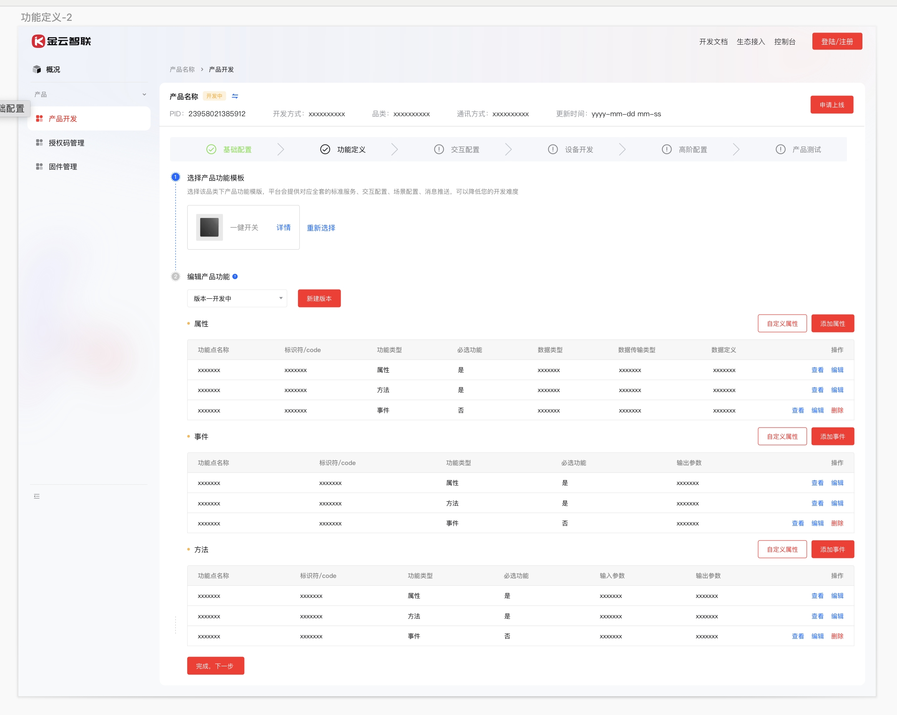
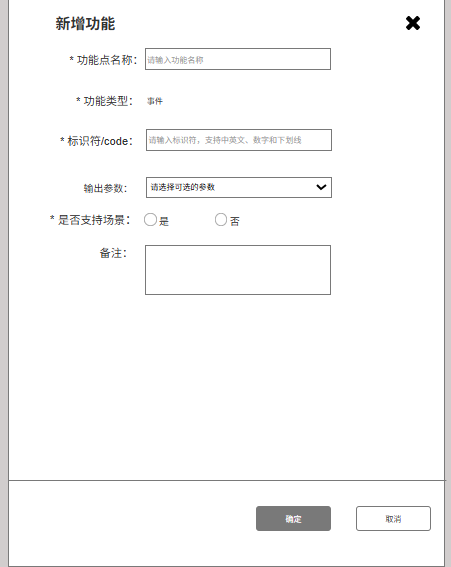

# 产品接入系统上线需求—3\.0

**原型：**

https://modao\.cc/axbox/share/orZxGKHRt05e9ogahMWo67

**蓝湖：**

https://lanhuapp\.com/web/\#/item/project/stage?tid=9af5cade\-5f03\-46be\-93df\-a4e5f2239076\&pid=ee3ed853\-77b8\-4e76\-90df\-6217d93cf85d

# 一、新增需求

## 场景联动

1. 自动化场景分为触发条件、执行动作

2. 自动化类型分为：标准、自定义

    1. 标准：标准自动化场景触发条件由平台根据产品功能定义自动生成

    2. 自定义：用户根据自己需求自定义自动化

3. 触发条件：由【属性】、【事件】组成

4. 执行动作：由【属性】、【方法】组成

5. 触发属性/事件、执行属性/方法：默认显示对应的属性/事件/方法的标识符，并标明是哪个功能类型

    1. 属性的场景权限满足【仅触发】 or 【可触发可执行】其一，即可作为触发条件

    2. 事件的场景权限为【是】，即可作为自动化触发条件

    3. 属性的场景权限满足【仅执行】 or 【可触发可执行】其一，即可作为自动化执行动作

    4. 方法的场景权限满足【是】，即可作为自动化执行动作

6. 触发范围

    1. 触发属性

        1. 整数型/浮点型，默认是属性的取值范围

        2. 枚举型，默认是列举其全部的枚举值，每一个枚举对应一个自动化触发条件

    2. 触发事件

        1. 输出参数为空时，则为空；

        2. 输出参数为数值型（整数or浮点型），则显示其取值范围

        3. 输出参数为枚举型，则需要预定义其选项

        4. 输出参数为字符串型，触发范围为字符长度的范围

7. 执行范围

    1. 当是执行属性时

        1. 整数型/浮点型，默认是属性的取值范围

        2. 枚举型，默认是列举其全部的枚举值，每一个枚举对应一个自动化执行动作

    2. 当是执行方法时

        1. 输入参数、输出参数为空时，执行范围则为空

        2. 当输入参数为枚举型时，执行范围为用户配置的枚举值

        3. 当输入参数为数值型时，执行范围为数值的取值范围

        4. 当输入参数为字符串型，执行范围为字符长度的范围

8. ~~是否支持本地~~

    1. ~~属性、方法支持本地多控，事件不支持~~

9. 状态

    1. 分为【开发中】、【审核中】、【已上线】

    2. 该自动化被创建就默认显示为【开发中】，用户已开发完成，提交【发起上线】，状态变成【审核中】，后台审核通过，即为【已上线】，审核不通过变为【开发中】

    |    状态|    操作权限||
    |---|---|---|
    ||    标准自动化|    自定义|
    |    开发中|    查看，编辑（限自动化名称）|    查看、编辑、删除|
    |    审核中|    查看|    查看|
    |    已上线|    查看|    查看|

10. 操作

    1. 查看、编辑、查看原因（申请上线后被驳回才显示）、删除

        1. 点击【查看】，可以查看自动化场景详情

        2. 点击【编辑】，可以编辑详情

        3. 查看原因，发起上线后被驳回后，可以点击【查看原因】查看被驳回的原因

    2. 标准化场景联动不能删除

    3. 自定义场景联动处于开发中可以删除

### 标准自动化

*根据功能定义自动生成，可以查看、编辑、不可删除*

1. **标准自动化名称命名默认规则**

    1. 整数型/浮点型/字符串型

        1. 自动化名称=属性的功能点名称

        2. 例：整数型属性为呼吸率，自动化名称默认为呼吸率

    2. 枚举型

        1. 自动化名称=触发范围（枚举名称）\+属性的功能点名称

        2. 例：枚举型的属性名称为常开模式，触发范围确定是【1—打开】，自动化名称默认为【打开常开模式】

    3. 事件

        1. 自动化名称=事件的功能点名称

        2. 例如：若触发范围为空，则只展示事件的功能点名称，默认为【开锁】

    4. 方法

        1. 自动化名称=方法的功能点名称

        2. 例如：方法的功能点名称为远程开锁，自动化名称默认为【远程开锁】

- 可自动生成标准自动化的功能范围：产品功能模板内的功能点

- 切换功能模板，对应的场景联动跟随变动

#### **触发条件**

1. 触发属性/事件覆盖范围

    1. 属性：*整数型/浮点型/枚举型/字符串型*

    2. 事件：无参事件

2. 标准化触发属性/事件自动生成条件

    1. 属性的场景权限满足【仅触发】 or 【可触发可执行】其一，即可作为自动化触发条件

    2. 事件的场景权限为【是】，即可作为自动化触发条件

3. 功能类型：根据功能点标识符，显示对应的功能类型

4. 触发范围

    1. 整数型/浮点型，默认是取值范围

    2. 枚举型，默认是列举其全部的枚举值，每一个枚举对应一个自动化触发条件

    3. 事件，默认：无参数即为空

5. ~~本地多控~~

    1. ~~属性支持本地多控，事件不支持~~

6. 自动化类型：默认为标准

7. 状态：开发中、审核中、已上线

8. 查看、编辑

    1. 点击【查看】，可以查看自动化详情

    2. 点击【编辑】，可调整自动化场景

        1. 标准化自动化，只可修改自动化名称

#### **执行动作**

9. 标准执行属性/方法覆盖范围

    1. 属性：整数型、浮点型、字符串、枚举型

    2. 方法：无参方法

10. 标准执行属性/方法自动生成条件

    1. 属性的场景权限满足【仅执行】 or 【可触发可执行】其一，即可作为自动化执行动作

    2. 方法的场景权限满足【是】，即可作为自动化执行动作

11. 功能类型：根据功能点标识符，显示对应的功能类型

12. 执行范围

    1. 整数型/浮点型，默认是取值范围

    2. 枚举型，默认是列举其全部的枚举值，每一个枚举对应一个自动化执行动作

    3. 方法，默认：无参数即为空

13. ~~本地多控~~

    1. ~~属性和方法均支持~~

14. 状态

    1. 开发中、审核中、已上线

15. 查看、编辑

    1. 点击【查看】，可以查看自动化详情

    2. 点击【编辑】，可调整自动化场景

        1. 标准化自动化，只可修改自动化名称

    3. 标准自动化不允许删除

### **自定义自动化**

1. 用户新建的自动化，提交时需要做重复校验，不能与已有自动化重复，如果重复，则创建失败，需提示：该自动化已存在，您无需再创建。

2. 自定义自动化支持查看、编辑、删除

#### 自定义触发条件

前提交互条件

1. 点击【新建自动化】，显示新增自动化的弹窗

**新建自动化页面**

1. 自动化类别：触发条件/执行动作，单选，必选

    1. 默认显示为：触发条件

2. 触发属性/事件

    1. 场景权限满足【仅触发】 or 【可触发可执行】的属性（*整数型/浮点型/枚举型/字符串型*）

    2. 场景权限为【是】的事件

    3. 下拉单选，下拉框内容显示格式为：功能点标识符—功能点名称

3. 自动化名称

    1. 必填，自定义中文，长度不超过20个字符

4. 当用户选择对应的触发属性/事件时，才显示出对应的触发范围

5. 功能类型：根据功能点标识符，显示对应的功能类型

6. 触发范围

    1. 若选择的是属性

        1. 枚举型：显示下拉选择框，单选

            1. 下拉选择框为：枚举值及对应备注

            2. 用户需要选择哪一个枚举值作为触发条件

        2. *整数型/浮点型：显示其取值范围*

        3. 字符串型：显示字符长度范围

    2. 当选择的是事件

        1. 若无输出参数，关联参数显示“—”

        2. 若有一个输出参数，显示【新增参数】的按钮，不是必填，用户可以点击新增，来定义其输出参数

            1. 点击新增后，则必须完善关联参数和触发范围

                1. 输出参数为*整数型/浮点型，显示其取值范围*

                2. 则根据其输出参数的属性进行显示

                3. *整数型/浮点型：显示其取值范围*

                4. 枚举型：支持多选（提示：满足任一条件），例如开锁

                5. 字符串型：给出字符长度范围

        3. 若有大于1个的输出参数，显示【新增参数】的按钮，不是必填，用户可以点击新增，来定义其输入参数

            1. 点击新增参数后，则必须完善关联参数和触发范围

            2. 当新增大于1个的参数后，需要选择是满足所有条件，还是任一条件即可

            3. 关联参数的最大数量是该事件已经关联的参数数量

7. 必填项完成后，点击【完成】，这时需要校验该自动化是否已存在

    1. 若不存在，则自动化创建成功

    2. 若校验已存在，则提示：该自动化已存在，您无需再创建。

#### **自定义执行动作**

前提交互条件

1. 点击【新建自动化】，显示新增自动化的弹窗

**新建自动化页面**

1. 自动化类别：触发条件/执行动作，单选，必选

2. 执行属性/方法

    1. 场景权限满足【仅执行】 or 【可触发可执行】其一的属性

    2. 场景权限满足【是】的方法

3. 功能类型：根据选择的功能点标识符，显示对应的功能类型

4. 自动化名称

    1. 必填，自定义中文，长度不超过20个字符

5. 当用户选择了属性/方法时，才显示出对应的执行范围和本地多控权限

6. 执行范围

    1. 若选择的是属性

        1. *整数型/浮点型：显示其取值范围*

        2. 枚举型：显示下拉选择框，单选

            1. 下拉选择框为：枚举值及对应备注

            2. 用户需要选择哪一个枚举值作为执行动作

        3. 字符串型：给出字符长度范围

    2. 当选择的是方法

        1. 若无输入参数、输出参数，关联参数显示“—”

        2. 当有1个参数时，关联参数显示【新增参数】

            1. 新增参数不是必填，用户可以点击新增，来定义其输入参数

                1. 点击新增后，则必须完善关联参数和触发范围

                2. 输入参数为*整数型/浮点型，显示其取值范围*

                3. 枚举型：支持多选（满足一个即可）

                4. 字符串型：给出字符长度范围

        3. 当有多于1个时，关联参数显示【新增参数】

            1. 新增参数不是必填，用户可以点击新增，来定义其输入参数

                1. 点击新增参数后，则必须完善关联参数和触发范围

                2. 当新增大于1个的参数后，需要选择是满足所有条件，还是任一条件即可

                3. 关联参数的最大数量是该事件已经关联的参数数量

**重复项校验**

1. 用户新建的自动化，提交时需要做重复校验，不能与已有自动化重复，如果重复，则创建失败，需提示：该自动化已存在，您无需再创建。

2. 校验规则

    1. 触发属性：校验属性code和触发范围

        1. 例：关联同一个属性，触发范围不能相同

    2. 触发事件：校验事件ccode、关联参数、关联参数的触发范围

        1. 例：若有参事件只关联了同一个参数，则其触发范围则不能有交集

        2. 例：若有参事件关联了两个及以上的参数，满足条件为任一参数触发，每个参数的触发范围不能有交集

    3. 执行属性：校验属性code和执行范围

    4. 执行方法：校验方法code、关联参数、关联参数的执行范围

        1. 例：若有参方法关联了同一个参数，则其执行范围则不能有交集

**自动化场景与功能点保持同步**

1. 自动化场景关联的功能点改变，则其同步修改调整其执行范围

2. 若关联功能点被删除，则该条自动化同步删除

### **自动化发起上线**

1. 场景联动不是必配的功能，所以可单独发起上线

2. 用户使用app进行自测后，可进行点击【发起上线】，场景信息同步到SaaS，且支持在管理后台对标准自动化和自定义自动化场景进行审核

3. 后台审核

    1. 用户在开放平台点击【发起上线】后，后台接收此条审核纪录

    2. 后台对该产品的场景联动进行审批，审批通过的自动化场景立刻上线，审核不通过的自动化返回开发中，并反馈不通过的原因给到开放平台的开发者

4. 用户可针对还处于开发中的自动化场景进行修改，再申请上线；已经上线的自动化场景无法修改、无法删除

5. 支持重复提交上线，支持有开发中的自动化场景再提交上线审批

6. 【审核中】状态下的场景，在智居app中只允许公司企业用户作为内测账号去使用

7. 【已上线】状态下的场景，在智居app中允许暴露给正常用户

## 自定义功能点

必选、非必选、自定义

### 自定义属性

自定义属性均默认为“自定义”，做数据隔离，不要存储在后台功能点模块

1. 功能点名称：属性/事件/方法功能的名称或描述，中文，20个字符内，不做唯一性校验

2. 功能类型：属性

3. 标识符/code：属性/事件/方法，简单的描述

    1. 支持小写英文、数字、下划线、20个字符内

    2. 唯一性校验

4. 数据类型：整数型、浮点型、字符串型、枚举型（枚举值做唯一值校验）

5. 数据传输类型：可下发可上报、只上报、只下发

6. 场景权限：可执行可触发，可触发、可执行，不可执行不可触发

### 自定义事件

自定义事件均默认为非必选功能，自定义

1. 事件由输出参数组成，输出参数由属性构成。

2. 事件的功能名称自定义，中文，20个字符内，不做唯一性校验

3. 标识符/code： 支持小写英文、数字、下划线、20个字符内，做唯一性校验

4. 是否支持场景：是or否，单选，必选

5. 输出参数个数：≥0

6. 输出参数的可选范围：只能从已有的属性功能点作为参数值

    1. 设备上报事件传回的属性参数

7. 备注：100字符以内

### 自定义方法

1. 方法是由输入参数、输出参数组成，输出和输入由属性构成。

2. 事件的功能名称自定义，中文，20个字符内，不做唯一性校验

3. 标识符/code： 支持小写英文、数字、下划线、20个字符内，做唯一性校验

4. 是否支持场景：是or否，单选，必选

5. 输入参数个数：≥0

6. 输入参数的可选范围：只能从已有的属性功能点作为参数值

    1. 方法的入参，第三方调用平台指令的参数

7. 输出参数个数：≥0

8. 输出参数的可选范围：只能从已有的属性功能点作为参数值

    1. 输出参数：平台给第三方的数据反馈

9. 备注：100字符以内

***编辑自定义功能点不能修改数据类型***

## 需求优化

1. 场景联动申请上线的前提条件是：该产品已上线

    1. 申请上线【场景联动】前，请先确认其所属产品状态为“已上线”

2. 根据自定义功能点创建的场景联动

    1. 若删除自定义功能点，则提示：此功能点已关联自动化场景，删除功能点将同时删除其关联的自动化场景，请谨慎操作

    2. 若编辑自定义功能点，则提示：此功能点已关联自动化场景，若修改，则关联的自动化场景失效，请谨慎操作

        1. 对应的场景联动显示一个【已失效】标识，提醒用户删除失效自动化场景

3. 产品功能模板内的功能点创建的场景联动

    1. 必选功能下的场景联动，无影响

    2. 非必选功能点下的场景联动，只可删除，删除时提示：此功能点已关联自动化场景，删除功能点将同时删除其关联的自动化场景，请谨慎操作

