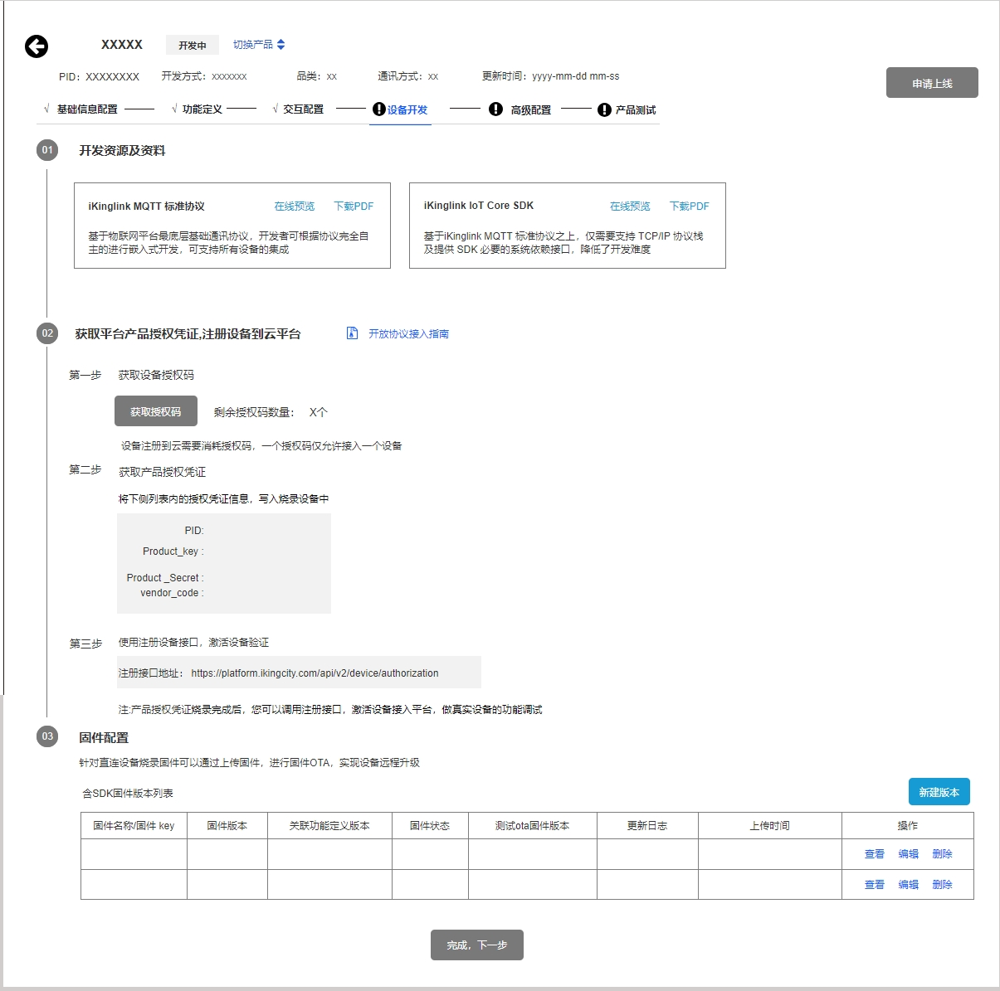
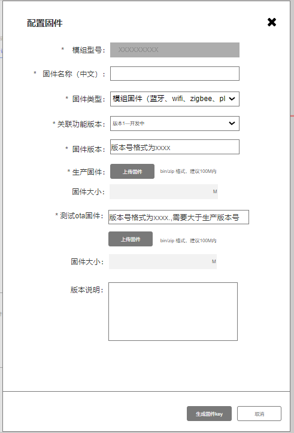

# 产品接入系统功能需求说明 

# 前言

# 一、 版本信息

版本号：1\.0

创建日期:2025\-03\-03

审核人

# 二、 变更日志

|**时间**|**版本号**|**变更人**|**主要变更内容**|
|---|---|---|---|
|3\.20|1\.0|崔梁雨|初版|
|3\.24|1\.1|崔梁雨|调整基础配置、功能定义、设备开发（云云接入）、产品测试功能需求|
|3\.30|1\.2|崔梁雨|完善云云接入、高级配置、实验室测试需求|

# 三、 需求背景

## 现状简介

- 硬件直连接入

- 硬件能力接入

1. 用户需要手动输入设备接入平台的功能需求，诉求表达不明确

2. 硬件接入的流程不清晰

3. 硬件接入智能化没体现

## 规划目标

- 硬件接入结合AI，结合智能设备开发方案，完成智能设备接入全流程配置

- 接入设备类型： 普通设备，网关设备，网关子设备

- 硬件接入方式：模组对接，协议直连、云云接入

    1. 模组固件接入（免开发）：金云提供模组固件，无需进行固件开发

    2. 模组\+sdk：金云模组\+SDK，基于公司提供的软件开发工具包（SDK），开发者可以将其智能设备接入公司的生态系统，并通过协议实现设备与金云App、网关等平台的互联互通

    3. 开放协议接入：iKinglink AIoT开放平台基于 MQTT 的对接协议，为平台统一对外开放提供的对接协议。根据开发灵活度由高到低，分为 iKinglink MQTT 标准协议和 iKinglink IoT Core SDK。开发者可自主选择协议中的一种或两种，用以集成设备接入。

        1. iKinglink MQTT 标准协议

            1. 平台开放的 MQTT 底层标准协议，包含设备上下线、设备属性及其动作上、下发等基础协议。开发者可根据需求进行 SDK 封装，最大程度地支持各行各业的设备接入涂鸦开发者平台。适用于对内存空间有特殊要求的设备场景。

        2. iKinglink IoT Core SDK

            1. 基于iKinglink MQTT 标准协议使用 C 语言实现，支持金云物模型协议，适用于开发者自主开发硬件设备逻辑业务，以接入iKinglink AIoT开放平台。SDK 不依赖具体设备平台及操作系统环境，就能够在单任务环境运行。仅需要支持 TCP/IP 协议栈及提供 SDK 必要的系统依赖接口，即可完成接入。

    4. 云云接入：支持三方业务系统通过协议接口的方式，将成熟的设备生态融入金云生态（设备云云）

- 实现产品接入流程智能化、简洁化

    - 智能化

        - 接入ai，可回答并解决用户使用中遇到的疑惑

        - ai智能分析用户诉求和产品技术文档，预先完成部分产品接入流程配置，节省部分流程的填写时间

        - ai辅助云云接入，分析用户诉求，结合用户选择的产品配置等，自动生成该产品物模型，供开发人员参考

    - 简洁化

        - 接入流程清晰展示给用户，一站式创建智能产品

# 四、 需求范围

> **更新中**
> 
> 

P0：产品接入系统一期任务

P1：产品接入系统二期任务

P2：产品接入系统三期任务

# 五、 功能详细说明

## 交互原型图

> https://modao\.cc/axbox/share/QfSf2eD7sto3jdFyLjyM9b
> 
> 

## 统一说明

1. 开放接入产品类型

    IoT 平台目前已经支持且开放了105个产品品类，供开发者按需选择，详情参见下表开放支持的产品品类

    |    产品类型|    包含产品|
    |---|---|
    |    插座开关|    开关、无线开关、场景开关、插座插排、插卡取电器、继电器控制器、控制面板、空调面板、继电器、插座、|
    |    网关路由|    路由器、网关、Wi\-Fi 信号放大器、边缘网关|
    |    照明|    灯、筒射灯、灯泡、恒流驱动器、恒压驱动器|
    |    传感器     |    人体传感器、温湿度传感器、烟雾传感器、燃气传感器、水浸传感器、窗磁/门磁、红外幕帘传感器、声光报警器、风速传感器、气象多要素传感器、 雨雪传感器、液压传感器、开窗器、光照传感器、压力传感器、气象传感器、风向传感器、液位传感器|
    |    家居安防|    门锁、摄像机、可视门铃、门铃、报警器、水表、电表、阀门控制器、空气断路器、门禁、电梯|
    |    厨房电器|    电磁炉、洗碗机、抽油烟机、电饭煲、冰箱、电热水壶、咖啡机、净水器、微波炉、烤箱、榨汁机|
    |    影音娱乐|    音箱、中控屏、电视机、网络视频录像机、视频对讲|
    |    环境电器|    空气净化器、电风扇、新风机、空气检测仪、加湿机、电暖器、温控器、环境检测仪、水质检测仪、空调插座|
    |    家居生活|    空调、马桶、晾衣架、热水器、浴霸、床、窗帘电机、卷帘电机、时钟、打印机、窗帘、体重秤、地暖、中央空调、床垫、|
    |    清洁电器|    洗衣机、扫地机器人、杀菌灯|
    |    健康运动|    血压计、睡眠监测仪、跌倒报警器、工牌、健康监测机、按摩椅、椅子、枕头|
    |    其他|    红外遥控、边缘超脑、遥控器、中央空调通道、DTU模块、浮球、雾化玻璃、家庭网络存储|

2. 产品开发流程：创建产品—基础配置—功能定义—交互配置—设备开发—高级配置—产品测试—申请上线

3. 产品ID隐藏，用产品model号显示

4. 开发状态：开发中、送审中、测试中、测试未通过、测试通过未上线、上线审核中、已上线

    1. 开发中：产品创建完成，产生model号后，则该产品处于开发中

        1. 产品配置均可修改、产品可删除、产品开发首页操作列显示“继续开发”

    2. 送审中：产品开发完成，提交测试预约后，开始测试前，状态由开发中转为送审中

        1. 该产品版本配置不可修改，产品不可删除，产品开发首页操作列显示“开发详情”

    3. 测试中：产品处于测试中

        1. 产品配置不可修改，产品不可删除，产品开发首页操作列显示“开发详情”

    4. 测试未通过：测试反馈为不通过，则开发状态变为测试未通过

        1. *产品配置可修改，产品可删除，产品开发首页操作列显示“重新开发”*

    5. 测试通过未上线

        1. 本版本的产品配置不可修改，产品不可删除，产品开发首页操作列显示“开发详情”

    6. 上线审核中

        1. 申请上线版本的产品配置不可修改，产品不可删除，产品开发首页操作列显示“开发详情”

    7. 已上线

        1. 已上线版本的产品配置不可修改，产品不可删除，产品开发首页操作列显示“开发详情”

## 功能说明

### 产品开发首页P0

1. 筛选产品

    1. 触发条件：点击【筛选器】，显示筛选器弹窗

    2. 筛选范围：【品类】、【开发状态】、【开发方式】、【通讯方式】、【设备类型】

        1. 品类：显示列表中所包含的所有一级、二级品类

        2. 开发状态：显示列表中所包含的所有开发状态

        3. 开发方式：显示列表中所包含的所有开发方式

            1. 四种类型：免代码开发、模组SDK接入、开放协议接入、云云接入

        4. 通讯方式：显示列表中所包含的所有通讯方式

            1. wifi、wifi\+蓝牙、4G、RS485、zigbee、wired、PLC、NB\-IOT、以太网

        5. 设备类型：显示列表中所包含的所有设备类型

            1. 普通设备、网关设备、网关子设备

2. 排序方式：创建时间倒序（默认）、创建时间正序、更新时间倒序、更新时间正序

3. 搜索产品：支持产品model、产品名称、产品型号输入模糊搜索

4. 下载产品信息

    1. 点击【下载】，下载列表创建的所有产品信息

        1. 下载文件为Excel格式

        2. 表格信息包括：产品名称、产品ID、产品状态、产品品类、产品型号、通讯协议、开发方式、设备类型、创建时间、更新时间、详情页URL、硬件模组、固件类型、固件id

5. 创建产品入口：点击【创建产品】，进入创建产品的流程

6. 创建的产品列表

    1. 从未上线过产品的企业，创建产品的数量上限为 40 个，开发者可以删除无用产品后继续创建；只要企业上线过 1 个产品则无数量限制

    2. 产品列表显示每10条分页

    3. 产品信息：展示产品图片、产品名称、产品品类

        1. 产品图片显示：当用户还未上传时，显示默认的拟物图

        2. 产品名称：最多只能显示15个字符

        3. 产品品类：显示二级品类名称

    4. ~~产品ID：PID~~

        1. ~~PID生成规则：20个字符之内生成随机的字符~~

        2. ~~PID必须全局唯一，避免重复~~

        3. ~~PID不展示在页面~~

    5. 开发方式：免代码开发、 模组SDK接入、开放协议接入、云云接入

    6. 产品型号：根据用户输入内容显示

    7. 通讯方式：wifi、wifi\+蓝牙、4G、RS485、zigbee、wired、PLC、NB\-IOT、以太网

    8. 设备类型：普通设备、网关设备、网关子设备

    9. 开发状态：开发中、送审中、测试中、测试未通过、测试通过未上线、上线审核中、已上线

    10. 创建时间：yyyy\-mm\-dd hh\-mm\-ss

    11. 更新时间：yyyy\-mm\-dd hh\-mm\-ss

    12. 操作列

        1. 继续开发 OR 开发详情

            1. 当产品状态：送审中、测试中、测试通过未上线、上线审核中、已上线，【继续开发】变为【开发详情】

            2. 开发中、测试未通过，显示继续开发

        2. 删除

            1. 点击【删除】，显示【删除确认】弹窗

            2. 开发中、测试未通过状态下的产品可以删除；送审中、测试中、测试通过未上线、上线审核中、已上线不可删除

            3. 该产品上线后，不支持删除

### 创建产品 P0

- 创建产品步骤分为三步：①选择创建的产品类别 ②选择产品智能化方式 ③完善产品信息

- 平台支持开发方式：免代码开发、 模组SDK接入、开放协议接入、云云接入

目前免开发方案、模组SDK开发方案仅支持部分品类，当用户选择品类后，会对应显示平台能做的开发方式

1. 选择创建的产品类别

    1. 产品类别为单选项，必选项

    2. 分类：标注类目

        1. 产品类目分为：目前以一级、二级产品类别分组

        2. 产品类目表：

        [产品类型分类](https://ikinglink.feishu.cn/sheets/NeMRsy0qEhdYEqten6Ecfk7Snnf?from=from_copylink)

2. 选择智能化方式

    1. 前提条件：已选择产品品类

    2. 智能化方式为单选项

        1. 免开发接入：适用于采用金云提供硬件模组、App及配套服务，无需代码开发

        2. 模组SDK接入：适用于采用金云硬件模组和SDK将设备智能化，接入金云IoT

        3. 开放协议接入：适用于采用自研模组，基于平台开放的 MQTT 底层标准协议/SDK接入金云IoT

        4. 云云接入：适用于成品智能设备通过Open API方式融入金云IoT

3. 完善产品信息

    根据选择的产品品类、智能化方式，展示特定需要完善的产品信息

    1. 产品名称：60个字符内，不允许带标点符号和空格，中文、英文、数字，必填，企业内唯一

        1. 提示：产品名称请与产品销售渠道、产品说明书上的产品名称保持一致

    2. 产品型号：支持小写字母或数字，6字符之内，必填

        1. 不能与本企业组同品类下的其他产品型号重复，产品创建成功后不可更改

    3. 设备类型：普通设备、网关设备、网关子设备

        1. 免开发、 模组SDK接入：普通设备、网关子设备

        2. 开放协议接入、云云接入：普通设备、网关设备、网关子设备

    4. 产品描述：最多200字符

4. 三步完成后，点击【创建产品】，创建产品成功，获取产品PID、产品model号

    1. 产品model组成：企业标识（3\-6位，数字字母、客户自定）\+品类（二级品类英文，自定义30位）\+产品型号（6位，客户自定） 

    2. 企业标识在企业注册账号的时候已经确定

### 产品信息统一显示

1. 展示要素：产品名称、开发状态、切换产品按钮、PID、开发方式、品类、通讯方式、更新时间、开发模块tab栏

    1. 更新时间：最新编辑的时间

    2. 点击【切换产品】，可以来回切换不同已创建的产品

2. 开发模块tab栏

    1. 开发流程：①基础配置 ②功能定义③交互配置④设备开发 ⑤高级配置⑥产品测试⑦申请上线

        1. 基础配置、功能定义、交互配置、设备开发、产品测试是必做项，高级配置内有必做项、选做项，完成必选项，通过产品测试才可申请上线产品

    2. 未完成的开发模块用【！】标识表示未完成；完成的开发模块用【√】标识表示已完成

    3. 在前提开发流程没完成的情况下，之后的开发流程无法选中

        1. 基础配置完成：必填信息已完成，点击【完成，下一步】校验是否已完成必填信息，校验通过即完成

        2. 功能定义完成：选择了功能模板，已选择必选功能，点击【完成，下一步】校验，校验通过即完成

        3. 交互配置：功能定义完成，该模块就完成

        4. 设备开发：①涉及到模组，已配置模组固件 ②协议直连or云云，已注册设备，点击【完成，下一步】校验通过即完成

        5. 高级配置：必配模块已完成，校验通过即完成

        6. 产品测试：最近申请的产品测试预约单已通过产品测试，校验通过即完成

3. 点击【←】，返回产品开发首页

### **基础配置P0**

1. 前提条件：已创建产品

2. 已创建产品后：~~PID、~~开发方式、产品model、所属品类、产品型号、通讯方式、设备类型即确定，不可编辑

3. 需要补充的产品基本信息：产品名称、配网方式、所属企业品牌（选填）、产品拟物图、详情页扩展图片、配网文案

    1. 输入框长度校验

        1. 产品名称：60字符之内，中文、英文、数字，必填，不允许带标点符号和空格，企业内保证唯一性

        2. 所属企业品牌：20字符之内，下拉选择

4. 上传产品拟物图

    1. 平台会上传一张产品品类的默认图，用户可以进行删改

    2. 图片格式：1080\*1080，2MB之内，透明底、一张即可

    3. 用户可以定义详情页扩展图，使用产品拟物图或自定义上传图片

    4. 用户可以使用平台背景处理工具，将图片修改为透明底

5. 配网引导配置

    1. 网关

    2. 热点名称

    3. 蓝牙名称

    5. 上传配网引导图

        1. 图片格式：1080\*1080，2MB之内，透明底、一张即可

        2. 配网文案：200字符之内

    6. 选择配网方式

        1. 根据不同的通讯方式，对应不同的配网方式

            1. 通讯方式为PLC、zigbee的产品，配网主要是与PLC网关或者zigbee网关建立连接，对的配网方式即为确定项：PLC子设备配网、zigbee子设备配网

            2. 配网方式（一期目标）

            [配网方式汇总](https://ikinglink.feishu.cn/docx/XYBkdWN94ov8ukxoQQncDgnan0f?from=from_copylink)[设备配网类型](https://ikinglink.feishu.cn/sheets/IRUWsH0qrhvf3gtAj2Nc4mSynch?from=from_copylink)

6. 点击【完成，下一步】，保存填写内容，校验必填项，校验通过跳转到【功能定义】页面

7. 点击【保存】，不跳转页面，只保存填写内容

8. 不点击【保存】的前提下，点击tab项进行切换，保存用户填写的内容

### 功能定义P0

1. 前提条件：已创建产品、完成基础配置

2. 产品功能模板

    1. 结合产品配置的通讯方式、品类、设备类型显示产品功能模板

    2. 产品功能模板内包括必选功能、非必选功能

        1. 点击【详情】跳转到文档中心的功能定义模块，查看选择功能模板的文档说明

3. **编辑产品功能**

    1. 选择产品功能模板后，功能点列表默认只显示必选功能，非必选功能需要点击【添加属性/事件/方法】添加

    2. 功能版本：版本1—开发中

        1. 第一版默认为：版本1

        2. 功能定义默认状态为 "开发中"，如果产品或固件申请测试上线会将功能定义状态自动变成 "审核中"，产品或固件审核通过功能定义状态会变成 "已上线"

    3. 属性功能

        1. 功能点列表：功能点名称、标识符/code、功能类型、必选功能、数据类型、数据传输类型、数据定义、操作

            1. 功能点名称：属性，名称或描述，中文，20个字符内，不做唯一性校验

            2. 标识符/code：属性简单的描述，支持小写字母、数字、下划线、20个字符内，唯一性校验

            3. 功能类型：属性

            4. 必选功能：功能分为该产品必备的基础功能即为必选功能、非必需功能称为非必选功能

                1. 必选功能：选择产品功能模板后，其必选功能则确定，不可删除

                2. 非必选功能：支持增加和删除

            5. 数据类型：整数型、浮点型**（原数值型分为整数型和浮点型）**、字符串型、枚举型

            6. 数据传输类型：可下发可上报、只上报、只下发

            7. 场景权限：可执行可触发，可触发、可执行，不可执行不可触发

            8. 数据定义：进一步明确功能点的数值取值范围、数值间距和单位

            9. 操作：查看、编辑、删除

                1. 必选功能支持查看、不支持编辑、删除

                2. 非必选功能支持查看、编辑、删除

                    1. 标识符、功能类型、必选功能、数据类型不可编辑

4. 添加属性功能弹窗

    1. 只显示选择的产品功能模板内的非必选功能点

    2. 支持多选，添加到功能点列表后，可以对功能点编辑修改

    3. 免开发接入方式下不支持自定义功能

5. 编辑功能，根据不同类型，可编辑内容不同

    1. 前置条件：已经添加到产品功能列表内

    2. 编辑属性功能

***事件功能***

1. 选择产品功能模板后，功能点列表默认只显示必选功能

    1. 列表字段：功能点名称、标识符、功能类型、必选功能、输出参数（属性标识符\+名称）、操作

    2. 输出参数由属性组成，列表输出参数显示内容：标识符—名称

2. 添加事件功能（套用模板）

    - 点击【添加事件】，显示添加事件的弹窗

    - 支持多选，点击选择按钮，即可添加到事件列表中，弹窗内这条即清除

    - 弹窗内展示：

        1. 产品功能模板内配置的事件

        2. 需要判断输出参数是否为空

            1. 为空，则不需要判断其关联属性，直接显示在该弹窗内

            2. 不为空，需要判断该事件的输出参数（属性）是否已被用户添加，用户没有添加此属性功能，则不展示这条事件。

3. 编辑事件功能

    1. 只支持修改事件的名称

    2. 中文，20个字符内，不做唯一性校验

4. 查看事件详情

***方法功能***

1. 选择产品功能模板后，功能点列表默认只显示必选功能

    1. 列表字段：功能点名称、标识符、功能类型、必选功能、输入参数（属性标识符\+名称）、输出参数（属性标识符\+名称）、操作

    2. 输出参数由属性组成，列表输出参数显示内容：标识符—名称

2. 添加方法功能（套用模版）

    - 点击【添加方法】，显示添加方法的弹窗

    - 支持多选，点击选择按钮，即可添加到方法列表中，弹窗内这条即清除

    - 弹窗内展示：

        1. 产品功能模板内配置的方法

        2. 判断该方法的输出参数（属性）、输入参数（属性）是否为空

            1. 若输出参数、输入参数都为空，则直接展示

            2. 若不为空，则需要判断输出参数（属性）、输入参数（属性）对应的属性点是否已被用户添加，用户没有添加此属性功能，则不展示这条方法

3. 编辑方法功能

    1. 只可修改方法的名称

    2. 中文，20个字符内，不做唯一性校验

4. 查看方法详情

**自定义功能（P2）**

1. 若提供的功能点模板内，没有满足用户需求，用户可进行自定义功能

2. 只有模组\+sdk接入、开放协议接入、云云接入这3种接入方式可以自定义功能，免开发方案不能自定义功能

5. 功能迭代（P2）

    1. 功能定义上线后，如需迭代功能：点击【新建版本】，创建功能定义版本：版本2—开发中

        1. 新版本自动复制原版本的功能定义，开发者可在此基础上

            1. 添加新功能

            2. 对原（已上线）版本修改描述、备注，以及单位从“无”改为有单位，为数值列表属性增加数值

    2. 对应也需要同步配置版本2的固件版本

### 交互配置P0

1. 前提条件：已完成创建产品、基础配置、功能定义

2. 根据产品品类、功能点配置对应的通用详情页样式

3. 编辑面板：调整组件的位置和主题色彩 P2

4. 搭建详情页品类动态组件库，根据品类、功能能定制化推荐详情页模版  P2

### 设备开发 P0

#### 开放协议直连接入 P0

前提条件：创建产品，完成基础配置、功能定义

1. 开发资源及资料

    1. 点击【开放协议接入指南】，跳转显示开放协议接入指南文档说明

    2. 提供iKinglink MQTT 标准协议和iKinglink IoT Core SDK两种类型的开发资料

        1. 开发资料可在线查看、下载

2. 产品授权凭证

    1. product\_key：base64\(model\_code\)

    2. product\_secret：随机字符串

    3. Vendor\_code：厂商编码

3. 注册设备

    - 管理通过开放协议接入、云云接入的设备，通过申请获取授权码数量并分配到对应产品进行消耗

    - 一个设备注册到IoT平台，需要消耗一个授权码获取到设备授权凭证，设备开发时，需将设备授权凭证信息烧录至设备并连网激活，设备才能成功接入开发者平台

    第一步：获取设备授权码

    1. 注册设备到云平台，需要消耗授权码，一个设备接入消耗一个授权码

    2. 当授权码数量不足接入平台的设备数量时，请点击【免费获取授权码】，可选择申请设备接入授权码的数量

    3. 提交申请后，后台进行审核通过下发

    ~~第二步：注册设备~~

    1. ~~使用产品PID、授权码、注册ID，去注册设备~~

        1. ~~注册ID为设备唯一标识码，开发者可手动输入，也可以不填，平台自动生成~~

        2. ~~设备唯一标识码可以是：mac地址、SN编码等~~

        3. ~~点击【注册】，获取设备key\+密钥，得到设备授权凭证~~

    2. ~~自动注册，不需要用户填写设备唯一标识码，输入需要注册的数量，点击注册，平台生成唯一标识码，自动生成授权凭证信息~~

    3. ~~批量注册，上传批量注册的设备唯一标识码文件，平台识别生成对应的设备授权凭证在下方的列表中~~

    第三步：~~设备验证~~

    1. ~~注册ID输入框~~

        1. ~~输入注册id查看设备状态，相当于筛选查询【授权信息列表】，列表筛选显示对应注册id的信息~~

    2. ~~授权凭证信息列表~~

        1. ~~设备成功注册到云平台后，获取授权凭证信息：注册ID、PID、device key、device secret 、device status~~

        2. ~~开发者将设备授权凭证的信息烧录到设备当中，并联网激活，通过注册ID验证设备设备激活状态~~

        3. ~~device status判断设备连入平台~~

            1. ~~设备在线、离线，则设备已成功接入平台~~

            2. ~~未绑定，则设备未接入平台~~

        4. ~~点击【复制】，可以复制注册ID号~~

4. **固件配置**

针对直连设备烧录固件可以通过上传固件，进行固件OTA，实现设备远程升级

**新建固件版本**

1. 点击【新建版本】，完成固件包的上传

2. 补充固件名称：中文，必填，最长32字符

3. 固件类型：含SDK固件

    1. 开发方式：开放协议接入

4. 关联功能版本

    1. 下拉选择已经创建的功能点版本，单选

5. 补充固件版本名称

    1. 生产固件版本号的命名规则：XX\.X\.X，其中X为 0\~9 数字，主版本号、次版本号、修订号；例如1\.0\.0

6. 补充测试ota固件名称

    1. 升级固件号的命名规则：需要大于生成固件版本号

7. 更新日志：最长100字符

    1. 为方便用户查看固件更新的信息，开发者上传硬件产品的固件后，需更新固件的日志

8. ~~固件key：固件唯一标识码，6位之内  ~~

9. 固件id代替固件key

**固件列表显示**

处于开发中或者测试中的固件不能

1. 展示固件名称/~~固件key~~，固件版本、关联功能定义版本、固件状态、测试ota固件版本、更新日志、上传时间、操作

    1. **固件状态：开发中、送审中、测试中、测试未通过、测试通过未上线、已上线、已下线**

    2. 上传时间格式：yyyy\-mm\-dd hh:mm:ss

2. 操作：查看、编辑、删除

    1. 开发中、测试未通过可以查看、编辑、删除

    2. 送审中、测试中、测试通过未上线、已上线可以查看

    3. 已下线可以查看、删除

#### 云云接入 P0

云云接入平台接入方式：open API接入

**前提条件**：已创建产品、基础配置、产品功能定义

1. 开发资源及资料

    1. 提供标准协议文件，开发资料可以查看、下载，协助开发者去适配我们提供的接口格式去做开发

2. 云云接入服务集成开发

    第一步：开通云云接入服务

    1. 需保证账号已经开通云云接入服务

    2. 若未开通，点击【开通服务】，跳转到【云云服务详情】则指引用户去开通设备接入服务，再授权产品到服务项目中

    3. 开通云云接入服务，产品默认已加入云云接入项目

    第二步：云云接入集成开发

    1. 开发者使用项目授权密钥、api文档，进行云云接入API集成开发，第三方通过我们提供的接口，进行设备属性上报

    第三步：确定消息回调地址

    1. 依据平台提供的协议文档，依据平台规则，输入且确认消息回调地址，通过该地址，平台向第三方平台下发指令和数据

3. 注册设备到云平台

    1. 授权码同理

    2. 使用云云接入的注册设备接口，进行设备注册

4. 在线调试

    1. 设备注册成功后，可以调用设备的open API接口进行在线调试，测试数据的上传下达

**云云接入服务**

包括：项目信息、API列表、已授权产品，点击【取消】，返回上一级

1. 项目信息

    1. 已开通服务

        1. 显示基本信息、授权密钥

        2. 服务状态，点击续订，可以延长一年使用期限，需要后台审核，审核通过则将服务延长一年

        3. 消息回调地址，输入之后，可以点击【验证服务器】进行验证，验证成功，消息回调地址才输入成功

    2. 修改消息回调地址

        1. 保存之后，若对消息回调地址再修改，可以点击【修改】再进行修改操作。

2. api列表

    1. 显示API接口名称、接口地址、接口文档、调试入口

3. 已授权的产品

显示model、产品名称、开发状态、设备数量、授权日期

设备数量：该产品model下，已经接入的设备数

授权日期：显示该产品创建的时间

#### 免开发方案 

直接采用金云提供的模组固件，不需要额外的开发

1. 前提条件：选择免开发方案开发方式、完成基础配置、功能定义

2. 流程：根据产品类型、通讯方式提供可适配的硬件，用户选择模组，再对选择模组申请采购试用

3. 硬件配置

    1. 展示模组型号、芯片类型、价格、操作列（先选择再采购）

        1. 点击【查看详情】可以查看模组更多具体的信息

    2. 采购申请提交后，一般在2个工作日内会给予回复，邮寄硬件设备

4. 固件设置

    1. 模组采购提交后，平台按照地址邮寄模组和发送固件版本，届时请上传平台提供的模组固件

    2. 点击【上传固件】，显示上传固件的页面

    3. 补充固件名称、固件类型、固件版本号、生产固件、版本说明

        1. 固件名称（中文）：必填，最长32字符

        2. 固件类型：模组固件（wifi、蓝牙、PLC、zigbee）、MCU固件

        3. 关联功能版本：下拉选择已经创建的功能点版本，单选

        4. 生产固件版本号的命名规则：xxxx，其中xxxx为 0\~9 数字，如1\.1

        5. 固件大小自动解析显示

        6. 版本说明：最长100字符

        7. 固件id：固件唯一标识码，6位之内

5. 资料下载：提供辅助开发者进行开发的指导文件

6. 采购申请

    1. 点击采购申请 or免费获取模组，跳转显示该弹窗页面

    2. 申请企业：即为当下选择的企业组，不需要手动输入

    3. 申请人：必填，长度不能超过32字符

    4. 手机号，必填，手机号格式校验

    5. 邮箱非必填

    6. 收货地址，必填，长度不能超过64字符

    7. 采购类型

        1. 开发测试、批量生产

        2. 优先显示开发测试

            1. 免费获取模组条件下确定为开发测试类型

    8. 产品ID：默认显示该产品ID 

    9. 模组类型：默认显示选择的模组类型

    10. 模组型号：默认显示选择的模组类型

    11. 采购套数

        1. 默认显示为2，不可填0和非整数

            1. 当填0时或者不填时，后方提示：“请输入大于0的整数”

        2. 当免费获取模组的时候，采购套数最多只能申请2套

            1. 当输入大于2的数值，后方提示：同一个产品id免费申请模组最多为2套

    12. 备注：选填，300字符以内

7. 查询采购进度

    1. 前置条件：点击【查询采购进度】跳转显示该页面

    2. 全部采购类型：开发测试、批量生产

    3. 全部采购状态：待发货、已发货

    4. 当后台邮寄快递时，会补充快递单号的信息

    5. 点击【查看】，显示采购详情页面弹窗

#### 模组sdk开发  

1. 前提条件：选择模组SDK接入开发方式、完成基础配置、功能定义

2. 流程：用户需要在这个页面，选择采购模组，上传固件

3. 硬件配置

    1. 展示模组型号、芯片类型、价格、操作列（先选择再采购）

        1. 点击【查看详情】可以查看模组更多具体的信息

    2. 采购申请提交后，一般在2个工作日内会给予回复，邮寄硬件设备

4. 免费获取模组

    1. 一个产品PID可以免费申请2套模组固件供测试使用，每个账号一共可以申请8套，当该产品or该账号下的免费次数用完时，文字提醒：免费领取次数已用完，【免费获取模组】置灰，不可点击

    2. 免费获取模组可点击的情况下，点击按钮，显示【免费领取模组】弹窗提示，点击【确定】，显示采购申请弹窗

5. 采购申请

    1. 点击采购申请 or免费获取模组，跳转显示该弹窗页面

    2. 申请企业：即为当下选择的企业组，不需要手动输入

    3. 申请人：必填，长度不能超过32字符

    4. 手机号，必填，手机号格式校验

    5. 邮箱非必填

    6. 收货地址，必填，长度不能超过64字符

    7. 采购类型

        1. 开发测试、批量生产

        2. 优先显示开发测试

            1. 免费获取模组条件下确定为开发测试类型

    8. 产品ID：默认显示该产品ID 

    9. 模组类型：默认显示选择的模组类型

    10. 模组型号：默认显示选择的模组类型

    11. 采购套数

        1. 默认显示为2，不可填0和非整数

            1. 当填0时或者不填时，后方提示：“请输入大于0的整数”

        2. 当免费获取模组的时候，采购套数最多只能申请2套

            1. 当输入大于2的数值，后方提示：同一个产品id免费申请模组最多为2套

    12. 备注：选填，300字符以内

6. 查询模组采购进度

    1. 点击【查询采购进度】，跳转显示【模组采购进度】页面

    2. 可以看到所有的模组采购进度，可以根据产品ID或者产品名称进行搜索

7. 配置自定义固件

    模组sdk开发，平台只提供通讯模组，不提供固件，需要用户提交自定义固件，需要上传模组固件、MCU固件

    1. 点击【配置自定义固件】，显示【配置固件】的抽屉式弹窗

    2. 需要补充固件信息

        1. 固件名称（中文）：必填，最长30字符

        2. ~~固件名称（英文）：必填，最长50字符~~

        3. 固件类型：模组固件（wifi、蓝牙、PLC、zigbee）、MCU固件

        4. 关联功能版本：下拉选择已经创建的功能点版本，单选

        5. 生产固件版本号的命名规则：xx\.xx，其中xxxx为 0\~9 数字，如 1\.1

        6. 升级固件号的命名规则：需要大于生产固件版本号

        7. 固件大小自动解析显示

        8. 版本说明：最长100字符

        9. 固件key：固件唯一标识码，6位之内

### 高级配置 

1. 前提条件：成功创建产品、完成功能定义

2. 该模块为选填项，功能：场景联动设置、消息推送配置

3. 场~~景联动设置~~

    1. ~~当功能定义完成后，将所有可以进行场景联动的功能点显示出来，让开发者选择设置触发条件和执行动作~~

    2. ~~产品上线后，场景联动不可修改~~

    3. ~~当产品处于送审中、测试中、上线审核中、已上线，不可修改~~

4. 消息推送

    1. 需要区别平台，目前只推送到我们平台

    2. 支持自定义设置或者套用平台提供的消息模板

        1. 消息推送模板化：根据前产品功能定义里的功能点进行推送

    3. 消息推送触发条件

        1. 触发条件支持由当前产品功能定义里功能点的属性、事件 2 种方式进行触发，但属性和事件须具有上报权限

            1. 等于、不等于、大于、小于、小于等于、大于等于

    4. 推送方式：应用通知栏、用户消息中心，支持多选

    5. 审核状态：已通过、审核中、未通过

        1. 只有原封不动使用模板才不需要审核

    6. 推送间隔：默认时长间隔，单位可选择分、秒

    7. 推送状态：开启 、——、关闭

    8. 操作：开启推送、修改、删除

        1. 只有当消息推送通过审核测试，才可以开启推送，其他情况，按钮置灰不可点击

        2. 修改

            1. 若该消息推送已经上线，修改后需要再通过审核才上线最新版本

        3. 删除

            1. 审核中不可删除

            2. 点击【删除】，显示删除确认：是否确定删除该消息推送，点击【确定】，删除成功，平台不再推送此消息，app或者小程序内该设备详情页的消息设置模块

**套用模板**

1. 根据产品类型和已确定的产品功能点，进行一对一功能点消息推送模板推送

2. 支持多选添加，点击【确定】添加成功

3. 模板添加后，再点击套用模板，该条模板不显示在列表内

**自定义消息推送**

1. 点击【新建推送】，显示消息推送设置的页面

2. 需要设置标题、内容，消息推送规则

    1. 标题长度：必填，最长20字符

    2. 内容长度：必填，最长100字符

3. 推送方式：必填，单选

4. 用户可关闭：必填，单选，选择“是”，用户可以在app端自定义推送的关闭开启，选择“否”，默认开启，用户不可关闭

5. 推送间隔：必填，单选，选择“用户自定义”，则用户用户可以在app端自定义推送的间隔时长；选择“默认时间间隔”，则统一设备的推送间隔，用户不可修改

### **产品测试**

#### **实验室测试  P0**

**测试上线流程：**

前提条件：成功创建产品、完成基础配置、完成交互配置、完成功能定义、完成设备开发（完成设备注册）

*测试的预约申请：只有产品处于【开发中】、【已上线】可以点击预约*

*已上线可以预约测试，产品状态不改变，维持：已上线*

1. 完成开发后，开发者可以预约实验室申请测试

2. 点击【预约申请】，显示【预约申请】弹窗

    1. 需补充预约测试类型（测试上线）、预约测试开始时间、计划上线时间、联系人、联系电话、邮箱，点击【确定】，提交申请成功

3. **测试上线流程**

    1. 提交预约申请后，需要等待平台审核

    2. 申请状态：待同意、待邮寄、待测试、测试中、测试完成

    |    申请状态|    预约信息|    产品状态|
    |---|---|---|
    |    待同意|    可修改|    送审中|
    |    待邮寄|    不可修改|    送审中|
    ||    不可修改|    送审中|
    |    待测试|    不可修改|    送审中|
    |    测试中|    不可修改|    测试中|
    |    测试完成|    不可修改|    测试未通过/测试通过未上线|

4. 测试结果类型：通过、未通过（可查看原因）、——

5. 操作：查看、修改、寄送样机

    - 待邮寄，需要寄送样品，需写快递单号（必填）

6. 测试流程：

    |    第一步|    第二步|    第三步|    第四步|    |
    |---|---|---|---|---|
    |    已提交预约申请     |    平台审核中|    ——|    ——|    |
    ||    平台同意预约     |    等待邮寄|    ——|    |
    |||    样品已邮寄     快递单号     |    平台测试中     |    平台测试通过|
    |||||    平台测试不通过|

**设备升级（固件升级）**

前提条件：仅仅是固件升级

1. 点击【预约申请】，显示【预约申请】弹窗

2. 需补充预约测试类型\-【设备升级】、预约测试开始时间、计划上线时间、联系人、联系电话、邮箱，点击【确定】，提交申请成功

3. 设备升级不需要寄送样机

4. **设备升级流程**

    1. 提交预约申请后，需要等待平台审核

    2. 申请状态：待同意、待测试、测试中、测试完成

    |    申请状态|    预约信息|    **产品/固件状态**|
    |---|---|---|
    |    待同意|    可修改|    送审中|
    |    待测试|    不可修改|    送审中|
    |    测试中|    不可修改|    测试中|
    |    测试完成|    不可修改|    测试未通过/测试通过未上线|

#### 在线调试 P2

前提条件：成功创建产品、完成功能定义、完成设备开发、保证设备在线

1. 属性调试指功能类型定义为属性的功能点，可以通过从云端设置或获取的方式，实现与真实设备功能点的联动测试。

2. 动作调试指功能类型定义为动作的功能点，通过从云端下发指令，来查看真实设备的响应，从而达到功能验证的目的

3. 【通过注册ID进行搜索设备】，查询设备状态，需要保证设备在线，才可以在线调试

4. 在线调试分为：属性调试、方法调试

5. 所有操作（如下发指令、状态更新、数据上报等）都会生成对应的日志

6. 所有功能点测试结果通过，在线调试才可验证完成通过

#### 自主测试 P2

### **申请上线  P0**

开发状态：开发中、送审中、测试中、测试未通过、测试通过未上线、上线审核中、已上线

单纯固件升级不需要申请上线

1. 点击【申请上线】，出现发布上线弹窗

2. 发布上线分为两步：第一确认提审项，校验是否已达可上线的标准，必选项均完成则可以点击【下一步】，否则【下一步】置灰，不可点击

3. 点击【查看】、【去配置】可以跳转到对应模块

4. 点击【完成】后，完成发布上线申请流程，页面隐藏

5. 发布上线提交申请后，产品开发状态转变为：【上线审核中】，之后根据审核结果更新

**提示语**

|模块|已完成|未完成|未完成提示语|点击【去配置】跳转|
|---|---|---|---|---|
|基础配置|已完成、查看|必做、去配置|未完成|基础配置页面|
|功能定义|已完成、查看|必做、去配置|未完成|功能定义页面|
|交互配置|已完成、查看|必做、去配置|未完成|交互配置页面|
|设备开发|已完成、查看|必做、去配置|未完成|硬件开发页面|
|高级配置|已完成、查看|选做、去配置|未完成/消息推送未完成/场景联动未完成|高级配置页面|
|产品测试|已完成、查看|必做、未完成|未完成|产品测试页面|

***上线短信通知***

### 授权码管理 P0

1. 授权码总览：授权码总量、已使用授权码、未分配授权码

2. 设备接入授权码

    1. 产品名称、PID、~~数据中心~~、已分配数量、~~分配时间（yyyy\-mm\-dd hh\-mm\-ss）~~

3. 授权码申请进度

    1. 序号、授权码数量、申请人、联系方式、申请时间（yyyy\-mm\-dd hh\-mm\-ss）、发放状态（未发放、已发放）、发放时间（yyyy\-mm\-dd hh\-mm\-ss）

4. 获取授权码

    1. 点击【获取授权码】，显示【申请设备接入授权码】弹窗，补充相关信息后提交，全为必填项

    2. 企业ID：默认6位以内随机数字，不能重复

    3. 提交后，发放状态为未发放，等待后台发放更新状态

    4. ~~每次申请最多只能100个（待定）~~

5. 授权码余量提醒

    1. 首次提醒：当剩余授权码 ≤ 100个时，发送第一次短信提醒

    2. 二次通知：当剩余授权码 ≤ 10个时，发送第二次短信提醒

        1. 以上通知：每个阈值触发就发一次通知

    3. 三次通知：当剩余授权码为0时，发送提醒通知

    4. 授权码为0绑定通知：当设备绑定时，没有授权码通知

    5. 通知对象：企业管理员

    6. 短信通知内容

        - 首次通知：【金云智联】温馨提示：尊敬的xx用户，您的企业在iKinglink AIoT平台目前只剩余100个设备接入授权码，即将耗尽，如需补充，请尽快登录平台申请设备接入授权码。

        - 二次通知：【金云智联】紧急通知：尊敬的xx用户，您的企业在iKinglink AIoT平台目前只剩余10个设备接入授权码，即将耗尽，为了不影响你后续设备的接入使用，如需补充，请尽快登录平台申请设备接入授权码。

        - 三次通知和0授权码绑定通知：【金云智联】紧急通知：尊敬的xx用户，您的企业在iKinglink AIoT平台的设备接入授权码已经用完了，为了不影响你后续设备的接入绑定，请尽快登录平台补充设备接入授权码。

### 模组采购 P0

模组采购进度查询和新增模组采购可以在这个页面查询和添加

**查询模组采购进度**

1. 列表筛选项

    1. 采购类型：开发测试、批量生产，默认显示全部采购类型

    2. 采购状态：待发货、已发货，默认显示全部采购状态

    3. 产品ID、产品名称搜索筛选

2. 采购列表

    1. 列表字段显示：采购类型、~~产品ID~~、产品名称、产品model、开发方式、模组类型、模组型号、模组套数、申请时间、采购状态、申请人、快递单号、操作

        1. 开发方式根据这个产品名称关联显示

        2. 快递单号由我方补充

        3. 操作：查看

            1. 单击【查看】，可以查看采购详情

3. **新增采购**

    1. 在【模组采购】模块里，点击【新增模块】，显示【模组采购申请】弹窗

    2. 申请企业：即为当下选择的企业组，不需要手动输入

    3. 申请人：必填，长度不能超过32字符

    4. 手机号，必填，手机号格式校验

    5. 邮箱非必填

    6. 收货地址，必填，长度不能超过64字符

    7. 采购类型：开发测试、批量生产

        1. 优先显示开发测试

    8. 产品名称：下拉选择，单选，选择范围是该企业目前所有已经创建的产品

        1. 下拉选择项显示格式【产品名称】

    9. 模组类型

        1. 单选

        2. 该产品下，显示能选择的模组类型范围

    10. 模组型号

        1. 下拉单选

        2. 根据该产品，开发方式下模组范围\+模组类型关联显示

    11. 采购套数

        1. 默认显示为2，不可填0和非整数

            1. 当填0时或者不填时，后方提示：“请输入大于0的整数”

    12. 备注：选填，300字符以内

### 测试进度查询

所有设备的测试进度可以在这个页面直接查询

1. 筛选项

    1. 申请状态：待同意、待邮寄、待测试、测试中、测试完成，默认展示全部测试状态

    2. 全部测试类型：测试上线、设备升级，默认展示全部测试类型

    3. 产品ID筛选：下拉筛选，下拉选择项显示格式【产品ID\+产品名称】

2. 列表展示

    1. 产品名称、产品ID、测试类型、申请状态、预约申请时间、计划完成时间、实际完成时间、测试结果、申请人、操作

    2. 操作列：查看、修改、寄送样机

    同实验室测试流程

