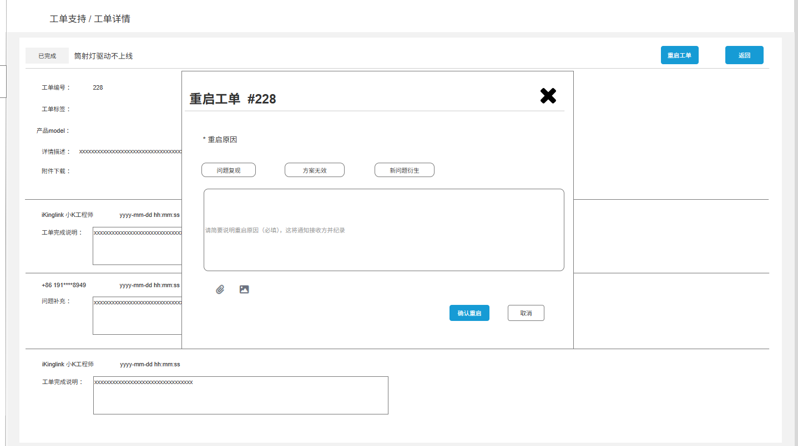

# 开放平台\+服务平台工单系统

# **原型地址**

https://modao\.cc/axbox/share/RwNvSeGt2x3g4wtif5GyO

## **蓝湖地址**

https://lanhuapp\.com/link/\#/invite?sid=xl4fyYa

# *需求修改的地址，标黄显示*

1. 工单上传图片

2. 工单描述内容，最多200字符

3. 新建工单，保留所属空间字段

# 工单填报入口

服务平台：400电话接听后，售后运维人工录入

开放平台：在Hommor Aura平台用户自行填写

智居App：我要报修（app组）

[App工单优化](https://ikinglink.feishu.cn/wiki/UmLXwi3fki67bTkU8NecdIBCnFc?from=from_copylink)

app工单提报的工单等级为低

## 工单流转

### **工单标签 **

将工单的问题归纳为不同标签

|服务平台 |工单来源|一级标签|二级标签|
|---|---|---|---|
||  个人用户 /项目用户|金云智居app|账号与登录、页面显示、场景联动、消息推送、家庭管理、设备配网、设备控制、设备离线、设备故障、其他|
|||~~金云智联App~~|~~账号与登录、页面显示、场景联动、消息推送、家庭管理、设备配网、设备控制、设备离线、设备故障、其他~~|
||开放平台 |产品接入系统\-开放平台 |页面显示、创建产品、基础配置、功能定义配置、开放协议接入开发、云云接入开发、模组SDK开发、模组选型、固件配置、场景联动、消息推送、产品测试、产品上线、其他|
|||产品服务系统\-开放平台|页面显示、服务器配置、SDK开发、API开发、API调试、云应用接入、saas 接入、其他|
|||产品运营系统\-开放平台|页面显示、设备管理、设备OTA、设备日志、数据统计、其他 |
|||中控屏|页面显示、设备离线、设备控制、数据展示、其他|
|||Aihouse系统|页面显示、项目管理、用户管理、设备管理、设备控制、模板管理、设备日志、其他|
|||施工端App|页面显示、空间管理、场景联动、设备配网、设备控制、设备离线、固件升级、设备故障、其他、模板 管理|
|||语控|语控问题排查、语控功能咨询、新增语控需求|
|||现场施工交付|施工问题排查、设备故障、其他|
|||其他|反馈与建议、投诉、新增需求、其他|

***注明：工单来源为个人用户/项目用户，一级标签【金云智居App】不可删除和修改。***

### 运维组

设置多个工单运维组，每个运维组下可自由添加人员，根据工单标签将工单流转至用户组下的人员，以下为推荐创建的用户组

|运维组编号|运维组名称及规划|主处理人|组员|
|---|---|---|---|
|001|金云智居 App|王振旭||
|~~002~~|~~C端 App~~|||
|003|施工端App|||
|004|Aihouse系统|||
|005|开放平台开发|||
|006|中控屏开发|||
|007|语控开发|||
|008|施工现场交付|||
|009|售后客服|||

### 流转流程

1. 流转

    1. 工单创建后，系统根据其标签（Tags） 自动匹配并分配至预设的运维组，工单先流转至指定运维组的主处理人

    2. 主处理人可将工单流转至指定用户组或指定运维组的某个人，转工单需要填写流转原因

    3. 主处理人可根据工单问题添加协作者，将工单任务分配给各自负责的人，当负责工单的所有协作者处理完成后，该工单由主处理人提交完成

2. 工单处理人不可驳回，仅支持处理完成；若工单发起人超时72小时没有回复，工单自动完成；工单发起人可以在页面中重新开启此工单

### 工单等级

1. 工单等级分为高、中、低

2. 在工单等级选项下，用文字描述处理时效。【高：2个工作日，中：4个工作日，低：6个工作日】

3. 处理时效

    1. 高：2个工作日

    2. 中：4个工作日

    3. 低：6个工作日

### 工单状态流转

用户提交的工单状态和分配给运维的工单状态，是根据工单所处的阶段和用户角色动态映射的

**提交人（用户）工单全部状态**：待处理、处理中、待验收、已完成、已撤销

- 待处理：工单已成功创建，分配至工程师，等待工程师处理

- 处理中：工程师正在处理问题中

- 待验收：工程师已提供解决方案，等待发起人的验收

- 已完成：发起人验收工单完成，已完结工单；若工单发起人超时72小时没有回复，工单自动完成

- 已撤销：待处理的工单，发起人撤回了工单

**接手人工单全部状态：**待处理、处理中、待验收、已完成、已转单、验收失败

- 待处理：等待我处理的工单

- 处理中：用户组正在处理的工单

- 待验收：该工单所有处理人都完成时，工单才为待验收

- 已完成：发起人验收工单完成，已完结工单；若工单发起人超时72小时没有回复，工单自动完成

- 已转单：我将工单已转给别人

- 验收失败：工单发起人没验收通过的工单

***状态视角详解表权限表***

|全局系统状态|发起方（用户）视角|处理方视角|**转单**|**添加协作者**|**移除协作者**|**询问发起人** |**提交处理结果**|**发起人询问**|
|---|---|---|---|---|---|---|---|---|
|待处理|待处理|待处理|可以|可以|可以|无|无|可以|
|处理中|处理中|处理中|可以|可以|可以|可以|可以|可以|
|待验收|待验收|待验收|不可以|不可以|不可以|不可以|不可以|可以|
|验证失败|待处理|验证失败|可以|可以|可以|可以|可以|可以|
|已完成|已完成|已完成|不可以|不可以|不可以|不可以|不可以|不可以|
|已撤销|已撤销|（不可见该条工单）|不可以|不可以|不可以|无|无|不可以|
||不变（待处理或者处理中）|已转单（则不可见该条工单）|不可以|不可以|不可以|无|无||

**工单状态流转**

1. 工单创建与分配阶段

    1. 用户提交工单：状态为 “待处理”

    2. 系统分配/接手人领取

        用户视角：状态仍为 “待处理”（用户只知道工单已提交，尚未开始处理）

        接手人视角：该工单进入其任务列表，状态为 “待处理”（表示这是一个新任务，需要他接手）

2. 工单处理阶段

    1. 接手人开始工作

        1. 接手人视角：手动将状态从 “待处理” 改为 “处理中”

        2. 用户视角：状态同步变为 “处理中”（用户能看到工单已有人正在处理）

3. 工单处理完毕，等待确认阶段

    1. 接手人完成工作

        1. 接手人视角：将状态改为 “待验收”（表示工作已完成，请发起人验收）

        2. 用户视角：状态同步变为 “待验收”（用户收到通知，需要进行验收操作）

4. 工单验收阶段

    1. 用户进行验收，有两种结果

        1. 验收通过

            1. 用户视角：状态变为 “已完成”

            2. 接手人视角：状态同步变为 “已完成”（整个工单流程圆满结束）

        2. 验收失败

            1. 用户视角：状态变回 “待处理”（用户拒绝验收，需要继续修改）

            2. 接手人视角：状态变为 “验收失败”，并且工单会再次回到他的“待处理”列表（他需要根据反馈继续工作）

5. 工单转单阶段 \(特殊流程\)

    1. 接手人A将工单转给接手人B

        1. 接手人A视角：该工单状态变为 “已转单”，并从他当前的“待处理/处理中”列表中移除

        2. 用户视角：状态保持不变（用户无需关心内部交接，他只关心工单是“处理中”还是“待验收”）

        3. 接手人B视角：工单作为新任务进入他的列表，状态为 “待处理”

6. 工单撤销阶段 \(用户主动终止\)

    1. 用户在工单处理前撤销

        1. 用户视角：状态变为 “已撤销”

        2. 接手人视角

            1. 如果工单还未被处理（状态为“待处理”），则工单直接消失

7. 重启工单

    1. 用户将已完成工单，重启

        1. 用户视角：从“已完成”变更为 “待处理”

        2. 接手人视角：从“已完成”变更为 “待处理”

# 服务平台工单管理

## 工单标签配置

支持新增、编辑、删除一级工单标签和二级工单标签

1. 新增一级工单标签

    1. 点击 “新增一级工单标签” 按钮后，弹出新增一级标签弹窗，用户可在弹窗中输入标签名称、提交后新增的一级标签卡片展示

    2. 工单来源：金云智居App、金云智联App、开放平台、服务平台

    3. 标签名称：必填，最大字符16字符

2. 新增二级工单标签

    1. 点击 “新增二级工单标签” 按钮后，弹出新增二级标签弹窗，用户可在弹窗中选择所属一级工单标签、标签名称、提交后新增的二级标签卡片展示，同步一级工单标签关联关系

    2. 所属一级工单标签：下拉选项框，支持多选

    3. 标签名称，必填，最大字符16字符

3. 标签信息卡片展示

    1. 以卡片形式展示工单标签信息，包括标签名称、工单数量、标签级别（一级标签 / 二级标签）

4. 标签编辑与删除

    1. 一级标签编辑

        1. 为每个标签卡片提供 “编辑” 按钮，点击 “编辑” 按钮，弹出编辑标签弹窗，弹窗中显示该标签名称，用户可修改相关信息后提交，提交成功后标签卡片上的信息同步更新

    2. 二级工单标签编辑

        1. 点击 “编辑” 按钮，弹出编辑标签弹窗，弹窗中显示该标签名称、归属一级标签，用户可修改标签名称、归属一级标签后提交，提交成功后标签卡片上的信息同步更新

        2. 每个二级标签，至少关联一个一级工单标签

5. 标签删除

    1. 为每个标签卡片提供 “删除” 按钮，点击 “删除” 按钮，弹出确认删除弹窗，用户确认后，该标签被删除，从标签列表中移除，若该标签关联有工单，不影响已存在的工单，后续不再有此标签的工单生成

## 运维组配置

**运维组搜索和筛选**

**搜索**

1. 提供搜索输入框，支持搜索运维组名字和编号

2. 用户在输入框输入关键词，实时触发搜索操作（按下回车键或查询按钮），筛选出匹配的运维组并展示在列表中

**筛选**

1. 提供 “工单标签” 下拉选择框，支持多选筛选查询，用于选择关联的一级工单标签筛选运维组

**运维组列表**

1. 以列表形式展示运维组信息，包括运维组编号、运维组名称、关联一级工单标签、负责人、创建时间

2. 列表支持分页展示、10条/页（底部有分页控件，显示总条数、页码、每页条数等）

**新增运维组**

1. 提供 “新增运维组” 按钮，点击 “新增运维组” 按钮后，跳转新增运维组页面

1. 运维组名称设置

    1. 提供输入框，用于设置运维组的名称，为必填项，限制最大字符：16字符

    2. 用户在输入框中输入运维组名称，输入框有 “运维组名称” 的提示文字

    3. 若未输入，提交（点击 “确定” 按钮）时给出 “请输入运维组名称” 的提示

2. 运维组描述输入

    1. 提供文本输入区域，用于输入运维组的描述信息，为非必填项，限制最大字符：32字符

    2. 用户可在输入区域中输入对运维组的描述内容，输入区域有 “运维组描述” 的提示文字

3. 运维组负责人选择

    1. 提供下拉选择框，用于选择运维组的负责人，为必填项（标注 “\*”）、单选

    2. 选择范围：服务平台用户列表所有企业员工

    3. 运维组负责人为关联一级工单标签下第一主处理人

4. 关联工单一级标签选择

    1. 提供多个工单一级标签的复选框，用于选择运维组关联的工单一级标签，为必填项（标注 “\*”）

    2. 用户可勾选一个或多个工单一级标签复选框。若未勾选，提交时给出 “请选择关联工单一级标签” 的提示

5. 运维组成员管理

    1. 提供 “添加成员” 按钮，显示添加成员弹窗，下拉选择可添加运维组成员

    2. 提供“移除”按钮，显示删除确认弹窗，点击确认可移除成员

**查看运维组**

1. 针对每条运维组，提供 “查看” 操作按钮，点击可查看运维组的详细信息，支持编辑

**编辑运维组**

1. 针对每条运维组，提供 “编辑” 操作按钮，可编辑运维组名称、描述、负责人、工单标签、运维组成员

**删除运维组**

1. 针对每条运维组，提供 “删除” 操作按钮，弹出确认删除弹窗，用户确认后，该运维组被删除，从运维组列表中移除

2. 删除提示：删除此运维组将同时解除所有关联关系，请谨慎操作。是否确认删除？

## 我提交的工单

### 工单列表

1. 工单状态分类展示

    1. 展示不同状态的工单分类卡片，包括待处理工单、处理中工单、待验收工单、已完成工单、已撤销工单，每个卡片显示对应状态工单的数量

    2. 交互逻辑：用户点击某一状态卡片，可筛选出该状态下的工单列表。卡片默认展示数量，点击后触发筛选操作

    3. 全部状态：待处理、处理中、待验收、已完成、已撤销

        1. 状态说明

        - 待处理：工单已成功创建，分配至工程师，等待工程师处理

        - 处理中：工程师正在处理问题中

        - 待验收：工程师已提供解决方案，等待发起人的验收

        - 已完成：发起人验收工单完成，已完结工单；若工单发起人超时72小时没有回复，工单自动完成

        - 已撤销：待处理的工单，发起人撤回了工单

2. 工单搜索

    1. 提供搜索输入框，用于搜索工单标题~~或处理人~~

    2. 输入框最大字符数：20，支持模糊查询，输入框有 “搜索工单标题~~或处理人~~” 的提示文字

    3. 交互逻辑：用户在输入框中输入关键词，系统在用户触发搜索操作（如按下回车键）后，筛选出匹配的工单并展示在列表中

3. 筛选条件设置

    1. 所属项目选择

        1. 提供 “所属项目” 下拉选择框，用于选择工单所属的项目

        2. 交互逻辑：用户点击下拉框可展开查看所有可选项目并进行选择，选择后筛选出所属该项目的工单

    2. 工单标签选择

        1. 提供 “工单标签” 下拉选择框，用于选择工单的标签

        2. 交互逻辑：用户点击下拉框可展开查看所有可选工单标签并进行选择，选择后筛选出带有该标签的工单

    3. 工单等级选择

        1. 提供 “工单等级” 下拉选择框，显示“中”、“高”、“低”3个等级

        2. 用户点击下拉框可展开查看所有可选工单等级并进行选择，选择后筛选出对应等级的工单

    4. SLA 截止时间

        1. 解决时间 \(Resolution Time\)：从工单提交到问题被彻底解决并关闭所需的最长时间

        2. 提供 “SLA 截止时间” 下拉选择框，用于选择工单的 SLA 截止时间，截止时间单位为小时

        3. 用户点击下拉框可展开查看所有可选 SLA 截止时间并进行选择，选择后筛选工单

    5. 查询与重置

        1. 提供 “查询” 按钮，点击可根据设置的筛选条件进行工单查询

        2. 提供 “重置” 按钮，点击可重置所有筛选条件

4. 工单列表展示及操作

    1. 工单信息展示

        1. 以列表形式展示工单信息，包括工单 ID、工单标题、工单等级、工单标签、所属项目、工单状态、SLA 截止时间、更新时间

        2. 列表支持分页展示，每10条进行一次分页

    2. 工单操作

        1. 针对每条工单，提供 “查看” 和 “编辑” 操作按钮

        2. 点击 “查看” 按钮，跳转到工单详情页面，展示工单详细信息

        3. 点击 “编辑” 按钮，跳转到工单编辑页面，可修改工单相关信息

    3. 新增工单

        1. 提供 “新增工单” 按钮，点击可创建新的工单

        2. 点击 “新增工单” 按钮后，跳转到工单新增页面，用户可在该页面输入工单标题、选择工单等级、标签、所属项目等信息，完成新工单的创建

### 创建工单

1. 工单标题配置

    1. 提供 “工单标题” 输入框，用于输入工单的标题，为必填项，最长为20个字符

    2. 用户直接在输入框中输入工单标题，输入框有 “请输入工单标题，最长20个字符” 的提示文字

    3. 若输入框为空，提交（点击 “确定” 按钮）时给出 “工单标题为必填项” 的提示

2. 所属项目选择

    1. 提供 “所属项目” 下拉选择框，用于选择工单所属的项目，为必填项

    2. 用户点击下拉框可展开查看所有可选项目并进行选择

    3. 若未选择，提交时给出 “请选择所属项目” 的提示

3. 所属空间

    1. 输入框

    2. 选填，最长为20个字符

4. 所属系统选择

    1. 提供 “所属系统” 选项组，包含 “设备操作”“施工交付”“产品接入系统 \- 开放平台”“产品服务系统 \- 开放平台”“产品运营系统 \- 开放平台”“B 端 App”“C 端 App”“中控屏”“语控”“其他” 等选项，用户可选择工单所属的系统，为必填项

    2. 用户点击对应选项即可选中，*只能选择一个系统*

    3. 若未选择，提交时给出 “请选择所属系统” 的提示

5. 工单标签选择

    1. 提供 “工单标签” 选项组，用户可选择工单的标签，为必填项

    2. 用户点击对应选项即可选中，*只能选择一个标签*

    3. 若未选择，提交时给出 “请选择工单标签” 的提示

6. 工单等级选择

    1. 提供 “高”“中”“低” 单选按钮组，用于选择工单的等级，为必填项

    2. 不同等级对应不同的处理时限（高：2 个工作日；中：4 个工作日；低：6 个工作日）

    3. 用户点击对应单选按钮即可选中，默认无选中状态

    4. 若未选择，提交时给出 “请选择工单等级” 的提示

7. 详情描述配置

    1. 提供 “详情描述” 输入区域，用于输入工单的详细描述信息，*最长200字符，为必填项*

    2. 输入区域为文本输入框（或富文本编辑区域），用户可直接输入详细描述内容

    3. 若输入区域为空，提交时给出 “详情描述为必填项” 的提示

8. *上传附件*

    1. *提供 “上传附件” 区域，支持上传图片，为非必填项*

    2. *用户点击 “Upload” 按钮，可选择本地文件进行上传*

    3. *上传完成后，在该区域展示已上传的图片，支持对附件进行删除等操作*

    4. *单张图片\<=10M，最多上传5张*

9. 联系方式配置

    1. 提供 “联系方式” 输入框，用于输入联系人的手机号码，为非必填项

    2. 用户直接在输入框中输入手机号码，输入框有 “请输入手机号码” 的提示文字

    3. 若输入格式不符合手机号码规范，提交时给出 “请输入有效的手机号码” 的提示

10. 操作按

    1. 确定按钮

        1. 提供 “确定” 按钮，点击可保存新增的工单信息，提交工单

        2. 点击 “确定” 按钮时，会先进行表单校验（检查必填项是否填写、格式是否正确等），校验通过则保存工单信息并跳转到工单列表页；校验不通过则给出相应的错误提示

    2. 取消按钮

        1. 提供 “取消” 按钮，点击可取消当前的新增工单操作，返回上一级页面

        2. 点击 “取消” 按钮，返回上一级页面

**待处理详情**

**工单详情**

1. 工单标题展示

    1. 展示工单的标题信息，从工单数据中获取标题并直接展示

2. 工单状态展示

    1. 展示工单的当前状态（如 “待处理”），状态文字采用醒目的颜色（如橙色）突出显示，从工单数据中获取状态并展示，状态为动态变化，会随着工单处理流程更新

3. 工单等级展示

    1. 展示工单的等级（如 “中”），从工单数据中获取等级并直接展示

4. 所属项目展示

    1. 展示工单所属的项目信息，从工单数据中获取所属项目并直接展示

5. 所属系统展示

    1. 展示工单所属的系统（如 “设备操作”），从工单数据中获取所属系统并直接展示

6. 工单标签展示

    1. 展示工单的标签（如 “设备离线”），从工单数据中获取标签并直接展示

7. 所属空间展示，从工单数据中获取并直接展示

8. 提交人展示

    1. 展示提交工单的人员信息，从工单数据中获取提交人信息并直接展示

9. 提交时间展示

    1. 展示工单的提交时间，格式为 “yyyy\-mm\-dd hh:mm:ss”，从工单数据中获取提交时间并按指定格式展示

10. 详情描述

    1. 展示展示工单的详细描述信息，描述区域有背景色区分，从工单数据中获取详情描述并展示在指定区域。

11. 附件下载展示

    1. 展示工单相关的附件列表（如图片），附件名称可点击下载

    2. 从工单数据中获取附件信息，展示附件名称，用户点击附件名称可触发下载操作

12. 联系方式展示

    1. 展示工单联系人的联系方式，从工单数据中获取联系方式并直接展示

13. 截止时间代替SLA 截止时间，时间格式：“yyyy\-mm\-dd hh:mm:ss”

14. ~~SLA 截止时间展示~~

    1. ~~展示工单的 SLA 截止时间，从工单提交时开始计算SLA 截止时间~~

    2. ~~等级高的工单的处理周期是2天，即48小时起，开始倒数计算，显示【还剩xx小时】~~

    3. ~~等级中的工单的处理周期是4天，即96小时起，开始倒数计算，显示【还剩xx小时】~~

    4. ~~等级低的工单处理周期是6天，即144小时，开始倒数计算，显示【还剩xx小时】~~

    5. ~~若超过了每个工单的处理时间，显示【已超时】~~

**处理纪录补充**

1. 补充说明输入

    1. 提供 “补充说明” 输入区域，用于输入对工单处理的补充说明信息

    2. 输入区域为文本输入框，用户可直接输入补充说明内容

2. 附件上传

    1. 提供附件上传功能，支持上传图片等（通过图片图标触发）

    2. 用户点击图片图标可上传图片，上传完成后在页面展示已上传的附件信息

3. 提交补充

    1. 提供 “提交补充” 按钮，点击可提交补充说明及上传的附件，并记录到工单的处理纪录中

15. 工单解决确认

    1. 解决确认

        1. 提供 “该问题是否已解决？已解决” 确认选项及 “撤单” 按钮，用于确认工单问题已解决并进行撤单操作

        2. 当该工单还处于“待处理”状态下，用户确认问题已解决后，点击 “撤单” 按钮，系统记录工单状态为“已撤销”

16. 返回

    1. 提供 “返回” 按钮，点击可返回上一级页面（工单列表页面），不保存当前未提交的补充说明等信息（若有）

17. 确定

    1. 提供 “确定” 按钮，点击可返回上一级页面（工单列表页面），保存当前未提交的补充说明等信息（若有）

**处理中详情**

- 工单详情与待处理详情交互逻辑一致

**处理记录**

1. 处理纪录展示

    1. 展示工单的历史处理纪录，包括处理人、处理时间和处理内容

    2. 从工单处理历史数据中获取相关信息并按时间正序展示

2. 补充说明和上面保持一致

**待验收详情**

**已完成详情**

### 重启工单

**前提条件**

若工单超时72小时没有验收，工单自动完成；工单发起人可以在页面中重新开启此工单

1. 重启工单操作

    1. 提供 “重启工单” 按钮，点击可将已完成的工单重新启动，使其回到【待处理】状态，进入新的处理流程

    2. 点击 “重启工单” 按钮，弹出确认重启工单的弹窗，用户确认后，系统将工单状态更新为指定的重启后状态，并将工单重新纳入处理纪录流程，同时记录重启工单标签

    3. **SLA 重置：重启工单后，工单的计时应根据规则重置或重新计算**

    4. 工单之前的所有历史记录、沟通记录完整保留

**已撤销详情**

## 分配给我的工单

### 工单列表

1. 状态卡片分类展示

    1. 展示不同状态的工单分类卡片，每个卡片显示对应状态工单的数量

    2. 用户点击某一状态卡片，可筛选出该状态下的工单列表，卡片默认展示数量，点击后触发筛选操作

    3. 工单状态：待处理、处理中、待验收、已完成、验收失败

        - 待处理：等待我处理的工单

        - 处理中：我正在处理的工单

        - 待验收：等工单发起人的验收的工单

        - 已完成：发起人验收工单完成，已完结工单；若工单发起人超时72小时没有回复，工单自动完成

        - *~~已转单：我将工单已转给别人~~*

        - 验收失败：工单发起人没验收通过的工单

    4. 状态卡片多一个状态：已超时工单

        1. 字段来源于：从SLA 截止时间来判断，超过工单处理时长的工单

2. 工单搜索

    1. 提供搜索输入框，用于搜索工单标题或提交人，最长20个字符

    2. 用户在输入框中输入关键词后，筛选出匹配的工单并展示在列表中

    3. 输入框有 “按工单标题或提交人” 的提示文字

3. 筛选条件设置

    1. 所属项目选择

        1. 提供 “所属项目” 下拉选择框，用于选择工单所属的项目

        2. 用户点击下拉框可展开查看所有可选项目并进行选择，选择后筛选出所属该项目的工单

    2. 工单标签选择

        1. 提供 “工单标签” 下拉选择框，用于选择工单的标签

        2. 用户点击下拉框可展开查看所有可选工单标签并进行选择，选择后筛选出带有该标签的工单

    3. 工单等级选择

        1. 提供 “工单等级” 下拉选择框，高中低，三个等级，用于选择工单的等级

        2. 用户点击下拉框可展开查看所有可选工单等级并进行选择，选择后筛选出对应等级的工单

    4. ~~SLA 截止时间选择~~

        1. ~~SLA 截止时间展示~~

            1. ~~展示工单的 SLA 截止时间，从工单提交时开始计算SLA 截止时间~~

            2. ~~等级高的工单的处理周期是2天，即48小时起，开始倒数计算，显示【还剩xx小时】~~

            3. ~~等级中的工单的处理周期是4天，即96小时起，开始倒数计算，显示【还剩xx小时】~~

            4. ~~等级低的工单处理周期是6天，即144小时，开始倒数计算，显示【还剩xx小时】~~

            5. ~~若超过了每个工单的处理时间，处理人未提交完成说明，显示【已超时】~~

        2. 用户点击下拉框可展开查看所有可选 SLA 截止时间范围并进行选择，选择后筛选出符合该时间范围的工单。

4. 查询与重置

    1. 提供 “查询” 按钮，点击可根据设置的筛选条件进行工单查询提供 “重置” 按钮，点击可重置所有筛选条件

**工单列表展示及操作**

1. 工单信息展示

    1. 以列表形式展示工单信息，包括工单 ID、工单标题、工单等级、工单标签、所属项目、工单状态、SLA 截止时间、提交人、更新时间

    2. 从工单数据中获取相关信息并展示在列表对应列中，列表支持分页展示，每10条为一页

2. 工单操作

    1. 针对每条工单，提供 “处理” 操作按钮，点击可进入工单处理页面

## 处理工单

用于支持多人协作处理工单，系统通过智能分配与手动协作相结合的方式，确保工单能被高效、准确地解决。

核心角色包括主处理人和工单协作者，主处理人对工单的最终闭环负主要责任。

|角色|权限说明||
|---|---|---|
|主处理人 |工单的主负责人，拥有处理工单、添加工单协作者、转单、移除工单协作者、提交工单处理说明的权限|主处理人转单的对象为新的“主处理人”|
|工单协作者|被邀请协助处理工单的成员，拥有处理工单，加工单协作者、转单、提交工单处理说明的权限|工单协作者转单对象为“工单协助者”|

**工单详情**

1. 和上述一致

**工单操作按钮**

1. 开始处理

- 提供 “开始处理” 按钮，点击 “开始处理” 按钮，全局工单状态从 “待处理” 变为 “处理中”，按钮状态更新，变为不可点击

2. 添加工单协作者

- 提供 “添加工单协作者” 按钮，点击可添加其他人员作为工单协作者，共同处理工单

- 点击 “添加工单协作者” 按钮后，弹出协作者添加弹窗，用户可选择协作者人员、提交后协作者加入处理人列表，协作者会收到工单通知，个人工单状态为“待处理”

3. 转单

- 提供 “转单” 按钮，点击可将当前工单转派给其他人员处理

- 点击 “转派” 按钮后，弹出转派弹窗，用户可在弹窗中选择转派对象（人员），填写转派说明，提交后工单将被转派给指定人员处理，

- 发起转单，不影响全局工单状态

- 转单对象选择

    - 提供搜索输入框，用于搜索人员或工作组作为转单对象，为必填项

    - 输入框有 “搜索人员或工作组” 的提示文字，用户输入关键词后，展示匹配的人员或工作组列表，用户可从中选择转单对象。若未选择，提交（点击 “确认转单” 按钮）时给出 “请选择转单对象” 的提示

- 转单原因设置

    - 预设原因选择

        - 提供 “非本组职责范围”“需要其他组协同处理”“需要更高级别处理” 预设按钮，用户可选择转单的预设原因

        - 用户点击对应按钮即可选中，可选择多个预设原因

    - 自定义原因输入

        - 提供自定义原因输入区域，用于输入转单的具体原因，为必填项，最大字符200

        - 输入区域为文本输入框，有 “请简要说明转单原因（必须），这将通知接收方并记录” 的提示文字。若输入区域为空，提交时给出 “转单原因不能为空” 的提示

- 确认转单

    - 提供 “确认转单” 按钮，点击可提交转单信息，完成工单转派

    - 点击 “确认转单” 按钮时，会先进行表单校验（检查转单对象是否选择、转单原因是否填写等），校验通过则保存转单信息，更新工单状态为转派状态，并通知转单对象；校验不通过则给出相应的错误提示

- 取消

    - 提供 “取消” 按钮，点击可取消当前的转单操作，关闭转单弹窗

    - 点击 “取消” 按钮，关闭转单弹窗，不保存任何输入内容，返回上一级页面（如处理工单页面）

- 转单记录和原因会同步到【处理记录】内，有个【转单】小标签标识转单的记录

- 转单后的工单状态

|当前工单状态|转单操作|A转单后的工单状态|B的工单状态|
|---|---|---|---|
|待处理|A转给B|不展示该工单|待处理|
|处理中|A转给B|不展示该工单|待处理|
|待验收|A转给B|不展示该工单|待处理|
|验收失败|A转给B|不展示该工单|待处理|

**处理人管理列表**

展示当前工单的处理人列表，包括处理人员姓名、工单处理状态，工单角色标识

1. 主处理人列表展示

    1. 主处理人姓名、工单处理状态、工单角色标识

    2. 工单协作者姓名、工单处理状态、移除按钮

        1. 主处理人可将协作者移除工单处理人名单，提供 “移除” 按钮，点击可将对应人员从处理人列表中移除

        2. 点击 “移除” 按钮，弹出确认移除弹窗，用户确认后，该人员被移除出处理人列表，不再参与该工单的处理

2. 协作者列表展示

    1. 主处理人姓名、工单处理状态、工单角色标识

    2. 工单协作者姓名、工单处理状态、工单角色标识

    

**处理纪录查看与补充**

1. 处理纪录展示

    1. 展示该工单的处理记录，区分用户可见和仅内部可见的内容，以确保信息透明度的同时，保护内部沟通的隐私性

    2. 主处理人和协助者的名字仅互相可见，工单发起人不可见真实名字，统一显示为“iKinglink 工程师”

2. **处理纪录和可见性规则**

    |    处理记录|    内容描述|    可见性|
    |---|---|---|
    |    发起人补充说明     |    发起人后续补充的问题说明附件、时间、姓名     1. 发起人的名称     2. 发起人补充提交的时间     3. 补充说明内容     4. 附件|    所有人可见     |
    |    主处理人完成说明|    工单主处理人的完成说明     1. 处理人名字（对外统一iKinglink 工程师，内部可见名称）     2. 提交时间     3. 完成说明内容|    所有人可见     |
    |    协作者完成说明|    工单协作者完成说明     1. 协作者名字     2. 提交时间     3. 完成说明|    仅处理人员可见|
    |    主处理人、协作者询问记录|    主处理人、协作者询问发起人的问题和细节     1. 处理人名字（对外统一iKinglink 工程师，内部可见名称）     2. 提交时间     3. 说明内容|    所有人可见|
    |    转单记录|    记录转出人、转入组/人、转单时间及转单理由     1. 转出人、转入人具体名字     2. 转单时间     3. 转单理由|    仅处理人员可见|

3. 处理说明输入

    1. 提供 “处理说明” 输入区域，用于输入对工单处理的说明信息，非必填

    2. 最大字符数：300

4. 提交处理结果

    1. 提供 “提交处理结果” 按钮，点击可提交工单的处理说明，更新工单处理纪录

        1. 协作者提交处理结果，更新自己的工单状态，更新工单处理纪录，不改变全局的工单状态

        2. 主处理人需要在协作者均完成的情况下，提交最终处理结果，更新工单处理纪录，改变全局的工单状态

    2. 工单完成说明：该工单的协作者全部完成后，由主处理人汇总处理结果，补充处理说明，点击“提交处理结果”，工单状态由“处理中”改为“待验收”，刷新该工单详情页面

5. 返回

    1. 提供 “返回” 按钮，点击可取消当前的工单处理操作，返回上一级页面（如 “分配给我的工单” 页面），不保存任何未提交的输入内容

**处理工单（转单显示）**

***~~已转出工单显示~~***

## 

### 短信通知——To 主处理人（暂不做），使用飞书通知

**超时前6小时\-预警通知**

【金云智联公司工单系统】提醒！您处理的工单\#【工单ID】即将在6小时后超时，工单标题【工单标题】。请优先处理，确保按时完成。

**超时后\-超时通知**

【金云智联公司工单系统】紧急！您处理的工单\#【工单ID】已超时，工单标题【工单标题】。请马上处理！

# 开放平台工单

工单查看权限：以公司为单位，企业管理员和成员均可以看到该公司所有工单

用户提交工单后，公司的运维人员和技术人员在内部服务平台接收工单并处理问题。

1. 状态栏显示：显示“待处理”、“处理中”、“待验收”、“已完成”、“已撤销”状态的工单数量

2. 全部状态：待处理、处理中、待验收、已完成、已撤销

    1. 状态说明

    - 待处理：工单已成功创建，分配至工程师，等待工程师处理

    - 处理中：工程师正在处理问题中

    - 待验收：工程师已提供解决方案，等待发起人的验收

    - 已完成：发起人验收工单完成，已完结工单；若工单发起人超时72小时没有回复，工单自动完成；

    - 已撤销：待处理的工单，发起人撤回了工单

3. 时间筛选器：可以通过确定时间区间去筛选工单

4. 输入框查询：可以输入工单标题模糊查询工单，字数最多为20字符

5. 工单列表：

    1. 以上报的时间由近及远显示

    2. 每10条工单进行分页

    3. 列表表头：工单编号、状态、工单标题、工单标签、所属系统、上报时间、提交人、操作（查看、编辑）

        1. 针对每条工单，提供 “查看” 和 “编辑” 操作按钮

        2. 点击 “查看” 按钮，跳转到工单详情页面，展示工单详细信息

        3. 点击 “编辑” 按钮，跳转到工单编辑页面，可修改工单相关信息

## 新增工单

1. 点击新建工单按钮，跳转到新建工单的页面

    1. 新增工单

        1. 选择工单标签

            1. 工单标签分为所属系统和工单标签

            2. 单选，必选

|标签编号|所属系统（一级标签）|二级标签|
|---|---|---|
|3|产品接入系统\-开放平台|创建产品、基础配置、功能定义配置、开放协议接入开发、云云接入开发、模组SDK开发、模组选型、固件配置、场景联动、消息推送、产品测试、产品上线、其他|
|4|产品服务系统\-开放平台|服务器配置、SDK开发、API开发、API调试、云应用接入、saas 接入、其他|
|5|产品运营系统\-开放平台|设备管理、设备OTA、设备日志、数据统计、其他|
|10|其他|反馈与建议、投诉、其他|

2. 填写工单具体信息

    1. 工单标题，必填，限20个字符

    2. 工单等级：必填，低、中、高、工单处理优先级

        1. 【高：2个工作日，中：4个工作日，低：6个工作日】

        2. 在工单等级选项下，用文字描述处理时效

    3. 产品model，选填

        1. 提示语：请提供问题所涉及的model，如果问题和产品无关可填无

    4. 设备ID，选填

        1. 提示语：请提供问题所涉及的设备ID，如果问题和产品无关可填无

    5. 详情描述

        1. 必填，200字符之内

        2. 提示语：请详细描述您的问题，尽可能包含问题出现的所有场景

        3. *上传附件*

            1. *提供 “上传附件” 区域，支持上传图片，为非必填项*

            2. *用户点击 “Upload” 按钮，可选择本地文件进行上传*

            3. *上传完成后，在该区域展示已上传的图片，支持对附件进行删除等操作*

            4. *单张图片\<=10M，最多上传5张*

    6. 联系方式

        1. 必填，请输入手机号

        2. ~~当工单有新的回复时，将通过短信的形式及时同步给用户~~

    ~~短信格式：【金云智联】您提交的工单12352目前状态为“待验收”，您可通过 开放平台\-工单支持 查看处理，详情请点击~~

    7. 必选项完成后，点击【创建】，则该条工单创建完成

## 工单详情

**待处理工单详情**

1. 工单详情最上方展示：工单处理状态和工单标题，右侧为返回按键

2. 工单编号、工单等级、工单标签、所属系统、产品model、设备ID、详情描述、上传的附件、上报时间

    1. 产品model、设备ID若没填，则显示为“——”

    2. 上传的附件若为图片：则显示查看图片链接格式；若上传的附件为文件，则显示该文件的下载查看链接

    3. 上报时间：显示工单的初次提交的时间

3. 下方显示：该问题是否已解决？已解决【撤单】，若有信息需要补充，请补充信息

    1. 待处理的工单，工程师还未查收到该工单，可以撤回

    2. 点击【撤单】，显示【撤单确认】弹窗，点击确定，则该工单状态为已撤销，工单流程终止

    3. 点击【补充信息】，则用户需要补充问题，点击【提交】则将信息补充完成，该工单状态不变

**处理中工单详情**

1. 工单状态显示：处理中

2. 处理中工单，工程师已经查收到该工单，不可以撤回

3. 下方显示：若有信息需要补充，请补充信息

4. 点击【补充信息】，则用户可以补充问题信息，点击【提交】则将信息补充完成，该工单状态不变

**待验收工单详情**

1. 工单状态显示：待验收

2. 工单详细信息下方显示：工程师的工单完成说明、提交时间

3. 该问题是否已解决？已解决【确认结单】，问题未解决，请【补充信息】

    1. 点击【确认结单】，则该工单状态变为“已完成”，工单详情变为【已完成工单详情】，工单流程终止

    2. 点击【补充信息】，则用户可以补充问题信息，点击【提交】则将信息补充完成，该工单状态转为“待处理”

**已完成工单详情**

1. 工单状态显示：已完成

2. 显示工单详情，和工单处理过程的交流信息

**重启工单**

若工单发起人超时72小时没有回复，工单自动完成；工单发起人可以在页面中重新开启此工单

1. 重启工单操作

    1. 提供 “重启工单” 按钮，点击可将已完成的工单重新启动，使其回到【待处理】状态，进入新的处理流程

    2. 点击 “重启工单” 按钮，弹出确认重启工单的弹窗，用户确认后，系统将工单状态更新为指定的重启后状态，并将工单重新纳入处理纪录流程，同时记录重启工单标签

    3. SLA 重置：重启工单后，工单的计时应根据规则重置或重新计算

    4. 工单之前的所有历史记录、沟通记录完整保留

**已撤销工单详情**

1. 工单状态显示：已撤销

2. 只有待处理的工单可以撤销，所以详情里只展示初次提交工单的内容

