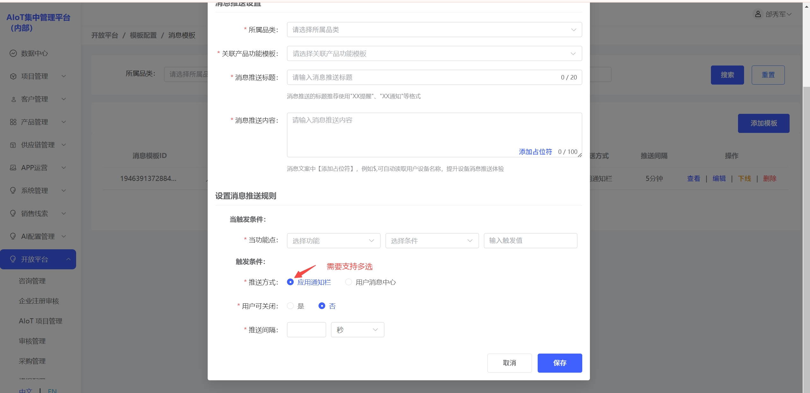
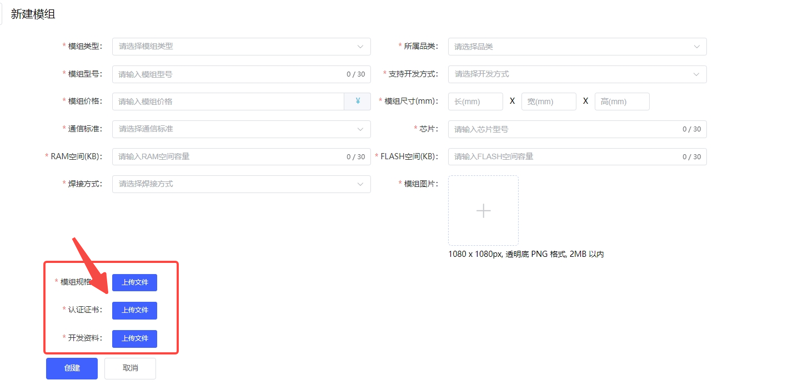
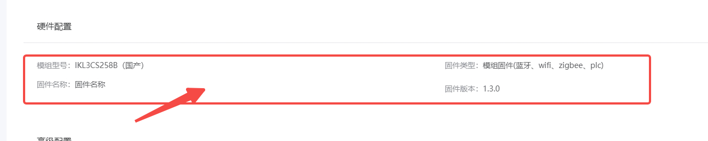

# 集中管理平台上线需求—2\.0

# 新需求

***添加事件***

1. 事件由输出参数组成，输出参数由属性构成。

2. 事件的功能名称自定义，中文，20个字符内，不做唯一性校验

3. *品类单选。*

4. 标识符/code： 支持小写英文、数字、下划线、20个字符内，做唯一性校验

5. *是否支持场景：是or否，单选，必选*

6. 输出参数个数：≥0

7. 输出参数的可选范围：只能从该品类下已有的属性功能点作为参数值

    1. 设备上报事件传回的属性参数

8. 备注：100字符以内

***编辑事件***

1. 不可编辑功能类型、标识符。

***删除事件***

1. 若该事件已被产品功能模板关联，则不可删除

***添加方法***

1. 方法是由输入参数、输出参数组成，输出和输入由属性构成。

2. 事件的功能名称自定义，中文，20个字符内，不做唯一性校验

3. 标识符/code： 支持小写英文、数字、下划线、20个字符内，做唯一性校验

4. *品类单选。*

5. *是否支持场景：是or否，单选，必选*

6. 输入参数个数：≥0

7. 输入参数的可选范围：只能从该品类下已有的属性功能点作为参数值

    1. 方法的入参，第三方调用平台指令的参数

8. 输出参数个数：≥0

9. 输出参数的可选范围：只能从该品类下已有的属性功能点作为参数值

    1. 输出参数：平台给第三方的数据反馈

10. 备注：100字符以内

***编辑方法***

1. 不可编辑功能类型、标识符。

***删除方法***

1. 若该方法已被产品功能模板关联，则不可删除

# 需求优化

### 一、功能库

1. FID隐藏不显示

2. 功能点的所属品类可以支持多选

3. 功能点的标识符保证唯一性

### 二、功能模板

1. 功能模板内的功能点大于10个功能点进行分页展示

2. FID隐藏不显示

3. 添加功能点，查看功能详情时，需要加个数据定义、场景权限的字段显示

4. *添加功能类型的筛选项：全部、属性、事件、方法*

5. *属性、事件、方法分3个列表展示*

### 三、消息推送

1. 推送方式支持多选

### 四、模组配置

1. 开发资料文件上传：支持文件压缩包上传

### 五、产品总览

1. 产品功能模板展示的功能点，分页展示，每10条进行分页

2. 关联的固件版本需要和开放平台保持一致，开放平台已经做了固件升级，产品总览界面必须立即更新显示，确保展示的始终是最新发布的固件版本号，避免用户看到过时信息。

### 六、 AIoT项目管理

1. 设备权限

    1. 设备权限根据：创建该设备的公司账号进行划分，不同公司的账号默认只能管理或操作自己公司下的设备

        - 操作其他公司的设备需要与平台申请，联系，后台进行权限分配。

        - 例如设备权限分为\-\-按照创建的公司账号品牌分：米家、金云智居、中建深装、、、

### 七、 产品配置

1. 模组固件配置

    1. 每种通讯方式需要和配置的模组保持一致，例如通讯方式选择了zigbee，那么模组固件需要配置至少一个zigbee模组

