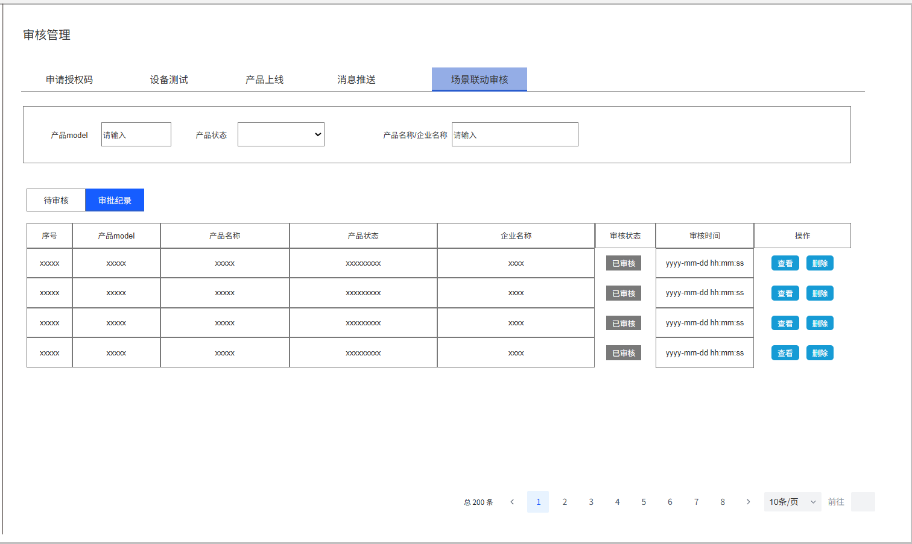

# 集中管理平台上线需求—3\.0

**原型：**

https://modao\.cc/axbox/share/orZxGKHRt05e9ogahMWo67

## 场景联动审核

开放平台发起自动化场景上线的申请，后台对场景联动进行审核，测试，确认是满足上线的条件后，才可审批上线

1. 场景联动审核分为两部分待审核、审核纪录

    1. 审核过的场景联动归纳到审核纪录

2. 状态：待审核、已审核

    1. 待审核表格下：只有待审核

    2. 审核纪录表格下：已经审核完成的产品纪录

### 待审核

若该产品目前处于待审核的情况下，又申请一条新的场景联动，则被覆盖展示新的数据

1. 筛选栏

    1. 产品model：支持模糊查询，不超过42个字符

    2. 产品状态：开发中、送审中、测试中、测试未通过、测试通过未上线、上线审核中、已上线

    3. 产品名称、企业名称：支持模糊查询，不超过

2. 列表展示：序号、产品model、产品名称、产品状态、企业名称、状态、申请时间、操作

    1. 产品状态：同步显示该产品在开放平台的开发状态

    2. 企业名称：产品所属企业名称

    3. 审核状态：待审核、已审核

    4. 申请时间格式：yyyy\-mm\-dd hh:mm:ss

    5. 操作：审核

        1. 点击【审核】，可以查看自动化场景申请详情

    6. 分页展示：10条/页

    7. 排序展示：按照时间正序展示，由远及近

**待审核详情**

点击【待审核】列表的【审核】，显示该弹窗

1. 产品信息

产品model、产品名称、产品状态、企业ID、企业名称

2. 自动化场景

    1. 同步开放平台的配置

    2. 自动化场景分为触发条件、执行动作

3. 触发条件

    1. 自动化名称：自定义中文，长度不超过20个字符

    2. 触发属性/事件：功能点的标识符

    3. 功能类型：属性/事件

    4. 触发范围：属性or事件关联属性的数据定义

    5. ~~本地多控：属性—支持，事件—不支持~~

    6. 自动化类型：标准/自定义

    7. *状态：待审核、审核驳回、已上线*

        1. 未审核的场景联动的状态显示：待审核

        2. 审核未通过的场景联动显示：审核驳回

        3. 已经通过审核的场景联动显示：已上线

    8. 操作：查看、同意、驳回

        1. 点击【查看】，可以查看该条自动化场景的触发详情

        2. 点击【同意】，则该条自动化可上线

        3. 点击【驳回】，需要补充拒绝原因，该条自动化场景无法上线，在开放平台返回状态【开发中】

            1. 驳回原因：不超过40个字符

        

        

4. 执行动作

    1. 自动化名称：自定义中文，长度不超过20个字符

    2. 执行属性/方法：功能点的标识符

    3. 功能类型：属性/方法

    4. 执行范围：属性or方法关联属性的数据定义

    5. ~~本地多控：属性/方法，支持~~

    6. 自动化类型：标准/自定义

    7. 操作：查看、同意、驳回

        1. 点击【查看】，可以查看该条自动化场景的触发详情

        2. 点击【同意】，则该条自动化可上线

        3. 点击【驳回】，需要补充拒绝原因，该条自动化场景无法上线，在开放平台返回状态【开发中】

            1. 驳回原因：不超过40个字符

5. 审批通过

    1. 点击【确定】，即可提交审批结果，已同意的自动化为已上线，被驳回的自动化显示开发中

### **已审核**

1. 筛选栏

    1. 产品model：支持模糊查询，不超过42个字符

    2. 产品状态：开发中、送审中、测试中、测试未通过、测试通过未上线、上线审核中、已上线

    3. 产品名称、企业名称：支持模糊查询，不超过

2. 列表展示：序号、产品model、产品名称、产品状态、企业名称、状态、申请时间、操作

    1. 产品状态：同步显示该产品在开放平台的开发状态

    2. 企业名称：产品所属企业名称

    3. 审核状态：待审核、已审核

    4. 审批时间格式：yyyy\-mm\-dd hh:mm:ss

    5. 操作：查看、删除

        1. 点击【审核】，可以查看自动化场景申请详情

        2. 删除，显示删除确认弹窗，点击【确认】，可以删除该条自动化审批

    6. 分页展示：10条/页

    7. 排序展示：按照时间倒序展示，由近及远

**已审核详情**

点击【审核纪录】列表的【查看】，显示该弹窗

1. 产品信息

产品model、产品名称、产品状态、企业ID、企业名称

2. 自动化场景

    1. 同步开放平台的配置

    2. 自动化场景分为触发条件、执行动作

3. 触发条件

    1. 自动化名称：自定义中文，长度不超过20个字符

    2. 触发属性/事件：功能点的标识符

    3. 功能类型：属性/事件

    4. 触发范围：属性or事件关联属性的数据定义

    5. 本地多控：属性—支持，事件—不支持

    6. 自动化类型：标准/自定义

    7. 状态：该条自动化状态

        1. 审批时被同意的自动化触发条件：已上线

        2. 被驳回的自动化触发条件：已驳回

    8. 操作：查看，驳回原因

        1. 点击【查看】，可以查看自动化详情，同上

        2. 驳回原因：只有被驳回的自动化才显示这个按钮，点击可以查看驳回原因

4. 执行动作

    1. 自动化名称：自定义中文，长度不超过20个字符

    2. 执行属性/方法：功能点的标识符

    3. 功能类型：属性/方法

    4. 执行范围：属性or方法关联属性的数据定义

    5. 本地多控：属性/方法，支持

    6. 自动化类型：标准/自定义

    7. 操作：查看，驳回原因

        1. 点击【查看】，可以查看自动化详情，同上

        2. 驳回原因：只有被驳回的自动化才显示这个按钮，点击可以查看驳回原因

