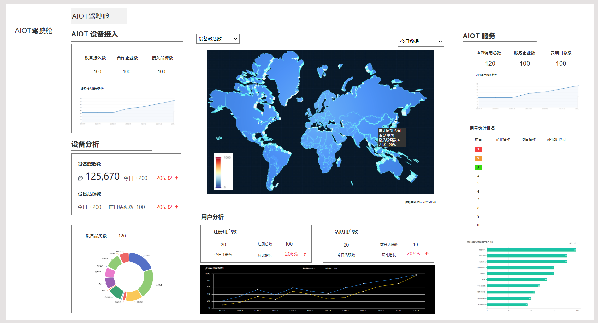
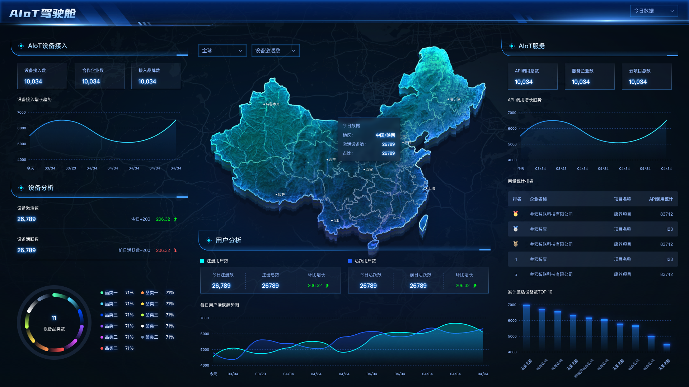

# 集中管理平台上线需求—4\.0

# **蓝湖设计图：**

https://lanhuapp\.com/web/\#/item/project/stage?tid=9af5cade\-5f03\-46be\-93df\-a4e5f2239076\&pid=ee3ed853\-77b8\-4e76\-90df\-6217d93cf85d

# 一、新需求

## AIoT驾驶舱

原为AIoT集中管理平台（内部）——【数据中心】模块，改名为【AIoT驾驶舱】，用于AIoT平台设备产品和用户展示和分析

原样子：

需求规划

1. 当前时区内2:00开始执行统计数据，数据统计节点为当前24:00前数据

2. 前端地图右下角提示：更新时间：今日04:00

1. AIoT设备接入

    1. 展示：设备接入数、合作企业数、接入品牌数、设备接入趋势图

    2. 设备接入总数趋势图：横坐标为日期，格式为：yyyy\.mm\.dd，横坐标时间区间间隔为7天，例如2025\.05\.10、2025\.05\.17，但最末的时间总是今天，纵坐标为设备接入总数

2. 设备分析

    1. 设备激活数

        1. 设备激活总数：激活注册绑定的设备

        2. 今日近7日/近30日~~增~~长数，根据用户选择映射显示

        3. 环比增长百分比

            1. 今日对比昨日的环比增长百分比/近7日对比前7日的环比增长/近30日对比前30日的环比增长

    2. 设备活跃数

        1. 设备活跃判断：设备与云端有过有效交互即为活跃，使用且在线过的设备数

        2. 今日/近7日/近30日设备活跃数，根据用户选择映射显示

        3. 前日/前7日/前30日设备活跃数

        4. 今日对比前日的环比增长百分比/近7日对比前7日的环比增长/近30日对比前30日的环比增长

    3. 设备品类分布

        1. 展示一级品类分布

            1. 一级品类名称、占比、数量

        2. 点击一级品类，展开二级品类的数量和各自占比

3. 用户模块

    1. 注册用户数

        1. 今日/近7日/近30日注册数

        2. 注册用户总数

        3. 环比增长百分比

    2. 活跃用户数

        1. 登录app的用户数

        2. 今日/近7日/近30日活跃用户数

        3. 前日/前7日/前30日活跃用户数

        4. 环比增长百分比

    3. 注册用户、活跃用户增长趋势图

        1. 两个主体，折线图

        2. 横坐标为日期，格式：yyyy\.mm\.dd，横坐标时间区间间隔为7天，例如2025\.05\.10、2025\.05\.17，但最末的时间总是今天

        3. 纵坐标为每日注册用户数量、每日活跃用户数量

4. AIoT服务

    1. API调用总数、服务企业数、云项目数

    2. API调用总数增长趋势图

        1. 横坐标为日期，格式为：yyyy\.mm\.dd，横坐标时间区间间隔为7天，例如2025\.05\.10、2025\.05\.17，但最末的时间总是今天

        2. 纵坐标为API调用总数

    3. API调用用量排名

        1. 以企业项目为评比基础排序，展示前10名

5. 累计激活设备TOP10名排名

    1. 横向柱状图展示

    2. *横坐标为设备名称*

    3. *纵坐标为数量*

6. 地区展示

    1. 地域维度：~~国家、~~省份

    2. 统计周期：今日、近7日、近30日

    3. 展示数据：根据统计周期显示不同地区的激活设备数/活跃设备数/注册用户数/活跃用户数，占比

    4. ~~根据拥有的设备激活数/活跃设备数/注册用户数/活跃用户数，地图色块不同显示~~

        1. ~~目前每1000个做个颜色划分~~

    5. 地图分为：~~世界地图和~~中国地图

        1. ~~世界地图~~

            1. ~~根据拥有的设备激活数/活跃设备数/注册用户数/活跃用户数，色块不同显示~~

            2. ~~鼠标移动到每个国家，显示：统计周期、国家名称、激活设备数/活跃设备数/注册用户数/活跃用户数，占比百分比~~

            3. ~~鼠标点击【中国】，进入中国地图~~

        2. 中国地图

            1. 根据拥有的设备激活数/活跃设备数/注册用户数/活跃用户数，色块不同显示

            2. 鼠标移动到每个省份，显示：统计周期、国家名称、激活设备数/活跃设备数/注册用户数/活跃用户数，占比百分比

    6. 交互：鼠标悬停部分显示该省份数据

