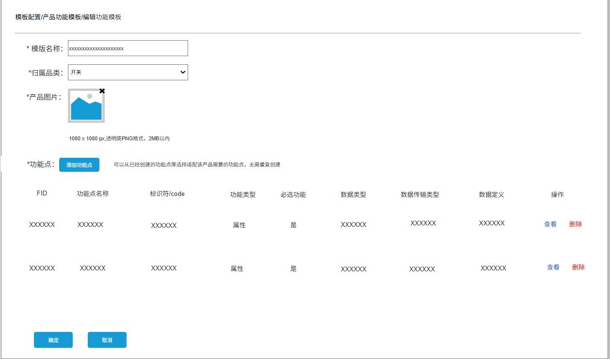

# 集中管理平台（运营平台）—开发者平台维护模块

# 一、 版本信息

版本号：1\.0

创建日期:2025\-04\-10

审核人

# 二、 变更日志

|**时间**|**版本号**|**变更人**|**主要变更内容**|
|---|---|---|---|
|4\.10|1\.0|崔梁雨|初版|
|4\.23|1\.1|崔梁雨|修改注册管理，删除企业成员列表，调整企业权限分配|
|4\.25|1\.2|崔梁雨|修改注册管理，新增企业管理、调整企业权限分配|
|5\.07|1\.3|崔梁雨|增加集中管理平台的数据中心改为【AIoT驾驶舱】的需求|

# 背景

开发者平台后台维护

# 目标

> 1\.0目标
> 
> 

1. 完成开发者平台三大产品接入系统、产品运营系统、产品服务系统的企业注册审核授权，权限分配

2. 管理客户企业的模组固件采购，审核、发货

3. 完成开发者平台设备的模组固件配置、固件配置，配置完成后，可在产品配置内直接调用对应品类的模组固件信息，后期展示在开发者平台\-设备开发模块

4. 审批开发者的授权码申请、产品测试申请、上线申请、消息推送设置

5. 产品配置，提前预设产品品类可实现的开发方式、可支持的通讯方式、可选择的功能模板、可配置模组固件、消息模板等

6. 创建产品功能点方案模板、消息推送模板，产品配置的时候可以直接调用，在开发者平台用户可以使用预配置的方案，简化产品接入的操作步骤，降低开发难度

# **原型**：

https://modao\.cc/axbox/share/J3lKYKh2sujhoaOS4923JJ?screen=soduvo

# 需求范围

## 开放平台对应的需求

一期任务：p0

二期任务：P1

## 统一说明：

- 全部产品id改成产品model，对应列表内，产品id改成产品model

- 列表以更新时间倒序排列

- 每页显示10条，分页展示，全局通用

- *斜体为修改后的需求*

- *功能点的FID干掉，不显示*

## 注册审核

用户在开发者平台申请注册企业，填写申请表单后，集中管理平台对注册企业申请进行审核，分配权限

1. 审核数据概览

    1. 已通过注册数量、未通过数量、待审核数量

2. 筛选搜索项：

    1. 申请日期: 年月日

    2. 企业名称：支持模糊查询

3. 注册管理分为待审核、已审核两个列表展示，可以点击【待审核】、【已审核】按钮切换显示

**注册待审核列表展示**

1. 表头：序号、企业名称、申请人、联系方式、注册状态、申请时间、操作

2. 申请人：申请注册企业的用户名称，20字符之内

3. 联系电话：11位手机号码

4. 注册状态：待审核

5. 申请时间：用户提交注册企业的时间，时间格式：yyyy\-mm\-dd hh:mm:ss

6. 操作：查看、通过、驳回

    1. 点击【查看】，跳转【企业注册审核】页面

    2. 点击【通过】，显示分配企业权限的弹窗

    3. 点击【驳回】，显示【拒绝原因】弹窗，需要输入驳回原因，字数控制在100字之内，点击【确定】，驳回注册成功，发送企业注册失败的短信、邮箱通知

7. 分页显示

    1. 显示总审核数，每页显示10条，分页展示，全局通用

#### **企业注册审核**

1. 要素显示：申请注册状态（待审核、已通过、未通过）、企业名称、企业信用代码、企业标识、企业地址、企业邮箱、营业执照、申请人、联系方式、企业简介

    1. 开放平台注册企业申请提交的信息

**同意注册\-分配企业权限**

点击【同意注册】，显示分配企业权限的弹窗，选择对应的权限，点击确定，分配成功，该条申请归入已审核列表内，发送企业注册成功的短信、邮箱通知

**拒绝注册**

1. 点击【驳回】，显示【拒绝原因】弹窗，需要输入驳回原因，字数控制在100字之内，点击【确定】，驳回注册成功，发送企业注册失败的短信、邮箱通知

2. 点击【返回】，【企业注册审核】抽屉弹窗隐藏

注册短信推送模板

- 平台审核通过

【金云智联】尊敬的崔小闲用户，您申请的iKinglink AIOT平台注册已审核通过！平台登录密码稍后发送，已有账号请忽略。

- 平台密码发送

【金云智联】尊敬的崔小闲用户，您申请iKinglink AIOT平台的账号初始密码为：ZA1QYpmBaZ，请妥善保管并尽早登录官网修改初始密码。

- 平台注册审核未通过

【金云智联】尊敬的用户，您好！抱歉地通知您，您于2025\-04\-10 17:30申请开通的iKinglink AIOT平台服务因【驳回原因】未通过审核，请登录iKinglink AIOT平台官⽹重新提交申请。感谢您对金云智联的支持。

**注册已审核列表展示**

1. 前提条件：点击【已审核】进入已审核列表显示页面

2. 列表显示：已通过注册的企业、未通过注册申请的企业

3. 表头：序号、企业名称、申请人、联系方式、注册状态、申请时间、驳回原因、操作人、操作时间

4. 注册状态：已通过、未通过

5. 驳回原因：若该条注册申请为【未通过】，显示驳回申请的理由，只显示15字符，其余部分隐藏显示，点击可以查看全部

6. 操作人：操作人信息

7. 操作时间：最后操作的时间，时间格式：yyyy\-mm\-dd hh:mm:ss

8. 操作：查看

**查看企业注册信息**

1. 点击【查看】，可以查看注册审核后的【企业详情】

    1. 未通过的企业详情下显示拒绝注册原因

## **企业管理**

只展示注册成功的企业信息

1. 筛选栏

企业名称：支持模糊查询

2. 序号、企业名称、管理员、联系方式、平台权限、操作人、操作时间、操作

**查看企业信息**

**编辑企业权限**

1. 点击【编辑】，显示【编辑企业权限】弹窗，只可修改企业的平台权限，勾选对应的平台，点击确定，则开通对应的系统权限

## 采购管理

用户在开放平台提交申请采购后，采购信息同步在该模块，采购提交发货后，发货信息同步到开放平台

1. 采购数据概览

    1. 待发货数量、已发货数量

2. 筛选搜索项

    1. 申请日期: 年月日

    2. 采购类型：全部、开发测试、批量生产

    3. 企业名称：支持模糊查询

3. 采购订单分为待发货和已发货，可以点击【待发货】、【已发货】按键进行切换展示

**采购待发货列表展示**

显示所有待发货的采购订单

1. 列表按照时间倒序排列

2. 列表显示字段：序号、采购类型、产品ID、开发方式、模组类型、模组型号、模组套数、企业名称、采购状态、申请时间、操作，其余信息通过点击【发货】查看详情

3. 采购类型：开发测试、批量生产

4. 产品ID、开发方式、模组类型、模组型号、~~固件信息~~、采购套数，企业名称、邮箱、申请时间与开放平台提交的采购表单同步

5. 点击【发货】，显示【发货详情】弹窗

    1. 平台人员可根据此信息，确定发货的物品信息

    2. 收货信息可以单击【一键复制】，负责收货信息

    3. 寄件信息:寄件人名字，快递单号

        1. 均为必填

        2. 寄件人名字，最长20字符

        3. 快递单号格式校验

    4. 点击【确认发货】，发货信息保存成功，该条采购订单变为已发货，同时发货信息同步到开放平台的【模组采购进度】，同时给已设置的申请人发送，发货短信通知和邮件通知

        1. 短信通知内容：待补充

        2. 邮件通知内容格式：待补充

**采购已发货列表展示**

显示所有已发货的采购订单

1. 列表字段显示：序号、采购类型、产品ID、开发方式、模组类型、模组型号、模组套数、企业名称、采购状态、快递单号、操作时间，其余信息通过点击【查看】查看详情

2. 操作时间：是待发货订单点击【确认发货】的时间

3. 操作：查看、删除

    1. 点击【查看】，查看发货详情，弹窗显示

        1. 产品ID、开发方式、模组类型、模组型号、~~固件信息~~、采购套数，企业名称、邮箱、申请时间、收货信息、寄件信息与采购订单同步

        2. 点击【返回】，弹窗隐藏

    2. 点击【删除】，显示确认删除的弹窗

        1. 点击【删除】，只删除集中管理平台已发货的订单信息，不删除开放平台的【模组采购进度】该条的采购信息

## 审批管理

1. 审批事项分为申请授权码、设备测试、产品上线、消息推送

2. 点击【申请授权码】、【设备测试】、【产品上线】、【消息推送】可以切换审批管理页面

3. 审批事项均由开放平台提交申请

### 申请授权码

1. 申请授权码可以点击【待通过】、【审批纪录】按钮，切换列表显示页面

2. 待通过：只显示等待通过的授权码申请审批单

3. 审批纪录：只显示审批后的审批纪录

**待通过列表展示**

1. 筛选搜索项

    1. 审批ID、企业名称、申请人

        1. 审批ID，每条审批在开放平台申请提交后，就会生成唯一标识审批ID，方便后期查询定位审批单

2. 列表展示字段：序号、审批ID、企业名称、申请人、联系方式、申请数量、审批状态、申请时间、操作

    1. 审批状态：待通过

    2. 申请时间：开放平台提交申请的时间，格式：yyyy\-mm\-dd hh:mm:ss

3. 点击【同意】，则下发对应数量的授权码到对应企业ID账号下

**审批纪录列表展示**

1. 前提条件：点击【审批纪录】进入该页面

2. 列表展示字段：序号、审批ID、企业名称、申请人、联系方式、申请数量、审批状态、审批时间、操作

    1. 审批状态：已通过

    2. 审批时间：在待通过列表页，点击【同意】的时间，yyyy\-mm\-dd hh:mm:ss

    3. 操作：查看、删除

        1. 点击【查看】，显示【审批详情】弹窗，可以查看申请授权码的申请信息和审批信息

        2. 点击【删除】，显示【确认删除】弹窗，可以删除已授权的审批纪录，只删除本平台的审批纪录，不删除用户那边的申请纪录

### 设备测试

1. 点击【设备测试】切换进入设备测试审批页面

2. 筛选选择栏

    1. 测试类型：上线测试、设备升级

    2. 测试状态：待同意、待邮寄、待测试、测试中、测试已通过、测试未通过

    3. 审批ID/产品model：请输入进行查询

    4. 产品名称、企业名称：请输入产品名称或企业名称查询，支持模糊查询

3. 列表字段显示：序号、审批ID、产品model、产品名称、测试类型、企业名称、计划上线时间、测试状态、申请时间、操作

    1. 待同意、待邮寄、待测试、测试中，点击【审核】，显示设备测试详情弹窗

    2. 测试已通过、测试未通过，只可查看测试详情

**前提测试类型为：测试上线**

测试状态有：**待同意、待邮寄、待测试、测试中、测试已通过、测试未通过**

**① 待同意状态下——设备测试详情**

1. 申请详情

    1. 测试次数的标签显示：第X次测试

        1. 根据提交测试的产品id/model，去统计该产品的测试次数

    2. ~~产品版本号（先不考虑）~~

        1. ~~每个产品创建后会有一个最初的产品版本号，后续涉及到产品功能定义版本的时候会更新这个产品版本号~~

    3. 产品model、关联功能定义版本、固件版本、产品名称、测试类型、企业名称、计划上线时间、测试状态、申请时间、联系人、联系方式，与开发者提交的申请内容保持一致

        1. 审批ID：每条测试申请在开放平台提交后，就会生成唯一标识审批ID，方便后期查询定位审批单

    4. *云云接入的设备测试没有固件版本，显示——*

2. 平台反馈

    1. 根据测试人员的排期时间，给开发者反馈真实的能够完成测试的时间

    2. 预计完成时间：yyyy\-mm\-dd，精确到天，必填

    3. 备注：输入最多300字符，非必填

3. 流程进度

    1. 测试待同意状态下，审核只完成已提交预约申请的步骤

    2. 已提交预约申请：显示申请人、申请时间

**②待邮寄状态下——设备测试详情**

1. 收到测试样品后，点击【确认收货】，更新测试进度状态：待邮寄→待测试

③**待测试状态下——设备测试详情**

1. 当该设备准备测试时，点击【开启测试】，更新测试进度状态，待测试→测试中，开始测试时间更新在平台反馈

**④测试中状态下——设备测试详情**

1. 设备测试完成，填写测试结果，必填

    1. 选择测试不通过，需要反馈测试不通过的原因，最多可输入300字符

2. 点击【确定】，同步更新测试进度状态，测试中→测试已通过or测试不通过，完成测试时间和测试结果

**⑤测试已通过/未通过状态下——设备测试详情**

1. 测试完成后，点击【查看】，可查看整体测试流程，测试结果

**测试类型为：设备升级**（仅涉及到固件升级）

测试状态：**待同意、待测试、测试中、测试已通过、测试未通过**

相比于测试上线：少样品邮寄的环节

①**待同意——测试详情**

②**待测试详情**

③**测试中详情**

④**测试完成详情**

1. 测试完成后，点击【查看】，可查看整体测试流程，测试结果

### 产品上线

1. 点击【产品上线】切换页面显示

2. 筛选项：归属品类、审批ID /产品model、产品名称、企业名称、申请人

    1. 产品名称、企业名称可模糊查询

3. 默认显示：待通过列表

**待通过列表展示**

1. 前置条件：产品上线，默认先显示待通过列表、也可点击【待通过】tab键进行切换

2. 只包括所有待通过的上线申请

3. 列表展示字段：序号、审批ID 、产品model、产品名称、归属品类、开发方式、所属企业、产品版本、审批状态、申请时间、操作

    1. 操作：点击处理，显示产品上线产品详情，审查要上线产品的内容

**产品上线审核详情**

1. 前置条件：在【产品上线\-待通过】点击【处理】按键，显示该页面

2. 产品基本信息

    1. 产品版本、所属企业、产品名称、产品model、~~产品ID、~~归属品类、通讯协议、产品型号、可搭载网关、语音控制、配网方式、配网引导图、配网文案、详情页样式

    2. 产品图片

3. 功能定义

    1. 产品功能模板

    2. 产品功能点列表

4. 硬件配置

    1. 模组型号

    2. 当前版本的固件信息：固件类型、固件名称、固件KEY、固件版本

5. 产品测试流程

    1. 标明是第几次测试，只更新最新的测试流程

6. 点击【同意上线】，即可完成该产品上线

    1. 产品上线到金云智居app端

    2. 审批状态同步为已通过，该条审批更新到审批纪录列表内

7. 点击【取消】，关闭产品上线审核页面

**审批纪录列表展示**

1. 前置条件：点击【审批纪录】tab键进行切换，显示已审批的审批纪录列表

2. 列表字段显示：序号、审批ID、产品ID、产品名称、归属品类、开发方式、所属企业、产品版本、审批状态、审批时间、操作（查看、删除）

    1. 审批状态：已通过

    2. 审批时间：点击【同意上线】的时间

3. 操作：查看、删除

    1. 点击删除，出现【删除确认】的弹窗，可以删除该条审批纪录

    2. 点击查看，显示【产品上线详情】，包括：产品基本信息、功能定义、硬件配置、产品测试、审批信息

### 消息推送

1. 前置条件：点击上端TAB栏的【消息推送】进入该模块

2. 筛选搜索栏：审批ID、产品model、产品名称、企业名称

    1. 产品名称、企业名称：请输入产品名称或企业名称查询，支持模糊查询

**待通过列表展示**

1. 列表标题显示：序号、审批id、产品id、产品名称、推送标题、推送内容、推送方式、~~企业id~~、企业名称、审批状态、申请时间、操作

2. 推送标题：显示用户在开放平台设置的标题内容，列表只显示15字符长度，可点击查看具体内容

3. 推送内容：显示用户在开放平台设置的标题内容，列表只显示15字符长度，可点击查看具体内容

4. 触发条件：显示用户在开放平台的设置的方式

5. 推送方式：显示用户在开放平台的设置的方式

6. 企业名称：显示用户所在企业名称

7. 审批状态：待审批

8. 申请时间：yyyy\-mm\-dd hh:mm:ss

9. 操作：审核

    1. 点击【审核】，显示【审批详情】，分为申请信息、审批信息两个部分

    2. 申请信息

        1. 推送编号，与开放平台显示的推送编号保持一致

        2. 产品ID、产品名称、企业名称、推送标题、推送内容、触发条件、推送方式、用户可关闭、推送间隔、申请时间

    3. 审批信息

        1. 审批ID 、审批状态

    4. 点击【同意】，该消息推送模版创建成功，可以进行推送

        1. 点击驳回，反馈审核不通过原因（不超过40个字符），点击确定，反馈提交成功，同步到开放平台

**审批纪录列表展示**

1. 前置条件：点击【审批纪录】tab，显示审批纪录列表显示

2. 列表标题显示：序号、审批id、产品id、产品名称、推送标题、推送内容、推送方式、企业名称、审批状态、申请时间、操作

    1. 审批状态：已通过、未通过

    2. 操作：查看、删除

        1. 点击【删除】，出现【删除确认】的弹窗，可以删除该条审批纪录

        2. 点击【查看】，显示【审批详情】

3. 审批详情，包含申请信息、审批信息两个部分

    1. 申请信息

        1. 推送编号，与开放平台显示的推送编号保持一致

        2. 产品ID、产品名称、企业名称、推送标题、推送内容、推送方式、用户可关闭、推送间隔、申请时间

    2. 审批信息

        1. 审批ID、审批状态、审批人、审批时间、驳回原因

4. 点击【返回】，隐藏该页面

## 模组配置 P1

1. 前置条件：点击左侧导航栏内的【模组配置】

2. 筛选栏：模组类型、开发方式、归属品类

    1. 模组类型：全部、wifi\&BLE模组、PLC模组、zigbee模组

    2. 开发方式：全部、免开发、模组SDK开发

    3. 状态：已上线、未上线

    4. 归属品类：下拉多选，显示二级品类

    5. 模组型号：输入框，支持模糊查询

3. 搜索项：模组型号输入型号则确定搜索

4. 模组列表

    1. 模组型号、模组图片、模组类型、支持开发方式、归属品类、模组规格、通信标准、模组价格、操作

    2. 模组类型：根据配置的模组显示，wifi\&BLE模组 or PLC模组 or zigbee模组

    3. 开发方式：免开发、模组SDK开发 ，两者其一或者两者都可以，根据配置显示

    4. 归属品类：根据配置的品类展示所有品类

    5. 操作：查看、编辑、上线、删除

        1. 点击【查看】，进入模组详情

        2. 点击【编辑】，进入编辑模组信息页面

        3. 点击【上线】，该模组信息，上线到开放平台

        4. 点击【下线】，模组信息不上线

        5. 点击【删除】，出现【删除确认弹窗】，点击【确定】删除该条配置信息

5. 新建模组

    1. 点击【新建模组】按钮，显示新建模组的页面，去配置新的模组固件信息

1. 模组类型

    1. 目前仅支持3种wifi\+BLE模组、PLC模组、zigbee模组，其他类型后续等待补充

    2. 下拉选择，单选

2. 归属品类

    1. 模组适配的产品品类，一种模组可适配多个二级品类

    2. 多选下拉框

3. 模组型号：输入框，字符最长30字符

4. 支持开发方式：支持多选

5. 模组价格：输入框，数字格式，支持小数

6. 模组尺寸：输入框，数字格式，默认mm计量单位

7. 通信标准：下拉单选，802\.11b/g/n、802\.11ax、BLE5\.2、BLE5\.0、BLE4\.2、BR/EDR、BLE4\.0

8. 芯片型号：输入框，字符最长30字符

9. RAM空间：输入框，字符最长30字符

10. Flash空间：输入框，字符最长30字符

11. 焊接方式：单选下拉框，邮票式贴装、金手指插装

12. 模组规格书

    1. 点击【上传】按键，显示上传弹窗，可上传word、PDF格式，规格大小限制100MB

    2. 可上传多个文件

13. 认证证书

    1. 点击【上传】按键，显示上传弹窗，可上传word、PDF格式，规格大小限制100MB

    2. 可上传多个文件

14. 开发资料

    1. 点击【上传】按键，显示上传弹窗，可上传word、PDF格式，规格大小限制100MB

    2. 可上传多个文件

## 模板配置

### **功能点配置**

目的：根据提前配置每个基本功能点，组成硬件产品功能点库，方便随机组合成产品功能模板

1. 筛选栏

    1. 归属品类，具体到二级品类

    2. 功能类型：属性、事件、方法

    3. 功能点/code名称：支持模糊查询

2. 列表显示

    1. 序号、功能点名称、标识符/code、归属品类、功能类型、必选功能、是否有消息模板关联、更新时间、操作（查看、编辑、删除）

    2. 列表每10条进行一次分页

    3. 操作列：查看、编辑、删除功能点

3. 新增功能点

    1. 点击【新增功能点】按钮，显示【新增功能】的抽屉式弹窗

    2. 需补充：功能点名称、归属品类、是否为必选功能、标识符/code、功能类型、数据类型、数据传输类型

        1. 功能点名称：属性/事件/方法功能的名称或描述，中文，20个字符内，不做唯一性校验

        2. 标识符/code：属性/事件/方法，简单的描述

            1. 支持小写英文、数字、下划线、20个字符内

            2. 唯一性校验

        3. 数据类型：整数型、浮点型（原数值型分为整数型和浮点型）、字符串型、枚举型（枚举值做唯一值校验）

        4. 场景权限：可执行可触发，可触发、可执行，不可执行不可触发

        5. 必选功能填写完成，点击确定，~~生成FID~~，功能点配置成功

            1. ~~FID：功能点编码，6位之内数字组合随机生成，不能重复~~

***添加事件***

1. 事件由输出参数组成，输出参数由属性构成。

2. 事件的功能名称自定义，中文，20个字符内，不做唯一性校验

3. 标识符/code： 支持小写英文、数字、下划线、20个字符内，做唯一性校验

4. 输出参数个数：≥0

5. 输出参数的可选范围：只能从该品类下已有的属性功能点作为参数值

    1. 设备上报事件传回的属性参数

6. 备注：100字符以内

***编辑事件***

1. 不可编辑品类、功能类型、标识符。

***删除事件***

1. 若该事件已被产品功能模板关联，则不可删除

***添加方法***

1. 方法是由输入参数、输出参数组成，输出和输入由属性构成。

2. 事件的功能名称自定义，中文，20个字符内，不做唯一性校验

3. 标识符/code： 支持小写英文、数字、下划线、20个字符内，做唯一性校验

4. 输入参数个数：≥0

5. 输入参数的可选范围：只能从该品类下已有的属性功能点作为参数值

    1. 方法的入参，第三方调用平台指令的参数

6. 输出参数个数：≥0

7. 输出参数的可选范围：只能从该品类下已有的属性功能点作为参数值

    1. 输出参数：平台给第三方的数据反馈

8. 备注：100字符以内

***编辑方法***

1. 不可编辑品类、功能类型、标识符。

***删除方法***

1. 若该方法已被产品功能模板关联，则不可删除

查看功能点

1. 点击列表操作列的【查看】，可以可查看单个功能点的详情

1. 编辑功能点

    1. 可编辑功能点名称、归属品类

    2. 可编辑标识符，需做唯一性校验

    3. 可编辑功能定义规则，例如数值型，可修改数据范围、间距、单位、

    4. 可编辑数据传输类型、场景权限、必选功能

2. 删除功能点

    1. 点击列表操作列的【删除】，出现【删除确认】弹窗，点击确定即可删除

        1. 消息模板与功能点关联，用标识符做绑定关系连接，若该功能点关联了消息模板，那这里删除功能点，则对应的消息模板将失效

### 产品功能模板配置

将创建好的功能点组合，预设特定品类的产品功能模板，配置产品的物模型模板，上线后可以供开放平台的公司进行选择，简化操作步骤

1. 筛选栏

    1. 归属品类，具体到二级品类

    2. 模板名称，支持模糊查询

    3. 状态：上下线

2. 列表显示

    1. 序号、产品图片、产品功能模板名称、归属品类、功能点数、是否有消息模板关联、是否上线、更新时间、操作

    2. 列表以更新时间倒序排列

    3. 功能模板名称：根据新增显示，不超过20个字符

    4. 归属品类：显示二级品类

    5. 功能点数：根据配置显示

    6. 是否有消息模板关联：有、无

        1. 跟随消息模板关联更新

    7. 是否上线

        1. 设置上线后，才能被产品配置关联到

    8. 操作：查看、编辑、删除

3. **新增产品功能模板**

    1. 在【产品功能模板】页面，点击【新增功能模板】按钮，进入新增功能模板的页面

    2. 模板名称：名字长度限制在20字符内

    3. 归属品类：下拉单选，先选择一级品类，再选择到二级品类

    4. 产品图片：需要上传一张

    5. 功能点

        1. 可以通过【添加功能点】配置

        2. 功能点列表

            1. 展示已配置的功能点，可查看、删除

                1. FID、功能点名称、标识符/code、功能类型、必选功能、数据类型、数据传输类型、数据定义、操作

    6. 添加功能点

        1. 点击【添加功能点】按钮，现在【添加功能】弹窗页面，去挑选已创建的标准功能点/可选功能

        2. 支持FID、标识符、功能点名称模糊搜索、归属品类筛选

        3. 左侧点击对应的功能点，即可添加到右侧【已选功能】中

        4. 点击【确定】，功能点添加成功，同步在【新增功能模板】页面的功能点列表

    7. 查看功能点

        1. 点击【查看】，可以可查看单个功能点的详情

    8. 删除功能点

        1. 点击【删除】，出现【删除确认】弹窗，点击确定即可删除，只删除这里的配置关系

    9. ~~编辑功能点~~

        1. ~~可编辑功能点名称~~

        2. ~~可编辑功能定义规则，例如数值型，可修改数据范围、间距、单位~~

        3. ~~可编辑数据类型~~

        4. ~~这里的编辑，只做影子编辑，不改变原有的功能点配置~~

4. **查看产品功能模板**

    1. 在产品功能模板页面，点击列表【查看】，可以查看功能模板详情

5. **编辑产品功能模板**

    1. 在产品功能模板页面，点击列表【编辑】，可以编辑产品功能模板

        1. 编辑后的状态，同步到产品配置，但不影响用户已经做的功能点配置

    2. 可删除功能点，同上页面

        1. 若该功能点已经关联了消息模板，那这里删除功能点，~~则对应的消息模板也同步删除，~~但不影响已经配置的数据

6. **删除产品功能模板**

    1. 删除产品功能模板，将解绑与之关联的消息模板

    2. 被产品配置关联上线后，则不能被删除

### 消息推送模板

目的：根据产品品类、产品功能模板，选择其中某个功能点，预设对应的消息模板，当用户选择到对应的功能点后，可以进行消息模板推送

功能点的标识符是唯一不重复的，消息推送模板与功能点的标识符做绑定校验

1. 筛选栏

    1. 归属品类：归属二级品类

    2. 状态：上下线

    3. 消息模板名称：支持模糊查询

2. 列表展示

    1. 消息模板ID、归属品类、关联功能点名称、消息推送标题、消息推送内容、是否上线、推送方式、推送间隔、操作

        1. 操作：查看消息模板、编辑消息模板、上下线消息模板、删除消息模板

            1. 上下线：设置上线后，才上线到在开放平台上

3. **新建消息推送模板**

    1. 设置消息推送的内容

        1. 选择归属品类：二级品类，缩小关联产品功能模板的选择范围

        2. 关联产品功能模板：单选，下拉选择框，显示产品功能模板的名称，缩小功能点的选择范围

        3. 设置消息推送标题

            1. 标题长度：必填，最长20字符

        4. 设置消息推送内容

            1. 内容长度：必填，最长100字符

    2. 设置消息推送的规则

        1. 触发条件、触发方式同开放平台

        2. 推送方式：应用通知栏或用户消息中心

        3. 属性为数值型，后面需要手动输入

        4. 属性为枚举型，后面下拉选择

    3. 确定创建后，不需要审核，直接生成

4. 查看消息推送模板

5. 编辑消息模板

    1. 可对推送的内容、规则再编辑

## 产品管理

### 产品总览

展示产品接入系统创建的所有产品，数据来源于产品接入系统

1. 筛选产品

    1. 产品名称：支持模糊查询

    2. 归属品类：下拉选择框，单选

    3. 通讯方式：下拉选择框，单选

    4. 所属企业：下拉选择框，单选

    5. 接入状态：下拉选择框，单选

        1. 开发中、送审中、测试中、测试未通过、测试通过未上线、上线审核中、已上线

    6. 点击【搜索】，结合筛选条件对列表进行搜索

    7. 点击重置，清空筛选条件

2. 产品列表展示

产品图片、PID、产品名称、归属品类、设备类型、开发方式、通讯方式、接入状态、所属企业、创建时间、更新时间、操作

1. 分页：每10条分页

3. 查看产品

    1. 点击操作列的【查看】，进入产品详情页面

4. 产品详情

展示的部分分为：产品基本信息、功能定义、硬件配置、高级配置，根据用户创建的产品信息同步

1. 产品基本信息

    1. 产品版本、所属企业、产品ID、产品model、产品名称、归属品类、开发方式、设备类型、通讯协议、产品型号、可搭载网关、语音控制、配网方式、配网引导图、配网文案、详情页样式

        1. 产品版本：每个产品创建后会有一个最初的产品版本号，后续固件升级会更新这个产品版本号，产品每更新一版设备固件，提交一次固件升级管理，产品版本都会升级

2. 功能定义

    1. 产品功能模板名字

    2. 产品具体的功能点

    3. 无，则显示“——”

3. 硬件配置

    1. 模组型号

    2. 固件基本信息

        1. 固件类型、固件名称、固件key、固件版本

    3. 用户没有选择，填写，显示“——”

4. 高级配置

    1. 根据用户在开放平台配置显示

    2. 场景联动

    3. 消息推送

### 产品配置

提前预设产品品类可实现的开发方式、可支持的通讯方式、可选择的功能模板、可配置模组固件、消息模板等，产品上线后同步到开放平台

1. 筛选栏

    1. 品类：一级品类、二级品类，先选择一级品类，然后选择二级品类

    2. 状态：全部、已上线、未上线

    3. 开发方式：全部、免开发方式、模组sdk方式、平台直连协议接入、云云接入

        1. 支持下拉多选

    4. 通讯方式：全部、zigbee、PLC、wifi\+蓝牙、wifi、NB、4G

    5. *模组型号：输入框查询，支持模糊查询*

    6. 查询、重置

2. 列表展示

    1. 品类、开发方式、通讯方式、功能模板数、可支持的硬件模组数、关联消息模版数、是否上线、更新时间、操作（查看、编辑、上线、下线、删除）

    2. 每10条进行一次分页

3. **新增配置**

    1. 点击【新增配置】，显示【新增配置】的页面显示

    2. 新增配置包括：产品信息配置、产品开发方案配置

    3. 产品信息配置

        1. 归属品类，下拉单选选择项，先选择一级品类，再选择二级品类

        2. 支持开发方式：支持多选

        3. 语音控制：单选，是 or 否，根据该品类是否支持语音控制来选择

        4. 详情页样式：提供符合品类的详情页样式

    4. 产品开发方案配置

        1. 分为四种开发方案，根据产品信息选择的【支持开发方式】显示，例如支持开发方式选择了全部，则四种开发方式都需要展示配置的情况，若开发方式只选择免开发方案，则【产品开发方案配置】只显示免开发方案

        2. 免开发方案

            1. 支持通讯方式：支持多选

            2. 产品功能模板

                1. 点击【添加】按钮，显示该品类下所有已上线的产品功能模板

                2. 添加的产品功能模板数量至少添加一个，上限不限制

                - 搜索栏可以搜索该品类下适合的产品功能模板，支持名称模糊搜索

                - 左侧为未选产品功能模板，右侧为已选择的产品功能模板

                - 选择左侧的产品功能模板，则右侧可以显示已选择的产品功能模板，点击【确定】则添加成功

                3. 产品功能模板详情

                点击【详情】可以查看产品功能模板

            3. 可配置模组

                1. 默认显示该品类下的所有已上线的模组固件，列表展示，每10条分页

                2. 模组固件列表展示：模组图片、模组型号、模组类型、通信标准、价格、芯片规格、~~固件信息~~，操作

                3. 可对默认显示的模组固件，选择取消配置 or 配置

                4. 可点击【详情】，查看模组固件的信息详情

        3. 模组SDK方案

            1. 支持通讯方式：支持多选

            2. 产品功能模板

                1. 默认显示二级品类的所有产品功能模板

                2. 点击勾选的产品功能模板，才可以上线，支持多选

                3. ~~点击【详情】，可查看产品功能模板详情~~

            3. 可配置模组

                1. 默认显示该品类下的所有已上线的模组固件，列表展示，每10条分页

                2. 模组固件列表展示：模组图片、模组型号、模组类型、通信标准、价格、芯片规格、操作（详情、配置/取消配置），默认显示取消配置

                3. ~~可点击【详情】，查看模组信息详情~~

        4. 平台直连协议方案

            1. 支持通讯方式：支持多选

            2. 产品功能模板

                1. 只默认展示二级品类的所有产品功能模板

                2. 点击勾选的产品功能模板，才可对应上线，支持多选

        5. 云云接入方案

            1. 支持通讯方式：支持多选

            2. 产品功能模板

                1. 只默认展示二级品类的所有产品功能模板

                2. 点击勾选的产品功能模板，才可对应上线，支持多选

4. **查看产品配置详情**

    1. 点击产品配置的操作列【查看】，查看产品配置的详情，只查看不能修改

    2. 点击【返回】，返回上一级

5. **修改产品配置详情**

    1. 点击产品配置的操作列【编辑】，展示产品配置的详情，可进行修改编辑

    2. *修改的时候，归属品类不允许修改*

6. **上线or下线**

    1. 点击产品配置的操作列【上线 or 下线】，可配置该品类上线开放平台 or 下线开放平台

7. **删除产品配置**

    1. 删除限制

        1. 已上线的产品配置不能删除，必须先下线

        2. 只有已经下线的产品配置才可以删除，但需要判断①若有产品还未上线，则该品类配置不能删除②该品类下产品全部上线，可以删除

    2. 删除产品配置后，则开放平台看不到该品类，不影响之前已经上线的产品

    3. 点击【删除】，【删除确认】弹窗，点击确定，删除成功

***产品配置需求—0704***

1. *当产品功能模版下线前，需要将关联的产品方案取消配置，才可以下线*

2. *当产品模组下线前，需要将关联的品方案取消配置，才可以下线*

3. *产品配置加一个【模组型号】筛选项，输入筛选，支持模糊查询*

4. *消息模板关联数，列表不展示*

### 类目管理

一级品类类目配置和管理

1. 筛选栏

    1. 类目名称：中文，支持模糊查询

    2. 类目编号：阿拉伯数字

2. 列表显示

    1. 列表以更新时间倒序排列

    2. 每10条进行分页显示

    3. 查看、编辑类目详情返回到列表页面，定位原来的位置，不刷新列表

    4. 列表字段显示：类目编号、类目名称、关联品类数、创建人、更新时间、操作（查看、编辑、删除）

3. 新增类目

    1. 点击【新增】，显示【新增一级类目】弹窗

    2. 类目名称：中文，最长30个字符，唯一性校验，不能与已有类目名称重复

    3. 点击【确定】，新增成功，点击【取消】取消新建

4. 查看类目

    1. 点击列表操作列的【查看】，显示【类目信息】弹窗

    2. 展示【类目编号】、【类目名称】、【关联二级品类数】、【已关联二级品类名称】

5. 编辑类目

    1. 点击列表操作列的【编辑】，显示【编辑类目信息】弹窗

    2. 只能修改调整类目的名称

6. 删除类目

    1. 点击列表操作列的【删除】，显示【删除确认】弹窗

    2. 若该类目已经关联品类，不允许删除该类目，只有该类目下关联品类为空时，才可以删除该类目

        1. 当已被关联品类时显示

            1. 提示语：若该类目下已关联品类，请先将关联品类移动到其他类目，再删除

            2. 删除提示：该类目下已关联品类，不可删除

    3. 当品类关联品类数为空时，点击【确定】，该一级类目删除成功

### 品类管理

二级品类配置和管理

1. 筛选栏

    1. 所属类目：下拉选择类目，单选

    2. 品类名称：中文，支持模糊查询

    3. 品类code：英文小写，“—”、“\-“，下划线、支持模糊查询

2. 品类列表

    1. 列表以更新时间倒序排列

    2. 每10条进行分页显示

    3. 查看、编辑品类详情返回到列表页面，定位原来的位置，不刷新列表

    4. 列表字段显示：品类code、品类名称、所属类目、产品数、操作人、更新时间、操作

3. 新增品类

    1. 点击【新增品类】，显示新增品类弹窗，补充一下信息

        1. 品类名称：必填，仅支持中文，最长30个字符，唯一性校验

        2. 品类code：必填，仅支持英文小写、“—”、“\-”，下划线、最多50个字符，唯一性校验

        3. 所属类目：下拉选择框，单选，必填

        4. 品类图片：仅支持上传1张图，大小格式：1080x1080px，透明底PNG格式，2MB以内

    2. 点击【确定】，新增品类成功，点击【取消】，取消新增品类，点击【X】，取消新增品类

4. 查看品类

    1. 点击操作列的【查看】，显示【查看品类信息】弹窗

    2. 显示品类名称、品类code、所属类目、品类图片、已关联产品数

5. 编辑品类

    1. 点击操作列的【编辑】，显示【编辑品类信息】弹窗

    2. 【品类名称】、【所属类目】、【品类图片】支持编辑

6. 删除品类

    1. 点击操作列的【编辑】，显示【是否确认删除】删除确认弹窗

        1. 若该品类已经关联产品，不允许删除该品类，只有该品类下关联产品为空时，才可以删除该品类

            1. 提示语：若该品类下已经有产品关联，请先将关联产品移动到其他品类，再删除

            2. 删除失败提示：若该品类关联模板、产品、模组信息，不允许删除

    2. 当品类关联产品数为空时，点击【确认】，该品类删除成功

## AIoT驾驶舱

原为AIoT集中管理平台（内部）——【数据中心】模块，改名为【AIoT驾驶舱】，用于AIOT平台设备产品和用户展示和分析

原样子：

需求规划

1. AIoT设备接入

    1. 展示：设备接入数、合作企业数、接入品牌数、设备接入趋势图

    2. 设备接入总数趋势图：横坐标为日期，格式为：yyyy\.mm\.dd，横坐标时间区间间隔为7天，例如2025\.05\.10、2025\.05\.17，但最末的时间总是今天，纵坐标为设备接入总数

2. 设备分析

    1. 设备激活数

        1. 设备激活总数

        2. 今日/近7日/近30日增长数，根据用户选择映射显示

        3. 环比增长百分比

            1. 今日对比前日的环比增长百分比/近7日对比前7日的环比增长/近30日对比前30日的环比增长

    2. 设备活跃数

        1. 设备活跃判断：设备与云端有过有效交互即为活跃

        2. 今日/近7日/近30日设备活跃数，根据用户选择映射显示

        3. 前日/前7日/前30日设备活跃数

        4. 今日对比前日的环比增长百分比/近7日对比前7日的环比增长/近30日对比前30日的环比增长

    3. 设备品类分布

        1. 展示一级品类分布

            1. 一级品类名称、占比、数量

        2. 点击一级品类，展开二级品类的数量和各自占比

3. 用户模块

    1. 注册用户数

        1. 今日/近7日/近30日注册数

        2. 注册用户总数

        3. 环比增长百分比

    2. 活跃用户数

        1. 登录app的用户数

        2. 今日/近7日/近30日活跃用户数

        3. 前日/前7日/前30日活跃用户数

        4. 环比增长百分比

    3. 注册用户、活跃用户增长趋势图

        1. 两个主体，折线图

        2. 横坐标为日期，格式：yyyy\.mm\.dd，横坐标时间区间间隔为7天，例如2025\.05\.10、2025\.05\.17，但最末的时间总是今天

        3. 纵坐标为每日注册用户数量、每日活跃用户数量

4. AIoT服务

    1. API调用总数、服务企业数、云项目数

    2. API调用总数增长趋势图

        1. 横坐标为日期，格式为：yyyy\.mm\.dd，横坐标时间区间间隔为7天，例如2025\.05\.10、2025\.05\.17，但最末的时间总是今天

        2. 纵坐标为API调用总数

    3. API调用用量排名

        1. 以企业项目为评比基础排序，展示前10名

5. 累计激活设备TOP10名排名

    1. 横向柱状图展示

    2. 横坐标为数量

    3. 纵坐标为二级品类

6. 地区展示

    1. 地域维度：国家、省份

    2. 统计周期：今日、近7日、近30日

    3. 展示数据：根据统计周期显示不同地区的激活设备数/活跃设备数/注册用户数/活跃用户数，占比

    4. 根据拥有的设备激活数/活跃设备数/注册用户数/活跃用户数，地图色块不同显示

        1. 目前每1000个做个颜色划分

    5. 地图分为：世界地图和中国地图

        1. 世界地图

            1. 根据拥有的设备激活数/活跃设备数/注册用户数/活跃用户数，色块不同显示

            2. 鼠标移动到每个国家，显示：统计周期、国家名称、激活设备数/活跃设备数/注册用户数/活跃用户数，占比百分比

            3. 鼠标点击【中国】，进入中国地图

        2. 中国地图

            1. 根据拥有的设备激活数/活跃设备数/注册用户数/活跃用户数，色块不同显示

            2. 鼠标移动到每个省份，显示：统计周期、国家名称、激活设备数/活跃设备数/注册用户数/活跃用户数，占比百分比

